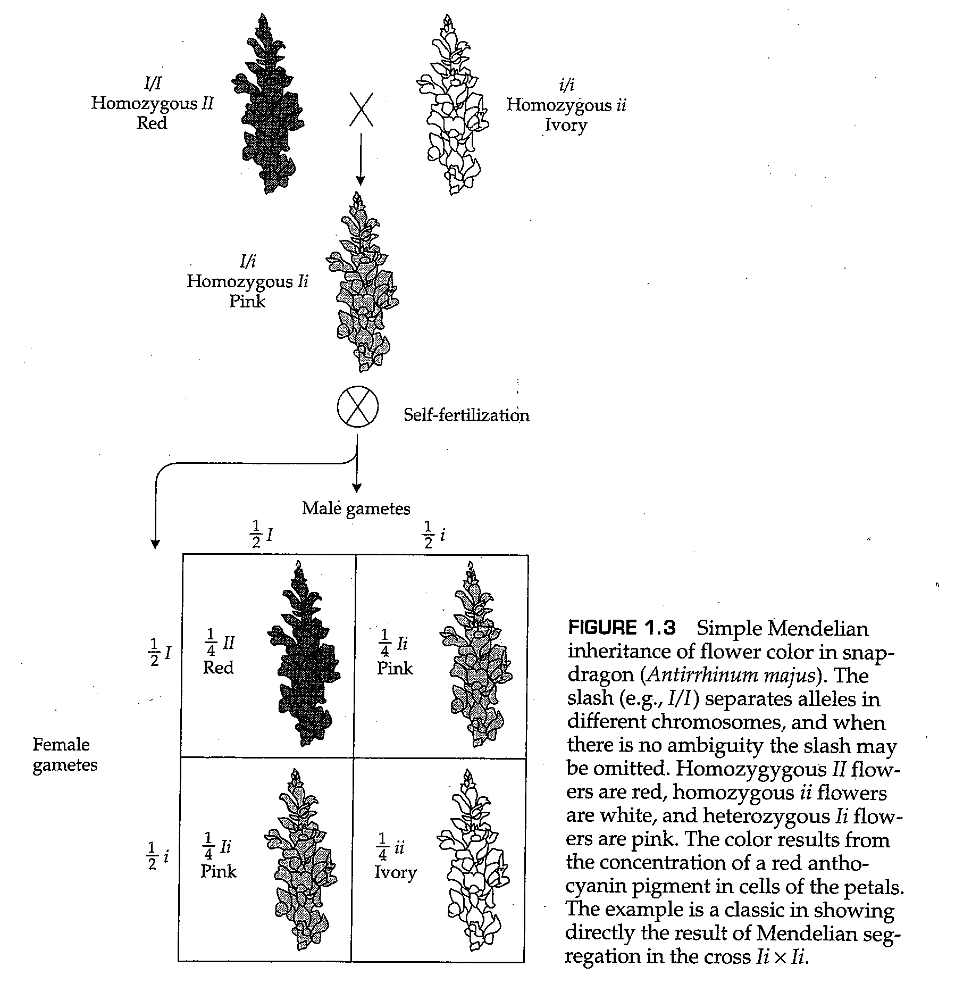

# 第1章 遗传和表型的变异

<link rel="stylesheet" href="https://cdn.staticfile.org/font-awesome/4.7.0/css/font-awesome.css"><a href="index.html"> <i class="fa fa-arrow-left"></i><b> 返回目录 </b></a>

<div style="position:fixed;height:20px;right:50px;bottom:80px;background-color:#ddd;color:#069;padding:5px;border-radius:20px;box-shadow:0px 0px 4px #aaa;cursor:pointer;" onclick="javascript:window.location.href='#top'"><i class="fa fa-arrow-up"></i><b> 返回顶部 </b></div>

- [第1章 遗传和表型的变异](#第1章-遗传和表型的变异)
  - [1.1 群体遗传学的意义](#11-群体遗传学的意义)
  - [1.2 自然种群中的表现型变异](#12-自然种群中的表现型变异)
    - [连续变异：正态分布](#连续变异正态分布)
    - [均值和方差](#均值和方差)
    - [中心极限定理](#中心极限定理)
    - [离散式孟德尔变异](#离散式孟德尔变异)
  - [1.3 多因素遗传](#13-多因素遗传)
  - [1.4 遗传变异的维持](#14-遗传变异的维持)
  - [1.5 分子群体遗传学](#15-分子群体遗传学)
    - [电泳](#电泳)
    - [等位基因频率和基因型频率](#等位基因频率和基因型频率)
    - [多态性和杂合子](#多态性和杂合子)
    - [等位酶多态性](#等位酶多态性)
    - [等位酶多态性的推断](#等位酶多态性的推断)
  - [1.6 DNA序列中的多态性](#16-dna序列中的多态性)
    - [限制性内切酶](#限制性内切酶)
    - [聚合酶链式反应（PCR）](#聚合酶链式反应pcr)
    - [单核苷酸多态性](#单核苷酸多态性)
    - [同义和非同义多态性](#同义和非同义多态性)
    - [分离位点和核苷酸错配](#分离位点和核苷酸错配)
  - [1.7 遗传多态性的应用](#17-遗传多态性的应用)
  - [本章小结](#本章小结)
  - [课后习题](#课后习题)


**群体遗传学**研究孟德尔定律和其他遗传原理，因为它们适用于整个生物群体。这些生物可能是人类、动物、植物或微生物。这些群体可能是自然的、农业的或实验性的。这些环境可能是城市、农场、田野或森林。这些栖息地可能是土壤、水或空气。由于其范围广泛，群体遗传学涉及现代生物学的许多领域。群体遗传学的工作知识已成为遗传学、基因组学、进化生物学、计算生物学、系统学、植物育种、动物育种、生态学、自然历史、林业、园艺、保护和野生动物管理的基础知识。对群体遗传学的基础了解在医学、法律、生物技术、分子生物学、细胞生物学、社会学和人类学中也很有用。

群体遗传学还包括对导致物种进化的各种力量的研究。一个物种中的个体由 **基因型（genotype）** 所区分，或者说由他们的基因结构所区分；同时，这些个体也由 **表现型（phenotype）** 所区分，或者说由他们的性状组成所区分。基因型和表现型的关系常常是复杂的，因为表现型常常由基因-环境相互作用所决定。通过定义进化事件发生的遗传框架（genetic framework），群体遗传学原理是生物学中广泛存在的进化现象的基础。从实验的角度来看，进化为生物学的所有其他分支提供了丰富的可测试的假设。从进化的角度来看，生物学中的许多奇怪之处都是可以理解的：它们源于生物间的共同祖先，它们证明了地球上生命的统一。

## 1.1 群体遗传学的意义

群体遗传学有着广泛的的实际应用，包括许多与人类相关的应用，并且在伦理和社会政策方面也有重要的影响。下面列举了一些群体遗传学在医学、农业、保护和研究中的应用：

+ 遗传病患者父母和亲属的遗传咨询。
+ 人类疾病易感性基因的遗传映射和鉴定，例如乳腺癌、结肠癌、糖尿病和精神分裂症等。
+ 疾病基因携带者人群筛查、结果保密和健康保险性维护。
+ 对刑事案件的血液或精液样本进行法医鉴定，通过DNA之间的类型匹配性寻找犯罪嫌疑人。
+ 采样和保存世界各地人类群体的遗传变异记录。
+ 家养动物和农作物性能的改善。
+ 组织动物园和野生动物保护区濒危物种的交配计划。
+ 对有灭绝风险的野生动植物进行采样和保护。
+ 解释同一物种或近缘物种之间基因序列或蛋白质序列的差异。
+ 分析不同物种之间的基因和基因组，以确定它们的进化关系，并检验关于进化过程的假设。

在19世纪末，甚至在孟德尔关于遗传的论文（Mendel，1866）被重新发现之前，种群的遗传变异已经成为了科学研究的主题。弗朗西斯·高尔顿（Francis Galton，1822-1911）是研究人类群体遗传差异的主要代表。高尔顿是将统计学应用于生物研究的先驱。他使用统计学方法研究了眼睛颜色和指纹纹等身体特征以及脾气和音乐能力等行为特征。高尔顿是第一个在连续世代中进行表型性状分布的统计关系研究的人。他也被认为是生物统计学的奠基人。在1900年之前，高尔顿的工作是在对孟德尔提出的遗传理论一无所知的情况下进行的。

## 1.2 自然种群中的表现型变异

高尔顿和孟德尔举例说明了研究遗传性状的两种相反方法。孟德尔的出发点是**离散变异（discrete variation）**，在这种变异中，个体之间的表型差异可以被划分为几部分明显不同的类别，例如圆豌豆和皱豌豆。高尔顿的出发点是**连续变异（continuous variation）**，在这种变异中，生物体的表型是可以在数量尺度上定量的，比如身高或体重，并且表型的变化在数学上是连续。在研究表型变异的材料上，高尔顿的选择很好：人与人之间肉眼可见的性状差异包括身高、体重、肤色、头发颜色、面部特征、跑步速度、鞋码等，这些都是连续性状。这些性状在其他物种中也是连续的。另一方面，作为遗传变异研究的材料，孟德尔的选择是好的（Hartl和Orel，1992年；Orel，1996年）：在离散的、简单的孟德尔性状的家系中，分离的效果最为明显。所谓**分离（segregation）**，我们指的是个体中存在的两种形式的基因，例如A和a，在生殖细胞的形成过程中分离，因此每个生殖细胞只获得A或a的一个拷贝。

### 连续变异：正态分布

对于连续的性状，不仅表型彼此相邻，而且性状通常也为遗传分析带来困难。问题主要有两种类型：

+ 大多数连续性状受两个或多个基因中稍微不同的DNA序列的影响，因此，在一个家系中，一个基因座上不同等位基因的分离可以被被影响性状的其他基因基因座上不同等位基因的分离所掩盖。
+ 大多数连续性状都受到环境因素和基因的影响，因此等位基因的分离可以被环境影响所掩盖。

这些问题并非无法克服，只需要研究的物种中已经有了遍布基因组的高密度遗传标记，这是因为在家系中这些遗传标记可以与我们所关注的连续性状一起追踪。许多物种已经有了这种遍布基因组的高密度遗传标记，包括人类、实验动物以及许多家畜和农作物。


然而，在高尔顿时代，基于染色体上遗传标记之间的连锁对连续性状的研究是未知的。那么，高尔顿为什么关注连续性状呢？原因是他们自己有一种规律性，即统计上的可预测性。对于许多连续的研究，当表型被划分为适当的区间并绘制成条形图时，表型的分布与称为 **正态分布（normal distribution）** 的一种统计分布家族的钟形对称曲线非常吻合。例如，高尔顿的数据中有一个包含1329个男性的身高统计数据，将这些数据四舍五入到最接近的英寸后绘制条形统计图，如图1.1所示。图中的平滑曲线是最符合数据的正态分布。正态曲线的方程式，更具体地称为 **正态概率密度函数（normal probability）** ，为：

$$
f(x)=\frac{1}{\sigma\sqrt{2\pi}}e^{-\frac{(x-\mu)^2}{2\sigma^2}} \tag{1.1}
$$

其中，$x$的取值范围从$-\infin$到$+\infin$，而另外两个常数$\pi=3.14159$，$e=2.17828$。沿x轴分布的峰值位置由参数u确定，该参数是表型值的**平均值（mean）**。表型围绕平均值聚集的程度由参数$\sigma^2$决定，即分布的**方差（variance）。数学上，方差是每个表型值与平均值的平方差的平均值；也就是说，它是$(x-\mu)^2$的平均值。下面讨论如何根据数据估计$\mu$和$\sigma^2$。

### 均值和方差

$\mu$和$\sigma^2$的值被叫做**参数（parameters）**，这意味着它们是一些固定的数值，并代表群体的某些特征或属性，例如在这里是均值和方差。尽管它们是固定的数值，但是它们的具体数值常常是未知的，因此必须需要从一些抽取自并能够代表整个群体的**样本（sample）** 中估计。对于身高数据，这些样本已经列在了表格1.1中，其中$f_i$代表身高近似为$x_i$的男性个数。（一个事实是，这个分布中，处于身高最高和身高最矮的两个组的样本，对整体的分布没有任何影响，因为这些样本仅仅代表所有样本中的一小部分）。我们还列出了$f_i\times x_i$和$f_i\times x_i^2$以及这些数据的总和。


概率分布的均值$\mu$可以由样本的均值所估计，后者通常表示为$\bar x$或$\hat \mu$：

$$
\bar x=\frac{\sum f_ix_i}{\sum f_i} \tag{1.2}
$$

在本例中，$\bar x=91,639/1329=68.95$英寸。

类似的，概率分布的方差$\sigma^2$可以由样本的方差所估计，后者通常表示为$s^2$或$\hat \sigma^2$：

$$
s^2=\frac{\sum f_i(x_i-\bar x)^2}{\sum f_i}=\frac{\sum f_ix_i^2}{\sum f_i}-(\bar x)^2 \tag{1.3}
$$

等式（1.3）中，中间的表达式直接遵循方差的定义：它是平均值的平方偏差的平均值，其中，对于$x_i$的任何值，$(x_i-\bar x)$是它与平均值的偏差。等式（1.3）右边的表达式在算术上与中间的表达式相同，但更容易使用。在表1.1中的示例中，$s^2=6,326,939/1329-(68.96)^2=6.11$（此处根据保留的小数位数做了一些近似，因此可能和读者的计算结果略有不同）。如果样本量较小（例如，小于50），则最好将等式（1.3）中的表达式乘以$n/(n-1)$以获得更好的估计，其中$n$是样本的总大小（在本例中为1329）。

与方差密切相关的是分布的**标准差（standard deviation）**，即方差的平方根。标准偏差是考虑到测量单位的自然量。例如，在表1.1中，每个测量单位为英寸。平均值也以英寸为单位。然而，因为方差是平方偏差的平均值，所以方差的单位是平方英寸，这似乎更适合于面积而不是高度。取方差的平方根可以恢复正确的度量单位，也就是本例中的英寸。标准偏差的估计值通常以符号$s$表示（有时也表示为$\hat \sigma$），计算方法是对等式（1.3）的结果求平方根。在身高的示例中，$s=2.47$（由于四舍五入的误差，这可能与读者的结果略有不同）。标准差$s$的估计值通常被称为*标准误差（standard error）*。

对于正态分布，68%、95%和99.7%的比例分别是观察期望落在均值附近的$1\sigma, 2\sigma, 3\sigma$区间中的概率。这些直接来自等式（1.1），因为观测值落在任何指定的$x$范围内的频率等于等式（1.1）在指定范围内的积分。对于正态分布，在$\mu\plusmn1\sigma$之间的积分等于0.6827，在$\mu\plusmn2\sigma$之间的积分等于0.9545，在$\mu\plusmn3\sigma$之间的积分等于0.9973。实际使用中，常常用$\bar x$和$s$代替$\mu$和$\sigma$。为什么我们要用两个符号去描述均值，另外还要用两个符号描述方差呢？因为$\bar x$和$\mu$之间以及$s$和$\sigma$之间有一个重要的差异。符号$\mu$和$\sigma$代表整个人群的平均值和标准差。这些参数的真实值是未知的，只能通过从总体中提取的样本来估计。符号$\bar x$和$s$表示基于样本的$\mu$和$\sigma$的估计值，不同的符号用于强调估计值会因样本而异，而$\bar x$和$s$仅近似于$\mu$和$\sigma$。

顺便说一下，正态分布中区间$\mu\plusmn4\sigma$之间的积分等于0.9999；这一结果表明，每10000次观测中，只有不到一次与平均值相差超过4个标准差。


### 中心极限定理

高尔顿对许多自然现象遵循正态分布的观察印象深刻。他写道：

> I know of scarcely anything so apt to impress the imagination as the wonderful form of cosmic order expressed by the "law of frequency of error"[the normal distribution]. Whenever a large sample of chaotic elements is taken in hand and marshaled in the order of their magnitude,this unexpected and most beautiful form of regularity proves to have been latent all along.The law would have been personified by the Greeks if they had known of it. It reigns with serenity and complete self-effacement amidst the wildest confusion.The larger the mob and the greater the apparent anarchy,the more perfect is its sway. It is the supreme law of unreason.
>
>（我所知道的几乎没有任何东西能像“误差频率定律”（正态分布）所表达的宇宙秩序的奇妙形式那样给人留下深刻印象。每当大量的混沌元素被拿在手中，并按照它们的数量级排列时，这种意想不到的、最美丽的规则形式被证明一直是潜在的。如果希腊人知道这项法律，他们就会把它拟人化。在最疯狂的混乱中，它以平静和完全的自我掩饰统治着。暴徒越大，表面上的无政府状态越大，其影响力就越完美。这是不理智的最高法则。
）

事实上，考虑到这种纯粹而盲目的偶然是“出乎意料的、最美丽的规律性形式”的原因，实在有些不可思议。这一原则在实践中也很有用。现代计算机可以以各种方式生成均匀分布的随机数（在均匀分布的一组随机数中，每个数字都等可能的被抽到）。一种获得来自正态分布总体的单个样本的常见方法是在计算机上生成12个均匀分布的随机数，然后简单地将它们相加！

正态分布的理论基础在概率论中称为**中心极限定理（central limit theorem）**。粗略地说，中心极限表示，大量独立随机数的和总是收敛于正态分布。在此处，“独立”意味着关于任何一个观测值的信息都不会提高预测任何其他观测值的能力。大量独立的随机数显然就是高尔顿所说的“大量混沌元素样本”。中心极限定理部分解释了为什么这么多连续分布的遗传性状符合正态分布。许多连续性状是 *多因素的（multifactorial）* ，意味着他们受到“许多因素”的影响，这通常包括几个或者更多基因与环境因素的共同作用。例如，在人类中，正常人在头发颜色、眼睛颜色、肤色、身材、体重等方面的明显差异通常不能追溯到单个基因。它们是由几个或更多基因以及众多环境因素作为“混沌元素的大样本”共同影响的结果，这常常导致分离过程中产生正态分布的表型。


应该强调的是，中心极限定理中规定的随机元素的“大数量”不必过多。例如，图1.2是100个观测值的条形图，其中每个“观测值”由从9个从$(-1,+1)$范围内以相等概率任意选择的连续随机数的和组成。对于该范围内的9个随机数的总和，理论平均值等于0，理论标准差等于1.73；样本值为$\bar x=-0.12$和$s=1.70$。我们取标准差与平均值的差异作为横坐标，每个类别的观测值数量作为纵坐标，如图1.2所示。因为每个类别期望的数量为2.5、13.5、68、13.5和2.5，这与正态分布的拟合度非常好。这个例子告诉我们，不到10个“混沌元素”加在一起，就会产生“这种意想不到的、最美丽的规律”。

----------

**问题1.1**

1884年，在伦敦举行的国际健康展览上，高尔顿建立了一个“人体测量实验室”，对各种各样的人类特征进行了数万次测量。其中一个特征是“拉力”，以一个人单手对抗一种手臂摔跤装置中的抵抗力所能拉动的磅数表示（高尔顿1889）。其中，519名23-26岁男性的数据可以分为以下几类（括号中的数字是每个类别中的样本数量）：40-50磅（10），50-60（42），60-70（140），70-80（168），80-90（113），90-100（22），100-110（24）。使用每个类别的中点作为该类别中所有男性的拉力强度，估计拉力强度的平均值和标准差。假设拉力强度具有非正态分布，参数等于这些估计值，拉力超过112磅的男性的预期比例是多少？

------

**答案**

$x_i$的值分别为45、55、65等。然后是$\sum f_i=519,\sum f_ix_i=38675,\sum f_ix_i^2=2963375$。因此，$\bar x=74.5$磅，$s^2=156.8$，因此$s=12.5$磅（由于舍入误差，答案可能略有不同。）

112磅的拉力比平均值高出三个标准误差；因此，预计只有$(1-0.997)/2=0.0015$（约每667人中有一人）的男性具有超过该值的表型。

----------


### 离散式孟德尔变异

离散式孟德尔变异（也叫做简单孟德尔变异）描述了由单个基因座上的等位基因的分离引起的表现型差异。相比于遗传差异，环境对这些性状的影响足够小，因此可以通过谱系追踪等位基因的传递。离散式孟德尔变异的一个例子是金鱼草（*Antirrhinum majus*）中红色、粉色或象牙白花朵颜色的遗传（图1.3）。金鱼草和人类一样，都是二倍体生物，每一条染色体都有两个拷贝，分别从双亲个体遗传而来。因此，任何基因在其同源染色体上都有另一个拷贝。我们将同一个基因座位上编码该基因的所有可能的序列形式叫做这个基因的**等位基因（allele）**。当个体中的两个等位基因无法区分时，个体的基因型被称为**纯合的（homozygous）**（图1.3中的II或ii），当它们不同时，个体被称为**杂合的（heterozygous）**（本例中为Ii）。由于杂合子的中间表型，这个例子对于遗传研究非常方便。I和i等位基因的分离结果以1:2:1的比例外显，对应于开红色、粉色或象牙白花朵的植株。



像金鱼草的花朵颜色这种能够以简单孟德尔式的方法发生分离的复杂表型，在自然界中少之又少。例如，在人类群体中，尽管简单孟德尔遗传确实解释了许多遗传性疾病，像囊性纤维化、苯丙酮尿症、镰状细胞贫血和血友病等等，但这些疾病都是非常罕见的，

由于自然种群的正常个体表型的大多数变异是多因素的，因此这些性状没有表现出明显符合孟德尔分离定律的遗传模式，也没有出现如孟德尔在豌豆实验中发现的任何简单数值比。在20世纪初，孟德尔的论文被重新发现后，这种比率的缺失引起了巨大的争议。一方面是高尔顿的门徒，所谓“生物统计学派”，他们否定了孟德尔发现的意义，声称孟德尔假设的分离因子不仅与连续性状无关，而且不足以解释亲属之间的关联。另一边是所谓的“孟德尔学派”，这些人认为，多个存在相互作用基因的分离既可以解释连续性状，又可以解释离散性状。这两派之间的激烈争论持续了近20年。1918年，统计学家罗纳德·艾尔默·费希尔（Ronald Aylmer Fisher，1890-1962）发表了一篇论文，题为《基于孟德尔遗传假设的亲属之间的相关性》（The correlation between relatives on the supposition of Mendelian inheritance），这篇文章聚焦了离散性状的多因素遗传的含义。下面我们将讨论费希尔的分析的模型类型。

## 1.3 多因素遗传

费希尔研究了一个多因素遗传的数学模型，并得出了亲属之间的预期相关性。他表明，可用于连续性状的各种数据不仅与孟德尔遗传相容，而且可以通过孟德尔遗传进行预测。


费希尔模型的思路如图1.4所示，其说明了在三个非连锁基因上的基因型杂合时的杂交后代的遗传变异（当基因彼此独立地进行分离时，它们被称为不连锁的，就像它们在不同的染色体上一样）。基因的等位基因表示为A/a、B/b和C/b，分离和自由组合产生的遗传变异在不同程度的阴影中标明了出来。如果我们假设一个性状，其中每个大写等位基因在表型上增加一个单位，并且每个小写等位基因都无效，则aa bb cc基因型的表型为0，AA BB CC基因型的基因型为6。因此，后代中有七种可能的表型（0-6）。表型分布如图1.5中的条形图所示。平滑曲线是近似于数据的正态分布，其方差为1.5。在图1.4中，我们假设所有表型变化都是由基因型差异引起的。如果还存在影响该性状的随机环境因素以及更多的基因，那么图1.5中相邻的两个柱子的高度差将更不明显，与正态分布也更加接近。这样的结果符合高尔顿的“非理性最高定律”，也就是中心极限定理。


费希尔模型比图1.4中的模型复杂得多，考虑到了等位基因的影响、等位基因频率的差异、各种类型的显性关系以及随机环境因素的影响。这是一项具有开创性的工作，证明了连续表型变异可以由多个存在相互作用的遗传因子以孟德尔遗传的方式所解释。费希尔的模型在当时是复杂的，而这篇论文是一篇困难的论文。甚至现在还不清楚费希尔的论文在终结生物统计学派和孟德尔学派之间的争论中可能发挥了什么实际作用。似乎没有多少人读过它。（有人说，除非你以前读过，否则你不应该读这篇论文。）另一方面，这篇开创性的论文标志着高尔顿和孟德尔理论的调和。

## 1.4 遗传变异的维持

由于达尔文的自然选择进化理论要求个体之间存在遗传变异，因此自20世纪初该领域出现以来，群体遗传学家一直对这一问题感兴趣。主要问题是个体之间基因型差异的程度，以及遗传变异从一代延续到下一代的过程。由于多因素性状的基因无法通过在家系中的分离所揭示，早期的群体研究仅限于研究离散变异的特殊情况。经典的例子包括花、昆虫或蜗牛种群内的颜色或形态变化；人类的血型变化（由红细胞表面不同的糖类抗原所决定，这些抗原可以被免疫系统抗体所识别）；以及果蝇染色体的变异（通过研究幼虫唾液腺中存在的巨大染色体检测到）。这些例子中的每一个都让我们对进化过程产生了重要的见解，但这些例子又是如此不同，以至于无法进行概括。由于基因型差异对生物体相对适应性的影响，每个系统也可能存在偏差。

尽管它们是有限的，但结果可以由支持遗传变异丰富度和维持性的两种模型之一所解释。一种被称为*经典假说（classical hypothesis）*的观点认为，遗传变异是罕见的，并且主要由有害突变等位基因组成，这些基因在反复发生的有害突变和负选择之间保持平衡。另一个模型称为*平衡假说（balance hypothesis）*，认为遗传变异是丰富的，并通过选择一种有利于杂合基因型或罕见基因型来维持。在经典假说中，遗传变异大多是坏的；在平衡假说中，遗传变异大多是好的。每一方都给了另一方一些支持，经典假说承认了一些平衡选择的案例，而平衡假说承认了有害突变的存在。同时，这两种假说都忽略了另一个重要的替代假设——自然种群中的许多遗传变异可能对生物体的适应性影响很小或几乎没有影响，这一模型后来被称为**中性理论（neutral theory）**。

## 1.5 分子群体遗传学

在20世纪50年代和60年代的大部分时间里，经典假说和平衡假说势不两立。如果没有一种可以广泛应用于多种生物中大量基因的无偏遗传变异研究方法，这些问题就无法解决。通过使用本节所述的技术对基因及其产物进行直接研究，这种方法最终成为可能，但代价是基因型与表型的分离。由于转录、RNA加工和翻译的机制相对不受基因相互作用和环境影响的影响，DNA序列和等位基因之间的对应关系是一对一的：不同的等位基因具有不同的DNA序列，而不管等位基因是否影响表型。同样，蛋白质编码区不同的基因可能导致不同的氨基酸序列，而不管蛋白质在代谢中做什么，或者序列的差异如何影响生物体。

因此，对分子的研究是检测简单孟德尔变异的有效途径——其中还存在一个悖论。作为进化生物学家，群体遗传学家对可能受到自然选择的可观察表型感兴趣：形态学、发育速度、交配行为、繁殖年龄、寿命等（简而言之，这都是些吸引高尔顿的性状）。另一方面，遗传学研究大多是通过检测简单孟德尔遗传导致的分子之间的差异来进行的。矛盾的是，健康生物体中分子的差异通常与表型的差异没有任何明显的联系。因此，存在一个障碍，使得我们无法确切说明哪种类型的分子差异是进化过程的基础。具有讽刺意味的情况与生理学家Albert Szent Gyorgyi所描述的情况相似：

> My own scientific life was a descent from higher to lower dimensions,led by the desire to understand life. I went from animals to cells, from cells to bacteria, from bacteria to molecules,from molecules to electrons. The story had its irony, for molecules anid electrons have no life at all. On my way, life ran out between my fingers.
> 
> （我自己的科学生活是就是一个从更高层次向更低层次下降的过程，由理解生命的欲望所引领。我从动物研究到细胞，从细胞研究到细菌，从细菌研究到分子，从分子研究到电子。这个故事具有讽刺意味，因为分子和电子根本没有生命。在我的科研生涯中，生命从我手指间流逝。）

基因型和表型之间的差距是由于基因和环境在决定生理、发育和行为方面的复杂相互作用造成的。在进化生物学中，复杂性更大，因为关键问题是生物体在其环境中生存和繁殖的相对能力。尽管如此，分子差异和进化适应性之间的脱节决不是不可避免的、永久的、无法克服的。很明显，研究遗传变异与进化适应之间的关系必须放在进化生物学的议程上，而且已经有许多例子证明了这种关系。

### 电泳

研究大分子的方法正在不断创造和改进，特别是DNA和蛋白质。几乎和它们出现的速度一样快，敏锐的群体遗传学家已经将它们应用于自然种群的遗传变异研究当中。尽管有许多这样的实验程序在无数细节上有所不同，但大多数方法都是基于一些简单原理的新颖组合。

大分子研究中，应用最广泛的原理之一是**电泳（electrophoresis）**，在施加电场的情况下，溶液中的大分子会响应电场并发生移动（Smithies 1954，1995；Shaw 1965；Lewontin和Hubby 1966）。电泳既可用于分离蛋白质，也可用于分离核酸。大分子的支撑材料通常是某种凝胶，其形式可以是水平板、两块玻璃板之间的垂直夹层，或者是玻璃管或塑料管内的圆柱体。凝胶的两边与缓冲液和电极片接触。每一个含有待分离大分子的材料样品都放置在板或管的一端，并在凝胶上施加数小时的电流。样品中的分子——通常是我们感兴趣的蛋白质或核酸——在电场的作用下穿过凝胶。大小不同、电荷不同的分子以不同的速率运动。双链DNA分子的移动速率主要与其大小有关，而蛋白质分子的移动速率则与其所带电荷和分子大小都有关系。电泳完成后，我们可以通过多种方法，将感兴趣的分子的位置显示出来。


典型的蛋白质电泳设备如图1.6所示。蛋白质电泳主要用于研究酶分子，通过将凝胶浸泡在含有酶底物和荧光染料的溶液中，可以显示特定的酶迁移的位置，因为这会在凝胶中酶的位置处产生一条暗带。如果样品中存在的酶存在氨基酸替换，导致分子的总电荷出现差异，那么酶的电泳迁移率会有所改变，并以不同的速率移动。电泳迁移率的变化是因为相同大小和形状的酶的移动速度很大程度上取决于带正电荷的氨基酸（主要是赖氨酸、精氨酸和组氨酸）的数量与带负电荷的氨基酸的数量（主要是天冬氨酸和谷氨酸）的比例。因此，电泳可用于检测酶蛋白上导致电泳迁移率变化的突变。


电泳实验的一个可能结果显示在图1.7A中的凝胶中，其中所有样品中的酶蛋白都显示出相同的电泳迁移率。这样的结果表明这是一个 *单态样品（monomorphic sample）* ，因为我们只观察到一种电泳条带。另一种结果如图1.7B所示，其中在电泳图谱类型中观察到 *多态性（polymorphism）* 。当观察到多态性酶蛋白条带时，遗传测试通常表明，只有一条快速迁移的酶蛋白条带的个体是纯和的，并携带有 *快速（fast）* 等位基因（F/F）；只有一条慢速迁移的酶蛋白条带的个体也是纯和的，并携带有 *慢速（slow）* 等位基因（S/S）；同时具有两条带的个体是杂合的，同时携带两个等位基因（F/S）。我们可以让杂合子个体互相交配，如果它们的后代平均产生了$\frac{1}{4}$的F/F、$\frac{1}{2}$的F/S和$\frac{1}{4}$的S/S，那么这就是一个简单的孟德尔遗传现象。每当活性酶由一条多肽链（而不是两条或多条多肽链聚集在一起）组成时，杂合子中就会出现两条酶带，因为杂合子的每个等位基因都会产生不同的多肽链。

### 等位基因频率和基因型频率

由不同等位基因编码、在电泳过程中表现出不同迁移率的酶称为**等位酶（allozymes）**。因此，群体中的等位酶变异通常可以用来指示简单孟德尔遗传变异。正如我们将在本章接下来的部分看到的那样，等位酶变异几乎在所有可以用电泳研究的自然群体中都广泛存在，例如细菌、植物、果蝇、小鼠和人类等。

为了更好的理解这种针对群体遗传数据的分析方法，我们考虑一个等位酶多态性群体，这个群体包含F和S等位基因，且基因频率不同。所谓特定等位基因的**基因频率（allele frequency）**，指的是在群体中特定等位基因占所有等位基因的比例。假设我们对包含400个样本的群体进行酶电泳，发现165个样本的基因型是F/F、190个是F/S、45个是S/S。（这里我们使用斜线分隔基因型中的每个等位基因；如果不存在歧义的话，斜线可以省略）。因此，我们在这个群体中，观察到的F和S等位基因数为：

$$
\begin{aligned}
F：2×165+190&=520\\
S：190+2×45 &=280
\end{aligned}
$$

纯合基因型包括2个相同的等位基因，因此在计算等位基因数量时要将纯合个体的数量乘上常数2。样本中的等位基因总数等于$2 × 400=800$。因此，如果令$p$代表F等位基因的频率，$q$代表S等位基因频率（这里$p+q=1$，因为在这个例子中基因座上只有这两种等位基因），那么我们可以根据观察结果估计$p$和$q$为：

$$
\begin{aligned}
\hat p=520/800&=0.650 \\
\hat q=280/800&=0.350
\end{aligned}
$$

对于这样的比例，估计等位基因频率的估计标准差由下式给出：$\sqrt{(\hat p\hat q/n)}$，其中n是样本中等位基因的数量。在这种情况下，$p$（以及$q$）的估计标准差等于$\sqrt{(0.650×0.350/800)}=0.0169$。

注意，如果F和S等位基因之间随机发生组合（组合事件相互独立），三种基因型的期望频率可以通过乘以对应的等位基因频率得到，例如FF的期望频率是$p^2$、FS是$2pq$ 、SS是$q^2$。因此，假设在这个群体中两种等位基因间随机组合，则三种基因型个体的期望数量为：

$$
\begin{aligned}
FF:(0.65)^2×400   &=169 \\
FS:2×0.65×0.35×400&=182 \\
SS:(0.35)^2×400   &=49
\end{aligned}
$$

因此，在我们假设的这个群体中，不同基因型的个体数量非常接近于等位基因随机组合的期望数量。当两个等位基因随机组合时，三种基因型的比例为$p^2$、$2pq$和$q^2$，这就是所谓的**哈迪-温伯格原理（Hardy-Weinberg principle）**。哈迪-温伯格原理是群体遗传学的基本原理之一，我们将在第2章进行详细讨论。

-----------

**问题1.2**

假设来自不同人群的400个个体的随机样本包括185个F/F、150个F/S和65个S/S基因型。估计两种等位基因F和S各自的等位基因频率$p$和$q$。假设群体中两种等位基因发生随机组合，三种基因型个体的期望数量是多少？观测数据与这一期望数据是否符合？

----------

**答案**

在总共800个等位基因中，我们观察到等位基因F的数量为$2 × 185+ 150=520$，等位基因S的数量为$150× 2 × 65= 280$。因此，$\hat p=520/800=0.65$，$\hat q= 280/800=0.35$。注意，尽管观察到的不同基因型个体的数量不同，但估计的等位基因频率与前文中的例子相同。在等位基因发生随机组合的情况下，不同基因型的个体的期望数量依然是169个 F/F、182个 F/S和49个 S/S。相比于这一期望值，观测值中的纯合子似乎太多，杂合子似乎太少。我们将在第2章中讨论一些统计检验的方法，这些方法可以帮助我们判断观测值和期望值是否相符。

--------

### 多态性和杂合子

样本中某一基因的多态性通常只在表明该基因在整个人群中的多态性时才有意义。在一个群体中，**多态性基因（polymorphic gene）** 意味着在这个基因座上，最常见的等位基因的频率也要比0.95低。实际上，对于一个具有两个等位基因的基因，多态性基因的定义意味着，从具有哈迪-温伯格平衡的的群体中随机抽取11个个体，这些个体中至少应该包含一个杂合子，因为$2 × 0.05 × 0.95 × 11 = 1$。编码酶的基因的杂合子的观测基因型频率差异很大，但通常情况下，这一频率在无脊椎动物中约为15%，在脊椎动物中约为7%（图1.8）。0.95的临界值是人为划分的，但这个数值有助于我们将注意力集中在那些等位基因变异更为常见的基因上。事实上，在任何一个足够大的群体中，几乎每个基因都会有罕见的等位基因。如果一个等位基因的频率低于0.005，则该等位基因被认为是*罕见等位基因（rare allele）*；在人类中，对于任何一个基因，每一千人中就可能有一到两人是该基因的罕见等位基因的携带者。许多罕见的等位基因是有害的，其可能是通过反复突变以在群体中保持。多态性的定义是一种尝试，旨在关注那些具有高频等位基因的基因，而这些高频等位基因的存在无法仅仅通过有害等位基因的反复突变来解释。根据上面给出的等位基因频率为0.95的多态性定义，如果这样的等位基因发生随机组合，那么在这个哈迪温伯格平衡的群体中，大约有10%的个体是杂合子，因为$2×0.95×0.05=0.095\approx 10\%$。


### 等位酶多态性

图1.8总结了243个物种群体中14至71个基因（大多数约20个）的电泳结果。图中的每一点都给出了所研究的生物类型和所研究的物种数量。纵轴为多态性，即根据0.95的标准估计的多态基因的比例。横轴为杂合度，此处表示各组生物中的平均杂合度。平均杂合度是生物体中杂合基因型在所有基因中的期望占比的平均值；它被估计为每个基因的杂合基因型在所有基因中的平均比例。例如，在一份欧洲人的群体遗传学数据中包含一个英国人群，在这个人群中检测了10个酶基因（Harris 1966）。在这10个基因中，有3个被发现是多态的，因此从中估计的多态基因在基因组中的比例为$3/10= 0.30$。观察到的三个多态基因中的杂合基因型比例分别为0.509（红细胞酸性磷酸酶）、0.385（磷酸葡糖变位酶）和0.095（腺苷酸激酶）；考虑到观察到的杂合度为0的另外7个基因，该样本中的平均杂合度为$(0.509+0.385+0.095+7×0)/10=0.099$。在另一份涉及更多样本与更多基因的电泳研究中，在包括几乎所有主要种族的人群样本中检测了104个基因，这项研究得到的估计值是多态性为0.32，杂合度为0.06（Harris等， 1977）。

图1.8中，代表 *果蝇（Drosophila）* 的点用水平和垂直的误差线标识了估计值的标准差的大小。误差线反映了多态性和杂合度的数值范围，即大约68%的数值将落入误差线所标明的区间。在果蝇中，大约68%的物种的多态性基因占总基因的0.30-0.56，同理，大约68%的物种的基因的平均杂合度落在0.09-0.19这一区间。如果在其他的点上绘制同样的误差线，我们会发现这些误差线的长度将与果蝇的误差线的长度相当，这表明一个生物类群内部，不同物种之间，多态性和杂合度都存在显著的差异。

图1.8显示了多态性和杂合度之间存在正相关。这种关系正如预期的那样，因为平均来说，一个群体中多态基因的比例越大，杂合基因的期望数量就越多。考虑一个理想群体，其中每个新突变都编码一种蛋白质，并且每个突变都会改变其电泳迁移率，使得所有等位基因编码的蛋白质都有不同的电泳迁移率，同时我们假定这些等位基因都处于中性选择之下（也就是说，突变对生存和繁殖的影响可以忽略不计）。由于反复突变，一个群体中的等位基因会随着时间的推移而改变，一些会丢失，另一些则变得多态。同时，我们假设正在研究的是二倍体生物常染色体上的基因。在这些条件下，多态性位点的期望频率$P$由下式给出（Kimura and Ohta， 1971）：

$$
ln[1-P]=\theta ln(0.05)\approx -3\theta \tag{1.4}
$$

其中，$\theta = 4N\mu$，$N$是群体大小，$\mu$是每一代中每个基因的突变率，$ln$是以$e=2.71828$为底的自然对数。数值0.05来自于多态性的定义，因为我们定义多态性基因为最常见的等位基因的频率低于0.95的基因，而$0.05=1-0.95$。【译者按：经过一些简单的数学变换，我们可以得到$P=0.95^\theta=0.95^{4N\mu}$】

在相同的假设下，杂合度（heterozygosity，以字母H表示）的预期大小可以表示为（Kimura and Crow， 1964）：

$$
H=\frac{\theta}{1+\theta} \tag{1.5}
$$

因此，对于经历连续中性突变的理想群体中的基因，通过消除方程1.4和1.5之间的$\theta$，可以获得杂合度和多态性之间的预期关系，结果是

$$
ln[1-P] = \frac{-3H}{1-H} \tag{1.6}
$$

这就是我们在图1.8中展示的那条曲线所表示的关系。【译者按：$P=1-e^{-3H/(1-H)}$，在$H\in[0,1)$上单调增，并且是个凸函数。H=1时P=1】

图1.8中的总体平均多态性为0.26±0.15，平均杂合度为0.07±0.05。在图1.8中，脊椎动物有着最低数量的遗传变异，植物次之，而无脊椎动物最高。*果蝇（Drosophila）* 是迄今为止研究的高等生物中遗传变异最大的一类，而哺乳动物是变异最小的一类。当然，我们人类是一种相当典型的大型哺乳动物。从图1.8可以得出一个明显的结论，即等位酶多态性在高等生物中广泛存在。遗传变异在一些原核生物中更为普遍。例如，哺乳动物肠道细菌 *大肠杆菌（Escherichia coli）* 的天然分离物的遗传多态性水平是脊椎动物的两倍或三倍（Selander等人，1987）。

虽然遗传多态性很普遍，但并不是所有物种都有如此高的多态性。例如，猎豹 *Acinonynx jubatus* 的两个主要亚种近乎于都是*单态的（monomorphic）*（O'Brien等人，1987）。对来自东非亚种（ *A.j.raneyi* ）的30只动物进行的49种酶的研究只发现了两个多态性基因，多态性估计值为0.04，杂合度估计值为0.01；在南非种（ *A.j.jubatus* ）的98只动物中，多态性估计值为0.02，杂合度估计值为0.0004。此外，最令人意外的事情，是在南非亚种的不同个体之间进行皮肤移植并没有触发排异反应。同种异体移植物的接受意味着猎豹种群对于触发排异反应的主要组织相容性位点是单态的，而在其他哺乳动物中这些位点具有丰富的多态性。显然，猎豹曾一度遍及全球范围，但目前的数量不到20000只，其种群数量至少经历了两次严重的缩减，导致其大部分遗传变异发生丢失。

### 等位酶多态性的推断

基于电泳的多态性估计方法的普适性有时候存在些不确定性（Lewontin 1974b，1991）。传统的电泳技术无法检测到许多氨基酸替换，这意味着多态性的数量可能被低估了。例如，一项针对包括鲸目动物（鲸鱼、海豚和鼠海豚）在内的多个物种的14种肌红蛋白的研究中，通过常规电泳可以区分的蛋白质不超过8种；然而，通过改变电泳缓冲液的pH值，可以区分其中13种（McLellan和Inouye 1986）。一些氨基酸的替换会改变酶对温度的敏感性，从而可以被检测到；温度敏感性测试识别到了更多的 *果蝇（Drosophila pseudoobscura）* 中黄嘌呤脱氢酶基因的等位基因，使得能够被区分的等位酶数量从6个增加到37个，并将平均杂合度的估计值从0.44增加到0.73（Singh等人，1976）。另一方面，尽管更精细的技术揭示了已知多态基因的额外等位基因，从而增加了杂合度的估计值，但通过常规电泳分类为单态的基因往往还会保持单态，因此多态性的估计值与之前的结果保持了很大的一致。

电泳研究也可能高估了多态性，因为通常被研究的酶主要是一些在组织或体液中浓度相对较高的酶（“I组酶”（Group I enzyme）），并且通常缺乏足够高的、如中央代谢过程相关的酶那样的底物特异性（后者称为“II组酶”（Group II enzyme））。例如，在果蝇的10种I组酶和11种II组酶中，前者的多态性和杂合度的估计值分别为0.70和0.24，而后者为0.27和0.04（Gillespie和Langley，1974）。总之，蛋白质电泳是检测多态性的一种方便方法，但很难从酶的电泳调查中推断出整个基因组，因为酶可能不具有代表性。

观察到的同种酶的高水平多态性立即使经典假说受到质疑。这一假设断言，遗传变异主要由反复突变维持的高度有害的等位基因组成。按照经典假说的预测，等位酶的多态性应该是罕见的，然而图1.8表明它们是常见的。但是，除了对多态性和杂合性大小的估计之外，其他数据也使得与之相反的平衡假说受到质疑。平衡假说预测，遗传变异应该是常见的，因为它是通过选择有利于杂合基因型或选择有利于稀有基因型来维持的。按照这样的思路我们可以预测，这种类型的选择压力将会使得近交（近亲之间的交配）的后果相当有害，然而实际观察到的近交的影响相对温和。

图1.8中的数据与方程（1.6）中的中性理论曲线之间的看似良好的拟合可能被视为对中性理论的支持，但数据隐藏了许多复杂性。一些单个基因的杂合度与其多态性水平相比太高，而其他基因的杂合度太低。使用第4章和第7章中讨论的统计方法对单个基因等位基因的DNA序列进行更精细的分析表明，图1.8中的数据过于笼统宽泛。在这张图所涉及的许多基因座中，一些基因座上的等位基因似乎大都轻微有害，另一些基因座上的多态性似乎是通过某种形式的选择来维持的，还有一些基因座上的多态性与预期的模式没有明显的差异，因为这些等位基因处于中性或者近乎中性的选择压力下。

## 1.6 DNA序列中的多态性

电泳也是DNA序列遗传变异研究的主要支柱之一，因为DNA分子带负电，可以在电场中移动。尽管标准的DNA纯化过程通常在随机位置将双链DNA分子切割成约50kb（1kb =1000碱基对）的片段，但可以使用多种方法来产生特定长度的片段。

### 限制性内切酶

特定大小的DNA片段可以通过一类称为 **限制性酶(restriction enzyme)** 的酶产生，这类酶可以识别DNA双链上的某些特定短序列并进行切割，而这些短序列被称为酶的 *限制性位点（restriction site）* 。由于切割位点高度特异，最终产生的DNA片段的大小由相邻限制位点之间的距离决定。限制酶及其限制位点的例子如图1.9所示，其中箭头所示的位置是酶的切割位点。例如，酶 *Alu*I 在四个核苷酸序列`5'-AGCT-3'`的位点进行切割， *Eco*RI 在六个核苷酸序列`5'-GAATTC-3'`处切割。只需一条DNA链的核苷酸序列就可以描述酶切位点，因为限制酶作用于双链DNA，而在双链DNA中，存在碱基A与T、G与C之间的互补配对。符号`5'`和`3'`用于表示链的极性（从左到右的方向性），而在双链DNA中，互补配对的两条链之间的极性相反，因此，序列`5'-GAATTC-3'`与序列`3'-CTTAAG-5'`互补配对。如图1.9所示，群体遗传学研究中使用的大多数限制性酶的限制性位点的长度大都是4bp或6bp。


由于酶切位点特异，限制性内切酶消化的基因组DNA会产生一系列大小不一的片段，这些片段的大小取决于基因组上相邻两个酶切位点的距离。电泳可以将这些片段按照分子量大小进行分离，而我们感兴趣的片段可以通过如图1.10的方法进行识别。这种方法利用了碱基互补配对的原理，我们先利用化学方法或者加热使得DNA双链互相分离，然后加入带有标记的一小段单链DNA，这一小段单链DNA就可以与互补的DNA片段发生互补配对。这样的一小段单链DNA片段通常被称为 **探针（probe）** 。探针的大小可以从24个核苷酸到数千核苷酸，并且常常带有某种标记，使其可以发射荧光或可见光，或者可以通过放射自显影的方法检测。标记可以附着在DNA分子的末端（例如图1.10A中的那种方式），也可以沿着探针结合到单个核苷酸中。实际上，图1.10中那种只有4个碱基长度的探针并不能发挥作用，因为互补配对的区域太短，导致配对很容易被热运动破坏。尽管如此，该图仍足以说明足够长的DNA（或RNA）探针将与任何DNA（或DNA）链中的互补（或几乎互补）序列杂交。如图1.10B所示，探针通常只与双链DNA上的一条链配对，因为另一条链的序列与探针的序列通常一致而并不会互补配对。


探针与限制性酶切片段的杂交是 **Southern印记（Southern blot）** 实验的基本原理，该实验的过程如图1.11所示。首先使用电泳将不同长度的限制性片段分离，并将凝胶浸泡在氢氧化钠溶液中使得DNA双链互相分离，之后，将这些DNA片段转印（blot）到硝化纤维或尼龙材质的滤纸（filter）上，并用化学方法进行处理（图1.11A）。之后，滤纸将浸于探针溶液中（图1.11B）。随着溶液冷却，探针DNA链将与滤纸上互补配对的DNA片段形成双链，此时我们可以小心洗去未配对的探针。之后，将滤纸夹在显影膜之间，并利用探针发出的荧光或射线以对探针所结合的条带的位置进行显影（图1.11C）。


通过这种方法，可以识别出能够改变限制性酶切位点存在与否的遗传变异，因为这样的遗传变异改变了限制性酶切片段的长度。图1.12显示了一个例子。图的上半部分展示了在一个二倍体生物中，三种不同基因型的个体的DNA分子上的限制性位点和探针的结合位置。基因型为 *a* 的分子比 *A* 的分子多了一个酶切位点。下半部分展示了对三种基因型个体的Western印记的结果，其表明，使用合适的探针，可以通过限制性片段的模式区分三种基因型。在自然种群中发现的限制性片段长度的差异被称为 **限制性片段长多态性（restriction fragment length polymorphism）** 或简称为 **RFLP** 。因为RFLP在大多数生物的基因组中都很丰富，它们已被广泛用于研究自然种群中DNA序列上的遗传变异。


### 聚合酶链式反应（PCR）

**聚合酶链反应（polymerase chain reaction，PCR）** 引起特定DNA片段的扩增。在群体遗传学中PCR具有很大的实用性，既可以用于生产探针DNA，也可以用于直接测定自然种群中存在核酸序列变异的数量。该方法如图1.13所示。待扩增的原始DNA序列以黑色显示，新合成的DNA链以灰色显示。小圆圈表示化学合成的、短的、能够与待扩增片段末端互补的单链核苷酸（ *寡聚核苷酸，oligonucleotides* ）。这些寡聚核苷酸被称为 *引物序列（primer sequences）* ，因为它们与待扩增序列末端互补，被用作DNA聚合酶合成新链的引物。引物寡聚核苷酸通常长约20-30nt。在PCR反应中，模板DNA首先与上下游引物以及热稳定的DNA聚合酶在缓冲溶液中混合。之后，PCR扩增以循环进行。在第一个循环中，首先整个体系被加热，使得模板DNA分离为单链，然后在存在过量引物的条件下降温退火，这会导致引物与模板的结合，随后DNA聚合酶将催化链的延伸，产生双链分子。PCR的第二个循环与第一个循环类似，但在第二个周期之后，每个原始的DNA模板分子都有四个拷贝。PCR的循环重复20至30次，每循环一次都会导致模板DNA片段的拷贝数翻一倍。理论上，$n$次循环将产生$2^n$个模板DNA的拷贝。但在实践中，反应不能以完美的效率进行，引物分子的杂交动力学以及模板DNA形成复杂结构的倾向性都对PCR反应的效率有影响。


PCR扩增在产生大量特定DNA序列方面非常有用。该技术的主要限制是必须知道待扩增区域末端的DNA序列，以便合成引物。在许多应用中，这一要求很容易得到满足。例如，在群体遗传学中，PCR可用于扩增自然种群中存在的不同等位基因。

----------

**问题1.3**

拟果蝇（ *Drosophila simulans* ）是一种与黑腹果蝇亲缘关系很近的果蝇。PCR用于扩增拟果蝇眼睛中编码光敏蛋白的基因 *Rh3* 的五个等位基因（指定为a-e）。对产生的DNA片段进行测序（Ayala等人，1993）。下表中的数据显示了在基因的氨基酸编码区的前500个核苷酸位点中存在16个多态性核苷酸位点，而剩余的484个核苷酸位点是单态的。任何位置坐标为3或3的倍数的核苷酸位点都位于密码子的第三个位置。在基因的这个区域：
+ （a） 多态性核苷酸位点有多大比例位于密码子的第三个位置？你能从这个现象中推断出什么？
+ （b） 核苷酸位点有多大比例是多态的？
+ （c） 为什么二项分布标准差 $\sqrt{(\hat p\hat q/n)}$ 不适用于（b）中的估算？


**表格：基因中的核苷酸位点**

|Allele|132|142|162|192|198|201|207|240|246|351|354|372|375|405|417|483|
|------|---|---|---|---|---|---|---|---|---|---|---|---|---|---|---|---|
|a|T|C|T|A|C|C|T|C|C|T|C|G|G|T|T|A|
|b|T|C|C|T|A|C|C|T|C|C|T|G|G|T|T|T|
|c|C|T|C|C|C|C|C|T|C|T|T|T|G|C|T|A|
|d|C|T|C|C|C|C|C|T|T|C|T|G|A|C|T|T|
|e|C|T|C|C|C|T|C|T|T|T|T|G|G|C|C|A|

------------

**答案**

+ （a）在16个多态性位点中，只有位点142不是3的倍数，因此 $15/16=94\%$ 的多态性位点位于密码子的第三个位置。由此我们可以推测，许多核苷酸多态性都是是沉默突变（同义突变，synonymous），它们不会改变编码的蛋白质的氨基酸序列（事实上，所有16个多态性位点都是沉默多态的（“silent polymorphisms”，都不会造成氨基酸改变），包括142位点的C→T改变，因为这个位置的密码子出现了CUA→UUA的变化，而这两种密码子都编码亮氨酸）
+ （b） 在该基因的这个区域中，总共$16/500=3.2\%$的核苷酸位点是多态的。
+ （c） 在这种情况下，二项分布的标准差是不合适的，因为基因内的核苷酸之间并不相互独立，它们在遗传上紧密连锁。

------------

PCR研究需要知道待扩增片段的末端序列，以便合成引物。这看似一个严重的限制条件，但即使这样的困难也可以通过一种称为 **扩增片段长度多态性（amplified fragment length polymorphism，AFLP）** 的方法而机智地绕过。该方法如图1.14所示。AFLP的第一步（图1.14A）是用限制酶消化基因组DNA。以 *Eco*RI 为例，这种酶的限制位点为`5'-GAATTC-3'`，图中的两个八角星符号标记了两个相邻的限制位点的位置（注意，为了展示方便，限制位点的大小与位点间距并不符合实际比例）。这一步产生了大量限制性片段，这些片段的两侧都各有一个 *Eco*RI 位点，。 *Eco*RI 的消化在每一条限制性片段两端都留下了一个`5'-AATT`的粘性末端（参见图1.9），这个粘性末端足够长，因此可以在低温下与携带有与之互补的`3'-AATT`粘性末端的特殊引物（ *接头序列，adapters* ）配对（图1.14B），之后可以用DNA连接酶将二者连接。在这以后，这些经过处理的限制性片段就可以用与接头序列配对的引物进行PCR扩增了（图1.14C）。注意，由于限制性片段两边连接的是相同的接头序列，因此只需要一种引物就可以与模板DNA的两端同时配对，并进行扩增。然而，关于引物序列有许多选择。与接头序列完美匹配的引物将扩增所有片段，但这通常会导致大量的非限制性片段也被扩增，以至于它们无法在凝胶中很好地分离。由于PCR反应中用到的引物需要在自身`3'`末端与模板DNA完全互补，才可以被DNA聚合酶延长，因此我们可以适当增加引物的长度，使其不仅与接头序列互补配对，还和 *Eco*RI 酶切产生的粘性末端互补配对，这样我们就可以减少被扩增的DNA的数量，仅仅把那些 *Eco*RI 限制性酶切片段给扩增出来。


### 单核苷酸多态性

遗传多态性研究的最终水平是DNA序列本身，而多态性的最小单位是 **单核苷酸多态性（single nucleotide polymorphism）** 或简称为 **SNP** 。在一个群体中，如果DNA分子上的某个位点的碱基在不同个体中常常不同，则称这个位点存在SNP。举一个例子。在一段编码蛋白质的DNA上有个碱基位点。在某个群体内部，一些DNA上这个位点的碱基是T（胸腺嘧啶），另一些DNA上这个位点则是C（胞嘧啶）。这种差异构成了SNP。SNP定义了这个群体中的两种“等位基因”以及三种基因型，分别是纯合子T/T（两条同源染色体上该位点都是T）、C/C（两条同源染色体上该位点都是C）以及杂合子T/C（一条同源染色体上是T，另一条则是C）。在这里，我们将“等位基因”一词用引号括起来，因为任何一个特定的SNP都不必在蛋白编码序列中，甚至不需要在基因中。人类基因组被认为至少包含一千万个SNP，换句话说大约每300bp就有一个SNP。已经鉴定出的SNP超过400万个，在这些SNP中，替代等位基因都比较常见，这些SNP的密度大约是每1kb-3kb有一个SNP（蛋白编码基因）或者每500bp-1kb有一个SNP（非编码DNA）。在第10章中，我们将会讨论SNP如何用于人类群体遗传学研究。

### 同义和非同义多态性

蛋白质电泳研究存在一个不可避免的缺陷，即它只能检测那些造成蛋白质中氨基酸替换的核苷酸多态性（事实上，在电泳的实验条件下，只有造成蛋白质电荷改变的一小部分核苷酸多态性可以被检测到，更多的则难以区分）。导致氨基酸替换的核苷酸多态性被称为 **非同义多态性（nonsynonymous polymorphisms）** 。另外还有一大类多态性叫做 **同义多态性（synonymous polymorphisms）** ，这一类多态性虽然也存在于编码区，但不会导致氨基酸替换。这很常见，因为遗传密码子允许许多同义核苷酸替换。例如，三联体密码子`TTA`、`TTG`、`CTT`、`CTC`、`CTA`和`CTG`都编码亮氨酸，密码子`CGU`、`CGC`、`CGA`、`CGG`、`AGA`和`AGG`都编码精氨酸（编码蛋白质的20种氨基酸中，只有两个在密码子表中没有同义密码子）。许多多态性也存在于基因组的非编码区域，例如蛋白编码序列的上游区域、下游区域或内含子中。同义多态性和非编码多态性对生物体产生的影响可能是微弱的，因此这一类多态性可能处于中性的自然选择之下；对于等位基因来说，只有两个等位基因编码的蛋白质的序列完全一致时，才说这样的多态性等位基因是同义的或者非编码的。


图1.15展示了一个在果蝇中广泛存在的同义多态性的例子，这是一些编码酒精脱氢酶基因的等位基因。该基因具有电泳多态性，在自然群体中存在两个主要等位基因分别是迁移率慢的（ *Adh-S* ）和迁移率快的（ *Adh-F* ）。这两种等位基因差异的分子基础在于编码蛋白质的第193位氨基酸，在 *Adh-S* 中其为AAG（赖氨酸），而在 *Adh-F* 中其为ACG（苏氨酸）。这些酶之间的差异不仅仅是电泳迁移率。迁移率快的等位基因的产物酶活性更高，并且合成的酶蛋白的数量也比迁移率慢的等位基因大。

图1.15中的数据来源于对北美东部25个群体中1533只果蝇的Adh编码区域研究（Berry和Kreitman 1993）。这项研究共鉴定出113个单倍型。 **单倍型（haplotype）** 是一系列沿着单个染色体存在的遗传标记的等位状态（allelic states）的独特组合。基因组某一区域的遗传重组越少，或者这一区域受到的选择越强，单倍型的分化可能越强。最极端的例子是线粒体DNA、叶绿体DNA和Y染色体，在这些区域通常不会发生重组（关于线粒体DNA和叶绿体DNA进化的讨论，请参见第4章）。

在图1.15中，用正方形表示的单倍型是 *Adh-F* ，用圆圈表示的是 *Adh-S* 。每个形状内的数字代表单倍型的相对丰度（1是最频繁的，2是次频繁的，依此类推）。连接两个单倍型的直线表明，它们之间只存在单个碱基的变化。图1.15展示了93个单倍型，这些单倍型之间可以通过单个碱基的变化彼此关联；此外，研究还观察到了其他20个单倍型，这些单倍型包括额外的变化。这个例子主要想表明一种观点，即自然群体中包含大量不同类型的核苷酸序列变异，这些变异不会影响氨基酸序列。

### 分离位点和核苷酸错配

与蛋白质电泳相比，DNA序列数据包含更多关于遗传变异的信息，因为不管位点是否是同义多态的或在非编码DNA中，位点的核苷酸多态性都是可以被检测的，而且在一组经过比对的序列中，每个核苷酸都可以被单独考虑。（如果一组核苷酸序列中，每个对应位置上的碱基都来自于祖先序列上的对应位置上的碱基，则称这些序列是 *经过比对的（aligned）* ）。

与蛋白质多态性的估计类似，DNA序列的遗传变异可以依据序列样本中多态位点和杂合位点的数目进行估计。在一组经过比对的序列中， *分离位点（segregating sites）* 代表样本中的多态位点的数量，其以符号 $S$ 表示，并且定义如下：

$$
S = 在经过比对的序列中存在差异的核苷酸位点数量 \tag{1.7}
$$

在DNA序列中，也存在一个与杂合度类似的概念，其代表沿着任何一对经过比对的序列，存在的核苷酸差异的数量。这些被称为 **核苷酸错配（nucleotide mismatches）**， 我们使用符号 $\Pi$代表经过比对的序列中，每一个可能的成对比较的核苷酸错配的平均数量。在 $n$ 条序列之间，存在 $n(n-1)/2$ 种可能的成对比较。因此，对于任意样本的 $\Pi$ 的值由下列表达式所定义：

$$
\Pi = \frac{核苷酸错配总数}{成对比较总数} \tag{1.8}
$$

由于随机抽样和群体历史的影响， $S$ 和 $\Pi$ 都存在方差，这将在第4章中讨论。

为了将 $S$ 和 $\Pi$ 与影响遗传变异的基本参数联系起来（这些参数例如 $\theta=4N\mu$ ，其中 $N$ 是理想化群体的大小， $\mu$ 是突变率），人们需要一个关于DNA序列如何进化的模型。最简单的模型之一是 *无限位点模型（infinite-sites model）* ，这个模型假设序列由数量巨大（无限多）的、没有重组的核苷酸位点组成，因此其中的每个核苷酸取代事件都发生在不同的位点，并且假设这些位点处于中性选择的状态。在足够长的时间后，种群最终达到稳定状态，即有了稳定的 $S$ 和 $\Pi$ ，但由于回复突变和等位基因的随机丢失，对于单个序列来说，其状态可能在慢慢翻转。在这个稳定状态下，可以看出，对于含有 $n$ 个序列的样本， $S$ （Watterson 1975）和 $\Pi$ （Kimura 1968）的期望值由下式给出：

$$
E(S)=\theta(1+\frac{1}{2}+\frac{1}{3}+\frac{1}{4}+...+\frac{1}{n-1}) \tag{1.9}  
$$

$$
E(\Pi)=\theta \tag{1.10}
$$

这些表达式将在本书后面推导和讨论，但我们现在提前介绍它们，以显示它们如何将DNA序列变异的一些基本度量参数结合在一起。对于较小的 $n$ 值，表1.2给出了方程（1.9）需要用到的倒数和的值。对于足够大的 $n$ ，倒数和的值近似等于 $0.577+ln(n-1)$ （Nei 1987）。需要强调的是，在方程（1.9）和（1.10）中，尽管 $\theta=4N\mu$ ，但 $\mu$ 的值代表的是整个序列的突变率。换句话说， $\mu$ 等于每个核苷酸的平均突变率乘以被比较的每个序列中的核苷酸数量。


在无限位点模型的稳定状态下， $\Pi$ 给出了 $\theta$ 的一个估计值（方程1.10）， $S$ 通过方程（1.9）给出了另一个估计，即

$$
\theta=S/(1+\frac{1}{2}+\frac{1}{3}+\frac{1}{4}+...+\frac{1}{n-1}) \tag{1.11}
$$

检验这两个估计值的相等性（equality），是检测无限位点模型是否偏离稳态的众多方法之一（Tajima 1989）。例如，某种类型的选择（或近期的群体增长）导致稀有等位基因增多，因此方程（1.10）中的 $\theta$ 估计值将小于方程（1.11）中的 $\theta$ 。类似的，另一种类型的选择（或近期的群体数量下降），方程（1.10）中的 $\theta$ 估计值将大于方程（1.11）中的 $\theta$ 。第4章将更详细地讨论针对偏离中性选择压力的检测方法。

问题1.3中的数据很典型，可用于此处的举例说明。我们考虑 $n=5$ 条序列，每条序列长度均为500nt，分离位点的观测数量为 $S=16$ 。因此，依据方程（1.11）的 $\theta$ 估计值为 

$$
\theta = 16/(1+1/2+1/3+1/4)=7.68 \tag{1.12}
$$  

核苷酸错配的平均数量 $\Pi$ 是样本序列的所有可能配对方法之间的核苷酸差异的平均数量。对于问题1.3中的数据，5个序列的样本可以有 $(5×4)/2=10$ 个可能的成配对方法。可以依次考虑每个核苷酸的成对比较。对于问题1.3中的多态性位点，六个位点（位点132、142、246、351、405和483）的成对错配总数为6 $(=2×3)$ ，九个位点（位点162、198、201、207、240、354、372、375和417）的成对错配总数是4 $(=1×4)$ ，一个位点（位点192）的成对错配总数是7。在问题1.3中的484个单态核苷酸中，成对错配的数量为0。因此，每个成对比较的平均错配数量为

$$
\Pi=\frac{6×6+4×9+7×1+0×484}{10}=7.90 \tag{1.13}
$$

因此，对于问题1.3中的数据，根据方程（1.11）的估计方法，我们得到的 $\theta$ 的估计值是 $\theta=7.68$ ，根据方程（1.10）的方法得到的估计值则是 $\theta=\Pi=7.90$ ，这两个数值非常接近。这样的一致性是足够好的，但是另一方面我们也应该意识到这个例子中样本量很小。在这种比较中， $S$ 和 $\Pi$ 的值取决于所分析的序列的长度，这种长度会因基因和研究的不同而不同。如何消除不同序列长度的影响，将是第4章所要研究的问题之一。

分离位点和核苷酸错配的估计也可以用限制性片段长度多态性（RFLP）形式的限制性位点数据进行。最简单的方法是依次分析限制位点。每个单态的限制位点被视为相同的六个连续单态核苷酸（或四个单态核苷酸，如果限制酶的限制位点长度为四个碱基）。每个多态性限制位点被视为五个相同的单态核苷酸和一个分离核苷酸（或三个相同的单态位点和一个分离位点，如果限制酶的限制位点长度为四个碱基）。换言之，每个限制性位点的多态性被认为是限制性位点中单核苷酸差异的结果。对 $\Pi$ 的估计在这一假设下进行。下面的问题说明了原因。

--------

**问题1.4**

在格罗宁根的一个荷兰水果市场捕获了一些黑腹果蝇，在这些果蝇的后代种群中，对酒精脱氢酶（ *Adh* ）基因区域的限制性位点变异进行了研究（Cross和Birley，1986）。该区域共包含5种限制性酶的23个酶切位点，每个限制位点长度均为6bp。这23个酶切位点中，有16个位点在所有果蝇中都是可被切割的，而其余7个位点表现出了多态性。下表记录了在10条染色体样本上，这7个多态性位点的存在情况，其中（+）代表酶切位点存在，（-）代表不存在。假设每个缺失的限制性位点只改变了一个核苷酸，则根据分离核苷酸位点数量 $S$ 和核苷酸错配的平均数量 $\Pi$ 来估计 $\theta$ 的值。在这份数据中，不同估计方法得到的估计值是否相等？

| *Bam*HI | *Hind*III | *Pst*I | *Xho*I | *Pst*I | *Eco*RI | *Eco*RI |
|-----|-------|----|----|----|-----|-----|
|+    |-      |-   |+   |+   |-    |-    |
|+    |-      |-   |-   |-   |+    |+    |
|-    |-      |+   |-   |-   |+    |-    |
|-    |+      |-   |+   |-   |+    |+    |
|-    |+      |-   |+   |-   |+    |+    |
|-    |+      |-   |+   |-   |+    |+    |
|-    |+      |-   |+   |-   |+    |+    |
|-    |+      |-   |+   |-   |+    |+    |
|-    |+      |-   |+   |-   |+    |+    |
|-    |-      |-   |+   |-   |+    |-    |


--------

**答案**

首先考虑分离位点。16个单态限制性位点鉴定出 $16 ×6=96$ 个单态核苷酸位点，而7个多态性限制性位点则鉴定出 $7×5=35$ 个单形核苷酸位点和 $7×1=7$ 个多态性（分离）位点，注意这里我们假设每个限制性位点的缺失只由一个核苷酸改变所导致，并且缺失特定限制性位点的所有DNA分子在该位点上的单倍型相同。因此，总共有138（ $=96+35+7$ ）个核苷酸位点，其中 $S=7$ 是分离位点。因为 $n=10$ ，方程（1.11）中的分母部分等于2.829（ $n=10$ 的倒数和，参见表1.2）。因此，基于 $S$ 的 $\theta$ 估计值为 $\theta=7/2.829\approx 2.47$。

对于 $\Pi$ 的估计，在本题中因为有10条DNA序列，因此成对比较的数量是 $C_{10}^2=10×9/2=45$ 。对于每个多态位点，如果有 $i$ 个（+）和 $(10-i)$ 个（-），则意味着这个位点的平均成对错配数是 $i×(10-i)$ 。因此，我们可以从左到右，依次计算每个限制位点的错配总数，分别为16、24、9、16、9、9和21，总计104。因此， $\Pi$ 的估计值为 $\Pi=104/45\approx 2.31$ ，这也是基于$\Pi$的$\theta$的估计值。

$\theta \approx 2.47$ 与 $\theta=\Pi\approx 2.31$ 这两个估计值的一致性非常好。然而，由于这个例子中的样本量太小，我们无法将这一结论进行推广。

--------

## 1.7 遗传多态性的应用

无论是通过同工酶还是核苷酸序列进行研究，自然遗传变异都有许多用途。遗传变异提供了一套内在的标记，用于对原生栖息地中的生物进行遗传研究，包括那些难以被驯化或在实验室中饲养、或无法进行常规遗传操作的生物。

遗传多态性在研究一个物种的不同亚群之间的遗传关系时非常有用。其原理是，由于迁移（migration）事件的存在，不同亚群之间可以共享一些等位基因，因此，亚群之间等位基因频率的相似性可用于估计迁移率（见第6章）。在亚群中，由于共同祖先的存在，不同个体之间的等位基因是共享的。例如，日本北部的阿伊努人（Ainu）有许多类似高加索人种的特征，包括面部特征、浅色皮肤和偏多的体毛，但他们的遗传多态性清楚地表明，他们与其他的蒙古人群体的关系更为密切（Watanabe等人，1975）。在信息量最大的几个等位基因上，阿伊努人拥有转铁蛋白的 *D(Chi)* 等位基因和Diego血型系统的 *Di<sup>a</sup>* 等位基因，而这两种基因基本上都局限于蒙古人种。与此相反的是，阿伊努人缺乏几种在高加索人种中具有多态性的等位基因。

从实用的角度来看，遗传多态性在人类群体中是有用的遗传标记，这些遗传标记可能一些有害基因或者致病基因连锁（见第10章）。在有该疾病家族史的亲属中，遗传标记可用于确定家族中哪些成员可能是有害基因的携带者。这些遗传标记也可用于疾病的早期诊断。与疾病基因连锁的RFLP或者其他类型的DNA多态性也证明了它们可以作为探针，在鉴定含有缺陷基因的重组DNA克隆的中发挥作用。缺陷基因附近的遗传标记使得缺陷基因以及其功能可以被鉴定出来，从而成为寻找有效治疗方法的第一步。

在群体遗传学中，有着大量中等频率等位基因的DNA标记特别有用。在大多数生物中，基因组的许多区域都是由串联重复片段组成，这些区域也因此存在多个等位基因。不同染色体上的重复片段拷贝数差异可能造成了多个等位基因的产生。而在这些区域上，基因型则更加多变，因为对于二倍体生物来说，每个基因型携带两个等位基因。这种串联重复片段的多态性的实际应用之一是 **DNA指纹分析（DNA fingerprinting）** ，其中来自嫌疑人DNA的等位基因将会与犯罪现场样本中的等位基因进行匹配。对足够数量的这种高度可变区域的检查，为我们区分不同的个体提供了基础，因为没有两个人（同卵双胞胎除外）在这种基因组区域上具有相同的基因型。这种遗传变异已经被用于亲子鉴定以及刑事侦察。

DNA指纹技术也被应用于植物和动物的自然交配系统的研究，因为DNA类型的巨大数量和高度特异性，我们可以利用这种技术在种群中检测到近亲。在行为学研究中，DNA分型可以确定表现出相互利他行为的生物体之间是否遗传相关。其他类型的多态性也可以提供关于交配系统的信息。例如，观察到的基因型频率可用于估计雌雄同株植物或雌雄同体动物种群的自花授粉/自体受精数量。

从进化生物学的观点来看，基因序列和多态性的模式可以用来推断进化历史和进化过程。事实上，有一个名为DNA条形码项目（DNA barcoding project）的国际项目，旨在通过不断扩大的数据库，对可用于识别几乎任何生物物种的独特DNA序列进行编目。大分子的序列本身包含着它们进化历史的记录。具有共同祖先的生物体之间通常具有相似的基因序列；反之亦然，序列上的相似性可以被视为共同祖先的衡量标准。作为共享祖先的指标，序列相似性提供了一种推断一群生物之间祖先关系的方法（ *分子系统发育学（molecular phylogenetics）* ，将在第7章讨论）。物种内以及近缘物种间的序列改变速率和改变模式，同样也是持续不断的进化力量的记录者。随着群体遗传学的发展，这一研究领域的数据量越来越丰富，而用于数据分析和假设检验的新方法也越来越多。

## 本章小结

1. 高尔顿研究的主要是连续性状，包括身高和体重，这些性状可以在数量尺度上进行测量，而孟德尔研究的是离散变异，包括豌豆种皮的圆润或褶皱，这些性状是由于单个基因座上的等位基因分离造成的。

2. 在自然种群中，大多数连续性状是多因素的，这意味着它们由多种遗传和环境因素的共同作用所决定。

3. 多因素性状需要特殊的方法来研究其遗传基础，而简单的孟德尔变异中，孟德尔定律就是基因及其产物遗传的规则。

4. 对于随机交配群体中，由两个等位基因控制的简单孟德尔性状，等位基因频率（ $p$，$q$）和基因型频率（$p^2$,$2pq$，$q^2$）之间存在简单的关系。

5. 蛋白质多态性在大多数自然群体中很常见，编码蛋白突变体的等位基因也很常见，而更多的等位基因虽然互相之间存在DNA序列上的差异，但编码的蛋白质却是相同的。

6. 广泛存在的多态性使人们对经典的遗传变异理论产生了怀疑，该理论认为大多数遗传变异是罕见并且有害的，并且由反复突变所维持。然而，其他类型的数据也对平衡假说提出了质疑，该假说认为，由于杂合基因型的适应性更强，大多数多态性得以维持。

7. 不论是经典模型还是平衡模型，都没有考虑到许多遗传多态性可能对生物体的生存和繁殖能力的影响微乎其微，而这一缺陷最终由中性理论所补全。

8. 遗传变异的最终水平由不同个体的染色体中相应位置的单核苷酸差异组成，也就是单核苷酸多态性（SNP）。人类基因组由约30亿个碱基对组成，估计包含约1000万个单核苷酸多态性。

9. 许多单核苷酸多态性发生在基因组中不编码蛋白质的部分。在蛋白质编码区，非同义多态性改变了氨基酸序列，而同义多态性不改变氨基酸序列。

10. 在一组经过比对的DNA序列上，核苷酸变异可以根据分离位点数量和序列之间的平均错配数量进行量化。比较这些值是对基因的进化历史进行推断的许多方法之一。

11. 遗传多态性在现代生物学的几乎各个领域都很重要，这些研究领域包括人类遗传学、分子和细胞生物学、植物和动物育种以及野生动物管理和保护等。此外，遗传多态性在人类群体中也有很多应用，从识别复杂疾病的遗传风险，到通过DNA指纹进行刑事侦查。


## 课后习题

1. Shown here is a table of a phenotypic values measured on each member of a random sample of 100 individuals. Estimate the mean,variance, and standard deviation in the population from which the sample was drawn. 

    | | | | | | | | | | |
    |--|--|---|---|--|--|--|---|--|---|
    |82|80|106|102|82|94|74|123|93|110|
    |102|112|105|97|125|96|89|105|111|97|
    |106|116|127|140|117|94|130|82|79|80|
    |91|114|81|128|73|130|95|94|98|109|
    |99|96|109|71|90|95|107|92|112|110|
    |87|101|113|117|97|80|139|108|107|103|
    |120|86|90|67|88|87|120|124|112|107| 
    |120|101|104|97|72|106|113|88|120|99|
    |106|75|100|82|98|126|103|118|120|104|
    |106|73|88|142|89|96|112|95|99|79|

2. Assuming that the sample in Problem 1 was drawn from a normal distribution, what number of individuals in the sample is expected to have a phenotypic value exceeding the mean plus one standard deviation? What number of individuals in the sample is expected to have a phenotypic value smaller than the mean minus one standard deviation?How do these. predictions compare with the observations? 
3. Assuming that the sample in Problem 1 was drawn from a normal distribution, what number of individuals in the sample is expected to have a phenotypic value exceeding the mean plus two standard deviations? What number of individuals in the sample is expected to have a phenotypic value smaller than the mean minus two standard deviations? How do these predictions compare with the observations? 
4. A typical means for using a computer to generate normally distributed random numbers is to choose 12 uniform random numbers and add them up. After scaling the sum by a constant that depends on the mean and the variance of the uniform distribution,the result represents a sample from a normal distribution.Why does this approach work?
5. One statemient of the central limit theorem is:that the sum of independent,identically distributed random variables has a limiting normal distribution. If the random variables that are added are not independent, but instead exhibit a positive correlation in successive draws,how would you expect the sum deviate from the normal distribution predicted by the central limit theorem? 
6. Protein electrophoresis is carried out using blood samples from wild mice for a gene with two alleles whose product runs either fast or slow in the gel.Among 100 females,64 have only a fast band,4 have only a slow band,and 32 have both a fast and a slow band.Among 100 males, however,80 have only a fast band and 20 have only a slow band,with no apparent heterozygous genotypes.What mode of inheritance might explain the absence of heterozygous males? 
7. Many proteins exist in an active form only as dimers,with the two subunits held together by hydrogen bonds or covalent cysteine bridges.If an enzyme is active only as a dimer,then in a population with two alleles encoding fast and slow migrating forms of the protein,what kind of banding pattern would you expect from tissue from a heterozygous genotype?  
8. The diagram shows the result of electrophoresis of tissue samples from 240 Canadian geese, *Branta canadensis* , stained for the enzyme aldehyde oxidase.The samples were placed in the depressions ("wells")shown at the top of the gel, and as electrophoresis took place the proteins migrated in a downward direction. The numbers are the number of individuals in the sample showing each banding pattern.  Estimate the allele frequencies of the fast and slow alleles,and calculate the expected genotype frequencies assuming Hardy-Weinberg proportions. Do the observed results seem to fit these expected values? 

    

9. The accompanying gel diagram summarizes the results of electrophoresis of 99 individuals from a population of pointed phlox ( *Phlox cuspidata* ). Does this population appear to be in Hardy-Weinberg proportions? 

    

10. A gene with two alleles in a population has genotype frequencies $P$ , $Q$ , and $R$ for the genotypes AA, Aa, and aa, respectively, Show that,if the population is in Hardy-Weinberg proportions,then the expected relation between the genotype frequencies is $PR=Q^2/4$. 
11. How many copies of a fragment of DNA should be present after 30 rounds of PCR,assuming perfect efficiency? 
12. Four sequences of a 1200 bp DNA fragment from a gene gave the following counts of pairwise differences: 4,7,5,3,6,5. What is the estimate of the number of pairwise mismatches for this sample? 
13. The nucleotide sequences shown here are the complete set of polymorphic nucleotides found in a region of 5 kb in a sample of six chromosomes from corn, *Zea mays* .The polymorphic nucleotides are not adjacent,as shown here,but scattered throughout the 5 kb.What is the number of segregating sites $S$ and the average number of pairwise mismatches $\Pi$ among these sequences?Estimate $\theta$ from both $S$ and $\Pi$. Do these estimates seem to be consistent with one another? If this result were found for a larger sample, what might it suggest about the selective forces acting on the sequence polymorphisms? 

    ```bash
    GCCTT TATGG CCTGT ATGAG 
    ACTAT TAAGG CTTGT TTGAT 
    ACCAC TGTCG CCCGT ACGCG 
    GTCAT TGTGG TCCTC TTGAG 
    GCTTT TATGA CCTTT ATAAG 
    ACCAT CATGA CCTTT ATAAT 
    ```

14. In forensic applications of genetics,if the DNA fingerprint taken from a crime-scene sample and that of a suspect do not match,the confidence one has in the conclusion is much greater than if the DNA fingerprints do match. What conclusion would be drawn,and why can one have confidence in this conclusion?    
