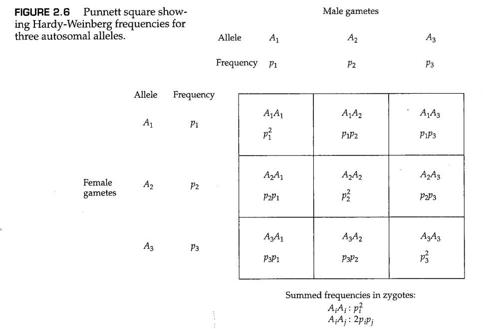
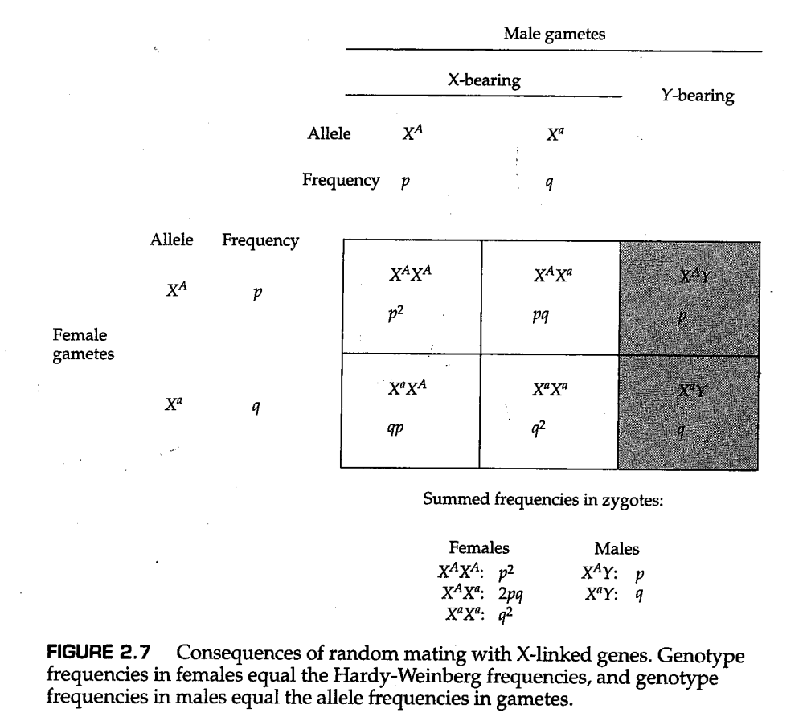

# 第2章 遗传变异的组织方式

<link rel="stylesheet" href="https://cdn.staticfile.org/font-awesome/4.7.0/css/font-awesome.css"><a href="index.html"> <i class="fa fa-arrow-left"></i><b> 返回目录 </b></a>

<div style="position:fixed;height:20px;right:50px;bottom:80px;background-color:#ddd;color:#069;padding:5px;border-radius:20px;box-shadow:0px 0px 4px #aaa;cursor:pointer;" onclick="javascript:window.location.href='#top'"><i class="fa fa-arrow-up"></i><b> 返回顶部 </b></div>

- [第2章 遗传变异的组织方式](#第2章-遗传变异的组织方式)
  - [2.1 随机交配](#21-随机交配)
    - [非重叠世代](#非重叠世代)
  - [2.2 哈迪-温伯格定律](#22-哈迪-温伯格定律)
    - [基因型的随机交配与配子的随机结合](#基因型的随机交配与配子的随机结合)
    - [哈迪-温伯格定律的含义](#哈迪-温伯格定律的含义)
  - [2.3 哈迪-温伯格平衡的检验](#23-哈迪-温伯格平衡的检验)
    - [哈迪-温伯格平衡检验中的困难](#哈迪-温伯格平衡检验中的困难)
    - [显隐关系的复杂性](#显隐关系的复杂性)
    - [杂合子频率](#杂合子频率)
  - [2.4 哈迪-温伯格定律的拓展](#24-哈迪-温伯格定律的拓展)
    - [三个或更多等位基因](#三个或更多等位基因)
    - [X染色体连锁基因](#x染色体连锁基因)
  - [2.5 连锁与连锁不平衡](#25-连锁与连锁不平衡)
    - [检验连锁不平衡中的困难](#检验连锁不平衡中的困难)
    - [连锁不平衡的相关度量值： $D'$ 和 $r^2$](#连锁不平衡的相关度量值-d-和-r2)
  - [2.6 连锁不平衡的原因](#26-连锁不平衡的原因)
    - [种群混合导致的连锁不平衡](#种群混合导致的连锁不平衡)
    - [由于重组减少导致的连锁不平衡](#由于重组减少导致的连锁不平衡)
  - [本章小结](#本章小结)
  - [课后习题](#课后习题)


到目前为止， *“种群”（population，亦可翻译为群体、人群。本文中视使用场景不同，会采取不同的译法）* 一词一直以非正式的、直观的意义来指代属于同一物种的一群生物。此时有必要进一步讨论和澄清这一概念。在群体遗传学（population genetics）中， **“种群”（population）** 一词通常指的并非整个物种（species）；相反，它指的是生活在一个足够有限的地理区域内的同一物种的一群生物，这群生物之间的任何成员都有与其他异性个体交配的潜力（而不是存在生殖隔离）。由于物种中普遍存在的某种 *地理结构（geographical structure）* ——生物空间分布中的某些典型的、非随机的模式，对种群这种单位的精确定义很困难，并且因物种而异。一个物种的成员很少在空间中呈现均匀分布，它们几乎总是存在某种程度的成群或聚集（clumping, aggregation, schooling, flocking, herding, or colony formation）。种群细分通常是由环境斑块（environmental patchiness）造成的，后者是指环境适宜的栖息地与不适宜栖息的区域混杂在一起。虽然这种现象似乎只在群岛生物群系这类环境中明显存在，但请记住，但环境斑块是大多数栖息地的共同特征——例如，淡水湖有浅水区域和深水区域，草甸有沼泽地和非沼泽地，森林也有阳光充足的地方和阴凉的地方之分。社会行为也可以造成种群细分，比如狼群的形成。甚至人类的群体也会聚集在远离沙漠和山区的城镇和城市中。地理边界很重要，因为包括人类在内的大多数物种的成员都倾向于从他们居住的局部地区选择配偶。

在具有地理结构的大型种群中，局部杂交单元（local interbreeding unit）具有一定的意义，因为在这样的单元中，适应性进化可以通过系统性地改变等位基因频率而得以发生。这样的局部杂交单元通常被称为 **局部种群（local population）** 或 **同类群（demes）** ，并且是群体遗传学的基本单位。局部种群是一个物种的实际进化单位。除非另有规定（或上下文明确暗示），本书中使用的 *种群（population）* 一律代表 *局部种群（local population）* 。局部种群有时也被称为 *孟德尔种群（Mendelian population）* 或 *亚群（subpopulation）* 。

## 2.1 随机交配

在有性生物中，基因型不会从一代传给下一代。基因型在配子形成过程中发生分离和重组，并在形成下一代的受精过程中重新组合；也就是说，基因型产生配子，胚子结合产生新一代的基因型。特定基因型在人群中的比例是 **基因型频率（genotype frequency）** 。新受精卵中基因型的形成取决于受精过程中相关配子结合的机会，而受精过程中配子结合的机会取决于上一代育龄个体之间的交配。从一个稍微不同的角度来看，交配双方的基因型决定了后代的基因型。此外，人们可以得出交配双方的频率和后代基因型频率之间的数学关系。这些数学关系通常是从指定种群中交配类型的模型中推导出来的。群体遗传学中的一个重要模型是 **随机交配（random mating）** ，其中交配双方的基因频率与基因型之间随机碰撞形成的频率相同。因此，一个个体与另一个具有特定基因型的生物体交配的机会等于种群中特定基因型频率。例如，假设在某些群体中，AA、Aa和aa的基因型频率分别为0.16、0.48和0.36；在随机交配的模型下，基因型为AA的雄性个体与基因型为AA、Aa或aa的雌性个体的交配概率分别为0.16、0.48和0.36；同样的比例也适用于Aa和aa雄性。

与表面上看到的情况相反，随机交配并不是一个简单或微不足道的过程。一个复杂的问题是，随机交配取决于性状。在同一时间和同一群体中，交配的过程对于某些性状来说可能是随机的，但对于另一些性状来说则是非随机的。例如，在人类群体中，交配过程在血型、等位酶表型、限制性片段长度多态性和许多其他特征上似乎是随机进行的，然而在肤色、身高等性状上则是非随机交配。第二个复杂问题是群体结构。看似矛盾一点在于，在亚群中可以观察到随机交配，可是在这些亚群构成的整个大群体中交配却不是随机的（这一矛盾的原因将在第六章讨论）。尽管存在诸多复杂性，随机交配在群体遗传学的模型中发挥着重要作用，因为对于更复杂的交配系统，随机交配是一种方便的比较标准。

### 非重叠世代

群体遗传学中最重要的数学模型之一是 *非重叠世代模型(nonoverlapping generation model)* ，其中每一代个体都会经历出生、性成熟和死亡的循环，并且除非前一代个体全部死亡，否则后一代个体不会性成熟。非重叠世代模型如图2.1所示。该模型仅适用于具有非常简单的生活史的生物，例如某些寿命很短的昆虫或一年生植物。在这样的植物中，任何一代的所有成员都会在同时发芽，一起成熟，同时授粉，一起受精，并在产生新一代个体（种子）之后立即死亡。这种具有简单生活史的假设种群，常被用作生活史更复杂的种群的一级近似（first approximation）以用于群体遗传学研究。尽管这个模型给人的第一印象过于简单，但基于该模型的期望基因型频率的计算对于许多问题来说都是足够的。在一些应用中，非重叠世代模型被证明是一个有用的近似，即使研究对象可能是一些生活史更长更复杂的生物，例如我们人类。


## 2.2 哈迪-温伯格定律

基因型频率部分地取决于交配模式。在本节中，我们考虑了非重叠世代模型中随机交配的后果。为了推断随机交配下的基因型频率，需要额外的假设。首先，自然种群中，由于系统进化的力量（包括突变、迁移、自然选择等），等位基因的频率会一代代地发生改变，但为了我们研究的方便，此处假定的理想群体中这些进化力量可以忽略不计，因此等位基因频率在几代群体中固定不变（这些进化力量的影响将在第4和第5章讨论）。其次，群体规模必须足够大，以确保抽样过程不会对等位基因频率造成改变。在较小的群体中，抽样误差会改变等位基因频率，这个过程叫做 *随机遗传漂变（random genetic drift）* ，我们将在第3章中重点讨论。除非群体无限大，否则随机遗传漂变是永远存在的，但只要群体足够大（例如群体规模大于500），在少数世代之间的随机遗传漂变对基因频率的影响就是微乎其微的，因此我们可以忽略。限定词“在少数世代之间”很重要，因为随机遗传漂变的影响会在世代之间慢慢累积。当研究的世代足够多时，即使群体规模大如 $10^6$ ，随机遗传漂变也会对基因频率造成显著的影响。

在进一步的讨论之前，我们先总结一下所做的假设：
+ 这是一种二倍体生物。
+ 进行有性生殖。
+ 世代不重叠。
+ 所研究的基因有两个等位基因。
+ 等位基因频率不存在性别差异。
+ 交配是随机的。
+ 群体规模非常大（理论上是无限的）。
+ 迁移可以忽略。
+ 突变可以忽略。
+ 所研究的等位基因不受自然选择。

总之，这些假设概括了 *哈迪-温伯格模型（Hardy-Weinberg model）* ，该模型以英国数学家哈迪（G.H.Hardy，1877-1947）和德国生理学家威廉·温伯格（Wilhelm Weinberg，1862-1937）的名字命名，他们于1908年各自独立地建立了该模型，并推导出该模型下基因型频率的理论预测。

在哈迪-温伯格模型中，等位基因频率和基因型频率之间的数学关系如下

$$
\begin{aligned}
    AA:&\ p^2\\ 
    Aa:&\ 2pq\\ 
    aa:&\ q^2 
    \tag{2.1}
\end{aligned}
$$

其中 $p^2$ 、 $2pq$ 和 $q^2$ 是任何世代合子中AA、Aa和aa基因型的频率， $p$ 和 $q$ 分别是等位基因A和a的频率，并且 $p+q=1$ 。方程（2.1）中显示的频率构成了 **哈迪-温伯格定律（Hardy-Weinberg principle）** 或 **哈迪-温伯格平衡（Hardy-Weinberg equilibrium，HWE）** 。

方程（2.1）中显示的基因型频率是基于独立重复试验的结果得到的。对于随机交配，雄配子和雌配子的选择可以看作独立试验，因此携带等位基因AA、Aa或aa的受精卵的比例的期望值是 $(p\ A+q\ a)^2=p^2\ AA+2pq\ Aa+q^2\ aa$ 。独立试验的原理如图2.2所示。两个携带A的配子结合在一起的概率为 $p×p=p^2$ ，两个携带a的配子结合在一起的概率为 $q×q=q^2$ ；对于杂合子，概率是 $p×q+q×p=2pq$，因为可以是雌配子携带A而雄配子携带a，或者相反。


----------

**问题2.1**

假设个体的随机交配等同于配子的随机结合（见图2.2），可以用来研究当雄性和雌性的等位基因频率不同时随机交配的后果。想象一个群体中，有一个常染色体具有两种等位基因，分别是A和a，雌性个体中两种等位基因的频率分别为 $p$ 和 $q$，其中$p+q=1$ ，相应的，雄性个体中的频率分别为 $p'$ 和 $q'$，其中$p'+q'=1$ 。在经过一代随机交配后，雌性和雄性的基因型频率是多少？雌性和雄性的等位基因频率是多少？这一结果对后世的HWE意味着什么？

---------

**答案**

对于这种情况，在如图2.2所示的Punnett棋盘法中，棋盘顶部的概率分别是 $p$ 和 $q$ ，对应雌配子中的等位基因频率；棋盘左边的概率分别是 $p'$ 和 $q'$ ，分别是雄配子中等位基因的频率。因此，在一代随机交配后，基因型频率为 $pp'\ (AA)$ 、 $pq'+qp'\ (Aa)$ 和 $qq'\ (aa)$ 。不论哪一种性别的后代，这些基因型的频率都是这样，因为父母双方对常染色体基因的遗传贡献相同。因此，我们还可以计算后代中不同等位基因的频率。对于A来说，其等位基因频率为 $p^*=pp'+(pq'+qp')/2=(2pp'+pq'+qp')/2=[p(p'+q')+p'(p+q)]/2=(p+p')/2$ ；同理可得，a的等位基因频率为 $q^*=(q+q')/2$ （请注意，这些值是上一代雌性和雄性的等位基因频率的平均值）。因此，一代随机交配足以使性别中的等位频率相等，而在随后的几代中，基因型频率将由HWE给出，即$p=p^*$和 $q= q^*$ 。

-------------

### 基因型的随机交配与配子的随机结合

图2.2隐含了一个重要前提假设，即基因型的随机交配等同于配子的随机结合。在两个等位基因的情况下，这一前提的证明在表2.1中进行了概括，其中成对的基因型被随机选择以进行交配。亲本世代中AA、AA和AA的基因型频率分别记为 $P$ 、 $Q$ 和 $R$ ，其中 $P+Q+R=1$ 。就基因型频率而言，A和a的等位基因频率 $p$ 和 $q$ 可以如下得到：

$$
\begin{aligned}
p=(2×P+Q)/2&=P+Q/2 \\
q=(2×R+Q)/2&=R+Q/2 \tag{2.2}
\end{aligned}
$$

注意， $p+q=R+Q+R=1.0$ ；这一结果建立在该基因只有两个等位基因的基础上。

对于拥有两个等位基因的基因，可能的交配类型共有六种。当交配随机进行时，不同的交配类型的发生概率与对应基因型的群体频率成对应比例，这些概率由 $(P \ AA+Q\ Aa+R\ aa)^2$ 的展开项所给出。例如， $AA×AA$ 的比例为 $P×P=P^2$ 。类似的，$AA×Aa$ 的比例为 $2×P×Q$ ，因为这种交配类型既可以在AA雄性和Aa雌性之间发生，也可以在AA雌性和Aa雄性之间发生。表2.1的第二列给出了不同交配类型的频率。

表2.1的最后三列给出了交配产生的合子的基因型及其频率。子代的频率遵循孟德尔分离定律，即一个Aa杂合子产生的A型配子和a型配子数量相等。AA和aa纯合子分别产生只含A和只含a的配子。因此， $AA×aa$ 产生的全是Aa杂合子，$AA×Aa$ 产生 $\frac{1}{2}AA$ 和 $\frac{1}{2}Aa$ ，$Aa×Aa$ 产生 $\frac{1}{4}AA$ 、 $\frac{1}{2}Aa$ 和 $\frac{1}{4}aa$ ，以此类推。

随机交配一代后AA、Aa和aa合子的基因型频率在表2.1中分别表示为 $P'$ 、 $Q'$ 和 $R'$ 。这些值按照表格底部的公式计算得出。经过化简， $P'=p^2,\ Q'=2pq,\ R'=q^2$ ，其中 $p$ 和 $q$ 是方程（2.2）中的等位基因频率。注意，亲本基因型频率 $P$ 、 $Q$ 和 $R$ 是完全任意的，除了需要满足 $P+Q+R=1$ 的要求。因此，哈迪-温伯格频率是在一代随机交配后获得的，而与亲代中的基因型频率无关。

-----

**问题2.2**

在黑腹果蝇的实验群体中，发现酯酶-6（esterase-6）编码基因的两个等位基因 *E6<sup>F</sup>* 和 *E6<sup>S</sup>* 的基因型频率与哈迪-温伯格比例一致， *E6<sup>F</sup>* 的等位基因频率为0.3579， *E6<sup>S</sup>* 的等位频率为0.6421（Mukai等人，1974）。假设哈迪-温伯格模型的所有假设在此群体中均成立，制作一个类似于表2.1的酯酶-6等位基因的交配频率表。然后计算下一代预期的基因型频率以及相应的等位基因频率。

-------

**答案**

亲代果蝇中的哈迪-温伯格频率为 $FF:0.1281;\ FS:0.4596;\ SS:0.4123$ 。因此，交配的预期频率为： $FF×FF(0.0164);\ FF×FS(0.1177);\ FF×SS(0.1056);\ FS×FS(0.2112);\ FS × SS(0.3790);\ SS × SS(0.1700)$ 。我们可以依次计算合子中的预期基因型频率： $FF:\ 0.0164+0.1177/2+0.2112/4=0.1281;\ FS:\ 0.1177/2+0.1056+0.2112/2+0.3790/2=0.4596;\ SS:\ 0.2112/4+0.3790/2+0.1700=0.4123$ 。请注意，这些基因型频率与亲代相同。等位基因频率为 $F:0.3579;\ S:0.6421$ 。

----------

### 哈迪-温伯格定律的含义

哈迪-温伯格定律为群体遗传学的许多理论和实验研究提供了基础。然而，该理论还远远不够深刻，适用性也远远不够普遍。特别是哈迪本人似乎也认为，哈迪-温伯格定律实际上是不言自明的——他曾经写道，“我似乎期待生物学家们熟悉我想表达的一个非常简单的观点。”事实上，这条定律确实为一些生物学家所熟知——早在1903年，哈佛大学的遗传学家威廉·E·卡斯尔（William E.Castle，1867-1962）就已经注意到了这一基本原则。然而，卡斯尔的工作鲜为人知，而且哈迪写这篇文章是为了反驳反对孟德尔主义的论点，即如果孟德尔遗传的机制普遍适用，自然种群中应该经常出现3显性：1隐性的表型比例。哈迪-温伯格定律的最直接含义是对3:1的论点的反驳，因为它证明了A-：aa的基因型比率由等位基因频率决定，并且没有达到任何其他特定比率的特殊倾（基因型中的短杠符号“-”是通配符，代表所有可能的等位基因，例如A-同时包括基因型AA和Aa）。

哈迪-温伯格定律除了简单之外，似乎并没有更多优点了，并且它还有一堆限制和看上去很不正确的假设。可是，为什么会有人想考虑这个模型呢？并且，如此简单的模型应该在什么情况下使用呢？众多理由中，最有说服力的有两个。首先，哈迪-温伯格模型是一个参考模型，在该模型中，除了繁殖过程本身所施加的力之外，没有其他进化力在起作用。从这个意义上讲，该模型很像物理学研究中的一些运动学或力学模型，例如物块在没有空气阻力的前提下进行自由落体，或在没有摩擦的斜面上滑动。该模型为与更现实的模型进行比较提供了基线，在这些模型中，进化的力量可以改变等位基因频率。也许更重要的是，哈迪-温伯格模型将生物的生活史分为两个阶段：配子结合产生合子，合子成熟成为成年个体。在构建更复杂、更接近现实的模型时，人们通常可以在生命周期的从合子到成年个体的这部分中添加更多的复杂因素。这种方法很常用，一些应用场景例如考虑迁移对群体的影响，或者不同基因型造成的个体生存率差异。由于所有等位基因频率的变化都发生在合子到成年个体这个阶段，配子到合子这个阶段遵循配子随机结合的原则，并导致合子之间的哈迪-温伯格比例。换句话说，在追踪等位基因和基因型的群体频率随时间变化情况的场景下，哈迪-温伯格模型是基本的，并且这种模型的结果可以推广到更加贴近现实的情况。

当我们根据表2.1中 $P'$ 、 $Q'$ 和 $R'$ 的公式计算下一代A和a的等位基因频率时，哈迪-温伯格定律的一个最重要的含义出现了。使用方程2.2中的结果，合子中A的等位频率等于 $P'+Q'/2=p^2+2pq/2=p^2+pq=p(p+q)=p$ ，同理可得a的等位基因频率为 $q$ ，下一代的等位基因频率与前一代完全相同。随机交配时，等位基因的频率在世代之间保持不变。因此，在任何一代中，AA、Aa和aa的基因型频率分别为 $p^2$ , $2pq$ 和 $q^2$ ，如等式2.1所示。等位基因频率的恒定性，以及种群的基因型组成的恒定性是哈迪-温伯格定律的两大最重要的含义。等位基因频率的恒定性意味着，在没有特定的进化力来改变等位基因的频率的情况下，孟德尔遗传机制本身保持等位基因恒定，从而保持遗传变异。另一个令人感兴趣的点在于，如果雌性和雄性个体中的等位基因频率相同，则只需要一代的随机交配就可以达到HWE。然而，这仅适用于非重叠世代；在具有更复杂生活史的人群中，需要几代人的时间才能逐渐达到HWE。

孟德尔遗传定律对进化论有着重要的影响。在达尔文时代，流行的遗传观点是 *融合的（blending）* ，即假定所有交配后代的遗传组成都与亲本的遗传组成的平均值相等。在这种情况下，种群中的遗传变异将会迅速消失。达尔文的批评者指出了这个问题，达尔文本人也认为这是其理论中的一个潜在致命缺陷。他解决这个问题的方法是假设环境对基因组的影响可以导致新的遗传变异以高频出现。

直到20世纪30年代，孟德尔遗传才最终被纳入进化论，即当时所谓的 *现代综合进化理论（modern synthesis）* 。在现代综合进化理论中，达尔文的高突变率产生遗传变异的想法被一个模型所取代，在该模型中，低突变率产生的遗传变异倾向于被孟德尔遗传机制所保留，并因此被积累。

这里需要注意的是，针对HWE的传统统计检验方法（如下面所讨论的那些）对群体与哈迪-温伯格理想群体的偏差并不敏感。因此，如果我们仅仅观察到某个群体中的基因型频率符合HWE，我们并不能得出该群体就是哈迪-温伯格理想群体的结论（也就是说，我们并不知道哈迪-温伯格定律的10条假设是否符合该群体）。可以得出的结论是，不管实际群体与哈迪-温伯格定律的理想群体的假设的偏差有多大，传统的统计方法都无法从群体基因型频率与HWE的偏差大小中检测出差异。

## 2.3 哈迪-温伯格平衡的检验

为了展示哈迪-温伯格定律的实际应用，我们将以人类基因组中的p53蛋白编码基因上的多态性为例进行下面的讨论。p53蛋白是一种多功能的转录因子，其在很多信号通路中发挥作用。同时，p53的编码基因也是一种重要的抑癌基因，在多种癌症中都观察到了这个基因上的突变。p53蛋白可以被DNA损伤或者DNA合成过程中发生的各种问题所激活，之后p53会启动某些基因的转录，合成一些阻断细胞周期的蛋白，直到DNA损伤被修复；如果DNA损伤无法修复，这些蛋白会介导细胞的程序性死亡。p53蛋白也有助于调控血管的形成，并作为雌激素和孕激素的信号通路中的媒介因子在怀孕的过程中发挥。

在人类中，p53蛋白上有一个广泛存在的多态性位点。这个位点位于第72位的氨基酸，其可以是精氨酸（Arg）或脯氨酸（Pro）。为了表述方便，我们将这两种等位基因分别叫做 *Arg* 和 *Pro* 。在纯合子中， *Arg* 等位基因与皮肤黑色素瘤弱相关（Shen等人，2003），而 *Pro* 等位基因则与复发性自然流产弱相关（Pietrowski等人，2005）。

在一项对318名白种人p53多态性的研究中（Pietrowski等人，2005），不同基因型的数量分别为166 *Arg/Arg* 、120 *Arg/Pro* 和32 *Pro/Pro*。为了确定这些基因型频率是否符合HWE，必须首先估计 *Arg* 和 *Pro* 的等位基因频率。 *Arg* 的等位基因频率的估计值为 $\hat p(Arg)=(2×166+120)/(2×318)=0.7107$ ，同理 *Pro* 的频率为 $\hat p(Pro)=(120+2×32)/(2×318)=0.2893$ 。如果是HWE人群，我们预期 *Arg/Arg* 、 *Arg/Pro* 和 *Pro/Pro* 三种基因型的频率分别为 $p^2$, $2pq$ 和 $q^2$ ，其中 $p$ 和 $q$ 分别是两种等位基因的群体频率。因为 $p$ 和 $q$ 是参数，所以它们的真实值是未知的。然而，在HWE测试中，我们可以用它们的估计值代替真实值，于是可以求出三种基因型的期望概率 $Arg/Arg:(0.7107)^2=0.5051,\ Arg/Pro:2(0.7107)(0.2893)=0.4112,\ Pro/Pro:(0.2893)^2=0.0837$ 。由于样本量为318，三种基因型的个体的期望数量分别是 $0.5051×318=160.6,\ 0.4112×318=130.8,\ 0.0837×318=26.6$ 。

此时，可以方便地列出一个3×3的列联表：

| | | |
|-|-|-|
|Arg/Arg|观测值166|期望值160.6|
|Arg/Pro|观测值120|期望值130.8|
|Pro/Pro|观测值32|期望值26.6|

通过上表，我们可以轻松的看出，观测值和期望值的拟合结果很好，尽管还存在一定的差异，而这种差异可能是由于统计过程中的偶然性导致的。为了验证这一结论，我们将对数据进行常规统计检验，以对观测值和期望值之间的接近程度进行定量。在群体遗传学中，一个常用的统计检验方法叫做 **卡方检验（chi-square test）** ，它基于一个称为 $\chi^2$ （卡平方）的统计量，该统计量的计算方法如下：

$$
\chi^2=\sum\frac{(观测值-期望值)^2}{期望值} \tag{2.3}
$$

在上面的方程中， *观测值* 和 *期望值* 分别指某种基因型的个体的实际数量和期望数量，而求和符号 $\sum$ 旨在表明把所有基因型的结果进行累加。因此在本例中，

$$
\begin{aligned}
\chi^2=&(166-160.6)^2/160.6 \\
       &+(120-130.8)^2/130.8 \\
       &+(32-26.6)^2/26.6 \\
      =&2.17
\end{aligned}
$$

为了彻底避免意义上的含糊不清，许多统计学家倾向于使用另外一些符号表示方程（2.3）中的检验统计量，以便与真正的卡方分布（ $\chi^2$ distribution）进行区分。对我们来说，虽然卡方检验和卡方分布的区别需要铭记在心，但是没有必要专门用另一种符号将它们区分开来。

与 $\chi^2$ 统计量有关的另一个数字叫做 **自由度（degrees of freedom，常用df表示）** 。通常，对于一个 $\chi^2$ 统计量，自由度（ *df* ）的计算方法如下：

$$
\begin{aligned}
df=&数据中的类别个数 \\
   &-从数据中估计出的参数的个数 \\
   &-1
\end{aligned}
$$

在p53蛋白的这个例子中，一共有三种类别的数据，以及一个从数据中估计得到的参数（ $p$ ），因此自由度为 $df=3-1-1=1$ 。注意我们不需要为了 $q$ 的估计值而再在自由度上减去1，因为一旦 $p$ 确定， $q=1-p$ 也就随之确定，因此我们只需要扣除 $p$ 所占的一个自由度即可。


计算 $\chi^2$ 及其自由度是为了获得一个用于评估拟合优度的数字，这个数字可以从图2.3中确定。这张图的使用方法如下：首先沿着水平轴找到 $\chi^2$ 的值，然后从该点开始垂直移动直到与对应自由度的曲线相交，交点的纵坐标即为相应的概率值 $P$ 。在p53蛋白的例子中，我们已经计算出了 $\chi^2=2.17$ 和 $df=1$ ，从图2.3中我们可以找到对应的P值大约是 $P=0.14$ （除了这种查表法，现在还有很多程序与网站也可以计算P值，例如你可以直接用浏览器搜索“卡方计算器”，并从搜索结果中选择合适的工具进行计算）。

$\chi^2$ 检验的P值可以这样理解：P值是一个概率值，表示观测值和期望值之间的偏差有多大的可能性是由于偶然误差产生的。因此，如果P值足够大，说明仅凭偶然误差就足以解释观测值和期望值之间的偏差，也就是说观测值和期望值实际上没有显著的差异，这增强了我们对用于获得期望值的模型（在本例中为哈迪-温伯格模型）的有效性的信心。另一方面，如果P值很小，说明仅凭偶然误差无法解释观测值和期望值之间的偏差，这让我们对模型的有效性产生了动摇。如何区分P值的“大”或者“小”呢？很显然，并没有什么明确的划分标准，但是我们通常会选择0.05这个数字，也就是说如果P值大于0.05，我们就可以认为P值很大、差异不显著、模型拟合效果好；而当P值小于0.05时，我们则认为P值很小、差异显著、模型拟合效果差。在p53的例子中，我们求出来的P值为 $0.14>0.05$ ，因此我们无法拒绝该基因在人群中的基因型频率符合HWE这样的假设。

--------

**问题2.3**

人类基因组上的 *CCR5* 基因的编码产物是艾滋病毒（HIV）侵染白细胞时所需的病毒受体。在许多人群中，这个基因上存在一种多态性，即缺失了该基因的一部分编码序列，从而合成无活性的蛋白质。这种多态性最先是在一些感染HIV十多年、却没有出现艾滋病表型的人中发现的。我们将这种缺失部分编码序列的 *CCR5* 等位基因记作 *CCR5Δ* ，它只有以纯合体形式存在时才能发挥保护作用。
在一项涉及338个丹麦或德国人的研究中（Lucotte和Mercier 1998），观察到的基因型数量如下：265个非突变 *CCR5/CCR5* 纯合子，66个 *CCR5/CCR5Δ* 杂合子和7个 *CCR5Δ/CCR5Δ* 纯合子。分别估计 *CCR5* 和 *CCR5Δ* 的等位基因频率 $p$ 和 $q$ ，
并使用卡方检验判断基因型频率是否符合哈迪-温伯格平衡（HWE）。

--------

**答案**

容易求得 $\hat p=0.882,\ \hat q=0.118$ ，因此三种基因型的期望数量分别是 $CCR5/CCR5: 262.9,\ CCR5/CCR5Δ: 70.4,\ CCR5Δ/CCR5Δ: 4.7$ 。因此，我们可以计算出 $\chi^2=1.42$ ，并且自由度为1，因此在图2.3中查表得 $P\approx0.25>0.05$ ，因此基因型频率符合哈迪温伯格平衡。

--------

### 哈迪-温伯格平衡检验中的困难

哈迪-温伯格平衡（HWE）的检验很重要。例如，在人类遗传学研究中，如果我们在一群患遗传病的个体中检测到某个标记基因偏离了HWE，我们就可以在该标记基因附近对疾病易感等位基因（disease-susceptibility allele）进行定位（Nielsen等人，1999）。与HWE的偏离也可以提醒研究人员可能存在的基因分型错误（Xu等人，2002）。然而，针对HWE的检验往往未见报道或者过于拙劣（Salanti等人，2005）。还有一些复杂因素会使方程（2.3）中的简单卡方检验方法失效。接下来将讨论处理这些复杂因素的一些方法。

**样本量太小**

问题2.3说明了HWE检验中可能出现的问题之一。 *CCR5Δ* 的等位基因频率足够小，以至于虽然样本量有338个之多，我们也只观察到7个突变等位基因的纯合子，并且按照HWE计算出的期望数量更是只有4.7个。在如此小的数量下，研究中的偶然性本身可能对任何实际样本组成产生重大影响。这对于方程（2.3）来说是一个问题，因为只有当每一类数据的期望值都足够大时，该统计量才会服从正态分布。如何判断数据量“足够大”确实是个问题，但多数统计学家都认同如果期望数量小于5时，标准卡方检验的结果并不可信。问题2.3的例子违反了这一点。在这种情况下，许多统计学家建议计算一个比方程（2.3）更保守的卡方值，即，

$$
\chi^2=\sum\frac{(|观测值-期望值|-0.5)^2}{期望值} \tag{2.4}
$$

在上式中，竖线是绝对值符号。按照这种计算方法，分子部分在求平方之前先取了绝对值并减去0.5，这会减小卡方的值。在问题2.3的 *CCR5* 基因的例子中，方程（2.4）会得出 $(2.1-0.5)^2/262.9+(4.4-0.5)^2/70.4+(2.3-0.5)^2/4.7=0.915$ 这个数值。这个数值在图2.3中未显示，但很显然 $\chi^2<1$ 常常意味着差异不显著。实际上， $\chi^2=0.915,\ df=1$ 时， $P=0.34>0.05$ 。方程（2.4）中这种针对小样本数据的校正也存在局限性，因为如果所有期望值都非常接近0时，校正结果是不可靠的。


**HWE的精确检验**

如果样本大小足够小，则可以计算所有可能样本配置的准确概率。具体来说，考虑具有两个等位基因A和a的基因，并用 $n_{11},\ n_{12},\ n_{22}$分别代表基因型为AA，Aa和aa的样本个数的观测值。样本总数为 $n=n_{11}+n_{12}+n_{22}$ ，等位基因A和a的数量分别为 $n_1=2×n_{11}+n_{12},\ n_2=n_{12}+2×n_{22}$ 。我们希望在给定样本个数 $n$ 和等位基因数量 $n_1,\ n_2$的条件下计算每一种样本配置 $(n_{11},n_{12},n_{22})$ 的概率。由于等位基因数量是固定的，任何样本的数量都由杂合子的观测值唯一确定。实际上，在等位基因数量 $(n_1,n_2)$ 的条件下，样本配置 $(n_{11},n_{12},n_{22})$ 的概率由下列方程所决定：

$$
Pr\{n_{12}|n_1,n_2\}=\frac{n!/(n_{11}!n_{12}!n_{22}!)}{(2n)!/(n_1!n_2!)}2^{n_{12}} \tag{2.5}
$$

（Emigh 1980；Weir 1996；多等位基因的版本见Guo和Thompson 1992）。

一旦为 $n_{12}$ 的所有可能值计算了这些条件概率，则将它们按递增顺序排列，并选择一个截止值，以使所有结果在截止值以上的累积概率等于0.05（或最接近但小于0.05的数字）。如果观察到的基因型计数低于临界值，则HWE假设被拒绝。

例如，考虑一个大小为 $n=8$ 的二倍体生物的群体样本，其等位基因数量为 $n_1=8$ 和 $n_2=8$ 。因此，只有五种可能的样本配置 $(n_{11},n_{12},n_{22})$ ，下面给出了它们各自的组成以及根据方程（2.5）计算的概率。

```
(0,8,0)  Pr=0.01989 
(1,6,1)  Pr=0.27848 
(2,4,2)  Pr=0.52215
(3,2,3)  Pr=0.17404
(4,0,4)  Pr=0.00544 
```

这些应按概率递增顺序排列，并计算累积概率，如下所示：

```
(4,0,4) Pr=0.00544  Cumulative Prob=0.00544
(0,8,0) Pr=0.01989  Cumulative Prob=0.00544+0.01989=0.02533 
(3,2,3) Pr=0.17404  Cumulative Prob=0.02533+0.17404=0.19937 
(1,6,1) Pr=0.27848  Cumulative Prob=0.19937+0.27848=0.47785 
(2,4,2) Pr=0.52215  Cumulative Prob=0.47785+0.52215=1.0000 
```

在每一行中，累积概率值对应于观察到拟合结果比该行中给出的样本配置差（或更差）的P值。因此，观察到的样本配置为（4,0,4）将导致在显著性水平为0.00544上拒绝HWE假设，而观察到的样品配置为（0,8,0）将导致在显著性水平为0.02533上拒绝HWE假设。

作为另一个例子，再次考虑问题2.3中的 *CCR5* 数据，其中 $(n_{11},n_{12},n_{22})=(265,66,7),\ n_1=596,\ n_2=80$ 。在 $n_1=596,\ n_2=80$ 的条件下，总共有41种可能的样本配置，形如  $(n_{11},n_{12},n_{22})=(298-x,2x,40-x)$ ，其中 $x$ 可以取0到40之间的所有整数。每一种可能的样本配置都具有由方程（2.5）给出的出现概率和由方程（2.3）给出的偏离HWE的概率。（这里，我们仅使用卡方作为偏离幅度的度量，而不假设这些值实际上服从 $\chi^2$ 分布）。在41种可能性中，37种产生的卡方值与观测值一样大或更大，这些样本的累积概率为0.290。这是准确的P值。相比之下，方程（2.3）中的传统卡方检验得出的P值为0.25，而方程（2.4）中针对小样本量校正的卡方检验得到的P值是0.34。这些值都不具有统计学意义，但该示例表明，方程（2.3）产生的P值太小，而方程式（2.4）产生的值有些太大。一个信息是方程（2.3）和（2.4）中的P值最好视为一种近似值，并且其精度随样本量的增高而提高。

精确检验是对小样本偏离HWE情况的最常见的显著性测试，实际研究中，人们可以使用一些软件包或通过搜索“哈迪-温伯格的精确检验”从而使用在线计算工具。

**HWE的置换检验**

在某些情况下，通过将样本与数据的随机排列进行比较，也可以很方便地检验HWE，这种方法叫做置换检验（permutation test）。例如，一个样本中包含8个二倍体个体， $n_1=8,\ n_2=8$ ，我们可以考虑对包含 $2×8=16$ 个元素的向量 $(1,2,3,4,5,6,7,8,9,10,11,12,13,14,15,16)$ 进行大量随机排列，这个向量中的偶数代表一种等位基因（A），奇数代表另一种等位基因（a）。然后，向量中的每对连续的数字将构成样本中的一个二倍体基因型。例如，这个向量的一个随机排列是 $(15,12,1,4,2,16,11,8,5,13,6,3,10,7,9,14)$ ，其对应于基因型aA、aA、AA、aA、aa、Aa、Aa、aA，或 $(n_{11},n_{12},n_{22})=(1,6,1)$ 。对于16个元素，有超过 $10^{13}$ 个可能的排列。每个随机排列产生一个可能的样本配置 $(n_{11},n_{12},n_{22})$ ，其卡方值可与观测值进行比较。在经过大量的随机排列之后，我们可以统计这些排列结果中卡方值大于或等于观测值的情况在所有情况中的比例，这个比例接近P值。

举一个更复杂的例子。再次考虑问题2.3中的 *CCR5* 的例子，其中 $n_1=596,\ n_2=80$ 。在这种情况下，要进行随机排列的向量具有 $596+80=676$ 个元素，为 $(1,2,3,...,676)$ ，其中小于或等于596的整数表示未突变的 *CCR5* 等位基因，大于596整数则表示 *CCR5Δ* 等位基因。同样，每一对连续的整数代表样本中的一个二倍体基因型。我们进行1000次随机排列，其中有294次的卡方值大于观测值，因此可以得出 $P=0.294$ 。这个值与之前计算出的0.290的精确值非常一致，这并不奇怪，因为随机排列的大量样本模拟了精确测试的结果。

当存在多个等位基因（其中一些是罕见等位基因）时，随机排列的方法特别有用，因为一些杂合基因型将很罕见，而一些纯合基因型在样本中不存在。当然，对于这种情况，也存在另一种选择，即不去比较单个基因型的观测频率和HWE下的期望频率，而是比较杂合子总数和纯合子总数的观测值和HWE下的期望值（下文中将讨论多等位基因HWE检验的细节）。最后，还有一个精确的测试，可以将方程（2.5）推广到多等位基因的情况（Guo和Thompson，1992）。

**多重检验问题**

需要解决的最后一个问题是多重检验。基因组学带来的高通量基因分型能力使得在大样本中同时测定数百万种多态性成为可能。例如，人类基因组中估计含有1000万个单核苷酸多态性（SNPs），大约每300bp中就有1个SNP，其中400万个已被识别。每个SNP都由DNA中的一个位点组成，该位点在不同染色体之间不同，其中最不常见的变体（称为 *次要等位基因（minor allele）* ）相对普遍。一般认为，最有用的SNP是那些次要等位基因频率大于5%的SNP。这些SNP非常有趣，因为它们允许对常见遗传变异和常见疾病之间的关联性进行系统的全基因组检测，后者包括心脏病、糖尿病、自身免疫性疾病、阿尔茨海默病等。

一项开创性的研究基于269个个体中的综合基因分型数据，这些个体来自世界上四个不同的人群，而基因分型涉及人类基因组上超过100多万个SNP（The International HapMap Consortium, 2005）。如此海量的数据带来了一个具有挑战性的统计问题。例如，如果对这100多万个独立的SNP都进行HWE测试，那么在 $P=0.05$ 的显著性水平上会有5万多个SNP会因为偶然性而拒绝原假设。出于同样的原因，在疾病关联性测试中，可能会有5万多个SNP因为偶然性而似乎与每种疾病相关，从而导致错误的检验结果。此外，由于遗传连锁效应，相邻的数个SNP之间不一定互相独立。在统计学检验中，被检验的假设称为 *零假设（null hypothesis）* ，用符号 $H_0$ 表示，在此处为基因型频率没有偏离HWE，或SNP与疾病之间没有关联。检验的显著性水平是零假设在事实上为真时被拒绝的条件概率；或者以符号表示为 $Pr\{拒绝H_0|H_0为真\}$ 。但拒绝“SNP对疾病没有影响”的原假设如果换句话说，那就是SNP对疾病确实有影响。这种虚假的推断被称为假阳性。也就是说，假阳性率等于 $Pr\{拒绝H_0|H_0为真\}$ 。

解决多重检验问题的一种方法是使显著性阈值更严格（例如，需要更大的卡方值），从而使所有受检测的SNP中任何一个出现假阳性的概率都等于0.05。例如，如果我们在显著性阈值 $P=0.05$ 的情况下进行了 $m$ 次独立测试，则假阳性的预期数量将为 $0.05×m$。这表明，应将适当的截止值调整为 $P=0.05/m$ ，因为此时假阳性的预计数量为 $(0.05/m)×m=0.05$ 。这就是所谓的Bonferroni校正，以意大利统计学家卡洛·埃米利奥·邦费罗尼（Carlo Emilio Bonferroni，1892-1960）的名字命名。但 $P=0.05/m$ 的显著性阈值放大了相反的问题。虽然这样使得零假设更难被拒绝，从而减小了假阳性的问题，但那些对疾病有较小影响的SNP会和没有影响的SNP一起被忽略，从而导致了更大的假阴性。

在多重检验中，另一个值得考虑的问题是，当检验结果拒绝了零假设时，零假设在多大程度上确实是错误的。在关联性检验中，在空假设实际正确的前提下，因为检验结果足够显著导致拒绝空假设的概率，叫做错误发现率（false discovery rate，FDR）。FDR与假阳性率截然不同，这可以从条件概率 $\text{FDR}=Pr\{H_0为真|拒绝H_0\}$ 中看出。

多重检验中，最有效的显著性阈值需要在假阳性率 $Pr\{拒绝H_0|H_0为真\}$ 和错误发现率 $Pr\{H_0为真|拒绝H_0\}$ 之间取得平衡，从而平衡对真关联和对假关联的发现。更多细节超出了本书的范围，但是感兴趣的读者也可以阅读Storey和Tibshirani（2003）以及Verhoeven等人（2005）所发表的文献。然而，纯粹的统计方法只能走到目前为止。正如The International HapMap Consortium在2005年发表的一篇论文中所述：

> Multiple replications in large samples provide the most straightforward path to identifying robust and broadly relevant associations.
>
> （大样本中的多重复制提供了最直接的途径，以识别稳健和广泛相关的关联。）


### 显隐关系的复杂性

等位基因之间的显隐性掩盖了表型和基因型之间的一对一关系，但如果愿意假设HWE，我们依然可以估计等位基因的频率。如果一个基因上只有两种等位基因，并且存在显隐性，我们只能区分显性和隐性两种表型。
一个例子是人类群体中的恒河猴血型系统（Rh），该血型由两个紧密连锁的基因 *RhD* 和 *RhCE* 编码，这两个基因起源于灵长类进化过程中的一次基因复制事件（Matassi等人，1999年）。人类 *RhD* 等位基因的编码产物会导致恒河猴产生抗体，而常见的突变等位基因 *Rhd* 是一种缺失突变。一般通过血细胞与anti-D抗体的交叉反应确定个体的血型，其中 *RhD/RhD* 和 *RhD/Rhd* 基因型的血细胞会与抗体反应，这被称为Rh<sup>+</sup>表型（Rh阳性）；而*Rhd/Rhd* 基因型的血细胞与抗体不反应，这被称为Rh<sup>-</sup>表型（Rh阴性）；

在美国白人中，Rh<sup>+</sup>的频率约为85.8%，Rh<sup>-</sup>的频率约14.2%（Roychoudhury和Nei 1988）。如果仅考虑表型频率，这些数据无法用于计算基因型频率，因为我们无法知道Rh<sup>+</sup>表型中 *RhD/RhD* 的比例和 *RhD/Rhd* 的比例。然而，如果我们愿意假设个体之间随机交配，就可以根据哈迪-温伯格定律算出不同基因型之间的相对比例。在HWE的假设下， 设 *RhD* 的频率为 $p$ ，而 *Rhd* 的频率为 $q$ ，我们可以知道 $q^2=0.142$ ，并求出 $\hat q=\sqrt{0.142}=0.3768$ 。更一般地，如果 $R$ 是在 $n$ 个个体样本中的纯合隐性基因型的频率，那么 $\hat q$ 及其标准差的估计如下：

$$
\begin{aligned}
\hat      q=&\sqrt{R} \\
SE(\hat q) =&\sqrt{\frac{1-R}{4n}} \tag{2.6}
\end{aligned}
$$

标准误差的表达式来自大样本公式，即函数 $f(x)$ 的方差 $Var[f(x)]$ 由 $[df(x)/dx]^2×Var(x)$ 给出。在此处，已知变量 $R$ 以及它的二项分布方差 $R(1-R)/n$ ，我们想要知道 $f(R)=\sqrt{R}$ 的方差。由于 $df(R)/dR=d\sqrt{R}/dR=\frac{1}{2\sqrt{R}}$ ，我们可以得出 $Var(\sqrt{R})=(\frac{1}{2\sqrt{R}})^2×R(1-R)/n=(1-R)/4n$ 。对这个数值进行开平方就得到了方差（2.6）中的标准差表达式。

根据方程（2.6）我们可以估算出 $\hat q=0.368$ ，于是 $p=1-0.3768=0.6232$ ，三种基因型的频率分别是 $p^2=(0.6232)^2=0.3884,\ 2pq=2(0.6232)(0.3768)=0.4696,\ q^2=(0.3768)^2=0.1420$因此，Rh<sup>+</sup>个体中的杂合子比例为 $0.4696/(0.4696+0.3884)=54.7\%$ 。然而，当存在显隐性时，自由度的个数是0，因此无法使用卡方检验检测群体是否符合HWE。由于缺乏自由度，Rh<sup>+</sup>和Rh<sup>-</sup>的计算频率与观测频率完全吻合。

----------

**问题2.4**

巴斯克人（Basque）居住在法国和西班牙之间的比利牛斯山脉，是目前报道的 *Rhd* 缺失频率最高的人群之一。在一项对400名巴斯克人的研究中，发现230人是Rh<sup>+</sup>，170人是Rh<sup>-</sup>（Mourant等人，1976年）。假设这个群体符合HWE，估计 *RhD* 和 *Rhd* 等位基因的频率、基因型频率以及杂合子在Rh<sup>+</sup>个体中的比例。 $\hat q$ 的估计值的标准差是多少？

-----------

**答案**

假设  *RhD* 和 *Rhd* 的基因频率分别是 $p$ 和 $q$ ，我们有 $\hat q=\sqrt{170/400}=0.65,\ \hat p=1-\hat q=0.35$ 。进而，我们可以求出三种基因型 *RhD/RhD* 、 *RhD/Rhd* 和 *Rhd/Rhd* 的概率分别为 $0.121,\ 0.454,\ 0.425$ 。杂合子在Rh<sup>+</sup>个体中的比例为 $0.454/(0.121+0.454)=79\%$ 。$\hat q$ 的标准差为 $\sqrt{(1-0.425)/(4×400)}=0.02$ 。

------------

哈迪-温伯格定律也适用于工业黑化的研究，这是最著名的、研究最详细的进化案例之一（Kettlewell 1973）。 **工业黑化（industrial melanism）** 是指在工业革命期间，伴随着煤烟对环境的逐步污染，几种蛾类的黑色（黑化）颜色模式的演变（蛾的各种颜色形式被称为 **变种（morphs）** ）。在英国、西德、东欧、美国等工业化程度较高的地区都观察到了工业黑化的演变。进化出黑色的物种通常是大型夜蛾。不列颠群岛的近800种大型蛾中，约有100种出现了工业黑化（Bishop和Cook，1975年）。其中最著名的是白桦尺蛾（ *Biston betularia* ）和齿缘四点尺蛾（ *Gonodontis bidentata* ）。在英国和美国，由于排放法规的影响，空气质量的改善伴随着黑化形式的频率降低，这一结论有力地支持了选择推动了工业黑化的进化（Grant等人，1998）。事实上，对频率的下降的记录比之前增加的记录更为详细（Grant 1999）。


选择的媒介曾经被普遍认为是鸟类捕食，因为不同变种的飞蛾放在背景颜色相反的树皮上时相当显眼（图2.4）。浅色形式可以隐藏在正常颜色的树皮上，而深色形式可以隐藏在被煤烟熏黑的树皮上。问题是，虽然鸟类是视觉捕食者，但飞蛾只在夜间飞行，白天休息时，它们不会在树干上休息。这些担忧往往会削弱那些显示鸟类捕食差异的经典实验的可信度，因为这些实验会故意在白天将不同变种的飞蛾高密度地放置在浅色和深色树干上（Majerus 1998，Coyne 1998）。但这些并不是唯一的实验表明鸟类的不同捕食是一种选择性的媒介（Majerus 1998；Grant 1999）。另一方面，鸟类捕食可能不是造成进化的全部原因，因为深色变种的频率下降也与环境变化存在相关性，后者中最明显的就是大气二氧化硫水平的降低（Grant等人，1998）。

-------------

**问题2.5**

多个对工业黑化的遗传基础的研究发现，黑化的颜色模式由单一的显性等位基因控制。在英国伯明翰附近一个严重污染地区的一项研究中，Kettlewell（1956）在白桦尺蛾（ *Biston betularia* ）中观察到了87%的黑化比例。估计该群体中导致黑化的显性等位基因的频率以及黑化个体中的杂合子的频率。

---------

**答案**

观察到的纯合隐性基因的频率为 $R=1-0.87=0.13$ ，因此隐性等位基因的频率估计为 $q=\sqrt{0.13}=0.36$ 。假设个体之间随机交配，显性纯合子、杂合子和隐性纯合子的预期频率分别为 $0.41,\ 0.46,\ 0.13$ 。黑化个体中的杂合子的频率为 $0.46/0.87=52.9\%$。

------------

### 杂合子频率

哈迪-温伯格定律对携带罕见隐性等位基因的杂合子的频率也有重要影响。图2.5中描述了HWE群体中AA、Aa和aa的频率。当等位基因频率为0.5时，杂合子频率最高。假设等位基因a是隐性的，并考虑当等位基因a的频率接近0时的曲线。当a变得罕见时，隐性纯合子和杂合子的频率都会降低，但隐性纯合子的频率要更低一点。当a的频率到达0时，隐性纯合子的频率为 $q^2=0$ ，而杂合子的频率则为 $2pq=0$ 。结果是，随着隐性等位基因变得罕见，杂合子与隐性纯合子的比例（ $2pq/q^2$ ）会无限增加。


为了说明原理，假设 $q=0.10$ ；则 $2pq/q^2=18$ ，这意味着杂合子的数量是隐性纯合子的18倍。如果取极端一点的值，例如 $q=0.01$ ，则上述比例为198；当 $q=0.001$ 时，比例为1998。这些例子表明，当隐性等位基因罕见时，大多数携带该等位基因的个体都是杂合子。

更一般地，杂合基因型与隐性纯合基因型的比率等于 $2pq/q^2=2/q-2$ ，对于很小的 $q$ ，该数值非常接近 $2/q$ 。因此，随着隐性等位基因变得更加罕见，杂合子与隐性纯合子的比例逐渐增加。举一个真实的例子，考虑囊性纤维化，这是一种由常染色体隐性基因造成的氯离子转运缺陷，其特征是腺体分泌异常、消化受损、呼吸道的频繁感染和其他严重症状。在白种人的新生儿中，该基因的隐性纯合子的比例约为1/1700。对于这个等位基因， $\hat q=\sqrt{1/1700}=0.024$ 。假设个体之间随机交配，杂合子的频率约为 $2(0.024)/(1-0.024)=0.047$ ，即大约每21个新生儿中就有一个是该缺陷等位基因的携带者。换句话说，尽管实际上每1700人中只有1人患有囊性纤维化，但每21人中就有1人是携带该缺陷等位基因的杂合子。

-------

**问题2.6**

苯丙酮尿症是由于缺少编码苯丙氨酸羟化酶功能的等位基因所导致的苯丙氨酸代谢缺陷。已鉴定出200多个缺陷等位基因，大多数受影响的个体实际上是两个不同缺陷等位的杂合个体。在白种人中大约每10000名新生儿就有1人患有这种疾病。在随机交配的假设下，估计正常和缺陷等位基因的杂合子频率。

--------

**答案**

$\hat q=\sqrt{1/10000}=0.01,\ \hat p=1-\hat q=0.99$ 。杂合基因型（携带者）的频率估计为 $2pq=0.0198≈2\%$ 。因此，大约每50人中就有1人携带缺陷等位基因。

----------

## 2.4 哈迪-温伯格定律的拓展

在本节中，我们将哈迪-温伯格定律拓展到多等位基因的情况和X染色体上的基因的情况。

### 三个或更多等位基因

具有三个等位基因的基因随机交配时的基因型频率如图2.6所示。在这里，可以方便地将等位基因标记为 $A_1,\ A_2,\ A_3$ ，将相应的等位基因频率标记为 $p_1,\ p_2,\ p_3$ 。因为只有三个等等位基因， $p_1+p_2+p_3=1$ 。有3种等位基因时，有6种二倍体基因型，在随机交配时，它们的预期频率如下：

$$
\begin{aligned}
&A_1A_1: p_1^2  &A_1A_2&: 2p_1p_2\\
&A_2A_2: p_2^2  &A_1A_3&: 2p_1p_3\\
&A_2A_3: 2p_2p_3 &A_3A_3&: p_3^2\\ 
\end{aligned}
$$


这些频率可以通过展开 $(p_1A_1+p_2A_2 +p_3A_3)^2$ 来获得，而图2.6中的多等位基因交叉棋盘法也得到了同样的结果。



图2.6的应用可以用人类熟悉的ABO血型来说明。到目前为止，这些红细胞抗原是输血中最重要的抗原，它们由第9号染色体上的单个基因的产物控制。在分子层面上已经鉴定到70多个不同的等位基因，但它们中的大多数可以被分为 $I^O,\ I^A,\ I^B$ 三大类之一（Yip 2002）。$I^A$ 和 $I^B$ 等位基因编码糖基转移酶，后者可以将不同的底物转移到复杂的糖链上，这是A型红细胞和B型红细胞之间抗原差异的基础。$I^A$ 和 $I^B$ 等位基因之间的诊断差异包括四个氨基酸替换，而 $I^O$ 类与另外两类的区别是编码序列起始部分的单核苷酸缺失，这会导致翻译阅读框的框移，产生非活性产物。

由于血型由A和B抗原的存在与否决定，因此 $I^AI^A$ 和 $I^AI^O$ 基因型具有A血型， $I^BI^B$ 和 $I^BI^O$ 基因型拥有B血型， $I^OI^O$ 基因型拥有O血型， $I^AI^B$ 基因型拥有AB血型。这种情况基本上是三种等位基因之一，在表型水平上由于 $I^A$ 和 $I^B$ 对 $I^O$ 的显性关系而变得复杂。在一项针对洛瓦市6313名白人中A型和B型红细胞抗原的检测中，A、B、O和AB血型的计数分别为2625、570、2892和226（Mourant等人，1976）。在这种情况下，等位基因频率的最佳估计值为 $\hat p_1=0.2593(I^A),\ \hat p_2=0.0625(I^B),\ \hat p_3=0.6755(I^O)$ 。（ABO血型的等位基因频率的估计很复杂，因为有两种共显性的等位基因存在，需要使用了一种称为EM算法的方法求解；更详细的信息可以参考Cavalli Sforza和Bodmer 1971，以及Vogel和Motulsky 1986。）因此，四种血型表型的预期（和观察到的）数量如下：

$$
\begin{aligned}
A:& [(0.2593)^2+2×0.2593×0.6755]×6313=2636.0 &(观测值&2625) \\
B:& [(0.0652)^2+2×0.0652×0.6755]×6313=582.9 &(观测值&570) \\
O:& [(0.6755)^2×6313]=2880.6 &(观测值&2892) \\
AB:&(2×0.2593×0.0652)×6313=213.5 &(观测值&226)
\end{aligned}
$$

哈迪-温伯格比例的拟合优度检验的 $\chi^2$ 为1.11。该检验的自由度为1（等于4-1（将总数固定在6313）-1（ 从数据中估计$\hat p_1$ ）-1（ 从数据中估计$\hat p_2$ ））；请注意，由于 $\hat p_3=1-\hat p_1-\hat p_2$ ，因此不扣除估计 $\hat p_3$ 的自由度。（更一般地，当有 $n$ 个等位基因和 $m$ 个可能的表型（ $m>n$ ）时，HWE卡方检验中的自由度为 $m-1-(n-1)=m-n$ 。）对于一个自由度为1.11的 $\chi^2$ ，由图2.3可知P值约为 $0.29>0.05$ ，因此没有证据表明洛瓦市人群在血型基因型上拒绝HWE的假设。

--------------------

**问题2.7**

在1617名西班牙巴斯克人（Basques）的样本中，观察到的A、B、O和AB血型个体数量分别为724、110、763和20。等位基因频率的最佳估计值为 $\hat p_1=0.2661(I^A),\ \hat p_2=0.0411(I^B),\ \hat p_3=0.6928(I^O)$ 。计算：四种表型的预期数量，并进行HWE期望的拟合优度检验。

------------

**答案**

A、B、O和AB的预期数量分别为710.7，94.8，776.1和35.4。拟合优度检验的 $\chi^2=9.61,\ df=1,\ p=0.002$ 。因为只有0.002个样本（即，约为1/500）可能会出现与观察到的偏差一样大或更大的偏差，因此有很好的理由拒绝原假设，也就是说血型基因型在这个群体中的比例并不符合HWE。差异的原因尚不清楚。一种可能性是，曾经有一批等位基因频率与巴斯克人显著不同的人迁移到巴斯克人群中。

---------------

更一般地说，在一个随机交配的群体中，对于一个含有 $n$ 个等位基因的基因，假设这些等位基因分别为 $A_1,\ A_2,...\ A_n$ ，相应的等位基因频率为 $p_1,\ p_2,...\ p_n$ ，并且 $p_1+p_2+...+p_n=1$ ，则HWE的期望基因频率为：

$$
\begin{aligned}
   & p_i^2   & ( A_iA_i纯合子) \\
   & 2p_ip_j & ( A_iA_j杂合子) \\
   \tag{2.7}
\end{aligned}
$$

方程（2.7）中的表达式也可应用于加利福尼亚州果蝇（ *Drosophila persimilis* ）等位酶多态性的数据。一个包含108只成年果蝇的群体样本中包括编码黄嘌呤脱氢酶的基因 *Xdh* 的四个等位基因。我们可以将这些等位基因称为 *Xdh-1* 、 *Xdh-2* 、 *Xdh3* 和 *Xdh-4* ；其各自的频率估计为 $\hat p_1=0.08,\ \hat p_2=0.21,\ \hat p_3=0.62,\ \hat p_4=0.09$ （Prakash 1977）。因此，存在四种纯和基因型和六种杂合基因型。在随机交配群体中，任何纯合基因型的期望频率是相应等位基因频率的平方，任何杂合基因型的期望频率是相应等位基因频率的乘积的两倍。所有10种可能基因型的哈迪-温伯格频率可以通过表达式 $(0.08$ *Xdh-1* $+0.21$ *Xdh-2* $+0.62$ *Xdh-3* $+0.09$ *Xdh-4* $)^2$ 的展开而获得。注意，在这一类例子中，一些基因型的预期数量很小（在许多情况下小于1），因此对HWE的检验必须基于HWE的精确检验或随机置换检验（permutation test）。

-------------

**问题2.8**

在德克萨斯州的一个草夹竹桃（ *Phlox cuspidata* ）群体中发现了编码乙醇脱氢酶的 *Adh* 基因的四个等位基因（Levin 1978）。我们将这些等位基因命名为 *Adh-1* 、 *Adh-2* 、 *Adh-3* 和 *Adh-4* 。它们的频率估计分别为0.11、0.84、0.01和0.04。这10种基因型的哈迪-温伯格期望比例是多少？

----------

**答案**

$$
\begin{aligned}
    &Adh-1/Adh-1:&0.11^2=0.0121;\\
    &Adh-1/Adh-2:&2(0.11)(0.84)=0.1848;\\
    &Adh-2/Adh-2:&0.84^2=0.7056;\\
    &Adh-1/Adh-3:&2(0.11)(0.01)=0.0022;\\
    &Adh-2/Adh-3:&2(0.84)(0.01)=0.0168;\\
    &Adh-3/Adh-3:&0.01^2=0.0001;\\
    &Adh-1/Adh-4:&2(0.11)(0.04)=0.0088;\\
    &Adh-2/Adh-4:&2(0.84)(0.04)=0.0672;\\
    &Adh-3/Adh-4:&2(0.01)(0.04)=0.0008;\\
    &Adh-4/Adh-4:&0.04^2=0.0016
\end{aligned}
$$

应该指出的是，观察到的基因型频率与哈迪-温伯格期望值相差甚远，因为 *Phlox cuspidata* 经历了高频率的自体受精（约78%），这违反了随机交配的假设。第6章讨论了如何处理这种偏离随机交配的问题。

-------------

### X染色体连锁基因

一般来说二倍体生物中每个基因都含有两个等位基因，但这一规则也存在许多例外，其中最重要的例外就是X和Y染色体上的基因。在哺乳动物和许多昆虫中，雌性有两条X染色体，而雄性只有一条X染色体和一条Y染色体。减数分裂过程中，X和Y染色体分离，因此男性的一半精子携带X染色体，一半精子携带Y染色体。Y染色体携带的基因很少（除了与性别决定和男性生育有关的基因），然而X染色体携带的基因与其他染色体一样多。X染色体上的基因称为X连锁基因，X连锁基因带来的重要后果之一就是男性X染色体上的隐性等位基因可以显性表达，因为Y染色体缺少任何同源显性等位基因以补偿隐性基因的功能。因此，对于具有两个等位基因的X连锁基因，雌性个体拥有三种基因型（AA、Aa和aa），但雄性个体中只有两种基因型（A和a）。

与两个X连锁等位基因随机交配的结果如图2.7所示，其中等位基因表示为 *X<sup>A</sup>* 和 *X<sup>a</sup>* 。注意，在具有两条X染色体的女性中，基因型频率由方程2.1中的哈迪-温伯格定律给出；在只有一条X染色体的男性中，基因型频率等于等位基因频率。



---------------------

**问题2.9**

在X染色体短臂末端附近有一个基因 *PBDX* （也称为Xg），它编码一种血细胞糖蛋白，可使用适当的抗体进行鉴定（Ellis等人，1994）。一个等位基因（称之为A）产生足够的基因产物以供检测，而另一个等基因（称其为a）产生的产物太少而无法检测。因此，来自基因型AA或Aa的女性和来自基因型A的男性的血细胞具有抗原，可以被抗体检测到并且被称为Xg阳性，而来自基因型aa的女性和基因型a的男性的血液细胞是Xg阴性。在一个包含2082名英国人的样本中，发现了967名Xg阳性女性和667名Xg阳性男性，以及102名Xg阴性女性和346名Xg阴性男性（Race and Sanger 1975）。等位基因频率的最佳估计值为 $\hat p=0.675(A),\ \hat q=0.325(a)$ 。假设随机交配，计算四种表型的期望数量，并进行拟合优度的 $\chi^2$ 检验。（这种情况下的自由度为1：一开始有四个自由度；在计算男性期望值时，必须扣除一个自由度，因为使用观察到的男性数量；在计算女性期望值时必须扣除一一自由度；从数据中估计 $p$ 时，必须再扣除一个。）

------------

**答案**

Xg阳性和Xg阴性男性的预期数量分别为 $0.675×1013=683.8,\ 0.325×1013=329.2$ 。Xg阳性和Xg阴性女性的预期数量分别为 $[0.675^2+2(0.675)(0.325)]×1069=956.1,\ 0.325^2×1069=112.9$ 。 $x^2$ 等于2.45，如上所述，它有一个自由度。因此，统计学检验的 $P=0.12$ （参见图2.3），因此没有理由拒绝随机交配比例的假设。

---------------------

X连锁基因随机交配的一个重要特征是，隐性等位基因导致的表型在男性中比女性中更常见。例如，在问题2.9中，Xg阴性男性的比例为 $346/1013=34\%$ ，而Xg阴性女性的比例仅为 $102/1069=10\%$ 。总是有过量的受影响男性，因为 $q$ （隐性表型男性的比例）总是大于 $q^2$（隐性表型女性的比例）。事实上，随着隐性等位基因越来越罕见，这种差异也越来越大（图2.8）。例如，对于X连锁的“绿色”色盲，西欧人为 $q=0.05$ ，因此受影响的男性与受影响的女性的比率为 $q/q^2=1/q=1/0.05=20$ 。相反，对于X连锁的“红色”色盲类型， $q=0.01$ ，因此在这种情况下，受影响的男性与受影响女性的比率是 $1/0.01=100$ 。


图2.7中的计算只有在卵子和精子中等位基因频率相同时才有效。当它们不同时，两性的等位基因频率会逐渐接近相等，而不是像常染色体基因那样在两代人之间就能达到相同（见前面的问题2.1）。原因是男性只能从母亲那里获得X染色体，因此任何一代男性的等位基因频率都与上一代女性相同。然而，由于女性后代从父母双亲中各获得一条X染色体，因此女性的等位基因频率等于上一代中两种性别的平均值。总之，这些考虑意味着在每一代人中，性别间等位基因频率差异的绝对值会降低50%。由于女性等位基因频率和男性等位基因之间存在一代的滞后，这意味着等位基因的频率差异的符号是交替的，因此有必要强调一下出现降低的是差异的绝对值。如果在任何一代中，女性的等位基因频率大于男性，那么在下一代中女性的等位基因的频率小于男性。

在结束X连锁遗传这个话题之前，有必要指出其中的某些物种，如鸟类、飞蛾和蝴蝶，性染色体的情况发生了逆转。在这些物种中，雌性为XY，雄性为XX。随机交配的后果与其他情况相同，只是性别相反。

## 2.5 连锁与连锁不平衡

在随机交配的前提下，任何基因的等位基因会发生随机组合产生不同的基因型，并且基因型的频率由哈迪-温伯格定律给出。具体来说，假设一个基因有两个等位基因，分别称为A和a，频率分别为 $p_A$ 和 $q_a$ ，其中 $p_A+q_a=1$ 。然后，哈迪-温伯格定律告诉我们，如果交配是随机的，基因型AA、Aa和aa的比例分别为 $p_A^2,\ 2p_Aq_a,\ q_a^2$ 。


类似地，我们可以考虑一个不同的基因，其等位基因B和B的频率分别为 $p_B$ 和 $q_b$，其中 $p_B+q_b=1$ 。哈迪-温伯格定律再次告诉我们，假设交配是随机的，BB、Bb和bb的基因型频率预计分别为 $p_B^2,\ 2p_Bq_b,\ q_b^2$。因此，A等位基因与a等位基因随机关联，B等位基因与b等位基因是随机关联的。虽然看起来很奇怪，但A基因的等位基因可能无法与B基因等位基因随机关联。“随机关联”的确切含义如图2.9所示。在该图中，正方形表示配子中存在的等位基因，而不是像前面的图表中的基因型。当基因的等位基因处于随机关联时，携带任何特定等位基因组合的配子的频率等于这些等位基因频率的乘积。处于随机关联的基因被称为处于 **连锁平衡（linkage equilibrium）** 状态，非随机关联的基因被称为 **连锁不平衡（linkage disequilibrium）** 。因此，在连锁平衡的情况下，配子频率为：

$$
\begin{aligned}
    &AB: &p_A×p_B \\
    &Ab: &p_A×q_b \\
    &aB: &q_a×p_B \\
    &ab: &q_a×q_b \tag{2.8}
\end{aligned}
$$


通过随机交配和前面列出的其他简化假设（包括没有突变、迁移或选择的大量种群），最终可以实现基因之间的连锁平衡。然而，连锁平衡是逐渐实现的，接近平衡的速度可能很慢。达到连锁平衡的缓慢过程与单个基因位点上达到HWE的快速过程（对于非重叠世代，只需要一代；对于重叠世代，需要的时间也很短）形成了鲜明对比。

接近连锁平衡的速率取决于两个基因的杂合基因型的重组率。有两种类型的双杂合子：

$$
AB/ab和Ab/aB
$$

在第一种情况下，基因型是由AB配子和ab配子结合形成的。在第二种情况下，基因型是由Ab配子与aB配子结合形成的。我们很快就会看到，这两种类型的双杂合基因型的频率并不总是相等的。

考虑基因型AB/ab。这种基因型产生的配子有四种类型：（1）AB、（2）Ab、（3）aB和（4）ab。配子类型1和2被称为 **非重组型配子（nonrecombinant gametes）** ，因为等位基因的连锁方式与上一代相同（具体而言，A与B连锁，a与b连锁）。配子类型3和4被称为 **重组型配子（recombinant gametes）** ，因为这些等位基因与上一代不同（具体而言，A与b连锁，A与b连锁）。

由于孟德尔分离，1型配子的频率等于2型，3型配子的频率等于4型。也就是说，两个非重组型配子以相同的概率形成，两个重组型配子也以相同概率形成。然而，除了某些特殊情况，重组配子（3型+4型）的总体频率不一定等于非重组配子（1型+2型）的总体频率。这里的术语 **重组频率（frequency of recombination）** ，通常用 $r$ 表示，是指由双杂合子产生的重组配子的比例。例如，假设基因型AB/ab分别以0.38、0.38、0.12和0.12的比例产生配子AB、ab、Ab和aB。那么基因之间的重组频率为 $r=0.12+0.12=0.24$ 。

基因之间重组的频率取决于它们是否存在于同一染色体中，如果存在，则取决于它们之间的物理距离。对于不同染色体中的基因，重组的频率为 $r=0.5$，因为四种可能的配子类型以相同的频率产生。对于同一条染色体中的基因，重组的频率取决于它们之间的距离，因为在减数分裂中，每条染色体都会与其同源染色体发生联会配对，并可能经历某种断裂和重组，导致配对染色体之间的部分交换。两个基因越接近，基因之间的区域发生断裂和重组的可能性越小；两个基因的距离越远，这种事件发生的可能性就越大。重组的最小可能频率为 $r=0$ ，这意味着这两个基因相当紧密，以至于它们之间从未发生过断裂重组。重组的最大可能频率为 $r=0.5$ ，当基因在同一条染色体上相距很远时，或者如上所述，当它们在不同的染色体上时，就会发现这种情况。重组频率低于 $0.5$ 的基因必须位于同一条染色体上，并且这些基因被称为 **连锁（linked）** 基因。

总之，如果A和B基因之间的重组频率表示为 $r$ ，那么基因型AB/ab的个体产生以下四种类型配子的概率分别为：

$$    
\begin{aligned}
&AB: &(1-r)/2\\
&ab: &(1-r)/2\\
&Ab: &r/2\\
&aB: &r/2
\end{aligned}
$$

与此类似，如果个体基因型为Ab/aB，那么非重组型配子为Ab和aB，而重组型配子为AB和ab（这一点非常重要，它与AB/ab的情况刚好相反）。相应的，产生四种配子的概率如下：

$$    
\begin{aligned}
&AB: &r/2 \\
&ab: &r/2 \\
&Ab: &(1-r)/2\\
&aB: &(1-r)/2
\end{aligned}
$$

---------------

**问题2.10**

考虑两个重组频率为r=0.005的连锁基因（在人类基因组中，这代表大约5kb的物理距离）。基因型AB/ab的个体会产生什么类型和频率的配子？基因型Ab/aB的个体会产生什么类型和频率的配子？

--------------

**答案**

AB/ab基因型产生的配子类型分别为AB、ab、Ab和aB，比例分别为 $(1-0.005)/2=0.4975,\ (1-0.002)/2=0.7975,\ 0.005/2=0.0025,\ 0.005/2=0.0025$ 。Ab/aB基因型产生完全相同的配子类型，但其频率分别为 $0.0025,\ 0.0025,\ 0.4975,\ 0.4975$ 。（事实上，人类的基因重组率存在性别差异，人类女性的重组率平均约为男性的1.6倍。）

-----------------

基因间的重组率在群体遗传学中很重要，因为它决定了基因在群体中接近连锁平衡的速度。准确地说，考虑一个群体，其中配子中染色体类型的实际频率如下：

$$    
\begin{aligned}
&AB: &P_{AB} \\
&ab: &P_{ab} \\
&Ab: &P_{Ab}\\
&aB: &P_{aB}
\end{aligned}
$$

其中 $P_{AB}+P_{ab}+P_{Ab}+P_{aB}=1$ 。就配子频率而言，连锁平衡定义为 $P_{AB}=p_Ap_B,\ P_{Ab}=p_Aq_b,\ P_{aB}=q_ap_B,\ P_{ab}=q_aq_b$ （见图2.9）的状态。

假设基因不处于连锁平衡状态。为了确定如何快速达到连锁平衡，我们需要推断下一代的配子频率。首先考虑AB配子。在任何一代中，携带AB的染色体可能在基因之间发生重组（这一事件的发生概率为 $r$ ，其中 $r$ 为重组频率），也可能不发生重组（这一事件的发生概率为 $1-r$ ）。在未经历重组的AB染色体中，AB的频率与前一代相同（ $P_{AB}$ ）；在经过重组的染色体中，AB染色体的频率仅仅是上一代中A和B等位基因频率的乘积（ $p_Ap_B$ ），因为重组结合了来自两个独立染色体的等位基因。因此，任何一代中AB的频率（称为 $P_{AB}'$ ）与上一代中的频率 $P_{AB}$ 之间的关系如下：

$$
\begin{aligned}
P_{AB}'=&(1-r)×P_{AB}\ &;&[对于非重组型]\\
&+r×p_Ap_B\ &;&[对于重组型]
\end{aligned}
$$

从两侧减去 $p_Ap_B$ ，得

$$
P_{AB}'-p_Ap_B=(1-r)(P_{AB}-p_Ap_B) \tag{2.9}
$$

我们定义 $D=P_{AB}-p_Ap_B$ ，那么（2.9）式可以进一步化简；这就是说，我们记 $D_n$ 是第 $n$ 代的 $D$ 值，（2.9）可以化简为 $D_n=(1-r)D_{n-1}$ 。根据这个递推公式，我们可以得到这个方程的解：

$$
D_n=(1-r)D_{n-1}=(1-r)^2D_{n-2}=...=(1-r)^nD_0 \tag{2.10}
$$

其中 $D_0$ 是初代群体中的 $D$ 值。

因为 $1-r<1$ ， $(1-r)^n$ 随着 $n$ 的增大而变为零，但 $(1-r)^n$ 变为零的速度取决于 $r$ ； $r$ 越接近零， $(1-r)^n$ 变为零的速率越慢。这种下降模式被称为 *几何式的（geometric）* ，它与指数衰减非常接近，因为对于很小的 $r$， $(1-r)^n\approx e^{-rn}$ 。连锁不平衡中的几何衰减如图2.10所示。请记住， $r=0.5$ 对应于同一染色体中相距很远的基因或不同染色体中的基因。关键的一点是， *连锁不平衡并不要求基因之间存在物理联系* 。连锁不平衡甚至可以发生在不同染色体上的基因。例如，如果一个群体固定了不同染色体中基因的等位基因A和B，而另一个群体固定了替代等位基因a和b，那么如果群体融合，配子最初将仅由AB和ab组成。这是连锁不平衡的极端形式，而且由于 $r=0.50$ ，根据（2.10）可知这种连锁不平衡现象会很快消失。由于连锁不平衡不需要物理连锁，一些作者选择将连锁不平衡称为 *配子期不平衡（gametic phase disequilibrium）* 。

因为 $(1-r)^n$ 最终会趋近于0， $D$ 也会趋近于零，因此 $P_{AB}$ 将会趋近于 $p_Ap_B$ ，除非存在其他抵消过程。类似的论点适用于含有 Ab、aB或ab的配子，因此 $P_{Ab},\ P_{aB},\ P_{ab}$ 将分别趋近于 $p_Aq_b,\ q_ap_B,\ q_aq_b$ 。因此，这些基因将以一个由 $r$ 决定的速率而达到连锁平衡。

$D$ 与 $P_{11}-p_1q_1$ 这样的关系对于另外几种类型的配子也适用，他们的关系如下：

$$
\begin{aligned}
&P_{AB}=p_Ap_B+D;&\ （这表明&D\ge-p_Ap_B）\\
&P_{Ab}=p_Aq_b-D;&\ （这表明&D\le p_Aq_b）\\
&P_{aB}=q_ap_B-D;&\ （这表明&D\le q_ap_B）\\
&P_{ab}=q_aq_b+D;&\ （这表明&D\ge-q_aq_b）\tag{2.11}    
\end{aligned}
$$

其中，数值 $D$ 通常被称为 **连锁不平衡参数（linkage disequilibrium parameter）** 。（2.11）中括号内对D的大小的说明来自于一个事实，即所有四种配子的频率 $P_{AB},\ P_{Ab},\ P_{aB},\ P_{ab}$ 必须大于或等于0。因此， $D$ 的最大值和最小值满足：

$$
\begin{aligned}
&D_{min}=&max&\{-p_Ap_B,\ -q_aq_b\}\\
&D_{max}=&min&\{p_Aq_b,\ q_ap_B\} \tag{2.12}
\end{aligned}
$$

此外，从方程2.11可以进一步得出，D也可以写成
 
$$
D=P_{AB}P_{ab}-P_{aB}P_{Ab} \tag{2.13}
$$

在随机交配和无相反作用力的情况下， $D$ 值将根据方程（2.10）发生改变并趋向于0，而 $D=0$ 对应于连锁平衡。


在紧密相连的SNP之间经常观察到连锁不平衡的存在（The International HapMap Consortium，2005）。例如，考虑人类4号染色体上两个紧密相连的基因的编码序列中的SNP，这些基因编码红细胞表面的糖蛋白A和糖蛋白B。一个SNP是碱基A到G的取代，这导致丝氨酸到亮氨酸的氨基酸取代（区分糖蛋白A的M和N形式的两个氨基酸取代之一）；另一个SNP是碱基T到C的替换，这导致氨基酸从苯丙氨酸替换为苏氨酸，从而区分S和s形式的糖蛋白B。特别是，1000名英国人的样本得出血型糖蛋白A中SNP的基因型计数为298 AA、489 AG和213 GG，血型糖蛋白B中SNP为99 TT、418 TC和483 CC。对这两个SNP的HWE拟合优度检验的卡方值分别为0.22和0.38。

根据这些SNP数据，糖蛋白A的SNP上，A和G等位基因的频率可以估计为 $\hat p_A＝0.5425,\ \hat q_a＝0.4575$ ，糖蛋白B的SNP上，T和C等位基因频率可以估计为 $\hat p_B＝0.3080,\ \hat q_b＝0.6920$ 。有四种可能的单倍型（一个 **单倍型（haplotype）** 是位于一条染色体上的一组等位基因 ），分别是 AT，AC，GT，GC，如果它们处于连锁平衡状态，则四种单倍型的预期频率分别为 $p_Ap_B,\ p_Aq_b,\ q_ap_B,\ q_aq_b$ 。因此，在1000个单倍型（总共2000条染色体）中，观察到的（obs）和预期的（exp）单倍型数量如下表所示（其中第二列给出了每种单倍型数量的观测值）：

$$
\begin{aligned}
    &AT\ &\text{obs}:474;\ \ &\text{exp}:0.5425×0.3080×2000=334.2& \\
    &AC\ &\text{obs}:611;\ \ &\text{exp}:0.5425×0.6920×2000=750.8& \\
    &GT\ &\text{obs}:142;\ \ &\text{exp}:0.4575×0.3080×2000=281.8& \\
    &GC\ &\text{obs}:773;\ \ &\text{exp}:0.4575×0.6920×2000=633.2& 
\end{aligned}
$$

拟合优度检验的 $\chi^2$ 为184.7，自由度为1（等于4（开始时）-1-1（从数据中估计 $p_1$ ）-1（从数据估计 $q_1$ ）=1）。因此，检验结果的 $P<0.0001$ 。这一结果意味着仅凭偶然性，需要一万次以上的随机试验才可能得到比观测值更差的拟合，因此，我们可以自信地拒绝原假设——“基因座处于连锁平衡状态”。

为了量化连锁不平衡的数量，我们必须估计四种单倍型的频率 $P_{AB},\ P_{Ab},\ P_{aB},\ P_{ab}$：

$$
\begin{aligned}
&AT:& \hat P_{AB}=474/2000=0.2370& \\
&AC:& \hat P_{Ab}=611/2000=0.3055& \\
&GT:& \hat P_{aB}=142/2000=0.0710& \\
&GC:& \hat P_{ab}=773/2000=0.3865& 
\end{aligned}
$$

因此，D可以从方程（2.13）中估计为 $\hat D=\hat P_{AB}\hat P_{ab}-\hat P_{Ab}\hat P_{aB}=0.07$ 。从方程（2.12）中可知， $D_{max}$ 由 $p_Aq_b$ 或 $q_ap_B$ 中的较小者给出；在本例中， $p_Aq_b=0.38$ 而 $q_ap_B=0.14$ ，因此 $D_{max}=0.14$ 。因此， $D/D_{max}=0.07/0.14=50\%$ ，因此我们得出结论，糖蛋白A和糖蛋白B基因中SNP之间的连锁不平衡数量约为其理论最大值的50%。在大多数避免极端近亲繁殖（亲属间交配）的有性生物的局部种群中， $D$ 值通常为零或接近零（表明连锁平衡），除非基因之间的联系非常紧密。

另一种被广泛使用的连锁不平衡度量与 $D$ 有关但并不同。这个度量值通常被符号化为 $r^2$ ，这可能会引起混淆，因为符号 $r$ 也被广泛用于描述基因之间的重组频率。在连锁不平衡的情况下， $r^2$ 中的平方符号非常重要，因为它是连锁不平衡度量的信号，而不是重组度量的信号。 $r^2$ 的值被定义为：

$$
r^2=\frac{D^2}{p_Aq_ap_Bq_b} \tag{2.14}
$$

一种对 $r^2$ 的相当直观的解释是，它的平方根（即  $\sqrt{r^2}$ ）是同一配子中等位基因之间的等位基因状态的相关系数。 $r^2$ 的值对于根据单倍型计数计算 $\chi^2$ 值也很有用，因为 $\chi^2$ 的值在数值上等于 $r^2N$ ，其中 $N$ 是被检查的染色体总数。 $r^2$ 的这一应用将在下面的例题中进行展示：

---------

**问题2.11**

黑腹果蝇的自然种群在编码酯酶6、酯酶C和辛醇脱氢酶的基因上存在多态性SNP，这些SNP导致了基因编码产物的蛋白质序列中出现氨基酸替换。为了避免歧义，我们将使用符号A、B和C来表示每个SNP的多数（最频繁）核苷酸，使用符号a、b和c来表示每个单核苷酸多态性的少数（最不频繁）核苷酸。A，a和B，b这两个SNP的连锁程度相当松散（r=0.122），而B，b和C，c这两个SNP紧密连锁（r=0.002）。注意，以上重组率指的是雌性个体中的重组率，因为雄性果蝇中连锁基因之间不发生重组。对于来自北卡罗来纳州群体的489条染色体，Mukai等人（1974）使用蛋白质电泳来鉴定SNPs，并发现了以下单倍型：

```
ABC 264     aBC 152
ABc 13      aBc 7
AbC 29      abC 15
Abc 8       abc 1
```

进行卡方检验，以确定A，a SNP和B，b SNP之间是否存在显著的连锁不平衡。

-------------

**答案**

观察到的四个单倍型AB、Ab、aB和ab的数量分别为277、37、159和16，因此它们的频率为 $P_{AB}=0.5665,\ P_{Ab}=0.0757,\ P_{aB}=0.3251,\ P_{ab}=0.0327$ 。样本中的等位基因频率为 $p_A=0.6421,\ q_a=0.3579,\ P_B=0.8916,\ q_b=0.1084$ ，因此 $D$ 的估计值为 $D=P_{AB}P_{ab}-P_{Ab}P_{aB}=-0.0061$ 。方程2.14得出的 $r^2$ 等于0.001659，因此，$\chi^2=0.001659×489=0.81$ 。该$\chi^2$ 具有一个自由度，相关概率约为0.37。因此，没有理由拒绝A，a和B，b SNPs在该群体中处于连锁平衡的假设。

------------------

**问题2.12**

对于问题2.11中给出的数据，进行卡方检验，以确定B，b SNP和C，c SNP之间是否存在显著的连锁不平衡。

-------------------

**答案**

对于问题2.11中给出的数据，观察到的四个单倍型BC、Bc、bC、bc的数量分别为416、20、44、9，因此样本中的等位基因频率为 $P_B=0.8916,\ q_b=0.1084,\ p_C=0.9407,\ q_c=0.0593$ ，因此 $D$ 的估计值为 $D=0.0120$ 。方程2.14得出的 $r^2=0.026609$，因此，$\chi^2=0.026609×489=13.0$ 。该$\chi^2$ 具有一个自由度，相关概率约为0.0003。因此，在这两个SNP之间存在显著的连锁不平衡。此外， $D_{max}=min\{0.053,\ 0.102\}=0.053$ 。相对于其理论最大值，连锁不平衡的大小为 $0.012/0.053=22.6\%$ 。

-------------------

**问题2.13**

使用方程（2.14）评估果蝇醇脱氢酶基因中A与C单核苷酸多态性与下游3500bp处的 *EcoR*I 限制位点的存在或缺失之间的连锁不平衡的统计意义。这些数据来自格罗宁根荷兰水果市场捕获的果蝇样本的后代（Cross和Birley，1986）。

```
SNP A, EcoRI +: 22 
SNP A, EcoRI -：3 
SNP C, EcoRI +: 4
SNP C, EcoRI -：5
```

--------------------

**答案**

$D=0.085,\ \chi^2=r^2N=(0.453)^2×34=7.0$，自由度为1；相关概率值约为 $P=0.008$ 。因此，连锁不平衡在统计学意义上显著，其值为其最大可能值的49%。

-----------------

### 检验连锁不平衡中的困难

本章前面讨论了哈迪-温伯格平衡测试中的所有困难，然而在涉及连锁平衡检测时，这些困难会加倍的（multipled）增加。术语“加倍的（multipled）”可以从字面上理解。期望数量太小的问题在连锁不平衡中会加倍，因为配子的期望频率是相应的等位基因频率的产物。这意味着连锁平衡的大样本卡方检验通常是不合适的，而精确的检验（Weir 1996）类似于方程（2.5）中HWE的精确检验，或类似于先前在HWE相关章节中讨论过的置换检验。

当涉及连锁平衡时，与多重检验相关的困难也会加倍的增加，因为对于 $n$ 个SNP，有 $n(n-1)/2$ 个可能的成对关联，以及 $n(n-1)(n-2)/6$ 个可能的三方关联（three-way association）。换句话说，成对检验的次数 $n^2$ 随着 $n$ 的增加而增加，而三方检验（three-ways test）的次数 $n^3$ 同样随着 $n$ 的增加而增加。这强调了在假阳性率（FPR）和假发现率（FDR）之间取得适当平衡的重要性，以在避免错过太多的真实关联的同时，尽量减少错误关联的数量。与HWE一样，相比于单个样本中的简单统计显著性，大样本中的多次重复检验可以为SNP之间的关联性提供更加稳健的支持。

前面所有估算连锁不平衡的例子都是基于四种配子类型的实际数量。然而，通常我们只能知道基因型的数量。对于两个基因座，其中每个基因座有两个等位基因，通常有九种可区分的基因型：AA BB、AA Bb、AA bb、Aa BB、Aa Bb、Aa bb、aa BB、aa Bb、aa bb。然而，Aa Bb双杂合基因型在配子类型方面是不明确的，因为一些个体的染色体组成是AB/ab，而另一些个体是Ab/aB；并且只有当 $D=0$ 时，这两类个体才具有相同的频率。

为了估计这种情况下四种配子类型的频率，我们需要使用来自另外8种明确基因型的信息，当然也要考虑双杂合子所能提供的信息，以获得最符合总体数据的配子频率估计值。如果我们愿意假设该群体符合哈迪-温伯格平衡，那么配子频率存在最大似然估计（Hill 1974）。如果我们不愿意假设哈迪-温伯格平衡，那么需要一种同时考虑偏离哈迪-温伯格频率和连锁不平衡的估计方法（Weir 1996；Schaid 2004）。用于进行这些估计的软件例如LDhat、Haploview和SAS/Genetics等，可以在互联网上获取。

### 连锁不平衡的相关度量值： $D'$ 和 $r^2$

 $D$ 作为连锁不平衡的度量值存在一定的局限性，因为它依赖于等位基因频率，而它的最大值和最小值由方程（2.12）给出。因此，连锁不平衡的数量常常用另一个叫做 $D'$ 的度量值所给出，其由下式所定义：

 $$
 \begin{aligned}
    D' = D/D_{max},\ (D>0) \\
    D' = D/D_{min},\ (D<0) \tag{2.15}
 \end{aligned}
 $$

$D'$ 作为对连锁不平衡的度量，允许不同染色体甚至不同物种之间的连锁不平衡情况的比较。另一个常用的连锁不平衡的度量值是 $r^2$ ，其定义由方程（2.14）给出，即 $r^2=D^2/(p_Aq_ap_Bq_b)$ 。顺便再强调一遍， $r^2$ 的平方根（即  $\sqrt{r^2}$ ​ ）是同一配子中等位基因之间的等位基因状态的相关系数。


$D'$ 和 $r^2$ 都被用于描述连锁不平衡的数量，因为它们能够捕获配子相关性中的一些不同方面。这一点可以从图2.11中看出。图2.11展示了对 $P_{AB},\ P_{Ab},\ P_{aB},\ P_{ab}$ 按照均匀分布进行的10000次随机模拟中， $D'$ 和 $r^2$ 的关系。很明显，当 $D'$ 趋近于0时， $r^2$ 同样趋近于0。然而，随着 $D'$ 的增加， $r^2$ 可以取得0到 $(D')^2$  之间的任何值。 $r^2$ 如此大的取值范围来自于一个事实，即 $r^2$ 不仅仅依赖于 $D$ ，而且还依赖于等位基因频率。 $D'$ 和 $r^2$ 差异的生物学解释将在下一节中明确。

## 2.6 连锁不平衡的原因

连锁平衡是历史的结果。它反映了任何当代群体中存在的单倍型的共同祖先。为了理解其原因，我们可以首先考虑一个没有重组的染色体区域。假设该区域最初在两个不同位点的核苷酸是单态的；我们将这两个位点的核苷酸命名为A和B。在某个时候，A核苷酸可能会突变为a，并且由于偶然（随机漂变）或自然选择，a核苷酸的频率会增加。群体中的单倍型将是AB和aB。现在假设在携带aB的染色体中发生B到b的突变。那么，产生的群体将包含三种单倍型：AB、aB和ab。请注意，这个时候Ab单倍型依然是缺失的。Ab单倍型的频率为0，并且在没有重组或重复突变的情况下，它的频率将保持为0。同时，因为单倍型Ab的缺失， $D'=1$ 。另一方面， $r^2$ 的值取决于B到b突变发生的时间。如果发生在携带a突变的谱系早期，那么a和b之间的相关性将很高，但如果发生在谱系晚期，那么a与b之间的关联性将很低。具体而言，考虑单倍型频率 $P_{AB}=0.5,\ P_{Ab}=0,\ P_{aB}=0.01,\ P_{ab}=0.49$ ；这代表了一种情况，即b突变在a谱系中较早出现，因此大多数携带a的染色体也携带b：在这种情况下， $r^2=0.96$ 。我们还可以举一个相反的例子，考虑单倍型频率 $P_{AB}=0.5,\ P_{Ab}=0,\ P_{aB}=0.49,\ P_{ab}=0.01$ ，这代表了一种情况，即b突变在a谱系中出现较晚，因此携带a的染色体很少携带b：在这种情况下， $r^2=0.01$ 。因此， $D'$ 是连锁不平衡的度量，主要受重组数量的影响，而 $r^2$ 还捕获了关于单倍型谱系中何时何地发生突变的信息。这种差异解释了为什么 $D'$ 和 $r^2$ 是连锁不平衡的互补度量，也解释了为什么对于给定的 $D'$ 值， $r^2$ 可以有一系列可能的取值（见图2.11）。 $r^2$ 和 $D'$ 都有一个不幸的特性，即它们模糊了连锁不平衡的方向，因为 $D$ 的原始正负号在计算 $r^2$ 和 $D'$ 时给丢失了。

### 种群混合导致的连锁不平衡

紧密连锁基因之间的连锁不平衡可能是由初始群体中的连锁不平衡造成的，由于重组频率较低，该连锁不平衡尚未有时间消散（方程2.10）。连锁不平衡的另一个来源是自然选择，前提是某些配子类型相对于其他配子类型具有足够的选择性优势，以克服 $D$ 趋于零的自然趋势。


连锁不平衡也可能是等位基因频率不同的亚群混合的产物。被细分为局部种群的生物体被称为具有 **群体亚结构（population substructure）** 。由亚群混合引起的连锁不平衡的一个例子如表2.2所示。在这个例子中，亚群1和亚群2都处于A、a和B、b多态性的连锁平衡状态，这些多态性可以由任何可能的遗传标记如SNP、RFLP等所组成。亚群1中A和B等位基因频率均为0.05，亚群2中A和B等位基因的频率均为0.95，每个亚群体中 $D'=0,\ r^2=0$ 。表格2.2的最后一列是亚群1和亚群2的混合群体的配子频率。虽然在混合群体中，A和B两个等位基因的频率依然为0.50，但在位点A和位点B之间已经存在显著的连锁不平衡。在混合群体中， $D'=0.2025/0.2500=0.81,\ r^2＝0.66$ 。不平衡的唯一原因是亚群体中的等位基因频率不同。此外，表2.2中的考虑因素没有假设A和B位于同一条染色体上，因此即使对于不同染色体上的基因，连锁不平衡也可能由群体混合造成。如果亚群永久混合并经历随机交配，则方程（2.10）暗示，诱导的连锁不平衡预计将以每代 $r$ 的速率减少，其中 $r$ 是A和B基因之间的重组分数，对于未连锁的基因，这等于 $\frac{1}{2}$ 。

### 由于重组减少导致的连锁不平衡

这里应该提到由于重组减少而在自然种群中发现连锁不平衡的几个例子。其中一个例子涉及果蝇某些物种群体中多态性的某些倒位，最明显的是 *D.pseudoobscura* 和 *D.subobscura* 以及他们的一些近亲。正如 **倒位（inversions）** 这一名称所述，一条含有倒位的染色体上，会具有与正常顺序相反的基因的某一片段。由于该片段倒置，减数分裂中染色体断裂和重聚的过程不能以正常方式完成，因此倒置片段中的等位基因通常不受重组的影响，因此它们保持连接在一起。因为倒位抑制了重组，每个倒位片段代表一种“超基因（supergene）”，并且自然选择在每个这样的倒位片段内积累有益相互作用的等位基因（beneficially interacting allele）。有益相互作用的等位基因展示了 **遗传共适应（genetic coadaptation）** 的现象。

由倒位引起的连锁不平衡可以被称为 *基因转换（gene conversion）* 的过程慢慢侵蚀，在这种过程中，被核酸酶扩大到一个缺口的DNA双链断裂，会以同源DNA分子作为模板被修复。这一过程允许遗传信息从一条染色体流向另一条染色体，即使染色体上的部分区域是倒位的。Schaeffer和Anderson（2005年）研究了果蝇 *D.pseudoobscura* 倒位染色体之间基因转换的结果。他们发现基因转换率约为每代每碱基 $3.4×10^{-6}$ 个转换事件（比核苷酸突变率高两个数量级），发生基因转换的染色体片段的平均长度约为200bp。不管怎么说， *D.pseudoobscura* 染色体的倒位区内的多态性仍显示连锁不平衡的存在，但倒位区中心区域的连锁不平衡的数量要比倒位断点100kb内的区域略少一点。更靠近倒位断点的地方（例如20kb以内），没有检测到基因转换事件。

另一种通过降低重组率维持连锁不平衡的情况在有一定自体受精（self-fertilization）概率的植物中存在。自体受精的过程是 *近交（inbreeding）* （亲缘个体之间的交配）的一种极端情况，因为在这种情况下，亲缘个体就是自己。在第6章中，我们将解释为什么近交会降低杂合基因型的频率，而在连锁的情况下，近亲繁殖又会降低双杂合子AB/ab和Ab/aB的频率，这对重组来说至关重要，而重组可以降低连锁不平衡的程度。在极端情况下，当进行完全自体受精时，双杂合子不存在，并且每个自交系表现为真育种克隆（true-breeding clone），随着突变的积累，其与其他此类自交系之间慢慢发生遗传差异。在整个群体中，每对SNP将处于完全连锁不平衡的状态（ $D'=1$ ）。

另一方面，即使是少量的异交（outcrossing，非亲缘个体之间的交配）也会导致连锁不平衡的显著降低，因为对于亲代之间不同的所有SNP位点，两个纯合系之间的杂交后代中都是杂合的。在这样的杂交个体中，每一次重组事件都会打破一些紧密相关的SNPs。小型开花植物拟南芥（ *Arabidopsis thaliana* ）就是一个例子，它是植物生物学中广泛用作模式生物的十字花科植物。在拟南芥的自然种群中，大约 $99\%$ 的植物来自上一代的自体受精，只有大约 $1\%$ 来自异交。尽管近交非常强烈，但异交的数量足以减少 **单倍型区块（haplotype block）** 的平均大小，其中单倍型区块这一术语指的是一组连锁SNP，其在 $r^2$ （方程2.14）测度上显示出显著的连锁不平衡。在拟南芥中，平均单倍型块的长度约为100kb，而距离大于或等于250kb的SNP之间的连锁不平衡性与不同染色体上的SNP之间无异（Nordborg等人，2002）。虽然与拟南芥全长125MB的基因组相比，100kb的单倍型区块显得很小，但与没有经历这种极端近亲繁殖的生物相比，100kb的单倍型区块依然非常大。例如，玉米或果蝇（均为异交）基因组中的单倍型区块平均大小约为几kb（Tenaillon等人，2001年；Long等人，1998年），而在狗和人类的基因组中，单倍型区块平均长度约为几十kb（Lindblad Toh等人，2005；The International HapMap Consortium， 2005）。不同基因组区域的单倍型区块的长度也不一样，部分原因是重组水平不同。当对重组频率进行调整时，单倍型区块的长度期望会更接近相等，这一现象已经在一些按照一定的精度估计了重组率的生物体中观察到了（The International HapMap Consortium，2005）。


## 本章小结

1. 对于随机交配群体中具有两个等位基因A和a的基因，AA、Aa和aa的预期基因型频率分别由 $p^2,\ 2pq,\ q^2$ 给出，其中 $p$ 和 $q$ 分别为A和a等位基因频率，且 $p+q=1$ 。这些基因型频率组成了哈迪-温伯格平衡（HWE）。
2. HWE的主要含义之一是等位基因频率和基因型频率在世代之间保持恒定，因此保持了遗传变异。
3. HWE具有面向多等位基因和X连锁基因的简单扩展。
4. HWE的统计检验通常基于拟合优度的卡方检验，但当样本量太小或进行了多次检验时，该检验会受到影响。对于小样本，HWE可以通过精确测检验或置换检验进行统计学检验。
5. 当执行大量样本的统计检验时，重要的是选择显著性标准，以在假阳性率（实际上应该拒绝原假设，但检验结果为接受原假设）和错误发现率（实际上应该接受原假设，但检验结果为拒绝原假设）之间实现适当的平衡。
6. 连锁是指在同一染色体上足够接近的基因的等位基因在遗传过程中保持在一起的趋势。连锁不平衡是指不同基因的等位基因之间的任何非随机关联。
7. 连锁不平衡通过连锁不平衡参数 $D＝P_{AB}P_{ab}-P_{Ab}P_{aB}$ 来测量，其中 $P_{AB}$ 表示携带等位基因A和B的配子的频率，其他符号依此类推。
8. 连锁不平衡通常用 $D'$ 进行度量，这个度量值表示 $D$ 的值占到了其最大（或最小）可能值的多大的部分；也可以用 $r^2$ 进行度量，其中 $\sqrt{r^2}$​ 是同一配子中等位基因之间的等位基因状态的相关系数。 $D'$ 和 $r^2$ 捕捉了配子中等位基因之间连锁不平衡的不同方面。
9.  连锁不平衡通常在染色体上位置紧密的基因位点上的等位基因之间发现。由于染色体异常（如反转）而无法进行重组的基因的等位基因之间，连锁不平衡也很常见。由于重组机会减少，经历高水平近交（如通过自体受精）的生物体也可能表现出显著的连锁不平衡。
10. 当具有不同配子频率的群体通过高迁移水平的群体融合而混合在一起时，不存在连锁的基因（甚至不同染色体中基因）的等位基因之间也可能表现出连锁不平衡。

## 课后习题

1. In certain groups of mosquitoes,including species of Aedes and Culex, sex is determined by the alleles M and m of a single autosomal gene. Genotype Mm is male and genotype mm is female.Since matings are always Mm × mm,the sex ratio is maintained at 1:1. How is it possible for there to be random mating for a gene in the same chromosome as the sex-determining gene,when mating for the sex-determining gene itself is completely nonrandom?
2. The table below shows the number of individuals affected,per million individuals,for each of several autosomal recessive traits.Assuming random mating proportions in the population,what is the expected frequency of individuals who are heterozygous for each of the recessive alleles?

    |Trait|Number of individuals affected per million individuals|
    |-|-|
    |(a)|2786|
    |(b)|658|
    |(c)|287|
    |(d)|160|
    |(e)|102|

3. The accompanying table shows the observe numbers of AA,Aa,and aa genotypes in samples of size 100 from each of four populations.Calculate the chi-square value for goodness of fit to Hardy-Weinberg proportions and the associated P value for each sample. For which samples can the hypothesis of Hardy-Weinberg proportions be rejected?

    |Population|AA|Aa|aa|
    |----------|--|--|--|
    |(a)|8|53|39|
    |(b)|9|61|30|
    |(c)|13|58|29|
    |(d)|18|35|47|

4. Charles Darwin could have discovered segregation had he known what to look for,because Mendelian segregation occurred in at least one of his own experiments. Darwin (cited in Iltis 1932)studied flower shape in the snapdragon Antirrhinum majus. In a cross between a true-breeding strain with regular (peloric)flowers and a true-breeding strain with irregular (normal)flowers, all of the $F_1$ progeny had normal flowers. Crosses of $F_1×F_1$ yielded 88 normal and 37 peloric plants. Perform a chi-square test assuming a 3:1 ratio of phenotypes in the $F_2$  generation. Is the peloric or normal allele dominant?
5. For a mating between genotypes that are heterozygous for the alleles of each of three unlinked genes,when one allele of each gene is dominant, there are eight phenotypic classes among the offspring. What are the expected phenotypic ratios? Mendel carried out such an experiment and obtained the phenotypic ratio 269:98:86:88:30:34:27:7 among a total of 639 progeny. (He commented that this particular experiment required the most time and effort of any of his crosses.) Calculate the chi-square and associated probability. 
6. When mating is random for a gene with two alleles A and a at frequencies $p$ and $q$ ,show that the genotype frequencies of AA,Aa,and aa are approximately $1-2q,\ 2q$ and $0$ when $q$ is so small that $q^2$ is approximately 0. 
7. For a trait due to a rare X-linked recessive allele, show that the frequency of heterozygous carrier females is approximately equal to two times the frequency of affected males. Calculate the exact frequencies for an Xlinked recessive allele with an allele frequency of 0.1. 
8. What is the analogue of the Hardy-Weinberg principle for a gene with two alleles in a so-called autotetraploid,in which each chromosome is present in four copies that segregate randomly during meiosis so that each gamete receives two of the chromosomes. 
9. A number of relationships between the allele frequencies of two alleles follows from the definition of $p$ and $q$ such that  $p+q=1$ . Show that

$$
\begin{aligned}
&(a)&\ &p2+pq=p \\
&(b)&\ &p-q=1-2q \\
&(c)&\ &p^2+q^2=1-2pq \\
&(d)&\ &(p-q)^2=1-4pq 
\end{aligned}
$$

10. The accompanying gel diagram shows the banding patterns observed for an esterase enzyme in 1000 individuals of the black-tailed jackrabbit, Lepus californicus,in which four alleles $A_1-A_4$ encode polypeptide chains that differ in their electrophoretic mobility. Estimate the allele frequency for each allele,the expected number of each genotype assuming HardyWeinberg proportions, the chi-square value for goodness of fit,the number of degrees of freedom,and the corresponding P value. Interpret the P value in terms of whether it supports or rejects the hypothesis of Hardy-Weinberg proportions.  

    

11. In a population undergoing random mating for a single gene with a dominant and recessive allele,show that the allele frequency of the recessive allele among individuals with the dominant phenotype is $q/(1 +q)$ ,where $q$ is the allele frequency of the recessive in the whole population.Then show that the frequency of homozygous recessive genotypes from dominant × dominant matings is $[q/(1+q)]^2$ ,and from dominant × recessive matings is $q/(1 +q)$. Note that the latter is equal to the square root of the former. These proportions are called Snyder's ratios and were once used to test human traits for simple recessive inheritance. 
12. Consider a gene A with alleles $A_1$ and $A_2$ at frequencies $x_1$ and $x_2$ ,and a different gene B in the same population with alleles $B_1,\ B_2,\ B_3$ at frequencies $y_1,\ y_2,\ y_3$ . What are the expected frequencies of gametes with linkage equilibrium assuming that $x_1=0.3,\ y_1=0.2,\ y_2 =0.3$ ? 
13. For a gene two alleles A and a, and another gene in the same population with alleles B and b, let $p_A$ and $q_a$ be the allele frequencies of A and a,and let $p_B$ and $q_b$ be those of B and b. Set $p_A=0.7$  and $P_B=0.3$ . 
    + (a) What are the expected frequencies of all possible gametes assuming linkage equilibrium? 
    + (b) What are the expected frequencies of all possible gametes if there is linkage disequilibrium with $D$ equal to  $50\%$ of its theoretical maximum? 
14. The accompanying table shows the estimated gametic frequencies for the alleles of two genes in a number of populations. For each population, calculate the values of $D'$ and $r^2$ . Which populations show the least amount of linkage disequilibrium?Which show the greatest amounts of linkage disequilibrium?Are there any that show relatively large linkage disequilibrium according to $D'$ but not according to $r^2$ ? 

    |Population | $P_{AB}$ | $P_{Ab}$ | $P_{aB}$ | $P_{ab}$ |
    |-----------|------|-------|-------|-------|
    | (a)| 0.2598 |0.5362| 0.0792 |0.1248|
    | (b)| 0.0008 |0.0196 |0.0694 |0.9102 |
    |(c) |0.7332| 0.0082| 0.0230 |0.2356|
    | (d)| 0.2363| 0.3029| 0.2183| 0.2425|
    | (e)| 0.0237| 0.3460 |0.5574| 0.0729 |

15. To see how population admixture can cause linkage disequilibrium (even for genes in different chromosomes),consider the three situations in the accompanying table. Each example gives the gametic frequencies in two subpopulations,both of which are in linkage equilibrium for the alleles A,a and B,b of two genes. The gametic frequencies in the two populations are denoted P1 and P2 with appropriate subscripts for the alleles in the gametes. For each example,verify the absence of linkage disequilibrium in each original subpopulation. Then assume that the  two subpopulations in each example undergo admixture in equal proportions,and calculate the values of $D'$ and $r^2$ in the resulting admixed population.

    |Example|(a)|(b)|(c)|
    |-------|---|---|---|
    |$P1_{AB}$ |0.0734|0.7220|0.0277|
    |$P1_{Ab}$ |0.6860 | 0.0082 | 0.0628 |
    |$P1_{aB}$ |0.0232 | 0.2667 | 0.2786 |
    |$P1_{ab}$ |0.2174 | 0.0031 | 0.6309 |
    |$P2_{AB}$ |0.4082 | 0.0132 | 0.0281 |
    |$P2_{Ab}$ |0.3380 | 0.0621 | 0.2959 |
    |$P2_{aB}$ |0.1388 | 0.1622 | 0.0587 |
    |$P2_{ab}$ |0.1150 | 0.7625 | 0.6173 |  


