# 第3章 随机遗传漂变

<link rel="stylesheet" href="https://cdn.staticfile.org/font-awesome/4.7.0/css/font-awesome.css"><a href="index.html"> <i class="fa fa-arrow-left"></i><b> 返回目录 </b></a>

<i class="fa fa-arrow-up"></i><b> 返回顶部 </b>

- [第3章 随机遗传漂变](#第3章-随机遗传漂变)
  - [3.1 随机遗传漂变和二项抽样](#31-随机遗传漂变和二项抽样)
  - [3.2 随机遗传漂变的Wright-Fisher模型](#32-随机遗传漂变的wright-fisher模型)
  - [3.3 扩散近似（the diffusion approximation）](#33-扩散近似the-diffusion-approximation)
    - [一种前向方法](#一种前向方法)
    - [一种后向方法](#一种后向方法)
    - [吸收时间和达到固定状态的时间](#吸收时间和达到固定状态的时间)
  - [3.4 细分群体中的随机漂变](#34-细分群体中的随机漂变)
  - [3.5 有效群体大小](#35-有效群体大小)
    - [群体规模的波动](#群体规模的波动)
    - [不等性比，性染色体，细胞器基因](#不等性比性染色体细胞器基因)
    - [后代数量的方差](#后代数量的方差)
    - [细分群体的有效群体大小](#细分群体的有效群体大小)
  - [3.6 基因树和溯祖事件](#36-基因树和溯祖事件)
    - [溯祖有效大小](#溯祖有效大小)
    - [伴随群体扩张的溯祖事件](#伴随群体扩张的溯祖事件)
    - [伴随突变的溯祖模型](#伴随突变的溯祖模型)
    - [溯祖方法的应用](#溯祖方法的应用)
  - [3.7 溯祖的理论意义](#37-溯祖的理论意义)
    - [伴随重组的溯祖模型](#伴随重组的溯祖模型)
    - [连锁不平衡映射](#连锁不平衡映射)
  - [本章小结](#本章小结)
  - [课后习题](#课后习题)

在每一个生物体中，形成的配子数量都远远超过了可存活后代的数量。这是达尔文自然选择理论的原理之一。哪一个特定的配子存活，哪一个死亡，一定程度上由偶然性决定：抽签的运气。随机因素意味着，偶然因素本身就可以改变一代又一代的等位基因频率。因为这样的采样过程不会以任何预定的方式改变等位基因频率，所以这个过程被称为 **随机遗传漂变（random genetic drift）** 。随机遗传漂变的微妙性和重要性是本章的主题。

## 3.1 随机遗传漂变和二项抽样

为了介绍随机遗传漂变的过程，我们首先考虑一个具有等位基因A和a的哈迪-温伯格平衡的大种群，其等位基因频率 $p=q=\frac{1}{2}$ 。在该群体中，基因型频率为 $\frac{1}{4}$ AA、$\frac{1}{2}$ Aa、$\frac{1}{4}$ aa。假设群体“崩溃”，并且只有四个随机选择的个体存活下来，使这个群体永久存在。仅凭偶然的机会，幸存者可能由四个AA个体组成：这种可能性有 $(\frac{1}{4})^4=\frac{1}{256}$ 。同样，四个个体的基因型全为aa的可能性也是如此。任何其他可能的基因型组合都可以通过这种思路求得，并且不难计算出每个组合的概率。如果新群体的规模保持在每一代只有四个个体，这种类型的随机抽样每一代都会发生。如果新群体的规模保持在每一代只有四个个体，这种类型的随机抽样每一代都会发生。在任何生殖周期中，基因频率都有可能发生纯粹由采样过程引起的巨大变化。随机漂变的一个结果很快变得清楚：最终，群体将要么拥有所有A等位基因，要么拥有所有a等位基因。原因是，一旦群体达到这种“固定”状态，这种变化就会停滞。只有新的突变或迁移到群体中才能重新引入变异。

在上面的例子中，我们每代抽样四个二倍体个体。如果交配是随机进行的，那么对四个二倍体个体进行抽样完全等同于对八个单倍体配子进行抽样。当从 $p=\frac{1}{2}$ 的群体中随机抽取八个配子时，有九种可能的结果，在这九种可能结果中A等位基因的拷贝数分别为0,1,2,3，…… 8 个，其余为a等位基因的拷贝。九种可能性中的每一种的概率由 **二项分布（binomial distribution）** 给出，对应于 $(\frac{1}{2}A+\frac{1}{2}a)^8$ 的展开式中的连续项的系数。由于每一次连续抽取被认为是独立的，并且有 $\frac{1}{2}$ 的机会抽到一个A等位基因，这意味着抽取八个连续的A等位基因的概率为 $(\frac{1}{2})^8=\frac{1}{256}$ 。结果与前面计算的抽取四个AA基因型的概率相同，它说明了随机交配的原理。二倍体个体的随机抽样相当于单倍体配子的两倍随机抽样。

图3.1描述了从有限种群中抽取配子的过程。这些假设与产生哈迪-温伯格频率的假设相同，但在这种情况下，由于种群规模有限，等位基因频率可能会随着世代发生变化。在图3.1中的模型中，每一代的可育成年个体包括N个二倍体个体。这些个体产生了一个基本上无限的配子池，其中的等位基因频率与成年个体的相同。从这个无限的配子池中，随机抽取2N个并结合，形成下一代的合子。采样过程的这个模型产生了A和a的所有可能组合的二项分布。

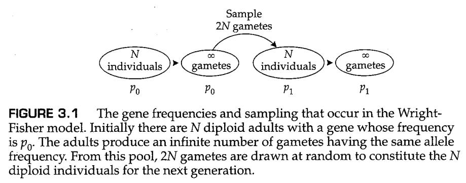

举一个具体的例子，一个由9个二倍体生物组成的群体仅代表一个含有18个配子的样本，但这些配子可以被认为是从一个基本上无限的配子池中取样的。由于小样本通常不具有代表性，样本中的等位基因频率可能与整个配子池中的频率不同。例如，假设一个配子池包含频率分别为 $p$ 和 $q$ 的等位基因A和a， $p+q=1$ 。然后，如果随机抽取2N个配子以产生下一代的合子，则样本中恰好包含 $j$ 个等位基因A的概率由下列二项分布频率给出：

$$
\begin{aligned}   
    Pr\{j \text{个等位基因A}\}&=C^j_{2N}p^jq^{2N-j}\\
    &=\frac{(2N)!}{j!(2N-j)!}p^jq^{2N-j} \tag{3.1}
\end{aligned}
$$

其中 $j$ 可以取 0到2N之间的任何整数值。二项式系数（中间表达式中的括号内）通常读为“C 2N取j”（英文中的读法为“two N choose j”），因为它是从总共 $2N$ 个元素中选择 $j$ 个元素的方法数量。在等式（3.1）中所示的一代随机抽样后，A在群体中的新等位基因频率（称为 $p'$ ）由 $j/(2N)$ 给出，因为根据定义，A的等位基因频率等于A等位基因的数量（在这种情况下为 $j$ ）除以总数（在这种情形下为 $2N$ ）。在下一代中，采样过程根据等式（3.1）重新进行， $p$ 替换为 $p'$ ，$q$ 替换为 $1-p'$ 。这样，等位基因频率可以在一代又一代之间随机变化。

图3.2是根据等式（3.1）对随机抽样的过程进行的计算机模拟的结果。图3.2A中的每一行给出了 $N=9$ （即 $2n=18$ ） 的群体中连续20个世代里等位基因A的数量变化。正如你所看到的，单个的群体的行为非常不稳定。在7个群体中，等位基因A发生了 **固定（fixed）** ，即 $p=1$ ；在5个群体中，等位基因A发生了 **丢失（lost）** ，即 $p=0$ 。在其他8个群体中，A和a都保持未固定的状态，或者说这两个等位基因依然是 **分离的（segregating）** ；然而，未固定群体中的最终等位基因频率很可能是一个不同于初始频率 $p=0.5$ 的其他值。图3.2B显示了 $2N=100$ 条件下的模拟结果。随着种群规模的增加，种群固定的速度明显变慢。图3.2的主要结论是，等位基因频率在任何一个群体中都表现得如此不稳定，以至于几乎不可能进行预测。

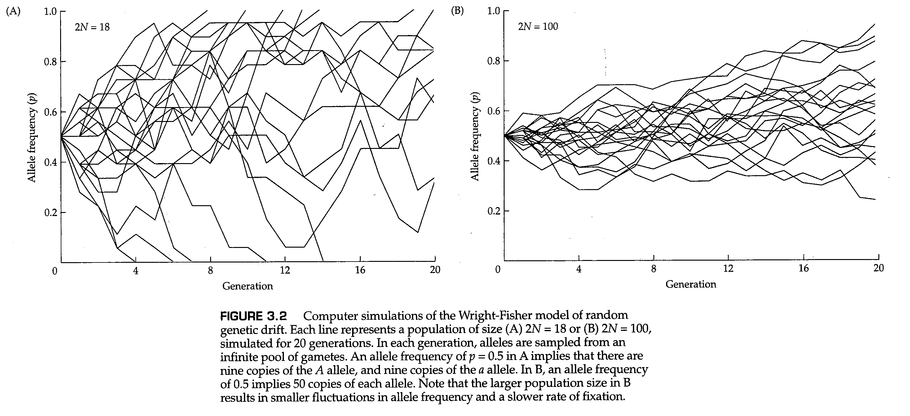

尽管由于任何单个群体中的随机遗传漂变导致的等位基因频率的变化可能无法预测，但我们可以预测大量群体中等位基因频率的 *平均* 行为。我们现在考虑大数量的多个群体，所有这些群体具有相同的初始等位基因频率和相同的群体大小 $N$ 。假设这些种群中的每一个都独立于其他种群经历漂变。并且假定除了它们的群体大小有限以外，所有亚群都满足哈迪-温伯格模型的所有假设，并附加规定：（1）雄性和雌性数量相等；（2）每个个体都有相同的机会为下一代贡献成功的配子。如图3.3所示，这里的关键点在于，我们可以通过考虑图中不同时间点的时间切片并统计具有特定等位基因频率的种群数量的直方图，来描述这些种群在等位基因的频率上是如何变化的。最初，种群将全部接近初始等位基因频率。随着时间的推移，这些种群“漂变”开来，最终它们在所有可能的等位基因频率上扩散开来。最后，正如我们将看到的，每个种群必须对一个或另一个等位基因进行固定。

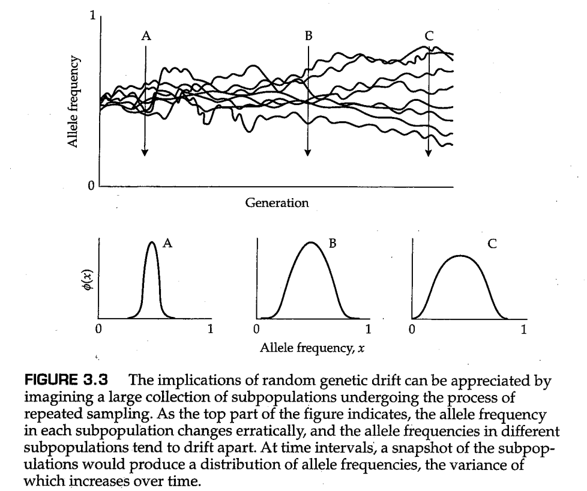

要理解为什么最终的固定或丢失是不可避免的，可以考虑一个无限长的保龄球道和一个无重量的保龄球。球道有一些微小的缺陷，这些缺陷会以某种方式影响保龄球，使其沿路径继续前进或者转向。由于球没有质量，这意味着它没有动量，因此在每一刻它都会受到球道的颠簸的影响。这意味着，就像等位基因频率一样，保龄球的未来只取决于它现在的位置，而不取决于它是如何到达那里的。沟槽代表了 $p=0$ 和 $p=1$ 的固定状态。一旦球进入沟槽，它就不能再出来。保龄球道的缺陷使球无法直线滚动，最终它会滚入一个或另一个沟槽。在这个类比中，群体的大小对应于保龄球道的宽度；群体越大意味着球道越宽。此时，虽然球道上的缺陷仍然会使球偏转，但这样的偏转与球道的宽度相比小了很多，球的Z字形偏转幅度更小。因此，球在沟外停留的时间更长，类似于较大群体中等位基因的固定时间更长，但最终球会落入沟槽中。

为了充分理解随机遗传漂变，我们必须学习如何推导图3.3中绘制的等位基因频率分布。我们刚刚描述了一代人之后会发生的情况，这组人群将具有一系列等位基因的频率，如等式（3.1）中的二项分布所描述的那样。二项分布为我们提供了一个群体在一代漂变之后具有等位基因概率 $p'$ 的概率。如果我们考虑到1000个初始等位基因频率 $p$ 的群体，那么二项分布给出了在经历一代漂变之后等位基因频率 $p'$ 的概率分布。那么下一代呢？对于每一个群体，我们可以将整个抽样过程看作重新开始。因为没有一个群体记得上一代的情况，所以每一代群体中都会重新进行二项抽样。但是，由于等位基因频率发生变化，新的等位基因频率必须在等式（3.1）中使用。对于1000个群体，等式（3.1）必须单独应用于每个群体，然后在这些分布中求和，以获得随机漂移的每个可能结果的总体概率。幸运的是，在我们检查了下面的实验之后，有一种更简单的方法。

按照图3.3设计的实际实验得出了图3.4所示的结果。该图显示了107个黑腹果蝇亚群中19代随机遗传漂变的历史。每个亚群由16只杂合的 $bw^{75}/bw$ 果蝇组成（ $bw$ =brown eyes棕色眼睛），并通过随机选择8只雄性和8只雌性来产生下一代来保持16只个体的恒定大小。图3.4中的每个直方图给出了包含0,1,2，……32个 $bw^{75}$ 等位基因的亚群体数量。图3.4中等位基因频率的变化模式起初看起来很复杂，但实际上发生了一件简单的事情。当固定了等位基因 $bw^{75}$ 或 $bw$ 的群体开始在边界堆积时，等位基因频率最初的那个呈驼峰状的分布逐渐变平。群体在边界处的堆积是因为，一旦等位基因被一个群体固定或丢失，其在这个群体中将会一直保持固定或丢失的状态不变，因为如此短的世代中，小群体中的突变可以忽略不计。经过19代漂变之后，大多数亚群体都固定了两个等位基因中的一个，而在还没有固定等位基因的群体中，等位基因频率的概率分布基本上是平的。

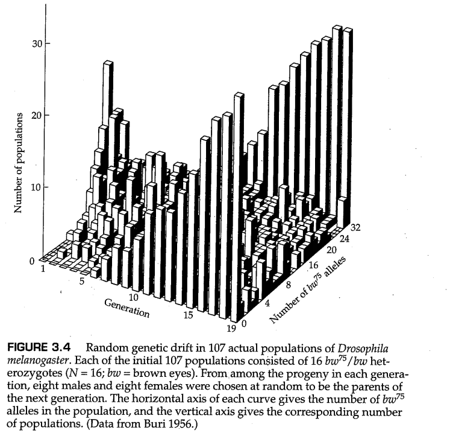

--------------------

**问题3.1**

考虑一个小荒岛上的自花授粉植物的群体，这个群体最开始由一个杂合子个体组成，基因型为Aa。假设这株植物开花结实后死亡，因此世代之间是离散的，并且整个群体只能由一株植物组成。到第二代时，这个群体中基因纯合的概率是多少？

---------

**答案**

第一代后代是AA的几率是 $\frac{1}{4}$ ，而它是aa的几率也是 $\frac{1}{4}$ ，因此在一代中固定的几率是 $\frac{1}{2}$ 。如果第一代后代为Aa，那么第二代中固定（假设种群在第一代中没有固定）的几率也是 $\frac{1}{2}$ 。因此，在第一代中没有固定，而在第二代中固定的几率是  $\frac{1}{2}\times\frac{1}{2}=\frac{1}{4}$ 。再加上第一代中固定的概率（ $\frac{1}{2}$ ），我们得到  $\frac{1}{2}+\frac{1}{4}=\frac{3}{4}$ 为这个基因在第二代中固定的概率。注意，每一代中不固定的概率是 $\frac{1}{2}$ ，因此在第二代中该基因依然没有固定的概率是 $\frac{1}{2}\times\frac{1}{2}$ ，等于 $1-\frac{3}{4}$ 。

-------------------

## 3.2 随机遗传漂变的Wright-Fisher模型

在前面的等式（3.1）中描述了一种带有二项分布随机抽样的随机遗传漂变模型，这就是著名的 **Wright-Fisher模型** ，因为费希尔（Fisher）（1930）和怀特（Wright）（1931）推导出了亚群中的等位基因频率的期望分布。尽管两位作者都没有用这里所用的方式来表述问题，但我们的方法使问题变得更简单，并给出了相同的结果。如果一个群体包含 $2N$ 个等位基因，其中可能存在两个等位基因A和a，那么群体的状态可以用群体中A等位基因的数量来描述。群体可能的状态是 $0,1,2,...2N$ 。状态 $0$ 和 $2N$ 是特殊的，因为它们代表了一种等位基因被固定的状态，一旦种群进入这两种状态中的任何一种，就无法离开，除非出现新的突变（在目前的讨论中我们排除了这种可能性）。状态 $0$ 与 $2N$ 被称为 *吸收状态（absorbing states）* 。从任何非固定的等位基因频率开始，群体都有可能漂变到任何其他等位基因的频率。然而，种群更可能保持在一个接近于当前状态的新状态，而不是大幅跳跃。如图3.4所示，如果 $2N=32$ ，则一代中基因A的数量从30个拷贝的漂移到29个拷贝的概率为0.186，而漂移到27个拷贝的概率为0.033。种群从具有 $i$ 个拷贝的等位基因A的状态漂移到 $j$ 个拷贝的状态的概率称为 *转移概率（transition probability）* 。Wright-Fisher模型的转移概率直接从二项分布（见方程3.1）获得。特别的，对于一个含有 $i$ 个拷贝的等位基因A和 $2N-i$ 个拷贝的等位基因a的群体，则转移概率 $T_{ij}$ 由下式给出：

$$
T_{ij}=C_{2N}^i(\frac{i}{2N})^j(\frac{2N-i}{2N})^{2N-j}\\
=\frac{(2N)!}{j!(2N-j)!}p^jq^{2N-j} \tag{3.2}
$$

其中， $p=i/2N$ 是等位基因A的初始频率，而 $q=(2N-i)/2N$ 是等位基因a的初始频率。

转移概率可以放在一个方阵 $\bm{T}$ 中，其中矩阵元素 $T_{ij}$ 给出了从状态 $i$ 到状态 $j$ 的转移概率， $i,j=0,1,2,...,2N$ 。矩阵 $\bm{T}$ 包含了预测经过几代随机遗传漂变以后，群体预期分布所需的所有信息，如图3.4所示。这类模型的状态是离散的，并且从一个状态到另一个状态的转移概率固定，这样的模型被称为 **马尔可夫链（Markov chain）** ，它具有一些非常优雅的数学性质。Wright Fisher模型的迭代给出了纯漂变过程的预期结果（图3.5）。几分钟后，我们将使用Wright Fisher模型来展示关于固定概率的重要结果。

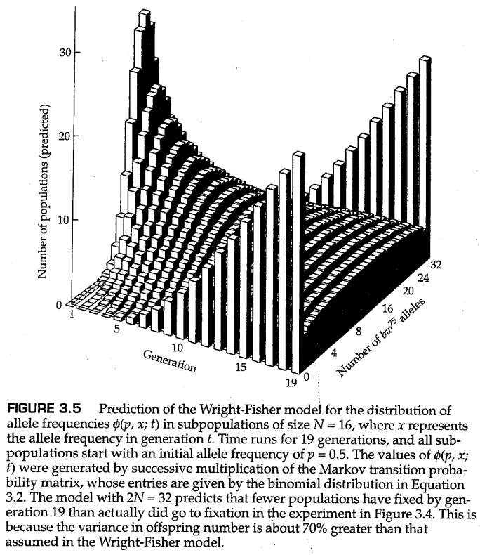

-----------------

**问题3.2**

考虑一个由四个二倍体个体组成的群体。这个群体具有四个等位基因A的拷贝（等位基因A的频率 $p=\frac{1}{2}$ ），计算经过一代的遗传漂变以后，群体中等位基因A的拷贝数变成3个的概率。如果经过一代漂变后，等位基因A的拷贝数还是4个呢？变成5个呢？计算它们的概率。现在考虑一个相同大小的群体，但最初拥有两个拷贝A。漂变到1个、2个或3个拷贝的概率是多少？

---------

**答案**

应用方程（3.2），我们得到 $T_{43}=[8!/(5!3!)](1/2)^8=7/32=0.219$ 。同理， $T_{44}=[8!/(4!4!)](1/2)^8=70/256=0.273$ ， $T_{45}=T_{43}=7/32=0.219$ 。（注意，二项分布关于 $p=\frac{1}{2}$ 对应的 $k$ 对称，这里 $p(k=4)=\frac{1}{2}$ ，因此这里的  $T_{43}$ 和 $T_{45}$ ，概率是相等的）。在初始频率为 $\frac{2}{8}$ 的情况下，我们得到 $T_{21}=[8!/(1!7!)](\frac{1}{4})(\frac{3}{4})^7=0.267,\ T_{22}=[8!/(2!6!)](\frac{1}{4})^2(\frac{3}{4})^6=0.311,\  T_{23}=[8!/(3!5!)](\frac{1}{4})^3(\frac{3}{4})^5=0.208$ 

-----------

**问题3.3**

Moran（1958）提出了一种随机遗传漂变的替代公式【译者按：与离散世代的Wright Fisher模型不同，Moran模型认为世代之间是连续的】。该模型具有相当大的直觉吸引力，它还允许针对不同数量的进化兴趣推导出显式表达式（Ewens 2004）。Moran模型严格适用于单倍体群体，但为了使其与Wright Fisher模型相比较，我们将假设一个拥有 $2N$ 个单倍体个体的群体。在每一代中，遗传漂变的过程从随机抽取两个个体开始，这里的抽样过程是有放回抽样（sampling with replacement），这意味着同一个体可以被抽到两次。如果随机抽到的是两个不同的个体，则随机选择其中一个来产生单个后代，并将这个个体和其后代放回到群体中；同时丢弃另一个个体。如果随机抽取到的是同一个个体，则只将这个个体的后代放回群体中。在Moran模型中，如果包含 $2N$ 个单倍体个体的群体中含有 $i$ 个等位基因A和 $2N-i$ 个等位基因a，那么转移概率 $T_{ij}$ 只在 $j=i-1,\ j=i,\ j=i+1$ 时非零，其他情况时均为0。Moran模型的转移概率由下面的式子给出：

$$
\begin{aligned}
T_{ii}&=\frac{i^2+(2N-i)^2}{(2N)^2}=p^2+q^2\\
T_{ij}&=\frac{i(2N-i)}{(2N)^2}=pq,\ (j=i+1或j=i-1) \tag{3.3}
\end{aligned}
$$

对于问题3.2中给出的示例，用Moran模型计算转移概率。

------------------

**答案**

将等式（3.3）应用于 $p=\frac{4}{8}$ 的情况，我们得到 $T_{34}=0.25,\ T_{44}=0.50,\ T_{45}=0.25$ ；对于 $p=\frac{2}{8}$ 的情况，我们得到 $T_{21}=0.1875,\ T_{22}=0.6250,\ T_{23}=0.1875$ 。与Wright-Fisher模型不同，Moran模型无论是保持等位基因数量不变，还是增加或减少恰好1个等位基因，转变概率总和为1。

-------------------

Wright Fisher模型和Moran模型都包含了随机遗传漂变的一个重要特征。这就是当等位基因频率等于 $\frac{1}{2}$ 时，等位基因频率的随机变化幅度最大，而更高或更低的等位基因频率则会导致更小的随机变化幅度。这是因为当 $p=\frac{1}{2}$ 时，二项分布随机抽样的方差最大。在Wright Fisher模型中，经过一代随机漂变后的等位基因频率方差由二项分布方差给出，为 $pq/(2N)$ 。当 $p=0$ 或 $p=1$ 时，方差降为0。在Moran模型中，单次出生/死亡事件所产生的方差为 $2pq/(2N)^2$ 。这看起来与Wright Fisher模型中的方差非常不同，然而，将个体出生和死亡转换为整个人口的更替还需要乘以数学因子 $2N$ 。此时，分子中仍有因子2，这反映了一个微妙的事实，即在Moran模型中，每个个体的后代数量的方差是Wright Fisher模型的两倍（Ewens 2004）。不论是哪一种关于随机漂变的方差公式都清楚的表明了一个事实，即更大的群体在遗传漂变过程中，等位基因频率的改变速率更慢，因为二项分布随机抽样的方差大小与群体大小成反比。

------------

**问题3.4**

对随机漂变的模拟可能是一个非常耗时的命题。如果要模拟一个大小为1000的群体在1000代中的遗传漂变，需要进行 $10^6$ 次随机数的生成，并根据随机数决定接受或拒绝每个基因型。木村资生（Kimura Motoo）（1980b）提出了一个与扩散近似的原理（见下一节）非常接近的捷径。这里的诀窍就是使用递归： $p'=p+(2U-1)\sqrt{(3pq/2N)}$ ，其中 $U$ 是一个均匀分布在0和1之间的随机数。在每一代中，你选择一个随机数 $U$ ，然后根据上述递归式计算下一代等位基因频率的实现值。为什么这种方法有效？（提示：均匀分布的方差是取值范围长度的平方除以12）

--------

**答案:**

表达式 $2U-1$ ，其中 $U$ 是介于0和1之间的数字，因此这个表达式产生的数值在-1到+1之间，值域的长度范围为2。因此， $(2U-1)\sqrt{(3pq/2N)}$ 的值域范围为 $2\sqrt{(3pq/2N)}$ 。将这个表达式平方并除以12，这个均匀随机变量的方差等于 $pq/2N$ ，这正是二项抽样分布的方差。每一代的等位基因频率都有相同的增加或减少的机会，等位基因频率变化的方差为 $pq/2N$ 【这与Wright Fisher模型给出的方差一致】。即使在伪抽样模拟中等位基因的频率变化的分布是均匀的，使用这一递推过程过程依然可以在使用很少的计算时间的前提下再现暴力模拟的大部分结果。请注意，作为在计算时间和结果精确性之间进行权衡的结果，当计算结果接近等位基因固定状态时必须稍加小心，因为这种算法可以产生小于0或大于1的等位基因频率。

-------------------

## 3.3 扩散近似（the diffusion approximation）

图3.4所示的等位基因频率变化模式与理想群体的理论预期非常接近，如图3.5所示。该分布是通过矩阵的连续乘法获得的，矩阵的元素由方程（3.2）中的转移概率给出。尽管全面的随机遗传漂变理论涉及的数学知识超出了本书范围（参见Kimura 1955，1964，1976；Wright 1969；Crow和Kimura 1970；Kimura和Ohta 1971；Ewens 2004），但在下一节中，我们提供了一个介绍性的花絮以让读者们浅尝一下。如果你是一个没有微积分背景的学生，这些讨论可能显得有些难以理解，但请不要气馁，因为对这一部分的理解与否并不影响对本章的其余部分或本书后面的任何内容的理解。

### 一种前向方法

连续矩阵乘法的一个优雅的替代方案是基于扩散近似的（Fisher 1922；Wright 1945；Kimura 19571964）。扩散近似假设随机漂变以类似于通过金属棒的热扩散或在布朗运动下的微小粒子扩散的方式在亚群中分散等位基因频率（Kolmogorov 1931）。这里的想法是假设亚群足够大，因此等位基因频率随时间的变化是平滑的，没有大幅跳跃。那么，任何时间的等位基因频率的统计分布都是一个连续函数，我们可以将其表示为 $\phi(p,x;t)$ ，其中 $x$ 表示 $t$ 时间时在大量的分离群体中的等位基因频率 $(0<x<1)$， $p$ 是这些群体中的初始频率。理论问题是建立一个描述 $\phi(p,x;t)$ 在随机遗传漂变下如何变化的方程，并求解该方程。在任何时间 $t$ ，函数 $\phi(p,x;t)$ 是一个平滑的连续函数，近似于图3.5中亚群体中等位基因频率的直方图，除了 $\phi(p,x;t)$ 只与A和a等位基因未固定的亚群有关。

实际上，有两种方法可以获得扩散方程，每种方法都有优点和局限性。一种方法是询问随着时间的推移，分布 $\phi(p,x;t)$ 的变化情况。为了解释方程的含义，我们将允许 $x$ 和 $t$ 以一个微小的、离散的增量 $\Delta x$ 和 $\Delta t$ 发生改变。有两个原因可以解释为什么状态 $x$ 会随着时间 $\Delta t$ 的改变而改变。一个原因是随机的遗传漂变，另一种是可能系统性力量，包括突变或选择。我们将假设A是受欢迎的等位基因，并将 $M(x)$ 定义为 $x$ 在系统性力量下以 $\Delta x$ 增加的概率。随机漂变的力量用概率 $V(x)$ 表示，即 $x$ 在随机漂变的力量下有 $V(x)/2$ 的概率增加 $\Delta x$ ，或者 $V(x)/2$ 的概率减小 $\Delta x$ 。因此，在任何时间段 $\Delta t$ 之后，等位基因频率 $x$ 依然保持为 $x$ 的概率为 $1-M(x)-V(x)$ 。

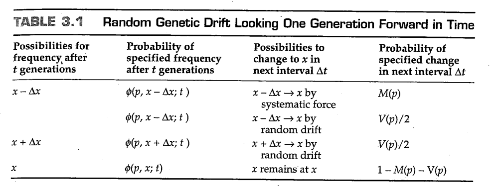

这其中的原因如表3.1所示。由于等位基因频率的状态变化仅限于 $+\Delta x$ 或 $-\Delta x$ ，对于一个群体，要想其在时间 $t+\Delta t$ 时处于状态 $x$ ，其在时间 $t$ 的状态只能是 $x+\Delta x,\ x, x-\Delta x$ 中的一种，它们各自的概率分别为 $\phi(p,x+\Delta x;t),\ \phi(p,x;t),\ \phi(p,x-\Delta x;t)$ 。一个处于状态 $x+\Delta x$ 的亚群转变为状态 $x$ 的概率为 $M(x-\Delta x)+V(x-\Delta x)/2$ ，取决于它是由系统性力量（例如，突变或选择）推动，还是由于随机漂变而随机改变。处于状态 $x+\Delta x$ 的亚群通过随机漂变达到状态 $x$ 的概率为 $V(x-\Delta x)/2$ 。最后，一个处于状态 $x$ 的亚群可以以 $1-M(x)-V(x)$ 的概率继续保持在 $x$ 状态。 $\phi(p,x;t)$ 所需的函数可以通过对表3.1中第2列和第4列相乘的结果求和而得到，其经过一些简化后，可以得到下面的差分方程：

$$
\begin{aligned}
    &\phi(p,x;t+\Delta t)-\phi(p,x;t)=\\
    &-[M(x)\phi(p,x;t)-M(x-\Delta x)\phi(p,x-\Delta x;t)]\\
    &+\frac{1}{2}\{
        [V(x+\Delta x)\phi(p,x+\Delta x;t)-V(x)\phi(p,x;t)]\\
    &-[V(x)\phi(p,x;t)-V(x-\Delta x)\phi(p,x-\Delta x;t)]\}
\end{aligned}
$$

等号左边的部分是在时间 $t$ 的改变量为 $\Delta t$ 时，函数 $\phi$ 的变化 $\Delta\phi$ 。在等号右边，第一项是等位基因频率 $x$ 的改变量为 $\Delta x$ 时，$M\phi$ 的改变量 $\Delta M\phi$ ，而第二项是在 $x$ 的两步改变量 $\Delta\Delta x$ 下， $V\phi$ 的改变量 $\Delta\Delta V\phi$ 。上面的差分方程用符号表示为：

$$
\frac{\Delta\phi(p,x;t)}{\Delta t}=
-\frac{\Delta[M(x)\phi(p,x;t)]}{\Delta x}
+\frac{1}{2}\frac{\Delta\{\Delta[V(x)\phi(p,x;t)]\}}{\Delta(\Delta x)}
$$

这里我们可以取一个极限 $\Delta t\rightarrow 0,\ \Delta x\rightarrow 0$ （同时忽略了一些技术细节），从而得到了所谓的 **柯尔莫哥洛夫前向方程（Kolmogorov forward equation）** ：

$$
\frac{\partial\phi(p,x;t)}{\partial t}=
-\frac{\partial[M(x)\phi(p,x;t)]}{\partial x}
+\frac{1}{2}\frac{\partial^2[V(x)\phi(p,x;t)]}{\partial x^2} \tag{3.4}
$$

这是一个偏微分方程，对于给定的初始函数值 $\phi(p,x;0)$ ，我们都可以求出 $\phi(p,x;t)$ （尽管求解的过程并不简单）。我们还没有确定 $M(x)$ 或 $V(x)$ 是否与群体遗传学有任何关系。函数 $M(x)$ 代表了一代中由于任何系统性力量（如突变、迁移或选择）而发生的等位基因频率变化。函数 $V(x)$ 也有直接的生物学解释； $V(x)$ 是根据方程（3.1）对 $2N$ 个等位基因进行一个世代的二项抽样后的等位基因频率的方差；因此  $V(x)=x(1-x)/(2N)$ 。

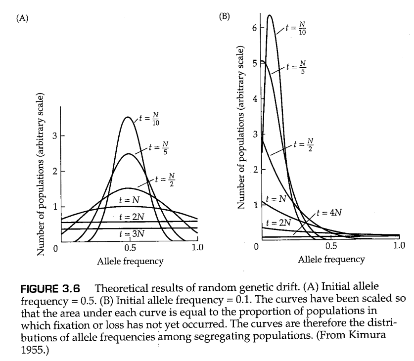

Wright（1931）探索了方程（3.4）的许多方面，Kimura（1955）发现了该方程的形式解，这些形式解需要一些复杂的数学知识。对于我们的目的，一些图表可以用来说明前向扩散方程的重要性质。图3.6的曲线展示了 $M(x)=0$ 的解，这些曲线展示了在等位基因未固定的群体中，经过了一系列时间 $t$ 后，等位基因频率的理论分布，其中时间 $t$ 的单位是 $N$ 代。图3.6A中，所有群体的起始频率均为 $\frac{1}{2}$ ，这与图3.4中的实际群体一样；在经过 $t=2N$ 代的时间后，等位基因频率的分布基本上平坦了，此时大约有一半的群体等位基因仍未固定。图3.6中的概率分布仅涉及那些未固定的群体；随着时间的推移，越来越多的群体固定了两个等位基因之一，概率分布逐渐堆积在0和1处，如图3.4中的直方图所示。实际上，在图3.6中，每条曲线下的面积等于未固定群体在所有群体中的占比，随着时间推移，这一比例在逐渐变小。特别是，一旦曲线变平，概率分布曲线的高度会以每代 $1/(2N)$ 的速率降低。为了说明扩散近似和Wright-Fisher模型给出的结果非常相似，图3.7显示了图3.4中数据的扩散近似，其中 $2N=32,\ P_0=\frac{1}{2}$ ， $t$ 的范围从第1代到第19代。

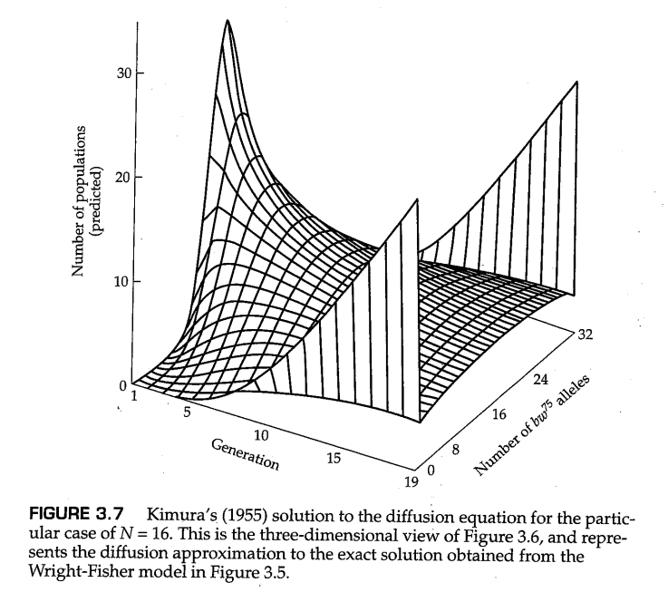

图3.6B显示了当初始等位基因频率为0.1时发生的情况；这里的分布是高度不对称的，等位基因频率的分布直到约 $t=4N$ 代才变得平坦，此时只有约10%的群体未固定。一旦等位基因的频率达到平坦分布，这一分布将继续保持平坦，但随机漂变仍在继续，直到所有群体完成对等位基因的固定或丢失。

### 一种后向方法

为了找到 $\phi(p,x;t)$ 的另一个方程，我们还可以回溯到过程的开始，并考虑在第一个时间增量 $\Delta t$ 中可能发生的情况。由于亚群最初都以等位基因频率 $p$ 开始，在第一个时长增量 $\Delta t$ 之后，一个特定的亚群的状态可以变为 $p+\Delta p,\ p-\Delta t$ ，或者保持在 $p$ 。这三种情况的相对概率分别是 $M(p)+V(p)/2,\ V(p)/2,\ 1-M(p)-V(p)$ ，与上一节一样， 这里的 $M(p)$ 测量了任何倾向于增加等位基因频率的系统性力量的强度， $V(p)$ 代表了由于随机遗传漂变导致的等位基因频率方差。

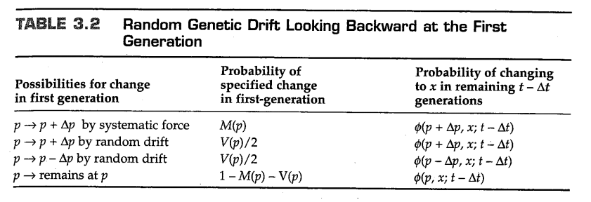

我们可以列出这种情况下的等位基因频率变化表，如表3.2所示。当 $p$ 在第一个时间增量之后变为 $p+\Delta p$ ，则亚群体在随后的 $t-\Delta t$ 时间单位后达到状态 $x$ 的概率与  $\phi(p+\Delta p,x;t-\Delta t)$ 成正比。类似的，从状态 $p-\Delta p$ 经过 $t-\Delta t$ 个单位的时间间隔后到达状态 $x$ 的概率与  $\phi(p-\Delta p,x;t-\Delta t)$ 成正比。最后，从 $\Delta t$ 时刻的状态 $p$ 到达 $t$ 时刻的状态 $x$ 的概率与 $\phi(p,x;t-\Delta t)$ 成正比。通过对表3.2中第2列和第3列的乘积求和，得到 $\phi(p,x;t)$ 的相关方程。经过一些重新排列后，我们得到下面的式子：

$$
\begin{aligned}
    &\phi(p,x;t)-\phi(p,x;t-\Delta t)=\\
    &M(p)[\phi(p+\Delta p,x;t-\Delta t)-\phi(p,x;t-\Delta t)]\\
    &+\frac{V(p)}{2}\{
        [\phi(p+\Delta p,x;t-\Delta t)-\phi(p,x;t-\Delta t)]\\
        &-[\phi(p,x;t-\Delta t)-\phi(p-\Delta p,x;t-\Delta t)]\}
\end{aligned}
$$

和之前一样，等号左边的式子等于在给定的时间 $t$ 的变化量 $\Delta t$ 中， $\phi$ 的变化量 $\Delta\phi$ 。对于等号右边的式子，第一项是在给定频率 $p$ 的变化量 $\Delta p$ 下， $M(p)$ 乘 $\phi$ 的变化量 $M\Delta\phi$ ；第二项是在给定频率 $p$ 的两步变化量 $\Delta\Delta p$ 下， $V(p)$ 乘 $\phi$ 的变化量 $V\Delta\Delta\phi$ 。因此，上述差分方程可以写成：

$$
\frac{\Delta \phi(p,x;t)}{\Delta t}=M(p)\frac{\Delta \phi(p,x;t)}{\Delta p}+\frac{V(p)}{2}\frac{\Delta(\Delta \phi(p,x;t))}{\Delta(\Delta p)}
$$

同样的，我们可以忽略一些技术细节，并取极限 $\Delta t\rightarrow 0,\ \Delta p\rightarrow 0$ ，就可以将上述差分方程变为下面的偏微分方程，即所谓的 **柯尔莫哥洛夫后向方程（Kolmogorov backward equation）** ：

$$
\frac{\partial\phi(p,x;t)}{\partial t}=M(p)\frac{\partial\phi(p,x;t)}{\partial p}
+\frac{V(p)}{2}\frac{\partial^2\phi(p,x;t)}{\partial p^2} \tag{3.5}
$$

为了回答群体遗传学中我们对随机漂变感兴趣的问题，柯尔莫哥洛夫后向方程（见方程3.5）通常比前向方程（参见方程3.4）更有用。这些感兴趣的问题包括等位基因最终固定的概率、最终固定的等位基因的平均固定时间等。为了理解后向方程是如何用于这些问题的，想象一下方程（3.5）中的时间 $t$ 足够大，此时等位基因频率 $\phi(p,x;t)$ 的分布不再改变。
由于只要任何亚群仍然是多态的，随机漂变将继续改变等位基因的频率，因此 $\phi(p,x;t)$ 不再变化意味着所有亚群都固定了两个等位基因之一，这进一步意味着方程（3.5）的等号左边等于0，等号右边不再取决于 $x$ （因为没有种群的等位基因仍然处于分离状态）或 $t$ 。为了强调我们现在处理的是单变量函数，群体遗传学家经常将方程3.5的形式改写为

$$
0=M(p)\frac{du(p)}{dp}+\frac{V(p)}{2}\frac{d^2u(p)}{dp^2} \tag{3.6}
$$

在这个方程中，微分符号 $d$ 代替了偏导数的符号 $\partial$ ，这是为了强度函数 $u(p)$ 是一个单变量函数。换句话说， $u(p)$ 是在给定的初始频率 $p$ 下，等位基因A最终被固定的概率。或者说， $u(p)$ 可以解释为最终固定了等位基因A的亚群在所有亚群中的比例。在没有系统性力量的纯随机漂变的情况下， $M(p)=0$ ，则方程（3.6）变为

$$
0=\frac{V(p)}{2}\frac{d^2u(p)}{dp^2} \tag{3.7}
$$

这个方程定义了一系列曲线，但群体遗传学中感兴趣的曲线具有性质 $u(0)=0$ ，这意味着不存在的等位基因无法固定，同时还有性质 $u(1)=1$ ，这意味著已经固定的等位基因会永远保持固定状态。

-------------

**问题3.5**

对于拥有初始频率 $p$ （ $0<p<1$ ）的等位基因A，证明 $u(p)=p$ 是微分方程（3.7）的解。

-------------

**答案**

我们需要证明的是， $u(p)=p$ 满足微分方程（3.7）。尽管 $V(p)=p(1-p)/2N$ ，但这与方程的解无关。 $u(p)=p$ 这个解来自于下列事实，即 $u(p)=p$ 的一阶导数 $du(p)/dp=1$ ，进而其二阶导数 $d^2u(p)/dp^2=0$ 。因此，只要 $V(p)\neq 0$ ， $u(p)=p$ 就是方程（3.7）的一个解。  $u(p)=p$ 的生物学意义如下：在随机遗传漂变的作用下，一个初始等位基因频率为 $p$ 的等位基因将有 $p$ 的概率被固定，有 $1-p$ 的概率被丢失，前提是它对生物体的生存和繁殖能力没有影响（这种等位基因通常被称为 *选择中性等位基因（selectively neutral alleles）* ）。

---------------

### 吸收时间和达到固定状态的时间

对于选择中性等位基因（如问题3.5所示），最终固定的概率等于其初始等位基因频率。对柯尔莫哥洛夫后向方程（方程3.5）的分析也得出了许多其他重要结论。这些结论包括中性等位基因固定或丢失的期望时间（假设其最终固定或丢失）。假设一个等位基因的初始频率为 $p$ ，Kimura和Ohta（1969）表明，假设一个等位基因最终固定，则其固定前的平均时间 $\bar t_1(p)$ 为（时间单位为世代数量）：

$$
\bar t_1(p)=-4N(\frac{1-p}{p})\text{ln}(1-p) \tag{3.8}
$$

类似地，假设一个等位基因最终丢失，他们发现丢失的平均时间 $\bar t_0(p)$ 为：

$$
\bar t_0(p)=-4N(\frac{p}{1-p})\text{ln}(p) \tag{3.9}
$$

结合等式（3.8）和（3.9），一个等位基因的平均持续时间（即在群体中等位基因A和a保持分离状态、没有被群体固定的平均时间长度） $\bar t(p)$ 由式子 $\bar t(p)=p\bar t_1(p)+(1-p)\bar t_0(p)$ 给出，其等于

$$
\bar t(p)=-4N[(1-p)\text{ln}(1-p)+p\text{ln}(p)] \tag{3.10}
$$

图3.8显示了中性等位基因的固定、丢失和持续的平均时间。当初始频率为 $p=\frac{1}{2}$ 时群体保持不固定的平均时间最长，约为 $2.77N$ 世代的时间。

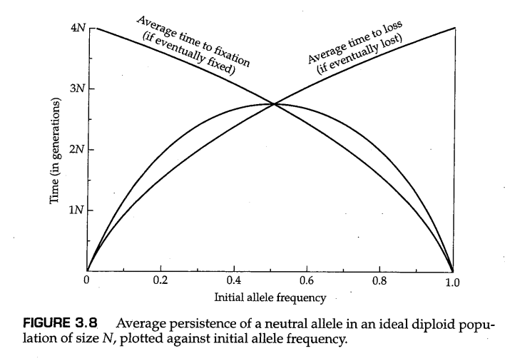

当 $p=1/(2N)$ 时，即当一个新的中性突变刚刚发生并且在群体中只有一个拷贝时，通过方程（3.8）和（3.9）得到的结果特别有趣。在这种情况下，这个新出现的等位基因最终固定的概率为 $1/(2N)$ ，并且，假设等位基因最终固定，平均固定时间约为 $4N$ 代。另一方面，一个新的中性突变最终丢失的概率为 $1-1/(2N)$ ，并且，假设该等位基因最终丢失，丢失的平均时间约为 $2\text{ln}(2N)$ 个世代。换句话说，新出现的中性等位基因如果最终被固定，则固定的过程通常需要很长时间，而如果其最终丢失，则丢失的速度很快。举个例子，对于 $N=500$ 的群体，最终固定的新中性突变需要平均2000代的时间才能固定，而最终丢失的新的中性突变平均需要少于14代的时间就会丢失。

## 3.4 细分群体中的随机漂变

大多数真实的群体被细分为更小的单位，例如，人类集中在城市、城镇和村庄；动物组成兽群、鸟群或鱼群；植物的群体也会发生空间上的聚集。这种群体细分让人联想到图3.5中的群体结构，除了一点不同，即自然界中的亚群之间并不存在遗传隔离，这是因为不同亚群之间的个体存在某种程度的 *迁移（migration）* 或者说移动，这导致了不同亚群体之间的 **基因流（gene flow）** 或者说基因交换。

然而，随机遗传漂变往往会导致亚群之间在其等位基因频率上发生分化，即使考虑到某些基因流的存在。为了了解这一点，我们考虑图3.9中所示的四个亚群体。每个亚群体的初始等位基因频率都是 $p=\frac{1}{2}$ ，并且每个亚群体在二项抽样后独立地经历随机漂变（见方程3.2）。

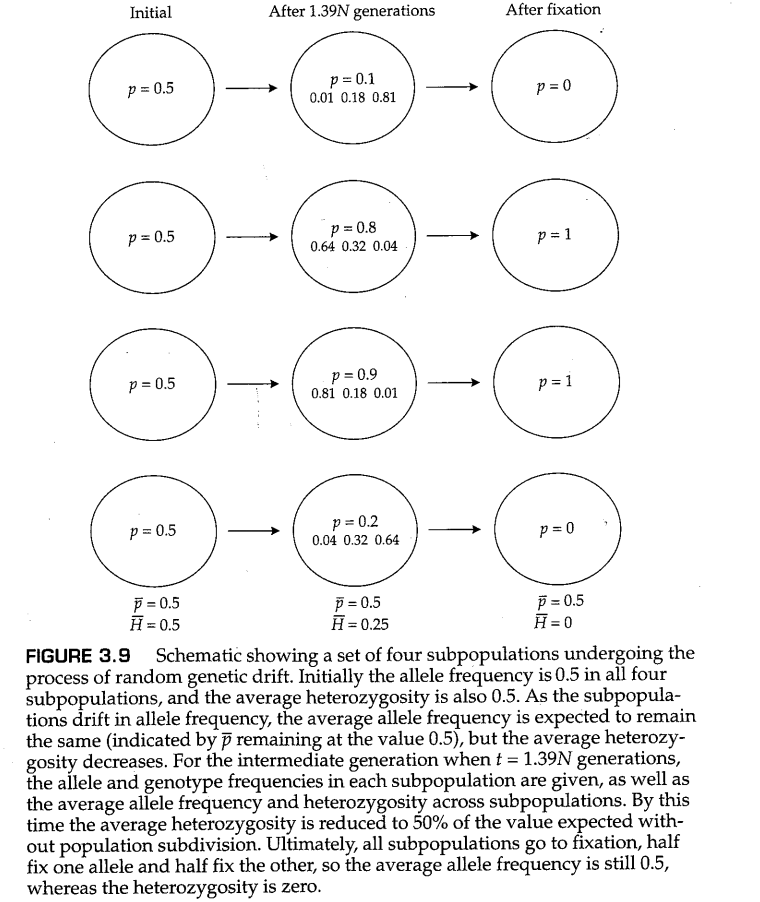

我们假设随机交配发生在任何特定的亚群中（称为亚群 $i$ ）。因此，如果第 $i$ 个亚群中A和a的等位基因频率表示为 $p_i$ 和 $q_i$ ， 则AA、Aa和aa的基因型频率可以由我们熟悉的哈迪-温伯格定律给出，分别为 $p_i^2,\ 2p_iq_i,\ q_i^2$ ；此外，图3.9中最后一列的情况代表着经过足够长的时间以后，所有亚群都固定了一个等位基因。因此，在第 $i$ 个亚群中， $p_i$ 要么等于0，要么等于1。此时，这个亚群中AA、Aa和aa的基因型频率要么分别为 $0,\ 0,\ 1$ （如果 $p_i=0$ ），要么分别为 $1,\ 0,\ 0$（ 如果 $p_i=1$ ）。这些基因型频率虽然极端，但仍满足哈迪-温伯格定律。因此，在图3.9中的任何一个亚群中，杂合子的频率是随机交配的预期频率。

图3.9中的总群体由四个亚群的总和组成，并且在总群体中存在杂合基因型的缺失。假设我们不知道亚群体结构，并从总群体中取样，就好像它是一个单一的、个体间随机交配的群体。如果我们从图3.9的最右边一列中随机取样，此时没有任何亚群的等位基因仍处于未固定状态，那么我们将获得 $p=\frac{1}{2}$ 的等位基因频率。按照哈迪-温伯格平衡的假设，我们会天真地期望基因型中的一部分是杂合的，并且杂合子的频率为 $2pq=\frac{1}{2}$ 。然而事实上，我们根本不会抽样到杂合基因型！这样一个相当矛盾的结论——尽管每个亚群内部都进行随机交配，但总群体中的杂合子数量依然不足——是有限的亚群大小与无尽的随机遗传漂变带来的结果。上面所说的这种每个亚群都处于固定状态的极端情况很容易理解：具有等位基因频率 $\frac{1}{2}$ 的群体只能由两个固定了等位基因A的亚群和两个固定了等位基因a的亚群所组成；平均等位基因频率是  $\frac{1}{2}$ ，但总群体没有杂合子。

我们现在能够量化在随机遗传漂变下，亚群等位基因频率的差异。为了有效地做到这一点，我们需要引入一个称为“血缘同源等位基因”（allele identity by descent）的概念。如果两个等位基因是之前某代中的基因的复制品（通过DNA复制产生），这两个等位基因就是 **血源同源（identity by descent）** 的。这一定义本身并不能说明问题，因为如果在时间上倒退得足够远，那么每对等位基因在血统上都必须是相同的，因此这个概念可能显得空洞。摆脱这个陷阱的方法是选择过去的某个任意时间（根据实际情况可以选择一个较近的时间或者较远的时间），并声明在这一刻每个等位基因都与其他等位基因不同。以这种方式，任何更早的血源同源性都会被抹掉，因此定义中所说的血源同源其实是通过DNA复制过程可以追溯到的共同祖先，这里需要考虑到刚刚指定的那个时间，因为我们宣称在那一刻，群体中的每个等位基因都是不同的。

血统同源的概念是有用的，因为它允许我们区分两种类型的纯合基因型。特别是，纯合AA基因型中的A等位基因可能是血统不同的等位基因（这意味着这些等位基因在每个等位基因被宣布为不同的时候都存在于人群中），或者它们也可以是血统同源的（这意味着它们起源于单个A等位基因的DNA复制事件，而复制发生在每个等位基因被宣布为不同的时间之后）。在另外一些情况下，通过实验方法（例如，蛋白质电泳），我们可能无法区分不同的等位基因，但这些等位基因在血统同源方面的情况是未知的。这种情况下的等位基因被称为 *类型同源（identical by kind）* 或 *状态同源（identical by state）* 的。

个体中的等位基因血统同源的概率通常表示为 $F$ ，Wright（1922）将其称为 **固定指数（fixation index）** 。在群体细分的背景下，本章中使用的 $F$ 与第6章中的 $F_{ST}$ 相同。在本章中，我们将省略下标，因为我们希望跟踪 $F_{ST}$ 随时间的变化，并且在这种情况下， $t$ 代后的等位基因血统同源的概率可以用 $F_i$ 方便地表示。

现在，我们可以更具体地说，我们可以选择过去的某个任意时间，并声明此时每个等位基因都是不同的。在图3.9所示的群体细分的背景下，宣布每个等位基因不同的时间是在最初的群体中，群体细分第一次发生，并且所有亚群都具有相同的等位基因频率的时间。用符号表示的话，我们声明 $t=0$ 是第一次建立亚群的时间，此时 $F_t=0$ 。随着时间的推移，每个亚群都经历了随机漂变，每个亚群体中的基因型频率将满足哈迪-温伯格定律，因为亚群体内的交配是随机的。然而，亚群中的等位基因频率将因随机遗传漂变而改变，并且 $F_t$ 的值也会逐渐增加，这是因为共同祖先导致亚群中的血源同源等位基因越来越多。

可以借助图3.10中的图表计算 $F_t$ 的增加率。该图显示了 $t-1$ 代育种群体中的 $2N$ 个等位基因。在 $t$ 代的等位基因抽样中，被抽中的第一个等位基因可能是 $t-1$ 代中存在的任何等位基因，并且每个等位基因被抽中的概率相等。当第一个等位基因被确定以后，被抽中的第二个等位基因与第一个类型相同的概率是 $1/(2N)$ （在这种情况下 $F=1$ ），因为这是在配子池中每个等位基因类型的频率；因此，被抽中的第二个等位基因与第一个类型不同的概率是 $1-1/(2N)$ 
（在这种情况下 $F=F_{t-1}$ ）。将这两种可能性放在一起，可以看出 $F_t$ 和 $F_{t-1}$ 之间的关系：

$$
F_t=\frac{1}{2N}+(1-\frac{1}{2N})F_{t-1} \tag{3.11}
$$

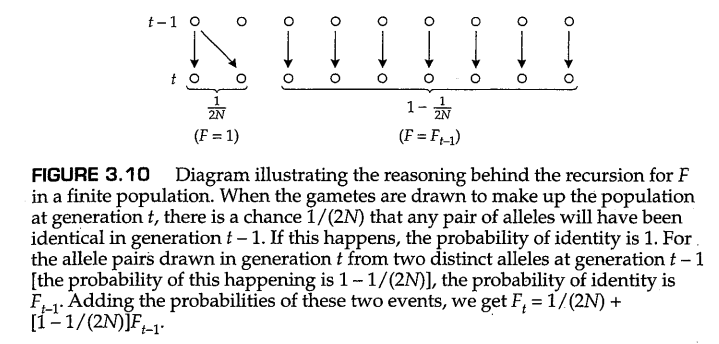

等号两边同时乘上 $-1$ 并加上 $1$ 得到：

$$
1-F_t=1-\frac{1}{2N}-(1-\frac{1}{2N})F_{t-1}\\
\Rightarrow 1-F_t=(1-\frac{1}{2N})(1-F_{t-1})
$$

因此，我们得到：

$$
1-F_t=(1-\frac{1}{2N})^t(1-F_0) \tag{3.12}
$$

或者，当 $F_0=0$ 时，

$$
F_t=1-(1-\frac{1}{2N})^t \tag{3.13}
$$

图3.11显示了小群体中 $F_t$ 的快速增加。尽管每个单独的亚群中的基因型频率处于哈迪-温伯格平衡的比例，但总群体中纯合基因型的频率稳步增加。与之相反的是，随着纯合基因频率的增加，杂合基因型频率降低，直到 $F_t=1$ ，没有任何杂合基因型留下，所有的亚群都固定了等位基因A或a。在任何时候，亚群中杂合基因的平均频率 $H_t$ ，相对于没有种群细分的情况，即 $H_0$ ，在 $F_t$ 中线性减少，因此我们有 $H_t/H_0=1-F_t$ 或 $H_t=(1-F_t)H_0$ 。将方程（3.13）代入 $1-F_t$ 并进行替换，我们得到：

$$
H_t=(1-\frac{1}{2N})^tH_0\approx H_0e^{-t/2N} \tag{3.14}
$$

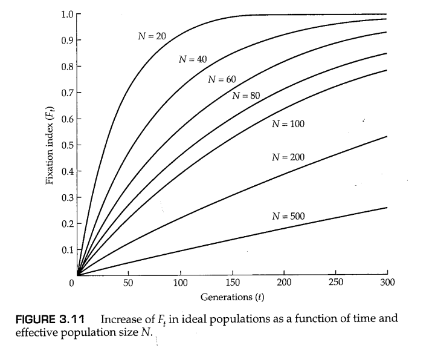

我们再次强调，每个独立亚群都经历了随机漂变，并保持在近似哈迪-温伯格平衡的基因型比例，符号 $H_t$ 代表一种“虚拟杂合性”，其中杂合基因型的频率是许多亚群的杂合基因型频率的平均值。

方程3.14表明，纯随机漂移应导致杂合性以几何速率下降，因为每一代中 $H_t$ 都要乘以常数 $[1-1/(2N)]$ 。这一预测的实验验证结果如图3.12所示。图3.12A显示了图3.4的例子中各亚群的平均杂合度如何随代数增加而下降，但当 $N=16$ 时的理论曲线与数据不太吻合。事实上，杂合度的下降速率大于理论预期，就好像群体规模小于 $N=16$ 那样。换句话说，图3.4中的群体杂合度降低的速率，更接近种群规模为 $N=9$ 时的情况，而非其实际规模 $N=16$ 。我们称 $N=9$ 为该亚群的 *有效群体大小（effecti size）* ，与实际群体规模不同（见第3.5节）。该理论还预测，各群体平均的等位基因频率预计不会改变，实际数据与该理论预测的这一方面非常吻合（图3.12B）。

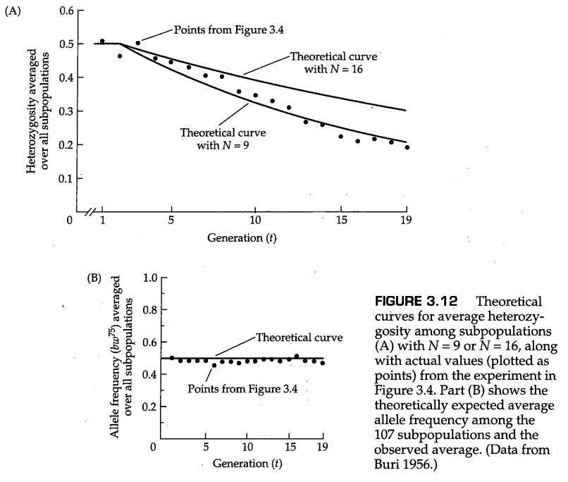

------------------

**问题3.6**

使用方程（3.14）确定群体规模为 $N$ 的有限群体将其初始杂合度降低2倍所需的平均时间长度。

-------------------

**答案**

设 $H_t=\frac{1}{2}H_0=H_0e^{-t/(2N)}$ 。现在将两边除以 $H_0$ ，取自然对数（以 $e$ 为底），得到 $\text{ln}(\frac{1}{2})=-t/(2N)$ ，进而得到 $t=-2N\text{ln}(\frac{1}{2})=1.39N$ 代。换句话说，这个结果表明，平均需要 $1.39N$ 个世代才能将杂合度减半。Fisher（1918）表明，将群体中的 *遗传方差（genic variance）* 减半也需要 $1.39N$ 代。由于二项式样本的方差为 $pq/2N$ ，且群体中的平均杂合度的降低与亚群体中等位基因频率方差的增加成正比，因此，平均杂合度降低的速度与亚群间等位基因频率方差增加的速度相同。

--------------------

现在可以总结出图3.9中种群结构的几个重要结论。首先，尽管每个亚群的规模都是有限的，但我们可以想象其中的数量之多，使得总种群的大小近乎无限。对于无限群体，等位基因频率必须保持恒定。也就是说，即使任何独立亚群中的等位基因频率可能由于随机遗传漂变而任意改变，总群体的等位基因A的平均频率保持为 $p_0$ 不变，其中 $p_0$ 表示初始群体中A的等位基因频率。图3.12B显示了平均等位基因的频率恒定性的实验证明。由于 $F_t$ 是t代个体中两个等位基因血源同源的概率， $t$ 代个体中的两个等位基因不是血源同源基因的概率为 $1-F_t$ 。因为 $p_0$ 是等位基因A的总体频率，是所有亚群中的平均值，随机选择的个体基因型为AA的概率为 $p_0^2(1-F_t)+p_0F_t$ ，其中第一项代表两个等位基因A间血缘不同源的情况，第二项代表它们血源同源的情况。类似的，个体基因型为Aa的概率为 $2p_0q_0(1-F_t)$ ，个体基因型为aa的概率为 $q_0^2(1-F_t)+q_0F_t$ 。我们总结一下，在任意时间 $t$ ，所有亚群的平均基因型频率有着以下的期望值：

$$
AA:\ p_0^2(1-F_t)+p_0F_t=p_0^2+p_0q_0F_t\ \ \tag{3.15a}
$$

$$
Aa:\ 2p_0q_0(1-F_t)=2p_0q_0-2p_0q_0F_t\ \ \tag{3.15b}
$$

$$
aa:\ q_0^2(1-F_t)+q_0F_t=q_0^2+p_0q_0F_t\ \ \tag{3.15c}
$$

其中 $q_0=1-p_0$ 是等位基因a在所有亚群中的平均频率。

注意，虽然每个独立亚群都符合哈迪-温伯格频率，但总群体中的平均基因型频率并不符合这一点，因为纯合子过多，杂合子不足。方程（3.13）表明，在时间 $t$ 时，亚群之间的平均杂合度等于 $2p_0q_0(1-F_t)=2p_0q_0[1-1/(2N)]^t$ ，这就是图3.12A中绘制的理论曲线的由来（其中 $p_0=q_0=0.5$ ）。此外，关于问题3.6答案中提到的遗传方差，可以用符号表示，即在任何时间 $t$ ，亚群中等位基因频率的预期方差等于 $2p_0q_0F_t$ 。

由于 $F_t$ 最终变为1，所有亚群最终都会固定两个等位基因之一（见方程3.15）。由于即使所有亚群都已固定，等位基因A的平均频率仍为 $p_0$ ，所以最终固定了等位基因A的亚群比例必须为 $p_0$ ，而最终固定了等位基因a的亚群比例必须为 $q_0$ 。换句话说，任何理想亚群中某个等位基因最终固定的概率等于该等位基因在初始群体中的频率。这一点源自扩散近似（见问题3.5），并在图3.4的实验中进行了说明，其中 $p_0=\frac{1}{2}$ ；在这种情况下，到第19代时，共有58个群体已达到固定状态，其中30个群体固定了等位基因 $bw$ ，28个群体固定了等位基因 $bw^{75}$ 。

## 3.5 有效群体大小

正如我们在图3.12中的果蝇实验中所看到的，群体的等位基因频率波动幅度通常大于 $pq/(2N)$ 。没有一个真正的群体能够在所有方面满足理论上理想群体的假设。因此，在任何实际情况下，都必须对群体规模的波动、性别比例的失衡、家庭规模和人口结构等方面的分布不均等情况进行修正（Crow和Kimura，1970年；Ewens，2004年）。这些复杂情况对等位基因频率和等位基因固定率变化的影响可以通过计算群体的 *有效规模（effective size）* 并在理想群体理论中使用该值来近似。也就是说，实际群体的 **有效群体大小（effective population size）** 是理论上理想群体要想具有与实际群体相同大小的随机遗传漂变所需要的个体数量。根据我们选择如何测量“大小”，有三种有效群体大小，即：（1）通过血源同源概率（ $F$ ）的变化，（2） 通过等位基因频率的方差变化，或（3）杂合性丢失的速率。这些分别称为 *近交有效群体大小（inbreeding effective size）* 、 *方差有效群体大小（varianc effective size）* 和 *特征值有效群体大小（eigenvalue effective size）* 。

Wright（1931）首先通过考虑不同情况下的血统同源的增长情况来计算有效群体大小。如前所述，有效群体大小也可以通过确定亚群中等位基因频率的变化率来计算，Kimura和Crow（1963）首次将此方法应用于重叠世代的问题。通常来说，近交有效群体大小和方差有效群体大小是相同的，但确实存在例外。同样，方差有效群体大小和特征值有效群体大小可以是不同的（Ewens 1982，2004）。现在将说明计算有效种群规模所需要的各种因素。我们将重点关注近交有效群体大小，因为这一概念应用最广泛。

### 群体规模的波动

对群体规模的波动的修正是很重要的，因为自然群体的规模确实会发生变化，有时仅在一代中会发生10倍或更大的变化。为了简单起见，假设群体在所有方面都是理想的，除了其规模不是恒定的。我们将考虑两个世代的情况。假设在连续的两个世代中，群体规模分别是 $N_0$ 和 $N_1$ 。图3.10中的论点表明

$$
1-F_2=(1-\frac{1}{2N_1})(1-F_1) \tag{3.16}
$$

和

$$
1-F_1=(1-\frac{1}{2N_0})(1-F_0) \tag{3.17}
$$

将第二个式子带入第一个式子中，我们可以得到

$$
1-F_2=(1-\frac{1}{2N_1})(1-\frac{1}{2N_0})(1-F_0) \tag{3.18}
$$

如果群体规模为常数 $N$ ，以下面这样的一般形式表达的方程是合适的

$$
1-F_t=(1-\frac{1}{2N})^t(1-F_0) \tag{3.19}
$$

现在，我们让这里的 $N$ 变成有效群体大小（其一般用 $N_e$ 来表示）。在我们的例子中， $t=2$ ，因此

$$
1-F_2=(1-\frac{1}{2N})^2(1-F_0) \tag{3.20}
$$

我们把两个与 $1-F_2$ 有关的方程（即方程3.18和3.20）进行联立，得到下面的方程

$$
(1-\frac{1}{2N})^2=(1-\frac{1}{2N_1})(1-\frac{1}{2N_0}) \tag{3.21}
$$

由此我们可以看出， $1/N=\frac{1}{2}(1/N_0+1/N_1)$ 是一个很好的近似值。一般来说，

$$
\frac{1}{N_e}=\frac{1}{t}(\frac{1}{N_0}+\frac{1}{N_1}+...+\frac{1}{N_{t-1}}) \tag{3.22}
$$

因此，有效群体大小 $N_e$ 是实际群体规模的 **调和平均值（harmonic mean）** ，即倒数平均值的倒数。如下面的问题所示，调和平均值往往由最小项主导。在实际的生物学问题中，这意味着一个简单的 **瓶颈（bottleneck）** ，即群体历史中一个群体规模很小的时期，可能会导致杂合性的严重丢失。群体瓶颈被认为是象海豹（Bonnell and Selander 1974）和猎豹（O'Brien等人，1985，1987）现存种群中多态性水平极低的原因。当一小群来自已建立亚群的移民建立一个新的亚群时，严重的群体瓶颈常常会自然地发生；与之相伴的随机遗传漂变被称为 **奠基者效应（founder effect）** （参见Holgate 1966；Nei等 1975；Chakraborty和Nei 1977；Neel和Thompson 1978）。人类群体中的奠基者效应对医学遗传学有很大影响，因为来自少数奠基者的人类群体可能会增加某些罕见遗传疾病的发病率。例如，阿什肯纳兹犹太人的Tay-Sachs综合征、芬兰人的肌营养不良症、魁北克人的家族性高脂血症，以及平格拉普岛（Pingelap）岛民的先天性完全色盲（参见Scriver 2001的综述）。除了会降低有效群体大小，从而导致 $F$ 的增加以外，群体瓶颈和奠基者效应还可能影响遗传变异的许多其他方面，包括导致等位基因数量减少、引起等位基因频率分布扭曲和连锁不平衡增加。

--------------

**问题3.7**

假设一个种群经历了如下瓶颈： $N_0=1000,\ N_1=10,\ N_2=1000$ 。计算这三代群体的有效群体大小。

---------------

**答案**

使用方程（3.22），我们得到 $1/N_e=(\frac{1}{3})(\frac{1}{1000}+\frac{1}{10}+\frac{1}{1000})=0.034$ ，或 $N_e=29.4$ 。三代群体的平均有效数量仅为29.4，而这三代群体规模的算数平均值则是 $\frac{1}{3}(1000+10+1000)=670$ 。

-----------------

### 不等性比，性染色体，细胞器基因

第二个重要的例子是，可以很容易地计算出非理想群体的有效群体大小，这涉及到性别比例不平衡的有性生物的群体。这种不平衡造成了一种特殊的瓶颈；因为任何一代中一半的等位基因都必须来自两种性别之一，任何偏离了平衡状态的性别比例都会增加随机遗传漂变的机会。这种情况在野生动物管理中很重要，因为对于许多狩猎动物（例如野鸡和鹿）来说，雄性的法定捕猎数量限制要比雌性大得多。尽管一些管理目标得到了此类狩猎法规的支持（例如，所涉及的物种通常是一夫多妻制的，因此一只雄性可以使许多雌性受精，总体实际种群规模可以保持），但必须记住，由此产生的性别比例不平衡会降低有效群体大小。具体而言，如果一个有性生物组成的群体包括 $N_m$ 个雄性和 $N_f$ 个雌性，则群体的实际大小为

$$
N_a=N_m+N_f \tag{3.23}
$$

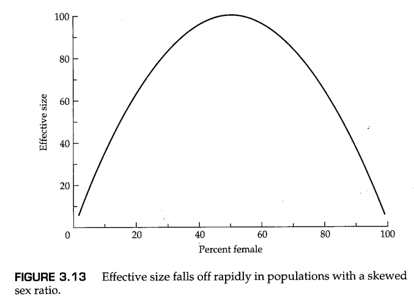

然而，有效群体大小为 

$$
N_e=\frac{4N_mN_f}{N_m+N_f} \tag{3.24}
$$

图3.13显示了性别比例的失衡与有效群体大小的减少之间的关系。举一个现实的例子，如果狩猎使得存活的雄性数量是雌性数量的十分之一，那么有效群体大小仅为群体中实际个体数量的三分之一。

一个相关的问题是X连锁基因的有效群体大小，在这种情况下，任何一代的X染色体有 $\frac{2}{3}$ 的概率来自上一代的雌性，有 $\frac{1}{3}$ 的概率来自上一代的雄性。X连锁基因的方差有效群体大小为

$$
N_e=\frac{9N_mN_f}{4N_m+2N_f} \tag{3.25}
$$

方程（3.25）可以通过以下方式证明：雄性X染色体的样本方差为 $p_mq_m/N_m$ ，而雌性X染色体的样本方差为 $p_fq_f/2N_f$ ，其中 $p_m$ 和 $p_f$ 分别为雄性和雌性中等位基因A的频率。群体中携带A的X染色体的频率为

$$
p=\frac{1}{3}p_m+\frac{2}{3}p_f \tag{3.26}
$$

现在我们引入一个事实，即如果 $a$ 和 $b$ 是两个常数，而 $X$ 和 $Y$ 是两个互相独立的随机变量，则 $Var(aX+bY)=a^2Var(X)+b^2Var(Y)$ 。这里， $a=\frac{1}{3},\ b=\frac{2}{3}$ ，变量 $p_m,\ p_f$ 都是二项分布随机变量，因此

$$
Var(p)=\frac{1}{9}(\frac{p_mq_m}{N_m})+\frac{4}{9}(\frac{p_fq_f}{N_f}) \tag{3.27}
$$

在稳定状态下， $p_m=p_f=p,\ q_m=q_f=q$ 。将其带入上式中可得

$$
Var(p)=pq(\frac{1}{9}\frac{1}{N_m}+\frac{4}{9}\frac{1}{2N_f})=\frac{pq}{2[\frac{9N_mN_f}{4N_m+2N_f}]} \tag{3.28}
$$

等式（3.28）最右边的方括号中的那一项，与等式（3.25）中的有效群体大小一致。这表明了为什么等式（3.25）就是X连锁基因的方差有效群体大小：理想群体中，二项分布样本方差为 $pq/(2N_e)$ 。

---------------

**问题3.8**

线粒体DNA的有效群体大小是多少？（假设线粒体DNA只从母亲传给所有后代。）给定一个包含 $N$ 个二倍体个体的理想群体，那么Y染色体上的基因的有效群体大小是多少？（假设XX个体是雌性，XY个体是雄性。）

----------------

**答案**

线粒体DNA基本上只由雌性传递，因此，抽到两个血源同源的线粒体DNA的几率为 $1/N_f$ ，其中 $N_f$ 是群体中雌性的数量。然而，两个随机选择的常染色体基因血源同源的概率是 $1/(2N_e)$ 。我们令  $1/(2N_e)=1/N_f$ ，得到 $N_e=N_f/2$ ，这就是线粒体DNA分子的有效群体大小。由于在理想人群中 $N_f=N/2$ ，相对于理想人群中的常染色体基因，线粒体DNA的有效群体大小为  $N/4$ 。同样，Y染色体的有效群体大小为 $N_m/2$ ，其中 $N_m$ 为群体中的雄性数量。与线粒体DNA一样，相对于理想群体中的常染色体基因，Y染色体DNA的有效群体大小为 $N/4$ 。注意，当 $N_f=N_m$ 时，即使mtDNA存在于所有个体中，而Y染色体仅存在于雄性中，mtDNA的有效群体大小也不大于Y染色体的有效群体大小。有效大小取决于基因的样本属性，这不仅取决于携带该基因的个体数量，还取决于该基因的传播方式。

--------------------

### 后代数量的方差

在理想群体中，所有的繁殖个体留下后代的机会都是相等的。从技术上讲，这意味着每个个体后代数量的统计分布是一个均值为 $1$ 、方差为 $1-1/N$ 的二项分布。该分布是二项分布，因为其范围是固定区间 $[0,N]$ ，上限 $N$ 是因为任何个体的后代数量都不会超过 $N$ 。如果 $N$ 相当大，这种二项分布几乎等同于均值为1、方差为1的泊松分布。然而，假设每个个体的后代数量的分布相同通常是不现实的，因为在真实的生物中，繁殖个体可以在其后代数量上表现出很大的差异。更现实的模型是种群中有 $N$ 个个体，其中第 $i$ 个个体（ $i=1,2...,N$ ）产生 $n_i$ 个后代。在这种情况下，种群的有效大小被定义为在产生下一代的配子中随机选择两个配子，它们来自同一个父母的概率 $P$ 的倒数（Crow和Kimura 1970）。我们将子代数量分布的均值和方差分别表示为 $\xi$ （希腊字母xi，读作“柯西”）和 $\sigma^2$。根据这些定义，

$$
\xi=\frac{\sum n_1}{N}\\
\sigma^2=\frac{\sum n_1}{N}-(\frac{\sum n_1}{N})^2 \tag{3.29}
$$

随机选择两个配子，它们来自同一个父母的概率 $P$ 由下面的式子给出

$$
P=\frac{\sum(C_{n_i}^2)}{C_{N\xi}^2}=\frac{\sum n_i(n_1-1)}{N\xi(N\xi-1)}=\frac{\sum n_i^2-\sum n_i}{N\xi(N\xi-1)} \tag{3.30}
$$

方程（3.30）的基本原理是，分子是两个随机选择的等位基因来自同一亲本的方式数，分母是不考虑亲本的条件下，任意选择两个等位基因的方式数。将方程（3.29）带入（3.30）并经过一点数学变换，我们得到：

$$
P=\frac{(\sigma^2/\xi)+(\xi-1)}{N-1}
$$

既然前面我们定义了 $N_e=1/P$ ，那么根据上式，我们可以写出有效群体大小：

$$
N_e=\frac{N-1}{(\sigma^2/\xi)+(\xi-1)} \tag{3.31}
$$

并且，当 $\xi=1$ 时， $N_e$ 近似等于 $N/\sigma^2$ 。因此，后代数量的巨大差异会使有效种群规模减少 $1/\sigma^2$ ，从而加快随机遗传漂变的进程。这一原则的另一面建议了濒危物种的管理策略：当后代数量的差异最小化时，遗传变异的损失可以减少，因为如果 $\sigma^2$ 小于1，有效群体大小可能大于实际种群规模。

后代数量的差异会对随机遗传漂变产生很大影响，这在两性个体通过不同机制（例如，X和Y染色体，或线粒体和叶绿体DNA）传播基因的特殊例子中也可以看到。通常来说，即使是核基因，雄性后代数量的变化也远远大于雌性，并且一个特别的结果是Y染色体的有效群体大小比问题3.8所暗示的 $N_m/2$ 的理论值小得多。

### 细分群体的有效群体大小

最后，我们将考虑一个模型，其中群体被细分为 $D$ 个亚群（**同类群，demes**），每个亚群由 $N$ 个二倍体个体组成，各个同类群之间存在迁移，这里我们用 $m$ 衡量迁移的情况，它表示对于从任意的同类群中随机选取一个等位基因，其来源于另外 $D-1$ 个同类群的概率。群体细分产生了一种情况，即两个级别的随机漂变同时发生。每个同类群内都有一个漂变过程，其发生速度相对较快，而总群体中还有另一个漂变过程，其发生速度较慢。由于这里的数学过程有些粗糙（Wakeley 1999，2000），我们将只给出主要结论，即当 $D$ 相当大时，整个群体的有效群体大小由下式给出

$$
N_e=ND(1+\frac{1}{4Nm}) \tag{3.32}
$$

在这个方程中，数学因子 $ND$ 来自同类群内的随机遗传漂变，数学因子 $1+1/(4Nm)$ 来自同类群间的随机遗传漂变。该模型的一个有趣且重要的特征是，除非 $4Nm$ 非常大，否则有效群体大小（ $N_e$ ）大于实际群体大小（ $ND$ ）。这一看似矛盾的现象是由群体细分造成的。当有许多同类群通过低迁移率连接在一起时，即使人们知道某个同类群中的某个等位基因最终会在未来某个时间成为总群体中所有等位基因的共同祖先，这个幸运的等位基因在同类群之间传播的过程也需要很长时间。换言之，当一个群体被细分时，不同同类群中的任何两个等位基因可能需要很长的时间才能追溯到祖先群体中单个同类群中的某个共同祖先。

## 3.6 基因树和溯祖事件

Wright-Fisher模型建立了一种主导群体遗传学约50年的思维方式，这种模型从时间发展的视角（proceed forward in time，在时间上向前推进）上研究等位基因的谱系。与之对应的是从 *时间回溯* 的视角（proceed backward in time，在时间上向后回溯）上研究等位基因的谱系，并且出于某些目的，这种思维方式要强大得多。从一个群体中取样的一组等位基因提供了比当前等位基因频率的估计更多的信息。样本中的每个等位基因都有数百或数千代的祖先历史。今天取样的一对等位基因，可能来自几代前同一个人产生的同一等位基因的相同拷贝，但也可能在几百代前就有了共同的祖先。 **“溯祖”** （ **coalescence** ，本义为合并）一词指的是在时间上回溯，两个等位基因的谱系在一个共同的祖先处合并的过程。例如，在一个包含 $k$ 个等位基因的样本中，第一次溯祖事件（在时间上回溯）将 $k$ 个当代谱系合并为 $k-1$ 个祖先谱系，第二次溯祖事件将这些合并为 $k-2$ 个谱系，依此类推，直到所有等位基因样本回溯到只剩下一个共同祖先。溯祖分析的想法是通过建立每个溯祖事件之间的时间间隔模型来考虑样本中基因的祖先历史（Kingman 1980，1982a，b，2000；Hudson，1983；Rosenberg和Nordborg 2002）。

为了了解溯祖过程是如何进行的，考虑图3.14中随着时间的推移（图中从上到下）会发生什么。在每一代人中，群体中都有许多等位基因，这些等位基因可能会被复制并出现在下一代人身上；然而，在某些情况下，一个等位基因没有留下后代，并从群体中消失。偶然的情况下，一些等位基因可能会在组成下一代时被抽到两次，这些事件的概率与随机遗传漂变的Wright-Fisher模型下的概率相同。随着时间的推移，我们不断重复这一过程，最终有一个初始等位基因将在群体中固定。在没有突变的情况下，群体将因此固定同一个等位基因；然而，由于突变可能发生在这一过程中，此时我们观察到的等位基因在核苷酸序列上并不完全相同，即使它们都来自一个共同的祖先等位基因。

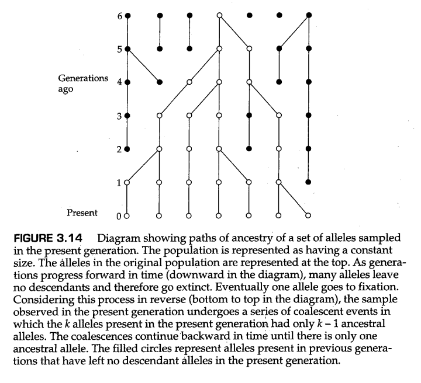

事实上，我们通常没有谱系信息，无法追踪一个群体中的所有等位基因。通常，我们所拥有的仅仅是一个单一的“快照”，也就是当前能够从群体中取样到的一小部分等位基因样本。现在再考虑图3.14，但这一次我们试试在时间上回溯过去（图中从下到上）会发生什么。我们从样本中第0代的 $k=7$ 个等位基因开始。从第0代到第1代（向过去回溯一代），我们看到最右边两个等位基因的谱系“合并”（coalesced）成一个祖先等位基因。随着时间的推移，祖先等位的数量要么保持不变，要么减少，而祖先等位数量的每一次减少都被称为 *溯祖事件（coalescent event）* 。

图3.14说明了溯祖推理如此强大的一个原因。如果我们通过计算机模拟研究图3.14中沿时间顺推的过程（前向模拟），那么我们追踪的许多等位基因导致了计算资源的浪费，因为它们在当前世代（第0代）中没有留下后代。这些等位基因用实心圆圈表示，在本例中，有22个这样的等位基因。另一方面，如果我们用时间回溯的视角研究相同的过程（后向过程），那么我们追踪的所有等位基因都不会浪费，因为任何一代中的所有等位基因都必须追溯到上一代中存在的一些等位基因上。这些等位基因用空心的园圈表示，在本例中，有27个这样的等位基因。换句话说，前向模拟浪费了近一半的计算时间来产生我们不感兴趣的等位基因（总共49个等位基因中的22个），这些等位基因并不是当前群体中的等位基因的祖先。当样本量很小时，这并不是个很大的代价，但是如果样本量达到成百上千之多时，前向过程中对这样多的等位基因谱系的模拟是不必要的。事实上，对于一个包含 $2N$ 个等位基因的原始群体，在经过了足够长的进化以后当前群体固定了一个等位基因，此时我们没有必要研究剩下 $2N-1$ 个基因的谱系，因为这些等位基因在进化过程中已经灭绝了。

由于我们感兴趣于一对基因谱系发生合并（coalesce）所需的时间，因此我们需要一个模型，以得出溯祖时间（coalescence times）。让我们考虑两个等位基因的直系祖先。这两个等基因来自上一代的同一等位基因概率为 $1/(2N)$ （在大小为 $N$ 的二倍体群体中），因此，它们来自前一代的两个不同等位基因的概率是 $1-1/(2N)$ 。同样，任何一代中的三个等位基因源自前一代中三个不同祖先等位基因的概率是  $Pr\{等位基因1和2具有不同的祖先\}\times Pr\{等位基因3具有与等位基因1和2都不同的祖先\}=[1-1/(2N)][1-2/(2N)]$ 。更一般的， $k$ 个等位基因在上一代中具有 $k$ 个不同亲本等位基因的概率为

$$
\text{Pr}(k)=\prod_{i=1}^{k-1}(1-\frac{i}{2N}) \approx 1-\frac{C_k^2}{2N} \tag{3.33}
$$

在每一代中，采样过程与之前发生的事情相互独立，因此，两代前 $k$ 个等位基因具有 $k$ 个不同亲本等位基因的概率是方程（3.33）右边的项目的平方。再次考虑两个等位基因。假设我们希望知道这两个等基因的共同祖先恰好发生在 $t+1$ 代前的概率。在这种情况下，这两种等位基因在第 $t$ 代时必须没有发生溯祖事件（即，存在两个不同的祖先谱系），然后在紧接着的一代中，溯祖事件发生。两个等位基因在 $t$ 代中没有发生溯祖事件的概率是 $[1-1/(2N)]^t$ ，而在紧接着的一代中发生溯祖事件的概率为 $1/(2N)$ 。因此，总的期望概率为

$$
\text{Pr}(两个等位基因的共同祖先恰好发在 t+1 代前)\\
=\frac{1}{2N}[1-(\frac{1}{2N})]^t\approx\frac{1}{2N}e^{-t/(2N)} \tag{3.34}
$$

当 $1/(2N)$ 很小时，指数函数是一个非常好的近似。上面的这个概率分布的均值为 $2N$ 世代，方差为 $4N^2$ 。注意，平均时间附近的置信区间不是很紧，因为分布的标准差（ $2N$ ）等于均值。

回到我们的包含 $k$ 个等位基因的样本。这 $k$ 个等位基因在 $t$ 代以前没有发生溯祖事件、并且在 $t+1$ 代前恰好发生一次溯祖事件剩下 $k-1$ 个等位基因的概率为：

$$
\begin{aligned}
    &=\text{Pr}(k)^t[1-\text{Pr}(k)] \\
    &\approx \frac{C_k^2}{2N}\text{exp}[-\frac{C_k^2}{2N}t] \tag{3.35}
\end{aligned}
$$

当 $k<<N$ 时（也就是说，样本规模远小于群体规模，这常常是实际情况），上面的近似是有效的。等式（3.35）中的概率分布的均值和方差如下：

$$
均值=\frac{4N}{k(k-1)} 世代 \\
方差=\frac{16N^2}{[k(k-1)]^2} 世代^2 \tag{3.36}
$$

Felsenstein在他的《推断系统进化论》（ *Inferring Phylogenies* ，2004）一书中，为溯祖过程提供了一个绝妙的“盒中之虫”（bugs-in-a-box）类比，使其变得简单而难忘，我们在他的允许下引用了这一类比：

> We can make a physical analogy (if a somewhat fanciful one)by considering a box containing hyperactive, indiscriminate,voracious,and insatiable bugs. We put k bugs into the box. They run about without paying any attention to where they are going.Occasionally two bugs collide. When they do,one instantly eats the other.Being insatiable,it then resumes running as quickly as before. It is obvious that the number of bugs falls from k to k-1,to k-2,as the bugs coalesce,until finally only one bug is left. ... The analogy is actually fairly precise.The number of pairs of bugs that can collide is k(k-1)/2. If there are 2N "places"in the box that can be occupied,the probability of a collision will be proportional to k(k-1)/4N. The size of the population corresponds to the size of the box. A box with twice as many "places"will slow the coalescence process down by a factor of two. So a simpleminded physical analysis of the bugs-in-a-box process will have the Kingman coalescent [our Equation 3.35] as the probability distribution of its outcomes. (p. 460)  \
> 我们可以通过考虑一个盒子来做一个物理类比（如果有点异想天开的话），这个盒子里有极度活跃、不分青红皂白、贪婪和贪得无厌的虫子。我们把k个虫子放进盒子里。它们到处乱跑，根本不在乎它们要去哪里。偶尔会有两个虫子发生碰撞。当它们发生碰撞时，一个会立即吃掉另一个。由于这些虫子太过贪得无厌，它会像以前一样快速地恢复乱跑。很明显，当虫子合并时，虫子的总体数量从k下降到k-1，再下降到k-2，直到最后只剩下一个虫子……这个类比实际上相当精确。可以碰撞的虫子的对数是k(k-1)/2。如果盒子中有2N个“位置”可以被占用，碰撞的概率将与k(k-1)/4N成正比。群体的大小与盒子的大小相对应。一个“位置”为两倍的盒子将使合并过程（溯祖过程，coalescence process）减慢两倍。因此，对盒中之虫的过程进行简单的物理分析，就会得到和Kingman溯祖过程[ 见我们的方程（3.35） ]一样的结果作为其概率分布。（原书第460页）

图3.15显示了五个等位基因（ $k=5$ ）的情况下的基因谱系。谱系以两种形式描述，这两种形式在文献中都很常见。在右侧，每条线的末端表示原始样本中的一个等位基因，沿着线条向上移动（时间上向过去回溯），每个节点（顶点）表示两个基因谱系发生一次溯祖事件，到达一个祖先等位基因。在左侧，线条的末端依然表示采样到的等位基因，但现在每个溯祖事件都表示为一条水平线。在时间上向过去回溯（从下往上）， $i$ 个等位基因合并为 $i-1$ 个等位基因的溯祖时间用 $T_i$ 表示（ $i=2$ 到 $5$ ）。这些溯祖时间的概率分布由方程（3.35）给出，期望值如图3.15所示。从五个等位基因开始，第一次溯祖预计在 $2N/10$ 代前发生，下一次在 $2N/6$ 代之前发生，依此类推。每个时间间隔的分布都是指数型的，随着时间向过去的回溯，时间间隔将不断增长。

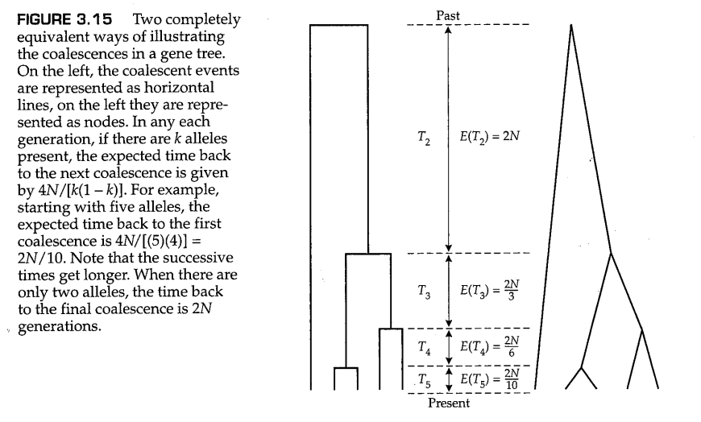

注意，随着时间向过去的回溯，溯祖时间越变越长，最后一次溯祖事件（从2个等位基因到1个）的时间最长。这是恒定大小群体中的典型溯祖模式。从数量上讲，对于 $k$ 个等位基因中最后 $n$ 个等位基因，它需要总时长的 $(1-1/n)/(1-1/k)$ 部分的时间才能完成溯祖【译者按：  $0<(1-1/n)/(1-1/k)\le 1$ 】 （Felsenstein 2004）。从这个关系很容易看出，如果 $k$ 相当大（例如 $k\ge 10$），则最后两个等位基因的溯祖将需要几乎一半的总时间（ $n=2$ ）。

对于 $k$ 个等位基因的样本，所有等位基因的溯祖时间（即， $k$ 个等位基因样本共享共同祖先的最近时间）为

$$
t=4N(1-\frac{1}{k}) \tag{3.37}
$$

其方差为

$$
V=4N^2\prod_{i=2}^k\frac{1}{(C_i^2)^2} \tag{3.38}
$$

（Kingman 1982a，b；Tajima 1983）

随着样本量 $k$ 逐渐向总群体规模增加， $t$ 接近 $4N$ ，这等于新出现的、最终会被固定的中性突变所需的期望固定时间。

样本的最近共同祖先（即所有谱系通过溯祖最终达到的等位基因）同时也是整个群体中所有等位基因的最近共同始祖的概率是多少？答案是由比率 $(k-1)/(k+2)$ 给出（Rosenberg和Nordborg 2002）。即使 $k$ 值相对较小，这个概率也惊人地大。例如， $k=5$ 时，这个比例已经是 $67\%$， $k=9$ 时，它是 $80\%$ ，最后 $k=19$ 时，它是 $90\%$ 。换句话说，对于一个只有19个等位基因的样本，溯祖得到的最近的共同祖先有 $90\%$ 的几率正是整个群体中所有等位基因的最近共同祖先，无论群体规模是五百、一千还是一百万。

### 溯祖有效大小

等式（3.37）表明，随着 $k$ 增长到 $2N$ ，群体中所有等位基因溯祖到同一个共同祖先的期望时间大约是 $4N$ 。这就是 *溯祖有效大小（coalescent effective size）* ，（当其存在时）其等于近交有效群体大小（Sjodin 等人，2005）。

为了解释何时存在或不存在溯祖有效大小，我们需要考虑时间尺度问题。方程（3.35）给出了溯祖时间的概率分布，并注意到，我们可以通过以 $2N$ 代为单位测量时间 $t$ ，从而消除对这个概率分布对 $2N$ 的明确依赖。经过这样的时间尺度缩放以后，方程（3.36）中溯祖时间的平均值和方差分别变为 $2/[k(k-1)]$ 代和 $4/[k(k-1)]^2$ 代 $^2$ 。同样，群体中所有等位基因的溯祖时间变为2。（由于此时我们的时间单位为 $2N$ 代，因此时间长度为2单位对应的实际时间尺度为 $2\times 2N=4N$ 代）。

无论何时，只要时间可以被常数重新缩放以再现方程（3.35）中标准溯祖时间的形式，溯祖有效大小就存在于任何群体过程中。我们已经考虑过一个这样的例子，其中后代数量的方差不符合Wright-Fisher模型中假设的二项分布（见方程3.31）。为了简化问题，我们令方程（3.31）中的后代数量均值 $\xi=1$ （这意味着群体大小保持不变）。在这种情况下，有效大小近似为 $N_e=N/\sigma^2$ ，其中 $\sigma^2$ 是后代数量的方差；因此，如果我们以 $2N/\sigma^2$ 代为单位来衡量时间，则可以得到标准的溯祖过程。这意味着后代数量的巨大差异降低了有效群体大小，并加快了随机遗传漂变的过程。

有许多过程可以重新缩放时间以转变为标准的溯祖过程。这些过程包括涉及人口增长、年龄结构和地理结构的某些模型（Emerson等人，2001年；Sagitov和Jagers 2005年；Sjodin等人，2005年）。决定性因素是时间尺度。许多过程发生在生态时间尺度上（ecological time scale），这通常比溯祖时间尺度更短。在这些过程中，当迁移率足够高时，人口年龄结构或地理结构会发生变化。在这些情况下，我们可以对这些“快”的过程简单地求平均值。即使该过程确实会影响溯祖时间，但这种影响只能通过类似于后代数量方差 $\sigma^2$ 之类的比例因子发挥作用。相反，一些过程发生在地质时间尺度上（geological time scale），这样的时间尺度通常要比溯祖时间更长，在这种情况下，我们可以忽略这些“慢”的过程。

当群体过程发生在与溯祖时间相当的时间尺度上时，问题就出现了，因为此时没有能够产生Wright-Fisher模型的线性时间尺度，因此没有溯祖有效大小。这时候发生的事情是，随着群体的演化，有效群体大小不断变化。举一个具体的例子，Sjodin等人（2005）考虑了群体规模在 $N=10^3$ 和 $N=10^5$ 之间随机波动的情况，并表明，当波动概率在每代 $10^{-6}$ 和 $10^{-2}$ 之间时，则不存在溯祖有效群体大小。原因是，在这个时间尺度上发生的群体大小的变化以非线性和随机的方式影响溯祖时间。另一方面，对于大于 $10^{-2}$ 的概率，由于波动过程发生的足够快，溯祖有效大小等于平均有效群体大小，而对于小于 $10^{-6}$ 的概率，波动过程发生的足够慢，因此溯祖有效大小与群体的初始有效大小相等。

### 伴随群体扩张的溯祖事件

群体规模的变化影响溯祖时间的概率分布。对于固定大小的群体，溯祖树通常在根部附近有稀疏的节点和相对较长的分支（根部是样本中所有谱系最终回溯到的等位基因，是样本中所有等位基因的最近共同祖先）。这种模式在图3.15中的“预期”溯祖树中可以看出。

在从初始大小 $N(0)$ 开始呈指数增长的群体中，任何时间 $t$ 的群体规模都由 $N(t)=N(0)\text{exp}(rt)$ 给出，其中 $r$ 是指数增长率。如果 $N(0)$ 和 $r$ 都很大，则溯祖树会扭曲，在树的根部附近会有更多节点和更短的分支。这其中的原因是，在扩张的群体中，处于溯祖树末端的等位基因需要更长的时间才能“找到”彼此，并向过去回溯。Felsenstein（2004）的“盒中之虫”类比有助于理解这一点，因为在一个体积扩大了的盒子中，虫子会花费更长的时间才能碰到彼此。在 $N(O)$ 和 $r$ 极其巨大的极端情况，所有的溯祖事件都发生在离根部很近的地方，这导致了通常所谓的 **星形系统发育树（star phylogeny）** 。（可以从时间发展的视角思考一下，对于一个快速扩张的群体，每个等位基因的谱系发生灭绝的概率非常低，因此所有的谱系都持续存在，它们的谱系关系图类似于一颗星星。）

由于快速扩张的群体的溯祖树在根部附近有许多短枝，因此有理由假设，随着 $r$ 的降低，溯祖事件将更少集中在根部附近，并将逐渐远离根部、向末端移动。靠近根部的分支数量将减少，靠近根部的分枝长度将变长，直到当 $r=0$ 时，溯祖树将呈现出群体规模不变时的理想形态。

聚结树中的分枝模式可用于推断群体增长的历史模式（Pybus等人，1999年；Emerson等人，2001年）。我们将以1型人类免疫缺陷病毒（HIV-1）为例，使用Pybus等人（1999年）提出的方法估计病毒群体的增长率，从而对这一点做出说明。他们观察到，在来自具有恒定种群大小 $k=400$ 的群体的样本的模拟溯祖树中，绝大多数（95%）的树在根节点和树的半深度点（mid-depth point）之间具有三个或更少的节点。（树的 *半深度点（mid-depth point）* 位于树根和末端之间的距离的中心位置。）图3.16显示了他们的模拟结果的平滑版本。这种模式在以指数增长率 $r$ 快速增长的群体中是不可能的。

在不断增长的群体中，预计在根部附近会有更多的节点。此外，在根部和半深度点之间有三个或更少节点的树的比例与当前群体规模和指数增长率乘积的对数成线性关系，而Pybus等人（1999）展示了在HIV-1的例子中如何进行估计。

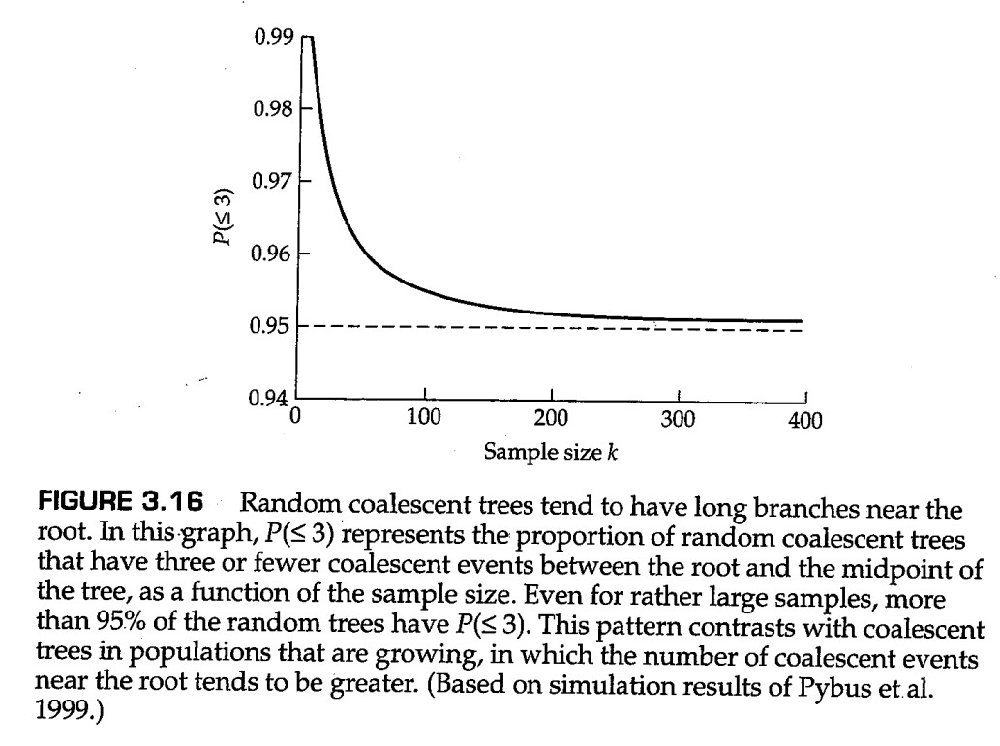

半深度点方法有一个缺点，即它将溯祖树视为已知的，然而更合适的方法是将所有符合数据的、可能的溯祖树以其概率为权重进行平均处理。Emerson等人（2001）研究了从溯祖树估计群体增长率的其他方法。通过将数据与模拟进行比较，还可以拟合更复杂的人口统计历史，例如过去的人口瓶颈（Thornton和Andolfatto 2006）。

### 伴随突变的溯祖模型

方程（3.35）中体现的原理允许我们生成分支长度与Wright-Fisher模型假设相对应的模拟基因谱系。需要强调的是，我们通常不知道等位基因之间的 *真实* 祖先关系。唯一的真实祖先已知的情况来自于在病毒或微生物实验室中开展的进化实验，其中每隔一段时间这些微生物的基因组样本就会被分离与冻存。在其他情况下，当我们想对单个样本进行推断时，我们模拟大量与样本组成一致的谱系，然后根据这些谱系的相对似然性进行推断。

更正式地说，我们感兴趣的是在给定一些突变和群体过程模型的情况下，在所有可能的谱系中的实际观测数据 $D$ （通常是DNA序列）的最大似然值 $L$ （Rosenberg和Nordborg 2002；Felsenstein 2004）。形式上，我们可以写出：

$$
L=\sum_G \text{Pr}\{D|G,\mu\}\text{Pr}\{G,\alpha\} \tag{3.39}
$$

其中 $G$ 表示任何特定的谱系， $\mu$ 是定义突变模型的一组参数， $\alpha$ 是表征群体过程的一组参数（即：群体规模、增长率、同类群数量、迁移率等）。

方程（3.39）通常难以解析，因此需要对数千个随机谱系进行模拟。为了模拟样本中的谱系和等位基因序列，我们需要指定某种类型的突变模型。一种广泛使用的模型被称为 **无限位点模型(infinite-sites model)** ，其中每个等位基因被认为是一个核苷酸序列，突变可以发生在序列中的任何位点。如果突变率足够低，那么样本中的大多数位点将是单态的，并且所有多态位点将仅存在两种分离核苷酸（segregating for just two nucleotides）。许多关于DNA序列等位基因变异的可用数据似乎与这一观点一致：很少有核苷酸位点存在两种以上的分离核苷酸（segregating for more than two nucleotides）。如果DNA序列足够长且多态位点的频率较低，那么大多数时候，新的突变将发生在以前单态的位点上。无限位点模型是基于这些假设的。这种模型最初由Kimura（1969，1971）和Watterson（1975）开发的，Kimura按照核苷酸之间是不连锁的进行了思考，Watterson考虑了位点之间几乎完全的连锁。

为了模拟能够代表从服从无限位点模型的群体中抽样的样本的等位基因序列数据，Hudson（1990，1993）表明可以如下进行：

1. 估计感兴趣的基因或基因组区域的 $\theta=4N\mu$ 的值，其中 $N$ 是有效群体大小， $\mu$ 是每个位点的突变率；这一估计既可以基于样本序列中分离位点的数量，又可以基于序列所有可能互相匹配的平均错配位点数（这些方法将在第四章中讨论）。
2. 对于观察到的 $k$ 个等位基因样本，绘制具有适当指数分布的随机数，以构建基因谱系，使得溯祖时间遵循方程（3.35）。
3. 在树的每个分支上随机散布具有泊松分布的突变，使得每个分支上的平均突变数由 $\mu t$ 给出，其中 $t$ 是以世代数量为单位的分支长度（例如，图3.15中从根开始的第一个间隔的期望长度为 $2N$ 代；因此，从根开始每个分支的预期突变数为 $2N\mu=\theta/2$。
4. 重复步骤2和3大约10000次或更多次，并根据方程（3.39），估计在所有可能的谱系中的实际观测数据的最大似然值。

### 溯祖方法的应用

Hudson等人（1994）发现了这种方法的一个典型（也是开创性的）应用。他们研究了一个样本规模为 $k=10$ 的等位基因序列样本，每个序列长度为1.4 kb，在果蝇（ *Drosophila melanogaster* ）的一个西班牙种群中编码超氧化物歧化酶。在这10个等位基因中，有5个在序列上相同，而其他的都是不同的，总共包含55个多态性位点。样本中的这种多态性配置似乎不太可能偶然发生，因此研究者可能倾向于在10个序列中随机散布55个多态性位点以进行假设检验。但这是无效的，因为这些样本存在以共同祖先为媒介的亲缘关系，因此需要考虑他们可能的系谱。

这里的零假设为，在所有多态性都是选择性中性的情况下，样本依然可能会因为偶然性而出现。为了进行假设检验，作者模拟了10000个样本，并且 $k=10$ 。他们没有根据泊松分布将突变分配给每个分支，而是按照分支长度的比例在系谱上随机放置了55个突变。前者在技术上是正确的，但后者是合理的，除非突变的数量非常少（Wall和Hudson 2001；Depaulis等人2001）。对于每个模拟的谱系，他们检查了其是否包含五个相同的等位基因【译者按：因为果蝇的实际数据中，相同的等位基因数量就是5个】。在发现只有大约1%的模拟谱系产生了具有这种特征的序列之后，他们认为有理由拒绝中性Wright-Fisher模型，并认为一个等位基因的频率偏高是由于基因本身受到的选择或某些连锁基因的选择。

作为溯祖方法应用的另一个例子，考虑对来自30,000-100,000年前的尼安德特人骨骼中扩增的线粒体DNA片段的解读（Krings等人，1997）。研究者将尼安德特人的序列与986个现代人类的序列样本进行了比较，结果发现，尼安德特人和现代人的最近共同祖先比人类序列本身的共同祖先估计要古老数倍。这被认为是尼安德特人和解剖学上的现代人类的祖先是不存在杂交的两个独立物种的证据。

Nordborg（1998）根据不同的群体模型，使用溯祖模拟和分析方法重新考虑了这些数据。这一分析证实了一个结论，即尼安德特人和解剖学上的现代人类的祖先并没有以相同的数量融合形成过一个随机交配单元。但不能排除其他存在基因库间混合的模型。

例如，有一个模型是在68000年前尼安德特人和解剖学上的现代人类祖先遇到了一起，在这个模型中，即使尼安德特人占混合人群的 $25\%$ ，所有尼安德特人mtDNA谱系因随机遗传漂变而丢失的概率也为 $52\%$ 。由于常染色体基因的随机遗传漂变的时间尺度要大得多，其为mtDNA的四倍（见问题3.8），所有尼安德特人序列从常染色体基因中丢失的概率要小得多。Nordborg（1998）的计算表明，如果68000年前尼安德特人占混合人群的25%，我们的常染色体基因中有90%仍在分离尼安德特人的序列！这个例子说明了试图从单个非重组序列（如线粒体DNA）的样本中得出远期推断的局限性，同时也表明了在解释观察数据时考虑各种种群模型的重要性。

## 3.7 溯祖的理论意义

溯祖方法可以用于群体遗传学的许多基础原理的推导。例如，方程（3.36）定义了一棵溯祖树中，每个时间间隔 $T_k$ 的期望长度（另见图3.15），因此整棵树的所有枝长之和的期望 $E(T)$ 由下式给出：

$$
E(T)=E(\sum_{i=2}^kiT_i)=\sum_{i=2}^kiE(T_i)=\sum_{i=2}^ki\frac{4N}{i(i-1)}=4N\sum_{i=1}^{k-1}\frac{1}{i} \tag{3.40}
$$

在一组已经完成比对的DNA序列中，分离位点的期望数量 $E(S)$ 等于突变率与溯祖树所有枝长之和的期望的乘积，或者说 $\mu E(T)$ 。因此，从方程（3.40）我们可以得到包含 $k$ 个已比对DNA序列的样本中，分离位点的期望个数

$$
E(S)=\mu E(T)=4N\mu \sum_{i=1}^{k-1}\frac{1}{i}=\theta \sum_{i=1}^{k-1}\frac{1}{i} \tag{3.41}
$$

其中 $\theta=4N\mu$ 。这是无限位点模型中的分离位点个数的期望值，我们将在第四章中在不同的背景下对其再次进行讨论。注意， $\mu$ 并不是每个核苷酸位点的突变率，而是整条DNA序列上的整体突变率。

作为溯祖方法理论实用性的另一个例子，考虑从当前处于突变和随机遗传漂变的平衡状态的群体中抽样到的等位基因样本。群体处于突变和随机遗传漂变的平衡状态，意味着每一代中新突变的发生率与随机遗传漂变导致的旧突变的丢失速率相同。追踪任意一对等位基因在前一代中的历史，这对等位基因可能发生溯祖事件，概率为 $1/(2N)$ ，或者未能发生溯祖事件，一个或另一个等位基因发生了概率为 $2\mu$ 的突变（这里的数学因子2是必要的，因为两个等位基因中的任何一个都可能发生突变）。这些是唯二的影响等位基因血缘同源性的事件，它们的概率之和是 $1/(2N)+2\mu$ 。因此，血缘同源的概率（ $F$ ）是等位基因溯祖时间的分数，或者

$$
F=\frac{\frac{1}{2N}}{\frac{1}{2N}+2\mu}=\frac{1}{1+\theta} \tag{3.42}
$$

这个表达式也将在第4章中使用不同的方法再次进行推导。

溯祖方法并不局限于对Wright-Fisher模型的考虑。如果可以在基因树的背景下得到重组、迁移或其他此类现象的发生概率的递归方程，那么通常可以从溯祖方法中获得更强大的见解。就我们的目的而言，可以说通过该方法可以得到一些经典方法的结果，并且通常难度要小得多，并且正如我们在上一节中所看到的，溯祖方法特别适合于通过对大量模拟树进行平均来对从自然群体中抽样的样本进行推断。计算机可以以极快的速度模拟从中性溯祖过程中抽样的样本，这为检验观测数据和理论预测之间的对应性提供了前所未有的机会。

---------------------

**问题3.9**

在纯随机漂移模型中，对于从群体规模为 $N$ 的单倍体群体中提取的 $k$ 个基因样本，从现在到过去发生第一次溯祖事件之间的时间（世代数）的概率分布为

$$
\text{Pr}\{t代前发生第一次溯祖事件\}\\
=ze^{-zt}
$$

其中 $z=C_k^2/N$ 。

由此可以看出，回溯到第一次溯祖事件发生所需的平均代数为 $1/z$ 。样本中的基因越多，溯祖事件发生在近期的可能性越大。计算来自 $N=450$ 的群体中的10个基因样本的第一次溯祖事件的预期时间。要将溯祖时间减少一半，需要抽样多少个基因？

--------------------

**答案**

对于10个基因样本，在 $N=450$ 的群体中首次溯祖事件的预期时间为 $N/C_k^2=450/C_10^2=450/(10×9/2)=10$ 代。为了确定要将溯祖时间减半，需要抽样多少基因，需要求解方程 $5=450/C_k^2$ ，这相当于 $90=k!/[2!(k-2)!]$ 或 $180=k(k-1)$ 。这是一个一元二次方程，将其化为 $ax^2+bx+c=0$ 的标准形式以后为 $k^2-k-180=0$ ，其中 $a=1,\ b=-1,\ c=-180$ 。解由 $[-b±\sqrt{b^2-4ac}]/(2a)$ 给出，在本题中我们解得 $k=13.9$ （另一个解是负的）。因此，大小为14的样本将使初始溯祖时间减少到大约5代（准确地说是4.94）。如果你不知道一元二次方程的求根公式，也可以通过反复试验不同的数字得到这个答案。在任何情况下，将样本从10仅仅增加到14，我们就可以期望任何一对等位基因之间的差异只有先前的一半。

--------------------

### 伴随重组的溯祖模型

伴随重组的溯祖是现代群体遗传学中最困难的问题之一（Rosenberg和Nordborg 2002；Stumpf和McVean 2003）。要理解为什么如此困难，请考虑图3.17中的树。这些是传统的溯祖树，但节点和末端都以两个不同核苷酸位点的身份进行标记。末端也标记为1-4，以识别样本中的单个等位基因。符号A和a表示该位点的单核苷酸多态性。例如，A可以是该位点的G核苷酸，而a可以是同一个多态性位点上的T核苷酸。同样，B和b表示第二个位点的单核苷酸多态性。

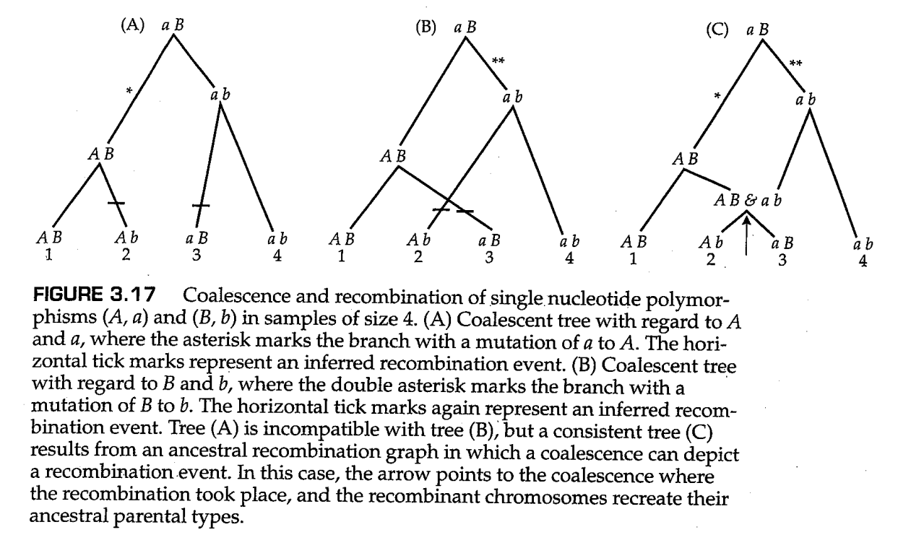

图3.17中的树（A）描述了样本中A和a等位基因的溯祖过程。a到A的突变发生时间用星号表示。树（B）描述了样本中B和b等位基因的溯祖过程。在这种情况下，B到b的突变发生时间用双星号表示。树（A）和树（B）都精确描述了等位基因A,a和B,b的祖先状态和溯祖过程。然而问题是，这两棵树是不同的。在树（A）中，第一个溯祖事件连接了样本1和2，而在树（B）中，第一次溯祖事件连接了样本1与3。

差异的原因在于（A）和（B）中的水平记号所示的时间，，在这个时刻，携带AB的染色体与携带ab的染色体发生了重组，产生了重组型染色体Ab和aB。核苷酸位点已发生重组的提示是，样本中存在所有四种可能类型的染色体（AB、Ab、aB和ab）。任何样本包含所有四种类型染色体的概率随样本大小的增加而增加，因此，大样本是检测重组的理想样本。然而，即使是大样本，也有可能错过许多重组事件。只有当突变率足够低，使得祖先历史中的每个位点突变不超过一次时，这种重组检验才有效。如果回复突变可能发生（这种突变常常发生在HIV-1等突变率高的病毒中），则重组的检测变得更加困难（McVean等人，2002）。

如何解决图3.17中树（A）和树（B）之间的不一致？传统的解决方法如树（C）（Hudson 1990）所示。在这种情况下，由于每个染色体的祖先都可以在时间上追溯，当两个染色体结合在一起时，两个事件中的任何一个都可能发生：染色体要么（1）发生重组，要么（2）发生溯祖事件。在树（C）中，箭头标记了重组事件，这是通过重组染色体重建其祖先亲本类型来描述的。类似C中的图被称为样本中单倍型的 *祖先重组图（the ancestral recombination graph）* 。

允许在每个节点进行重组或合并的想法，解决了树中的不一致性，但同时也暴露出了过程的复杂性。只有在最简单的情况下才可能得到分析结果（Hudson 1990，2001）。模拟是一种替代性的方法，但假设你被派去模拟一个DNA区域的祖先历史，其中包含50个互相之间可以发生重组的分离位点，直觉上你会意识到这项任务是可怕的。你必须生成一个祖先历史，在序列中的位点上撒上突变的分支，决定哪些节点会导致溯祖事件，哪些会导致重组，并跟踪突变和重组事件在序列中发生的位置。因此，模拟产生了溯祖树，其元素为一维图。

尽管它很复杂，然而对伴随重组的溯祖过程的模拟存在其可能性。问题是，随机生成的溯祖树甚至不太可能产生一个具有类似于实际样本的连锁不平衡等特征的等位基因模拟样本。这个问题可以用多种方式解决。一种方法是忽略溯祖事件，并根据样本本身的各种特征来估计重组率。正如突变的相关参数是 $4N\mu$ 一样，重组的相关参数也是 $4Nr$ ，其中 $N$ 是有效群体大小， $r$ 是每代的重组率。 $4Nr$ 的一个估计是基于比较所有可能的等位基因对中的样本等位基因，并为每对等位基因列出核苷酸错配的数量。成对错配的概率分布是估计重组率的基础，因为错配数量的方差通过重组而减少（Wakeley 1997）。这一点可以通过比较由AB, AB, ab, ab组成的样本中的错配数量的概率分布与由AB, Ab, aB, ab组成的样本中的错配数量的分布来理解，其中后一个样本代表重组。在两个样本中，成对错配的平均数量为1.33，但方差分别为0.89和0.22。这种方法的优点是它是完全直接的；主要的限制是它没有使用样本中的所有信息，因此具有比必要的更大的采样方差。

与使用汇总统计相反的方法是进行大量模拟，以执行方程（3.39）中所述的完全似然分析。正如我们所提到的，这种方法的问题是随机模拟极不可能接近实际数据。参数空间如此之大，以至于除了在简单的情况下，全面的似然方法需要的计算能力甚至超过最强大的计算机系统的计算能力。这个问题刺激了一些方法的实施，这些方法通过将完整的数据集折叠成汇总统计数据，并且通过将最相关的参数空间部分归零。近似贝叶斯溯祖方法（Approximate Bayesian coalescence methods）将观察到的数据折叠为汇总统计数据，例如不同单倍型的数量或序列对之间的平均失配数量。对于每个模拟的溯祖树，计算相同的汇总统计数据。如果观测数据和模拟样本之间的差异足够小（基于某种程度上任意选取的阈值），则接受模拟样本中的参数。多次重复模拟样本产生所谓的参数估计 *后验分布（posterior distribution）* 。

两种广泛使用的方法是 *马尔可夫链蒙特卡罗模拟* （ *Markov Chain Monte Carlo，MCMC* ）和 *序贯重要性采样* （ *sequential importance sampling* ），它们避免了对参数值的随机猜测，而是使计算机能够在参数空间的“最有希望”的区域花费更多时间。即使是这些方法也面临着当前可用数据集的巨大规模的挑战。这两种方法都需要数据和模型之间拟合优度的标准，这本身有时很难计算。有时使用 *复合似然度（composite likelihood）* 来代替计算全似然度，这种方法首先解决了一个更简单的问题，即计算每个独立核苷酸位点的似然值，然后将总体似然值作为一组核苷酸的似然值的乘积进行计算（Kim和Stephan 2000；Hudson 2001；McVean等人2002；Zhu和Bustamante 2005；Carvajal Rodriguez等人2006）。这种方法假设核苷酸位点互相之间具有统计独立性——这一假设很难证明——但在实践中，该方法的表现似乎比预期的要好得多。

### 连锁不平衡映射

伴随重组的溯祖分析很重要，因为了解突变、重组和随机漂变同时作用的后果是使用人类样本推断多因素遗传疾病（如高血压、糖尿病和精神分裂症）遗传风险因素的核心（见第10章）。一个基本的原理是，在有限的群体中，突变、重组和随机漂移的过程会导致 *连锁不平衡（linkage disequilibrium）* ，即染色体上等位基因的非随机关联，我们已经在第2章中对非常大（理论上无限）的群体进行了研究。

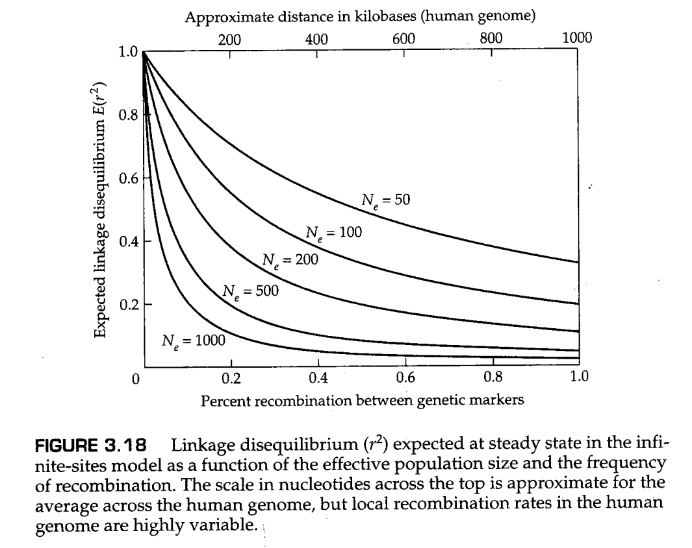

我们将在第9章对突变、重组和随机遗传漂变情况下连锁不平衡的定量进行详细讨论，这里只简单提供一些结论。主要结论总结在图3.18中，它们显示了两个遗传标记（例如SNPs）之间的期望连锁不平衡的大小（ $E(r^2)$ ）是两个遗传标记间重组百分比和有效群体大小（ $N_e$ ）的函数。粗略地说，在人类基因组中，1%的重组率对应于大约1Mb的DNA，我们基于这条经验法则绘制了图中顶部的以kb为单位的刻度。你或许可以从第二章中回忆到，连锁不平衡的度量 $r^2$ 具有直观的含义，即其平方根（即 $\sqrt{r^2}$ ）是单个染染色体上的等位基因之间的相关系数。因此， $r^2=0.2$ 表示相关系数为 $\sqrt{0.2}=0.45$ ，这是相当大的。图3.18中绘制的许多值的 $r^2=0.2$ 。即使 $N_e$ 大如1000，对于100 kb的SNPs，平衡 $r^2$ 也期望大于0.2。这一推理表明，人类基因组可能在至少几十kb的数量级的区域之间表现出显著的连锁不平衡，国际人类基因组图联盟（The International HapMap Consortium）（2005年）证实了这一预期。

SNPs与具有遗传成分的复杂疾病之间的关联分析称为 **连锁不平衡映射（linkage disequilibrium mapping）** 。这一方法将在第10章中进行详细研究。其目标是识别处于疾病易感的突变等位基因中或在其附近的独立SNP。这些突变等位基因被称为该疾病的 *遗传风险因素（genetic risk factor）* ，关联性的度量是连锁不平衡的大小。本质上，此类研究检查了大量受影响的个体（ *病例，cases* ）和对应的同样数量的非受影响个体（ *对照，controls* ）。对这些个体进行了全基因组数十万个SNP的基因分型，并确定了在受影响个体中比在未受影响的对照中更频繁发现的SNP（对于如此大量的统计测试，第2章中讨论的假阳性和假发现问题变得至关重要）。独立研究中显著相关且可重复的SNPs被认为标记了遗传风险因素的基因组位置。任何遗传风险因素都可能与多个附近的SNPs表现出连锁不平衡，因为与遗传风险因素相关的SNP的系谱树也是相关的。在这些基因中搜索能够提供病例和对照的最佳分离的系谱树对应的SNP，这提供了风险因素的更精细的遗传分辨率。这些应用是伴随重组的溯祖模型成为现代群体遗传学中最活跃的研究领域之一的部分原因。

## 本章小结

1. 由于每代配子的随机抽样，有限群体中的等位基因频率以 $pq/(2N)$ 的理论方差波动。这些等位基因的频率波动是随机遗传漂变的基础。
2. Wright-Fisher模型将二项抽样的概念扩展到多代，并暗示对于一个理想群体，其中作用于等位基因频率的唯一力量是随机遗传漂变，则一个等位基因经过漂变达到固定的概率等于其在群体中的初始频率。
3. 当规定了亚群中的初始等位基因频率时，Wright-Fisher模型的扩散近似使用了二阶偏微分方程来计算在任何给定时间亚群中等位基因的频率分布。扩散方法对于随机漂变的结果产生了许多重要见解，例如，对于一个注定要固定的新的中性突变，其固定的预期时间是 $4N$ 代。
4. 考虑随机漂变的一个有用方法是考虑一组相同大小的亚群，这些亚群经历了重复的世代抽样和漂变。在每个亚群中，基因型都是通过随机抽取等位基因而构成的，因此每个亚群总是处于哈迪-温伯格平衡。将所有亚群的基因型频率进行平均，我们发现总群体中的杂合基因型的频率低于HWE预期的频率，且总群体的杂合性以每代平均 $1/(2N)$ 的速率降低。
5. 真实的生物种群通常不符合Wright-Fisher模型，因为等位基因频率的变化比基于实际群体规模的预期情况更快。通过计算有效群体大小 $N_e$ ，可以使漂变模型更好地符合实际情况，其中有效群体大小的计算考虑了性别比例、后代数量的方差、世代之间群体规模的波动或群体细分。在某些情况下，有效群体大小可能大于实际群体数量。
6. 通过考虑等位基因的系谱历史，随机漂移的许多方面都得到了极大的简化。从时间上向过去看，等位基因谱系在某个时间点聚集在一起（溯祖事件），在这个时间点上，两个等位基因由单个祖先等位基因复制而来。
7. 溯祖时间的分布是指数型的，这使得溯祖树的计算机模拟非常容易实现，从而产生在任何特定模型下进化的群体样本中预期的特征。这些模拟样本可以与实际数据进行比较，以检验假设或估计群体参数。
8. 突变、重组和随机漂变的共同作用导致某种稳态，在这种稳态下连锁不平衡的大小是重组率和有效群体大小的函数。在人类群体中，连锁不平衡为基于连锁不平衡映射的疾病风险因素研究提供了可能。

## 课后习题

1. Describe the Wright-Fisher model of random genetic drift. The elements $T_{ij}$ of the transition matrix are probabilities. How should $T_{ij}$ be interpreted? 
2. Explain how the basic concept behind the Kolmogorov forward equation differs from that underlying the Kolmogorov backward equation. 
3. Explain why, in any population model in which random genetic drift plays a role, "backward" computer simulation, which starts with the alleles present in the current population and traces their coalescence backward in time, is computationally much simpler than "forward" simulation, which starts with the alleles present in the original population and simulates random genetic drift moving forward in time.  
4. In an ideal diploid population of size 50,what is the probability that a neutral allele present in exactly one copy will be lost in the next generation?What is the answer if the allele is present in two copies? 
5. Suppose that a diploid population of size 50 undergoes a change in average heterozygosity across loci from 0.50 to 0.42 in a single generation. Is it plausible to attribute this magnitude of change to random drift alone? 
6. How many generations of random genetic drift are required to reduce the expected heterozygosity to 5% of its initial value in a diploid randomly mating population of size 10? Of size 50? 
7. An autosomal gene in a colony of 28 Asian wild mice, *Mus castaneus* , undergoes mutation to a new neutral allele. Assuming that the population conforms to the Wright-Fisher model,what is the probability that the allele eventually becomes fixed? What is the probability that it eventually becomes lost? What is the average time to loss,given that the allele is eventually lost. What is the average time to fixation,given that it is eventually fixed?
8. What are the answers to Problem 3.7 if the mutant gene is X-linked and the population consists of equal numbers of males and females? What if the gene is Y-linked? 
9. An isolated population of apine edelweiss ( *Leontopodium alpinum* )loses half its heterozygosity in 30 generations. What is its effective population size? 
10. Remote Pitcairn Island in the South Pacific was settled in 1789 by Fletcher Christian and eight fellow mutineers from *HMS Bounty* , along with a small number of Polynesian women. Although many descendants have left the island in the intervening years, there has been essentially no immigration. Assuming an effective size of 20 in each of the eight generations since the island's settlement, what value of $F_t$ would be expected in today's population from random genetic drift? 
11. Show that random genetic drift requires an average of $t=2N\text{ln}(x)$ generations to reduce the expected heterozygosity from $H_0$ to $H_0/x$ . 
12. A large randomly mating diploid population with two neutral alleles A and a at allele frequencies $p_0=\frac{1}{3}$ and  $q_0=\frac{2}{3}$ ,respectively,splits into a large number of isolated subpopulations each of effective size 50. Within each subpopulation mating is random, but the allele frequencies diverge due to random genetic drift. After 69 generations,what are the expected genotype frequencies of AA,Aa,and aa,averaged across the subpopulations? In one of the subpopulations,the allele frequency of A equals 0.3. What are the expected genotype frequencies in this individual subpopulation?  
13. Two inbred strains of the azuki bean beetle *Callosobruchus chinensis* are crossed and their progeny allowed to mate at random each generation thereafter. Among 100 single-nucleotide polymorphisms differing in the original inbred strains,what number would be expected to remain segregating after 10 generations,assuming an effective population size of 80 individuals How many would be expected to remain unfixed after 50 generations? 
14. Use Equation 3.14 to show that approximately $2N$ generations of random genetic drift are required to reduce the number of segregating genes by a factor of $e$ ( $e=2.71828...$ ) given initial allele frequencies close to 0.5. 
15. What is the effective population number in a population of African lions, *Panthera leo* ,in which each breeding male controls a harem of five females and the total population consists of 200 males and 200 females? 
16. What is the effective population size of a herd of 10 dairy cows and 1 bull?What is it for 40 cows and 1 bull? For 10 cows and 2 bulls? 
17. What is the variance effective population size for an X-linked gene in a population consisting of 100 females and 10 males?In a population of 10 females and 100 males? 
18. In a haploid population of constant effective size 50,what is the probability that two randomly drawn alleles shared a common ancestor exactly 100 generations ago? 
19. In a population of effective size 30,how many generations are required on the average to coalesce from 4 alleles to 3?From 3 alleles to 2? From 2 alleles to 1? 
20. In a haploid population of effective size 50, how many sequences $k$ should be present in a sample for the first coalescence to have an average time of 10 generations. 
21. In the infinite-sites model, if $\theta=10$ , how many segregating sites are expected in a sample of size 10? 20? 50?  

