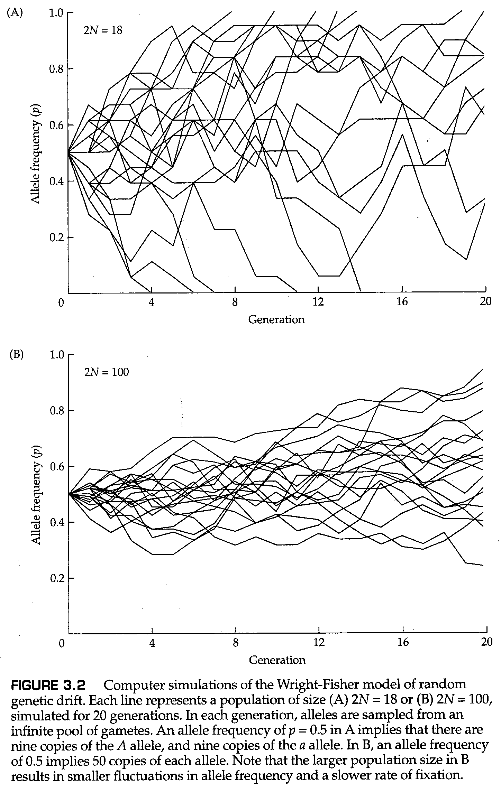

# 第3章 随机遗传漂变

在每一个生物体中，形成的配子数量都远远超过了可存活后代的数量。这是达尔文自然选择理论的原理之一。哪一个特定的配子存活，哪一个死亡，一定程度上由偶然性决定：抽签的运气。随机因素意味着，偶然因素本身就可以改变一代又一代的等位基因频率。因为这样的采样过程不会以任何预定的方式改变等位基因频率，所以这个过程被称为 **随机遗传漂变（random genetic drift）** 。随机遗传漂变的微妙性和重要性是本章的主题。

## 3.1 随机遗传漂变和二项抽样

为了介绍随机遗传漂变的过程，我们首先考虑一个具有等位基因A和a的哈迪-温伯格平衡的大种群，其等位基因频率 $p=q=\frac{1}{2}$ 。在该群体中，基因型频率为 $\frac{1}{4}$ AA、$\frac{1}{2}$ Aa、$\frac{1}{4}$ aa。假设群体“崩溃”，并且只有四个随机选择的个体存活下来，使这个群体永久存在。仅凭偶然的机会，幸存者可能由四个AA个体组成：这种可能性有 $(\frac{1}{4})^4=\frac{1}{256}$ 。同样，四个个体的基因型全为aa的可能性也是如此。任何其他可能的基因型组合都可以通过这种思路求得，并且不难计算出每个组合的概率。如果新群体的规模保持在每一代只有四个个体，这种类型的随机抽样每一代都会发生。如果新群体的规模保持在每一代只有四个个体，这种类型的随机抽样每一代都会发生。在任何生殖周期中，基因频率都有可能发生纯粹由采样过程引起的巨大变化。随机漂变的一个结果很快变得清楚：最终，群体将要么拥有所有A等位基因，要么拥有所有a等位基因。原因是，一旦群体达到这种“固定”状态，这种变化就会停滞。只有新的突变或迁移到群体中才能重新引入变异。

在上面的例子中，我们每代抽样四个二倍体个体。如果交配是随机进行的，那么对四个二倍体个体进行抽样完全等同于对八个单倍体配子进行抽样。当从 $p=\frac{1}{2}$ 的群体中随机抽取八个配子时，有九种可能的结果，在这九种可能结果中A等位基因的拷贝数分别为0,1,2,3，…… 8 个，其余为a等位基因的拷贝。九种可能性中的每一种的概率由 **二项分布（binomial distribution）** 给出，对应于 $(\frac{1}{2}A+\frac{1}{2}a)^8$ 的展开式中的连续项的系数。由于每一次连续抽取被认为是独立的，并且有 $\frac{1}{2}$ 的机会抽到一个A等位基因，这意味着抽取八个连续的A等位基因的概率为 $(\frac{1}{2})^8=\frac{1}{256}$ 。结果与前面计算的抽取四个AA基因型的概率相同，它说明了随机交配的原理。二倍体个体的随机抽样相当于单倍体配子的两倍随机抽样。

图3.1描述了从有限种群中抽取配子的过程。这些假设与产生哈迪-温伯格频率的假设相同，但在这种情况下，由于种群规模有限，等位基因频率可能会随着世代发生变化。在图3.1中的模型中，每一代的可育成年个体包括N个二倍体个体。这些个体产生了一个基本上无限的配子池，其中的等位基因频率与成年个体的相同。从这个无限的配子池中，随机抽取2N个并结合，形成下一代的合子。采样过程的这个模型产生了A和a的所有可能组合的二项分布。

举一个具体的例子，一个由9个二倍体生物组成的群体仅代表一个含有18个配子的样本，但这些配子可以被认为是从一个基本上无限的配子池中取样的。由于小样本通常不具有代表性，样本中的等位基因频率可能与整个配子池中的频率不同。例如，假设一个配子池包含频率分别为 $p$ 和 $q$ 的等位基因A和a， $p+q=1$ 。然后，如果随机抽取2N个配子以产生下一代的合子，则样本中恰好包含 $j$ 个等位基因A的概率由下列二项分布频率给出：

$$
\begin{aligned}   
    Pr\{j \text{个等位基因A}\}&=C^j_{2N}p^jq^{2N-j}\\
    &=\frac{(2N)!}{j!(2N-j)!}p^jq^{2N-j} \tag{3.1}
\end{aligned}
$$

其中 $j$ 可以取 0到2N之间的任何整数值。二项式系数（中间表达式中的括号内）通常读为“C 2N取j”（英文中的读法为“two N choose j”），因为它是从总共 $2N$ 个元素中选择 $j$ 个元素的方法数量。在等式（3.1）中所示的一代随机抽样后，A在群体中的新等位基因频率（称为 $p'$ ）由 $j/(2N)$ 给出，因为根据定义，A的等位基因频率等于A等位基因的数量（在这种情况下为 $j$ ）除以总数（在这种情形下为 $2N$ ）。在下一代中，采样过程根据等式（3.1）重新进行， $p$ 替换为 $p'$ ，$q$ 替换为 $1-p'$ 。这样，等位基因频率可以在一代又一代之间随机变化。

图3.2是根据等式（3.1）对随机抽样的过程进行的计算机模拟的结果。图3.2A中的每一行给出了 $N=9$ （即 $2n=18$ ） 的群体中连续20个世代里等位基因A的数量变化。正如你所看到的，单个的群体的行为非常不稳定。在7个群体中，等位基因A发生了 **固定（fixed）** ，即 $p=1$ ；在5个群体中，等位基因A发生了 **丢失（lost）** ，即 $p=0$ 。在其他8个群体中，A和a都保持未固定的状态，或者说这两个等位基因依然是 **分离的（segregating）** ；然而，未固定群体中的最终等位基因频率很可能是一个不同于初始频率 $p=0.5$ 的其他值。图3.2B显示了 $2N=100$ 条件下的模拟结果。随着种群规模的增加，种群固定的速度明显变慢。图3.2的主要结论是，等位基因频率在任何一个群体中都表现得如此不稳定，以至于几乎不可能进行预测。

尽管由于任何单个群体中的随机遗传漂变导致的等位基因频率的变化可能无法预测，但我们可以预测大量群体中等位基因频率的 *平均* 行为。我们现在考虑大数量的多个群体，所有这些群体具有相同的初始等位基因频率和相同的群体大小 $N$ 。假设这些种群中的每一个都独立于其他种群经历漂变。并且假定除了它们的群体大小有限以外，所有亚群都满足哈迪-温伯格模型的所有假设，并附加规定：（1）雄性和雌性数量相等；（2）每个个体都有相同的机会为下一代贡献成功的配子。如图3.3所示，这里的关键点在于，我们可以通过考虑图中不同时间点的时间切片并统计具有特定等位基因频率的种群数量的直方图，来描述这些种群在等位基因的频率上是如何变化的。最初，种群将全部接近初始等位基因频率。随着时间的推移，这些种群“漂变”开来，最终它们在所有可能的等位基因频率上扩散开来。最后，正如我们将看到的，每个种群必须对一个或另一个等位基因进行固定。

