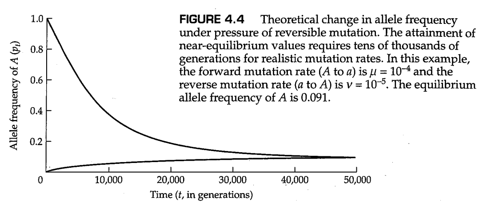

# 第4章 突变与中性理论

<link rel="stylesheet" href="https://cdn.staticfile.org/font-awesome/4.7.0/css/font-awesome.css"><a href="index.html"> <i class="fa fa-arrow-left"></i><b> 返回目录 </b></a>

<i class="fa fa-arrow-up"></i><b> 返回顶部 </b>

几个过程可以在群体中产生新类型的遗传变异，或促进基因组内或亚群体之间先前存在的变异的重组。遗传变异的最终来源是 **突变（mutation）** ，这里指的是遗传物质中的任何可遗传变化。因此，突变包括单个基因的核苷酸序列的改变以及染色体重排的形成，如倒位与易位。重组将不同基因上发生的突变带到了同一条染色体上，而迁移使突变能够在亚群中传播。 **转座子（transposable element）** 是一种DNA序列，能够复制并插入基因组中的大量位点之中。通过插入到基因内部或基因附近，转座子可以改变基因表达水平或表达模式，而转座子之间的重组可以导致染色体重排，例如，染色体的倒位。在本章中，我们考虑了遗传变异的产生过程，并研究了自然群体中突变的期望命运。

## 4.1 突变

突变是进化变化背后的遗传新颖性的最终来源。然而，大多数野生型基因的突变率非常低，通常每代每基因会发生 $10^{-4}$ 至 $10^{-6}$ 个新突变。即使很低的突变率也会产生许多新的突变等位基因，在一个足够大的群体中，每一个基因都有突变的风险。在一个群体规模为 $N$ 的二倍体生物群体中，每个基因有 $2N$ 个拷贝，每个拷贝都可以在任何一代中发生突变。例如，如果突变率（突变概率）为每代每对核苷酸发生 $10^{-9}$ 次，每个人类配子的基因组大小约为 $3×10^9$ 对核苷酸，那么每一代配子中平均产生3个新的突变；因此，每个新受精卵平均会携带6个新的突变。因此，目前约有65亿人口（2007年数据）的人类群体预计会携带400亿个新的基因突变，而这些基因甚至在一代人之前都没有出现过。

### 不可逆突变

尽管突变可能会产生一个新的等位基因，但当群体规模较大时，突变等位基因的初始频率必须非常低。具体而言，在一个群体规模为 $N$ 的二倍体生物群体中的单个新突变等位蛋白的初始频率为 $1/(2N)$ 。后代中的新突变可能会增加突变等位的数量，但是独立发生的反复突变对突变等位基因频率增加的速率非常缓慢。考虑一个具体的例子，其中A是野生型等位基因，a是突变体形式。如果每一代正好有一个新的突变，并且忽略了随机遗传漂变，那么a的等位频率会以数列 $1/(2N),\ 2/(2N),\ 3/(2N)...$ 而增加。并且，如果 $N$ 非常大（例如， $N=10^6$ ），那么等位基因增加的速率确实非常缓慢。因此，由于反复突变（ **突变压力，mutation pressure** ），等位基因频率发生变化的趋势非常小。另一方面，长时间内突变的累积效应可以变得明显。

对于突变研究来说，一个有用的模型是第2章的哈迪-温伯格模型，但与第2章中不同的是这里我们允许突变的存在。这里，我们关注的突变是对生物体生存和繁殖能力影响很小的突变，因此自然选择不会明显影响其频率。我们还将假设突变是 *不可逆的（irreversible）* ，这意味着a不能回复突变为A。为了避免因偶然因素导致等位基因频率变化而造成的结果的复杂性，我们还将假定群体是无限大的。

考虑一个具有两个等位基因A和a的基因，假设A突变为a的速率为每个A等位基因在每世代中发生 $\mu$ 个突变。换句话说，每个A等位基因在任何世代中都有 $\mu$ 的概率突变为a。我们将A的等位基因频率表示为 $p$ ，A的等位频率表示为 $q$ ，并用下标表示世代。因此， $p_t$ 和 $q_t$ 分别是第 $t$ 代中A和a的等位基因频率，其中 $t=0,1,2...$ 。在任何世代中， $p_t+q_t=1$ ，因为这里只考虑A和a两种等位基因。

接下来，我们将根据上一世代中的等位基因频率 $p_{t-1}$ ，推导出当前世代等位基因的频率 $p_t$ 的公式。在 $t$ 世代中， $p_t$ 包括在 $t$ 世代所有未发生突变的A等位基因，因此

$$
p_t=p_{t-1}(1-\mu)
$$

然而，因为同样的原因， $p_{t-1}$ 包含在 $t-1$ 世代所有未发生突变的A等位基因，因此 $p_{t-1}=p_{t-2}\times (1-\mu)$ 。将这个式子代入上面那个式子中，我们可以得到

$$
p_t=p_{t-2}(1-\mu)^2
$$

重复这一操作直到第 $0$ 世代，最终我们可以得到

$$
p_t=p_0(1-\mu)^t \tag{4.1}
$$

图4.1展示了当 $\mu=10^{-4}$ 时，突变压力对等位基因频率的影响。最开始，等位基因A的频率几乎呈线性地缓慢下降，因为当 $t$ 足够小时，方程（4.1）中的控制项 $(1-μ)^t$ 近似为 $1-\mu t$ 。1000代后，等位基因A的频率仍为0.90；然而，在 $t＝10000$ 代时， $p_t＝0.37$ ；当 $t=20000$ 代时， $p_t=0.14$ 。

一种分析方程（4.1）的指导性方法是考虑等位基因A频率降低一半所需的时间。为了找到这个过程的“半衰期”，我们令 $p_t=0.5×p_0$ ；于是我们得到 $0.5=(1-\mu)^t$ 。两边取对数，我们得到

$$
t_{\frac{1}{2}}=\text{ln}(0.5)/\text{ln}(1-\mu)\approx 0.6931\mu
$$

在图4.1的例子中，$t_{\frac{1}{2}}=6931$ 代。以10为倍数对 $\mu$ 进行减少，会相应地使 $t_{\frac{1}{2}}$ 以10为倍数增加，例如，$\mu =10^{-5},\ t_{\frac{1}{2}}=69310$ 世代，而 $\mu =10^{-6},\ t_{\frac{1}{2}}=693100$ 世代。突变压力在改变等位基因频率方面的微弱影响，可以通过计算基于突变率的等位基因频率半衰期长度来说明。

如参考方程（4.1）所示，当 $t$ 很小时，方程（4.1）的近似关系 $p_t=p_0(1-\mu t)$ 非常准确。对于突变等位基因a的等位基因频率 $q_t$ ，如果 $q_0$ 很小，其也可以近似写为 $q_t=q_0+\mu t$ 。这种近似意味着等位基因a的频率随时间线性增加，且斜率等于 $\mu$ 。然而，由于 $μ$ 很小， $q_t$ 的线性增加很难通过实验检测，除非在非常大的群体中。在 **细菌恒化器（bacterial chemostat）** 中可以获得较大的群体规模，这是一种保持细菌群体处于连续生长和细胞分裂状态的设备（图4.2）。在恒化器中观测到的由突变压力导致的 $q_t$ 线性增加如图4.3所示。注意在添加咖啡因（一种细菌诱变剂）后不久，突变率突然增加（由斜率增加表示）。

---------

**问题4.1**

一种遗传因子已在果蝇（ *Drosophila mauritiana* ）中进行了研究，这种遗传因子导致转座子元件 *mariner* 以每世代每拷贝 $1\%$ 的频率发生自发性丢失（Hartl 2001）。我们假设一个群体，其在一个常染色体位点上固定了 *mariner* 转座子（这个位点上的 *mariner* 插入在所有个体中都是纯合的），这个群体需要多少代才能使 *mariner* 缺失纯合子的果蝇比例超过 $5\%$ ？假设群体足够大，交配随机发生，前述能够使转座子元件丢失的遗传因子在群体中也是固定的，并且该转座子元件的丢失不会影响生存或繁殖。

----------

**答案**

设 $p_t$ 为 $t$ 代中 *mariner* 元件未丢失的染色体频率，并令 $μ=0.01$ 为每代丢失该元件的概率。在本题中，我们可以将 $\mu=0.01,\ p_0=1$ 代入方程（4.1）。 *mariner* 元件缺失纯合子的频率超过 $5\%$ 意味着， $(1-p_t)^2 > 0.05$ ，或 $p_t<1-\sqrt{0.05}=0.776$ 。因此， $t$ 应该大于 $\text{ln}(0.776)/\text{ln}(0.99)=25.2$ 世代。

--------------

### 可逆突变

除了从A到a的正向突变外，这个模型也可以允许从a到A的反向突变。因此，有两种不同方向的突变压力推动等位基因频率 $p$ 的改变：正向突变倾向于降低 $p$ ，反向突变倾向于增加 $p$ 。最终，这两种不同方向的压力达到平衡，于是等位基因频率 $p$ 在世代之间达到固定值。此时，正向突变导致的A等位基因的丢失正好被反向突变获得的A等位基因所抵消。

为了推导平衡点时的等位基因频率，假设从A到a的正向突变率为每代 $\mu$ ，而从a到A的反向突变率为每代 $\nu$。设 $p_t$ 和 $q_t$ 分别表示 $t$ 世代中A和a的等位基因频率，其中 $p_t+q_t=1$ 。 $t$ 世代中的一个A等位基因可以以两种方式之一产生：它可能来自 $t-1$ 代中的一个A等位基因，这个等位基因躲过了从A到a的突变（发生概率为 $1-\mu$ ），也可能来自 $t-1$ 代中的一个a等位基因，这个等位基因通过反向突变成为A（发生概率为 $\nu$ ）。用数学符号表示如下：

$$
p_t=p_{t-1}(1-\mu)+(1-p_{t-1})\nu \tag{4.2}
$$

为了求解关于 $p_t$ 的方程，上面的式子可以写作下面的形式：

$$
p_t-\frac{\nu}{\mu+\nu}=(p_{t-1}-\frac{\nu}{\mu+\nu})(1-\mu-\nu)\tag{4.3}
$$

由于 $p_{t-1}$ 和 $p_{t-2}$ 的关系和 $p_{t}$ 与 $p_{t-1}$ 的关系是一样的，对方程（4.3）的求解可以由如下的连续替代所获得

$$
p_t-\frac{\nu}{\mu+\nu}=(p_{0}-\frac{\nu}{\mu+\nu})(1-\mu-\nu)^t \tag{4.4}
$$

为了了解等位基因频率的长期变化，我们考虑当 $t$ 极大时的方程（4.4），例如 $t=10^5$ 或 $10^6$ 代。尽管 $1-\mu-\nu$ 通常接近于1，但 $t$ 的值如此之大，以至于 $(1-\mu-\nu)^t$ 近似为0。因此，方程（4.4）中等号右边的项整体趋近于为0，于是 $p_t$ 最终获得了一个在代际之间保持不变的值。这样的 $p$ 值称为 **平衡值（equilibrium value）** ，我们将用 $\hat p$ 表示。在可逆突变的情况下，令方程（4.4）的左侧等于0，我们可以得到平衡值，为：

$$
\hat p=\frac{\nu}{\mu-\nu} \tag{4.5}
$$

对于式子（4.5）给出可逆突变平衡的原因，有一个简单直观的解释。由于A等位基因以每代 $\mu$ 的速率变为a等位基因，而等位基因a则以每代 $\nu$ 的速率回复为A等位基因，因此在平衡时，我们可能会期望等位基因频率的比率是突变率比率的倒数，或 $\hat p/\hat q=\nu/\mu$ 。由于 $\hat q=1-\hat p$ ，此推理意味着 $\hat p=\nu/(\mu+\nu)$ ，和方程（4.5）一致。

图4.4展示了在 $\mu=10^{-4}$ 和 $\nu=10^{-5}$ 的情况下， $p_t$ 收敛到其平衡值的方式。注意，无论A等位基因的初始频率是多少，其最终频率都会达到 $\hat p$ ，在本例中等于 $0.00001/(0.0001+0.00001)=0.091$ 。图4.4还表明，突变压力在改变等位基因频率方面的效果通常非常微弱，因为群体需要数千或数万代才能达到平衡。

------------------

**问题4.2**

肠沙门氏菌（ *Salmonella enterica* ）具有一种基因转换机制，可调节不同形式的细胞鞭毛蛋白质的产生。有两个等位基因，我们将其称为A（“特相”鞭毛性质）和a（“群相”鞭毛性质）。A和a之间的来回切换发生得足够快，从而可以应用等式（4.4）。从A到a的转化率为每代 $\mu=8.6×10^{-4}$ ，而从a到A的转化率则为每代 $\nu=4.7×10^{-3}$ 。这些突变率比其他基因的突变率观测值高了几个数量级。原因是，从A到a再变回A的变化不是由常规意义上的突变引起的，而是由染色体内重组引起的（Simon等人，1980）。然而，在形式上，我们仍然可以将这个系统视为具有可逆突变的系统。在一个等位基因A初始频率为 $p_0=0$ 的培养物中，Stocker（1949）发现30代后频率增加到 $p=0.16$ ，700代后频率增加到 $p=0.85$ 。在 $p_0=1$ 的培养物中，388代后A的频率降至0.88，700代后降至0.86。这些值与使用估计突变率从方程（4.4）计算的值是否一致？A的平衡频率预测是多少？

-----------

**答案**

注意， $\nu/(\mu+\nu)=0.845$ 。这是预测的平衡频率（方程4.5）。同样， $1-\mu-\nu=0.99444$ ，这个数量决定了接近平衡的速度。对于 $p_0=0$ 的培养物，预测值为 $p_{30}=0.845-(0.845)(0.99444)^{30}=0.13,\ p_{700}=0.845-(0.845)(0.9944)^{700}=0.83$ 。对于 $p_0=1$ 的培养物，预测值为 $p_{388}=0.845+(0.155)(0.99444)^{388}=0.86,\ P_{700}=0.845+(0.154)(0.9944)^{700}=0.85$ 。预测值与观测值非常吻合。

------------------

## 4.2 突变和随机遗传漂变

假设群体规模无限大通常是不现实的。一个改进的模型使群体规模有限，在这种情况下，突变等位基因频率的变化不仅取决于突变压力，还取决于一代又一代的随机抽样。随机抽样导致等位基因频率的偶然变化，这一过程就是我们在第3章中详细讨论的 *随机遗传漂移* 。为了理解随机遗传漂变与突变结合时的影响，请考虑图4.5中的图表。正方形代表第 $t$ 代中成年群体的 $2N$ 个等位基因。每个等位基因被分配一个唯一的标签—— $α_1,\ α_2,\ α_3,...α_{2N}$ ——以暂时掩盖其A或a的身份。圆圈代表 $t$ 代中基本上无限的配子池。在配子池中，每个标记的等位基因被抽到的频率均为 $1/(2N)$ 。底部的正方形表示通过从配子池中随机取样形成的 $t+1$ 代中的两种二倍体基因型。有时候，上一代中的同一个等位基因的两个复制品可能会碰巧遇到一起，这样形成的基因型如 $α_iα_i$ 。或者，形成基因型的两个等位基因来自上一代中的两个不同的等位基因，这样形成的等位基因例如 $α_iα_j$ 。

从配子池中随机取样意味着，相对于 $t$ 代中的频率，某些等位基因可能在 $t+1$ 代中出现频率更高，而另一些等位基因则可能更低。事实上，任何特定的等位基因都很有可能在 $t+1$ 代中直接消失，因此该等位基因的谱系就此止于这一代。准确地说，在一个恒定大小的群体中， $t$ 代中的任一等位基因在 $t+1$ 代中没有出现的几率约为 $e^{-1}=0.368$ 。要了解原因，我们可以考虑一个标记为 $α_1$ 的等位基因。配子池中 $α_1$ 的频率为 $1/(2N)$ ，因此所有其他等位基因的频率加在一起为 $1-1/(2N)$ 。由于 $t+1$ 代中的基因型是通过从配子池中随机选择 $2N$ 个等位基因形成的，因此 $t+1$ 代中 $α_1$ 和非 $α_1$ 等位基因的数量分布由下列二项分布中的连续项给出：

$$
[\frac{1}{2N}α_1+(1-\frac{1}{2N})α]^{2N} \tag{4.6}
$$

其中， $α$ 代表除了 $α_1$ 之外的其他等位基因。因此，等位基因 $α_1$ 在 $t+1$ 代中不存在的概率由下式给出：

$$
(1-\frac{1}{2N})^{2N}\approx e^{-1}=0.368 \tag{4.7}
$$

即使 $N$ 很小，上面的式子依然提供了一个很好的近似。例如，当 $N=10$ 时，方程（4.7）的左侧等于 $0.358$ ，当 $N=20$ 时，左侧等于 $0.363$ 。

方程（4.7）的重要含义是，由于随机的遗传漂变，每个等位基因的祖先谱系在每一代中都面临着巨大的灭绝风险。随着时间的推移，谱系一个个地逐渐消失。最终，在某个时间点，除了一个等位基因的谱系以外，其他所有的谱系都灭绝了。在这个时候，群体中的所有等位基因之间，以及它们与祖先群体中存在的某个特定等位基因之间都是 *血缘同源（identity by descent）* 的。

### 一个新的中性突变固定的概率

除了一个谱系之外，所有谱系最终都会灭绝，这里暗藏着下列问题的答案：在一个规模为 $2N$ 的群体中，一个新的突变最终固定下来的概率是多少？解决这个问题的一种方法如图4.6所示。图4.6中的图A和图B分别展示了在突变产生后当前世代中的所有等位基因，其中突变基因用深色圆圈表示。在经过足够多的世代以后，后代群体中的所有等位基因将是当前世代中的同一个等位基因的后代，而具体哪一个等位基因将会成为共同祖先是随机的。在图A中，后代群体中的所有等位基因来自当前世代中的一个非突变等位基因；由于非突变等位基因的频率为 $1-1/(2N)$ ，因此非突变等位基因最终固定的概率亦是如此。在图B中，后代群体中的所有等位基因来自突变基因，因此一个新突变产生的等位基因最终被固定的概率为 $1/(2N)$ 。更一般地，对于不影响个体生存和繁殖的中性等位基因来说，有限群体最终将其固定下来的概率等于初始群体中中性等位基因的频率。

第3章已经以两种不同的方式推导了新的中性突变最终固定概率为 $1/(2N)$ 的结果。一种是通过基于溯祖的推理；当我们从右向左审视图4.6B时，我们会发现这就是一棵没有树枝的溯祖图，其中最右边的所有深色等位基因都可以通过溯祖过程追溯到左边的深色祖先等位基因。另一种方法在第3章中提到过，即通过柯尔莫哥洛夫后向方程求解这一问题（见问题3.5）。在第3章中，我们还使用这种方法得到了以下结果，即对于几个幸运的将被最终被固定的中性等位基因来说，固定的过程需要很长时间——平均来说，需要 $4N$ 世代。

## 4.3 分子进化的中性理论

**中性理论（neutral theory）** 的假设认为，许多遗传多态性来自于选择中性的等位基因，并且由突变和随机遗传漂变之间的平衡所维持（Kimura 1968a; King and Jukes 1969）。突变将新的等位基因引入群体，随机遗传漂变决定了中性等位基因最终是固定还是丢失，尽管丢失更加常见。在平衡状态（equilibrium）下，突变和随机遗传漂变之间存在平衡（balance），因此，平均而言，每一个通过突变获得的等位基因都会与丢失的现有等位基因相抵消。

本质上，中性假设表明，许多突变对生物体的影响很小，因此它们对生存和繁殖的影响可以忽略不计。因此，中性等位基因的频率不是由自然选择决定的。于是乎，如果中性假设成立，那么许多多态性在物种适应环境方面可能没有特别的意义。从适应的角度来看，选择中性的多态性只是进化的“噪音”，无论对它们的研究可能揭示多少关于群体结构和随机遗传漂变的信息，它们几乎没有告诉我们进化中的适应性遗传变化。对于这一讽刺的现象，木村资生（Kimura，1968a）给出了一个乐观的补充，他指出：

> if my chief conclusion [about the prevalence of neutral alleles] is correct, then we must recognize the great importance of random genetic drift ... in forming the genetic structure of biological populations.
>
> （如果我（关于中性等位基因普遍性的）主要结论是正确的，那么我们必须认识到随机遗传漂变在塑造生物群体遗传结构中的重要性）

确实如此。尽管中性等位基因可能不适合遗传适应的研究，但正因为它们对于自然选择是不可见的，这些中性等位基因成为了绘制群体地理结构和追踪DNA序列祖先谱系，以推断种内和种间谱系关系的理想选择。

由于中性假设在种群遗传学和进化中具有根本重要性，因此它一直是一个值得讨论的主题（例如，Li 1997；Graur和Li 2000；Hartl 2000a；Nei和Kumar 2000；Gillespie 2004）。中性假说是在20世纪60年代末提出的，当时大多数基因组都被认为具有蛋白质编码功能，而内含子和其他非编码序列还未被人们所知。今天我们已经知道，只有约1.5%的哺乳动物基因组编码蛋白质。如此低的编码基因密度为几乎不影响适合度的突变提供了充足的空间，这包括发生在内含子、假基因、基因间区、染色体着丝粒区的非编码DNA等中的一些突变（但并非全部）。

## 4.4 无限等位基因模型

在自然群体中，许多基因具有两个以上的等位基因。因此，确定突变压力下的预期遗传变异水平具有一定的重要性。一个方便的遗传变异的度量值是杂合基因型的比例（ *杂合度，heterozygosity* ）。如果一个基因的杂合度比单靠突变压力所预期的更高，那么自然界中的其他力量必须倾向于保持遗传变异。另一方面，如果一个基因的杂合度比预期的要小，那么其他力量必须倾向于消除遗传变异。

基因的杂合度是等位基因数量及其相对频率的函数。原则上，任何基因的等位基因的数量都可能很大。例如，编码300个氨基酸的蛋白质的基因具有长度为900个核苷酸的编码序列。因为每个核苷酸位点可能被A、T、G或C占据，所以可能的等位基因总数为 $4^{900}$ ，约等于 $10^{542}$ 。因此，我们可以假设每一个新的突变都会产生一个在人群中不存在的等位基因。这被称为突变的 **无限等位基因模型（infinite-alleles model）** 。无限等位基因模型只是确定新突变特征的一种方法。尽管它代表了对突变的某种简化看法，但它仍然为其他模型或观察到的等位基因频率提供了一个有用的比较标准。

在无限等位基因模型中，两个序列相同的等位基因也必须是血缘同源的，因为我们假设每个突变产生一个独特的等位基因。参考图4.5，可以清楚地说明血源同源的概念，其中每个等位基因被分配了一个唯一的标识符 $α_1,\ α_2,\ α_3$ 等。在图片底部，左边的基因型 $α_iα_i$ 中的等位基因被认为是血源同源的，因为它们是通过DNA复制从前一代中的单个祖先等位基因中继承下来的。在这种情况下，产生 $α_iα_i$ 的DNA复制发生在前一代。同样在图4.5中，基因型 $α_iα_j$ 中的等位基因也可能是血源同源的。下标不同仅意味着它们不是在前一代中通过DNA复制获得的，但如果它们是在前几代中通过DNA复制得到的，则它们依然是血源同源的。

在群体遗传学文献中，等位基因之间血源同源的基因型有时被称为 **自系纯合的（autozygous）** ，而等位基因之间血缘不同源的则被称为 **异系杂合的（allozygous）** 。血源同源的概念有些模糊，因为溯祖过程意味着一个基因的每个等位基因最终都必须来源于同一个祖先等位基因，这个祖先等位基因在过去的某个时间发生了DNA复制，最终形成了现在的等位基因。在实际应用中，我们可以通过任意选择过去的某个参考时间点，并声明在这个时间点上所有等位基因之间互相血缘不同源，从而解决这种歧义。

在无限等位基因模型中，每个突变产生一个群体中不存在的新等位基因，纯合基因型必须具有自系纯合的等位基因（血源同源）。因此，为了测量纯合度（homozygosity），我们只需要计算自系纯合性（autozygosity）。这也可以参考图4.5中的有限群体模型来完成。将 $F_t$ 定义为在 $t$ 代中，从群体中随机选择的两个等位基因血源同源的概率。在图4.5的情境下，随机选择的等位基因成对组合以形成基因型，因此 $F_t$ 也是 $t$ 代中的自系纯合概率。 我们将使用图4.5中的 $α_iα_i$ 和 $α_iα_j$ 基因型，以 $F_{t-1},\ N$ 以及突变率 $\mu$ 推导出 $F_t$ 的表达式。首先，考虑基因型 $α_iα_i$ 。这种基因型中的两个等位基因之间血缘同源的概率有多大？这两个等位基因之间的血缘同源性意味着在一个世代的过程中必须没有突变发生，因此血缘同源的概率为 $(1-\mu)^2$ 。下面我们再考虑基因型 $α_iα_j$ 。这两个等位基因之间的血缘同源性意味着在 $t-1$ 代中随机选取的两个等位基因必须血缘同源，并且在一个世代的过程中必须没有突变发生。因此，这种情况下血缘同源的概率为 $F_{t-1}(1-\mu)^2$ 。由于图4.5中每个标记为 $α'$ 的等位基因在配子池中都有相同的频率，即 $1/(2N)$ ，因此出现 $α_iα_i$ 这样的组合的概率是 $1/(2N)$ ，而出现 $α_iα_j$ 这样的组合的概率为 $1-1/(2N)$ 。将这些放在一起，我们可以得到 $F_t$ 的表达式：

$$
F_t=(\frac{1}{2N})(1-\mu)^2+(1-\frac{1}{2N})(1-\mu)^2F_{t-1} \tag{4.8}
$$

最终达到的 $F$ 的平衡值，称为 $\hat F$ ，其中任何一代中随机遗传漂变导致的自系纯合性增加都被新突变导致的自系纯合性降低所抵消。通过将 $F_t=F_{t-1}=\hat F$ 带入式（4.8）并求解，我们可以找到平衡值。我们可以忽略式子中的 $\mu^2$ 和 $μ/N$ 两项，因为它们足够小以至于可忽略。最终我们得到了一个近似值：

$$
\hat F=\frac{1}{1+4N\mu} \tag{4.9}
$$

因此，在突变压力下，选择性中性等位基因的数量增加，直到 $\hat F$ 满足方程（4.9）。因为它是血缘同源概率的平衡值，所以 $\hat F$ 也是自系纯合性的平衡值。由于无限等位基因模型中的假设，即群体中的每个等位基因只出现一次，所有纯合基因型也必须是自系纯合的。因此， $\hat F$ 也可以解释为纯合基因型比例的平衡值。

在方程（4.9）中， $N$ 应被解释为第3章中定义的有效群体大小 $N_e$，即拥有与所研究群体相同的纯合子增长率的理想群体的大小。在群体遗传学中， $4N_e\mu$ 常用符号 $θ$ 表示，因此 $\theta=4N_e\mu$ ，而方程（4.9）也可以改写为

$$
\hat F=\frac{1}{1+\theta}=\frac{1}{1+4N_e\mu} \tag{4.10}
$$

由于任何基因型不是纯合就是杂合，因此群体中杂合基因型的比例由 $1-\hat F$ 给出。于是，在无限等位基因模型下，由方程（4.10）我们可以得到杂合子比例的表达式：

$$
1-\hat F=\frac{\theta}{1+\theta}=\frac{4N_e\mu}{1+4N_e\mu} \tag{4.11}
$$

其中 $\theta=4N_e\mu$ 。图4.7展示了在 $\theta=4N_e\mu$ 取得不同值时，群体的平衡纯合子 $[1/(1+\theta)]$ 和杂合子 $[\theta/(1+\theta)]$ 的比例。由图可知，要想保持中等水平的遗传变异（杂合度）， $4N_e\mu$ 的取值范围相当窄。例如，仅当 $4N_e\mu$ 在0.25至4的范围内时，平衡杂合度可以落在0.2至0.8的范围内。然而，事实上，如第一章的图1.8所示，同工酶电泳的结果表明，许多蛋白质分子的杂合度小于0.2，且通常远小于0.2（在哺乳动物中约为0.03）。

这意味着图4.7中的实际值范围仅限于图的最左侧，其中 $\theta$ 远小于1。事实上，对于图1.8中的蛋白质电泳数据， $\theta$ 的估计范围为0.03-0.16。换言之，$4N_e\mu$ 的最大估计值与最小值仅相差约5倍。这是非常出人意料的，因为不同物种的群体数量可能相差 $10^4$ 倍或更多。不同生物中 $\theta=4N_e\mu$ 的范围显然太窄，这意味着对于氨基酸多态性来说，中性假说是错误的（Gillespie 1991）。另一方面，自然群体中有效群体大小的估计通常是不精确的，因为相关研究非常困难，并且对 $μ$ 的估计（在本例中是中性氨基酸多态性的突变率）更不确定。然而，在群体中等位基因频率的实际分布提示，许多低频的分离氨基酸多态性是轻度有害的，并且多态性由突变压力维持。

-------

**问题4.3**

一件很奇怪的事情在于，方程（4.10）和（4.11）预测了平衡纯合度和杂合度，却没有明确提及等位基因频率。然而，如果我们可以在随机交配群体中估计出等位基因频率，则可以使用第2章的哈迪-温伯格定律来估计纯合度和杂合度。特别是，纯合度的估计由 $\hat F=\sum p_i^2$ 给出，其对所有等位基因频率 $p_i$ 的平方进行了加和，而杂合度的估计由 $1-\hat F$ 给出。一项在加勒比果蝇 *Drosophila willistoni* 的群体中的蛋白变异电泳研究（Ayala和Tracy 1974）给出了一些基因座位的等位基因频率，这些基因座位包括 *Adk1* （腺苷酸激酶-1）、 *Lap-5* （亮氨酸氨基肽酶-5）和 *Xdh* （黄嘌呤脱氢酶），它们的等位基因频率如下表所示：

|        | *Adk-1* | *Lap-5* | *Xdh* |
|--------|---------|---------|-------|
|Allele 1|0.574    |0.801    |0.446  |
|Allele 2|0.309    |0.177    |0.406  |
|Allele 3|0.114    |0.014    |0.092  |
|Allele 4|0.003    |0.004    |0.034  |
|Allele 5|-        |0.004    |0.014  |
|Allele 6|-        |-        |0.004  |
|Allele 7|-        |-        |0.002  |
|Allele 8|-        |-        |0.002  |

估计每个基因的纯合度和杂合度，并给出相应的估计值 $\theta$ 。

----------

**答案**

*Adk-1* 的纯合度估计值为0.438， *Lap-5* 为0.673， *Xdh* 为0.373，相应的杂合度估计值分别为为0.562、0.327和0.626。因为平衡纯合度 $\hat F$ 等于 $1/(1+\theta)$ [见方程（4.10）]，那么 $\theta$ 可以估计为 $(1-\hat F)/\hat F$ ，这等于杂合度与纯合度的比率。对于这三个基因， $\theta$ 的估计值分别为1.28、0.49和1.68。这些值明显大于果蝇电泳多态性的平均值（见图1.8），后者约为 $\theta=0.16$ 。

-------

### Ewens抽样公式

方程（4.11）表明，当杂合度等于 $\theta/(1+\theta)$ 时，无限等位基因模型达到一种平衡。这不是通常意义上的“平衡”，或者说没有变化发生。事实上，这是一种动态的状态，在这种状态下，等位基因频率总是在变化，新的突变继续进入群体，先前存在的等位基因发生丢失，甚至一度固定的等位基因也可能会最终丢失。 *“稳定状态”（steady state）* 一词更适合于这种情况，因为等位基因并非保持在恒定的频率，而是新的基因加入，旧的基因从群体中消失。在等位基因数量和纯合度（无限等位基因模型下的自系纯合性）保持稳定的意义上，群体保持稳定状态。但是，如果等位基因的数量和自系纯合性水平处于稳定状态，那么有理由假设等位基因频率也处于稳定分布。当存在多个等位基因时，群体中的等位基因频率的联合概率分布通常被称为群体中的 **等位基因频率谱（allele-frequency spectrum）** 。当等位基因频率谱处于稳定状态时，这意味着最常见的等位基因的频率始终为 $p_1$ ，其次常见的等位基因频率为 $p_2$ ，依此类推。稳态下的等位基因频谱具有一种奇怪的特性，即哪怕最常见等位基因的预期频率总是为 $p_1$ ，最常见等位基因的 *身份（identity）* 也会随着时间而改变。在稳态群体中，并不是所有等位基因都具有相同的频率，并且 $F$ 大于所有等位基因频率相同时的情况。

现在站在一个需要从群体中进行采样的实验者的角度，考虑稳态等位基因频率谱。假设样本大小为 $n$ 个基因，同时假设样本中有 $k$ 个不同的等位基因。例如， $n=20$ 的样本可能由 $k=10$ 个各不相同的等位基因组成，其中一个等位基因在样本中出现六次，一个等位基因出现四次，两个等位基因各出现两次，六个等位基因各出现一次。对样本的这种描述被称为样本的 **等位基因配置（allelic configuration）** 。Ewens（1972）的一个重要发现是，在中性突变和随机遗传漂变（由 $\theta=4Nμ$ 测得）下，从服从无限等位基因模型的稳态群体中提取的样本，其预期等位基因配置完全由样本大小 $n$ 和观察到的等位基因数量 $k$ 决定。Ewens（1972）表明，在大小为 $n$ 的样本中，等位基因的预期数量 $k$ 是 $\theta$ 的简单函数：

$$
E(k)=1+\frac{\theta}{\theta+1}+\frac{\theta}{\theta+2}+...+\frac{\theta}{\theta+n-1} \tag{4.12}
$$

如果 $θ$ 非常小，则 $E(k)\approx 1$ ，而对于非常大的 $\theta$ ， $E(k)$ 接近 $n$ ，这意味着对于足够大的群体和足够高的突变率，采样得到的每个等位基因都将不同。方程（4.12）的形式表明，增加样本量，可以发现更多的等位基因，但同时，随着样本量的增加，发现新等位基因的回报率会减少。当我们绘制 $E(k)$ 相对于 $\theta$ 的变化曲线时（如图4.8所示），我们可以发现，当群体的遗传多样高时（对应于更大的 $\theta$ ），样本量越大，期望等位基因数量的增加率越高。

无限等位基因模型给出了在给定 $\theta$ 时，参数 $F$ 的稳态预测值（因为公式（4.10）中有 $F=1/(1+\theta)$ ），以及由公式（4.12）所给出的 $k$ 的预测值。整合这些预测值，我们可以得到 $F$ 和 $k$ 之间的期望关系，如图4.9所示。双曲线关系并不奇怪，因为在拥有许多等位基因的群体中随机选取一对等位基因，它们相同的概率通常很低。对于 $\theta=1$ ，期望的 $F$ 是所有样本大小的 $\frac{1}{2}$ ，但样本大小越大，得到的不同等位基因种类数越多。对于不同的样本大小（ $n$ ），曲线没有显著差异，主要是因为随着样本大小的增加，有更多低频等位基因被揭示了出来，然而低频等位基因对纯合度 $F$ 没有太大贡献。

利用Ewen的结论，Karlin和McGregor（1972）找到了样本中期望等位基因频率配置的明确公式。特别是，他们发现，一个大小为 $n$ 、包含 $k$ 个不同等位基因的样本，其正好包含 $n_1$ 个1型等位基因、 $n_2$ 个2型等位基因，……， $n_k$ 个 $k$ 型等位基因的概率由下列公式给出：

$$
Pr\{n_1,n_2,...,n_k,k\}=\frac{n!\theta^k}{k!n_1n_2...n_kS_n(\theta)} \tag{4.13}
$$

其中 $S_n(\theta)=\theta(\theta+1)(\theta+2)...(\theta+n-1)$ 。该方程为比较 样本等位基因配置的观测值 和 中性条件下的无限等位基因模型下的配置的期望值 提供了基础。[ 参见Ewens（2004）了解更多和更深入的讨论。 ]

### Ewens-Watterson 检验

Ewens（1972）年的论文是群体遗传学历史上的重要里程碑之一。因为它在假定仅存在中性等位基因的样本中，能够对预期等位基因配置提供明确预测，而这些预测结果可以与实际观察结果进行比较，以检验样本是否符合中性理论。基于等位基因配置的观测值和期望值，我们有许多统计检验方法可以确定观测样本是否符合中性模型的期望值。当可以区分大量等位基因时，例如当DNA序列的实际差异未知并通过蛋白质电泳确定等位基因时，基于无限等位基因模型的检验是最合适的。在这种情况下，基于Ewens抽样公式（见方程4.11）的检验必须假设任何无法区分的等位基因必须是血缘同源的，而这可能是一个严重的限制。

为了说明这种检验的特点，我们考虑了两个例子。一种类型的检验方法使用方程（4.13）比较样本等位基因频率配置的观测值和期望值。图4.10显示了人类群体中多态等位基因频率配置的观测值和期望值的直方图，其中每个等位基因在DNA区域中具有不同数量的短串联重复。在这个特定的例子中，常见等位基因（common allele）似乎略有过量；这种过量与无限等位基因模型的任何数量的偏离原因都是一致的。

第二个检验方法是一种基于Watterson（1978）开创的方法，该方法比较了样本纯合度的观测值和基于方程（4.13）的期望值。在一项研究中，作者在加利福尼亚州索诺马谷的冈德拉赫·邦德舒酒庄采集了89个 *Drosophila pseudoobscura* 果蝇纯合品系的样本（Keith等人，1985）。作者对这89个品系样本的组织匀浆进行顺序电泳（sequential electrophoresis，一种检测蛋白质产物之间的电荷和构象差异的灵敏方法），并对电泳结果的凝胶进行处理，以揭示黄嘌呤脱氢酶（ *Xdh* ）迁移率的差异。作者发现了一个存在于52个品系中的常见等位基因，一个存在于9个品系中的等位基因，一个存在于8个品系中的等位基因，两个分别存在于4个品系中的等位基因，两个分别存在于2个品系中的等位基因，以及八个单例突变基因（singleton）或独特等位基因（unique alleles）。

为了检验观察到的配置是否符合预期，我们可以通过一个计算机模拟程序，从服从无限等位基因模型的群体中产生一系列模拟样本，并重点关注与观测数据的等位基因数量一致的模拟样本。F.Stewart在一篇论文（Fuerst等人，1977）中描述了这种模拟算法，但读者也可参见Manly（1985）的论文。从每个计算机生成的样本中，我们可以计算出等位基因频率的平方和 $F$ 。图4.11显示了计算机生成样本中的 $F$ 的概率分布直方图，其中箭头指明了果蝇样本的 $F$ 的所在位置。从果蝇样本中观察到的 $F$ 落在这一分布的上尾部，由于在原假设的中性模型下，随机产生的样本的 $F$ 值很难超过这一观测值，研究者可以拒绝原假设，并认为数据不符合无限等位基因模型。观测数据偏离的方向是拥有过多纯合子，但由于群体可能处于哈迪-温伯格平衡，因此更明确的说法是在给定数量的等位基因观测值中杂合子缺乏（a deficiency of heterozygotes）。这种缺乏意味着常见等位基因（common allele）比预期更常见，而罕见等位基因（rare allele）的数量也比预期更多。这种等位基因的频率模式与纯化选择（purifying selection）一致，其中纯化选择的作用是降低有害等位基因的频率，后者会通过突变不断进入群体中。除了纯化选择外，这种频率模式也与其他情景一致，例如群体扩张（population growth）。一个不断扩张的群体比没有扩张的群体包含更多新突变等位基因（因为在扩张群体中，有突变风险的等位基因的拷贝数更多）。因此，相比于稳定的群体，扩张群体的低频多态性期望值会更高。

Ewens-Watterson 检验的结果也可以用图表的形式进行报告，如图4.12所示。每个基因在图上产生一个点，这个点的位置由该基因位点所拥有的等位基因的数量和样本的 $F$ 的观测值所指定。图中的两条曲线代表了由Ewens-Watterson 抽样理论得到的95%置信区间。我们可以通过查看样本点是否落在置信区间的方法，快速检验数据与模型的一致性。尽管 *Drosophila pseudoobscura* 果蝇的 *Xdh* 基因严重偏离无限等位基因模型，但更常见的结果是，我们观测到的实际数据与中性模型拟合的很好，就如图4.12所示的那样。

## 4.5 无限位点模型

当DNA序列数据可获得时，从直觉上看，无限位点模型比无限等位基因模型更具吸引力。在 **无限位点模型（infinite-sites model）** 中，我们首先考虑DNA分子上一段很长的核酸位点序列，并假设每个突变都仅会改变一个核苷酸位点。这个模型直接涉及了分子群体遗传学家可以获取的数据类型。此外，等位基因DNA序列包含了大量关于等位基因进化史的信息，这些信息隐藏在相似性和差异性模式中。无限位点模型首先由Kimura（1969，1971）和Watterson（1975）开发，其中Kimura认为核苷酸位点之间没有连锁，而Watterson考虑了位点之间几乎完全的连锁。在位点之间完全连锁的模型当中，如果每次突变都导致不同的位点发生改变，那么无限位点模型与无限等位基因模型共享许多性质。我们在第1章中简要讨论了无限位点模型，以举例说明基于群体等位基因序列可以进行的推断的类型，并在第3章的溯祖模型中再次讨论了它。在本节中，我们将更详细地考虑这一模型，并从这一模型的含义出发讨论了一些中性基因的统计检验方法。

在一段很长的核酸序列中，如果突变率足够低的话，那么大多数位点将是单态的，并且所有多态位点将仅存在两种分离核苷酸（即存在两个等位基因）。许多DNA序列等位基因变异的数据似乎与这一观点一致，因为很少有核苷酸位点存在超过两种以上的分离核苷酸。如果序列足够长，多态位点的频率足够低，那么新发生的突变绝大多数情况下将发生在单态位点上。

为了强调这些点，我们可以考虑表4.1中所示的模拟样本，这个样本包含4条已进行序列比对的DNA序列。这些模拟的序列比实际序列更短、多样性更高；它们旨在尽可能清楚地显示从这样的序列中提取一些类型的信息的可能性。为了便于阅读，在每列对齐的核苷酸位点中，任何与该位点的多数规则一致性（majority-rule consensus）不匹配的核苷酸都会加下划线。关于无限等位基因模型，我们通常提取两种类型的信息：

+ 样本中被两个或多个核苷酸占据的核苷酸位点。这些位点被称为 **可分离位点（segregating sites）** ，在第1章和第3章中，我们将可分离位点的数量表示为 $S$ 。在由16个核苷酸组成的 $a-d$ 四个样本序列中，恰好有8个可分离位点（位点1、2、4、5
、9、10、11、12），因此 $S=8$ 。
+ 样本中在一对序列配对之间存在差异的核苷酸位点。这些位点被称为 **核苷酸错配位点（nucleotide mismatches）** ，在第1章中，我们将所有已比对序列间的核苷酸错配数量的平均值表示为 $\Pi$ 。在 $a-d$ 四个序列中，存在6对（即组合数 $C_4^2$ ）成对序列配对，分别为 $a-b,\ a-c,\ a-d,\ b-c,\ b-d,\ c-d$ 。我们在这些组合中分别比较每一种的16个核苷酸位点，并可以得到这6对序列中的错配位点数分别为 $0 (a-b),\ 4 (a-c),\ 4 (a-d),\ 4 (b-c),\ 4 (b-d),\ 8 (c-d)$ 。因此，总的错配位点数量为6对成对比较中有 $0+4+4+4+4+8 = 24$ 个，于是乎在这个例子中 $\Pi = 24/6 = 4$ 。

考虑到分离位点和核苷酸错配的概念，我们可以继续研究中性进化中无限位点模型的一些性质。首先，考虑一个仅由两条序列组成的样本。在这种情况下，分离位点 $S$ 的数量和核苷酸错配 $\Pi$ 的平均数量是相同的，因为只有一对的成对序列比较（pairwise sequence comparison）。对于大小为2的样本，Watterson（1975）表明，分离位点的数量 $S$ 等于任意数值 $i$ 的概率由下式给出

$$
Pr\{S=i\} = \frac{1}{1+\theta}(\frac{\theta}{1+\theta})^i \tag{4.14}
$$

其中 $\theta=4N_e\mu$ 。我们强调，在这个公式中， $\mu$ 是 *整个核苷酸序列（across the entire nucleotide sequence）* 的突变率。（从形式上看， $\mu$ 可以被认为是整条序列中所有核苷酸位点上的单核苷酸突变率（per-nucleotide mutation rate）之和。）

现在我们考虑两条序列之间不存在错配的特殊情况（ $i=0$ ）。将 $i=0$ 带入公式（4.14）中，经过计算我们得到：

$$
Pr\{S=0\}=\frac{1}{1+\theta} \tag{4.15}
$$

注意，无限位点模型的方程（4.15）右侧部分与前述方程（4.10）右侧部分相同，其中方程（4.10）描述的是在无限等位基因模型中，自系纯合概率的平衡值。这里的原因在于，在两个模型中，对于大小为2的样本，两条序列相同的概率也是两条序列自系纯合的概率。

从方程（4.14）中可以看出，对于样本量为2的样本，分离位点数量 $S$ 的均值和方差由 $E(S)=θ$ 和 $V(S)=θ+\theta^2$ 给出。如前所述，对于大小为2的样本，成对错配数 $\Pi$ 的均值等于分离位点的数量，因此 $E(\Pi)=\theta,\ V(\Pi)=\theta^2$ 。方差为 $\theta+\theta^2$ 需要完全的连锁。如果核苷酸位点之间可以重组，那么方差会降低。图4.13展示了一个计算机程序模拟的例子，它比较了无重组样本（方差更大，黑色柱状图）和自由重组样本（方差更小，灰色柱状图）的每位点平均成对错配数（average number of pairwise mismatches per nucleotide site）。由于这种差异，错配数量的概率分布的均值和方差之间的关系可以用于推断基因内重组的程度（Hudson 1987，Wakeley 1997）。

无限位点模型在中性进化和无重组的状态下的重要抽样性质，最初由Watterson（1975）首先发现。他同时检查了分离位点的数量和成对错配的平均数量。样本量为 $n$ 的序列样本中，分离位点的预期数量由下式给出

$$
E(S)=\theta\sum_{i=1}^{n-1}\frac{1}{i} \tag{4.16}
$$

在第3章中，上式就已经根据溯祖树的预期分支总长度推导出来过（见方程3.41）。这里 $\theta=4N_e\mu$ ，其中 $\mu$ 是整个核苷酸序列的突变率。大小为 $n$ 的样本中，分离位点数量的方差等于

$$
V(S)=\theta\sum_{i=1}^{n-1}\frac{1}{i}+\theta^2\sum_{i=1}^{n-1}\frac{1}{i^2} \tag{4.17}
$$

上述方差的表达式针对的是无重组的情况。实际情况表明，重组不会影响 $E(S)$ ，但会降低 $V(S)$ 。在相邻核苷酸位点之间能够自由重组的极端情况下，序列上的分离位点数量服从泊松分布，此时方差等于均值。

现在考虑一组序列中成对错配的平均数量 $\Pi$ 。一个重要的结果是，在稳定状态下，一个样本量为 $n$ 的样本中，

$$
E(\Pi)=\theta \tag{4.18}
$$

这里依然有 $\theta=4N_e\mu$ ，其中 $\mu$ 代表整个核苷酸序列的突变率。

当核苷酸位点之间没有重组时，Tajima（1983）发现 $\Pi$ 的方差为

$$
V(\Pi)=\frac{n+1}{3(n-1)}\theta+\frac{2(n^2+n+3)}{9n(n-1)}\theta^2 \tag{4.19}
$$

其中 $\theta$ 在方程（4.18）中被定义。同样的，重组降低了平均成对错配数的方差（对于 $n=2$ 的情况，见图4.13）。不难直观地看出为什么方差降低——重组打乱了等位基因之间的变异，通过等位基因随机配对的差异，减少了那些使得随机等位基因配对之间不一样的位点的平均数量。Wakeley（1997）对此进行了更深入的探讨。

### 核苷酸多态性和核苷酸多样性

将 $S$ 和 $\Pi$ 作为群体核苷酸变异的度量值，存在的一个限制是，每个具体的数值取决于所比较的序列的长度；这些因基因而异，因研究而异。通过将分离位点数 $S$ 和成对错配的平均数量 $\Pi$ 表示为位点总数的比例，可以消除对序列长度的依赖性。具体地说，假设一个样本由 $n$ 条经过比对的序列组成，每条序列的长度为 $L$ 。那么在所有比较位点中，分离位点的比例等于 $S/L$ 。这个数量没有固定的符号，但有时被称为 **核苷酸多态性（nucleotide polymorphism）** 。为了一致性，我们将用符号 $S^*$ 表示核苷酸多态性，因此 $S^*=S/L$ 。由于 $L$ 是一个常数，因此 $S^*$ 的均值和方差由下式给出：

$$
E(S^*)=E(S)/L\ \ \ \ \ \ V(S^*)=V(S)/L^2 \tag{4.20}
$$

方程（4.16）和（4.17）中给出了在没有重组的情况下 $E(S)$ 和 $V(S)$ 的表达式。尽管 $S^*$ 不取决于序列长度，但它确实取决于样本大小，这从方程（4.16）中可以明显看出。另一方面，除非样本很小，否则其对样本大小的依赖性相当弱（见表1.2）。

同样，长度为L的序列中，成对错配的平均比例由 $\Pi/L$ 给出。这个数量确实有一个既定的符号，即 $π=\Pi/L$ ，它被称为 **核苷酸多样性（nucleotide diversity）** （Nei和Li 1979）。因为 $L$ 是一个常数， $π$ 的均值和方差由下式给出：

$$
E(π)=E(\Pi)/L\ \ \ \ \ \ V(π)=V(\Pi)/L \tag{4.21}
$$

方程（4.18）和（4.19）中给出了在没有重组的情况下 $E(\Pi)$ 和 $V(\Pi)$ 的表达式。

### Tajima'D 统计量

方程（4.16）提供了一种基于样本分离位点个数 $S$ 的参数估计方法，用于估计 $\theta=4N\mu$ 。如果我们定义

$$
\alpha=\sum_{i=1}^{n-1}\frac{1}{i}=1+\frac{1}{2}+\frac{1}{3}+...+\frac{1}{n-1} \tag{4.22}
$$

那么从方程（4.16）中我们可以得到下面的估计：

$$
\hat \theta=S/a \tag{4.23}
$$

类似的，方程（4.18）提供了一种基于成对错配数 $\Pi$ 的参数 $\theta$ 的估计方法，并且这一方法相当直接：

$$
\hat \theta=\Pi \tag{4.24}
$$

Tajima（1989）提出，方程（4.23）和（4.24）中 $\theta$ 的估计值之间的差异可以用作对无限等位基因模型拟合优度的检验，并且这种检验已经得到了广泛使用。其原理是分离位点的数量和成对错配的平均数量不同，这种差异的主要原因是前者与位点上的多态核苷酸的相对频率无关。无论如何，除非某些进化过程导致实际情况与无限等位基因模型的假设存在差异，否则这两个值对 $θ$ 的估计是一致的。Tajima检验（Tajima's test）基于差值 $\Pi-S/a$ 。如果无限等位基因模型成立（或者样本与模型假设的差异太小，无法使方程（4.23）和（4.24）无效），那么差值 $\Pi-S/a$ 将等于 $0$ 。主要差异出现在两种情况下：

+ 多态核苷酸的频率几乎相等。这种模式增加了成对差异的平均数量，超过了其中性预期；因此 $\Pi-S/a$ 为正值。这一现象通常表明，要么存在某种类型的平衡选择，使得杂合基因型受到青睐，要么存在某些类型的多样化选择，其中携带罕见等位基因的基因型受到偏爱。如果样本群体是由两个不同种群在近期发生混合而形成的时，也可能发生这种情况。
+ 多态变体的频率极其不相等，出现了过多的常见类型（common type）和太多的罕见类型（less common type）。这种模式会导致成对差异的比例下降，因此 $\Pi-S/a$ 为负值。稀有等位基因过多的一个可能原因是存在对携带有害突变的基因型的负选择。然而，偏离无限位点模型并不一定意味着自然选择正在发挥作用。例如，一个正在增长的群体也会有过多的稀有等位基因，并且 $\Pi-S/a$ 是负值。

-------------

**问题4.4：**

为了具体利用这些想法，请考虑表4.1中的示例。根据这些数据，使用方程（4.23）和（4.24），根据分离位点的数量和成对错配的平均数量，获得 $\theta$ 的估计值。然后计算 $\Pi-S/a$ ，并根据数据偏离无限等位基因模型期望的程度来解释结果。

---------

**答案：**

对于表4.1中的数据，我们已经计算出 $S=8$ 和 $\Pi=4$ 。在这种情况下， $n=4$ ，使得 $a=1+1/2+1/3=1.833$ 。因此，根据方程 （4.23）对 $\theta$ 的估计为 $16/1.833=4.36$ ，而根据方程（4.24）对 $\theta$ 的估算为 $4.00$ 。因此，在本例中， $\Pi-S/a=4.00-4.36=-0.36$ 。由于样本量较小，几乎没有理由对该值是否与 $\theta$ 有显著差异进行正式的统计测试，但与 $0$ 的微小差异表明稀有等位基因没有显著过量。在实际工作中，中性突变下的无限位点模型的随机溯祖事件可以使用程序进行模拟，例如 `ms` 程序（Hudson 2002）。对于每个模拟样本，我们可以计算 $\Pi-S/a$ 的具体数值，并且这些样本的统计分布将构成统计检验的零假设分布，即中性状态下的概率分布。如果观测值落在这一零假设分布的末尾5%以上或以下，则认为统计检验的P值显著（ $P<0.05$ ）。

-------------

来自自然群体的数据通常有过量的分离位点，在这些位点中，占比少的核苷酸（minority nucleotide）只在一个样本中存在，构成所谓的 **单例突变（singleton）** 。尽管过量的单例突变可能由近期发生的群体快速扩张所导致，但更常见的情况是，单例突变代表了通过选择而保持在低频率下的轻微有害的等位基因。当在蛋白质编码区的非同义核苷酸多态性中观察到类似这样的情况时，我们通常解释为这些氨基酸多态性是轻微有害的，并且在这些位点上存在两种力量的平衡，即倾向于清除有害等位基因的选择压力，和倾向于产生新的有害等位基因的回复突变压力。这两种力量的相互平衡使得这些多态性位点上的等位基因维持在低频状态。

Tajima's（1989）检验实际上是基于 $\Pi-S/a$ 的归一化版本，其中差值的大小以相对于差值标准差的倍数来表示。由此产生的统计数据被称为 **Tajima's D** ：

$$
D=\frac{\Pi-S/a}{\sqrt{V(\Pi-S/a)}} \tag{4.25}
$$

在Tajima的论文中可以找到方程（4.25）中分母部分的精确表达式。这个等式最初的意图是，Tajima's D的任何观测值的统计显著性都可以基于 $\Pi-S/a$ 统计分布的均值和方差。但 $\Pi-S/a$ 的统计分布非常复杂，目前大多数有意义的检验方法都是基于对Tajima's D的观测值与溯祖过程模拟的模拟值的比较，如问题4.4的答案所述。

### 适合中性溯祖过程的Fu and Li检验

