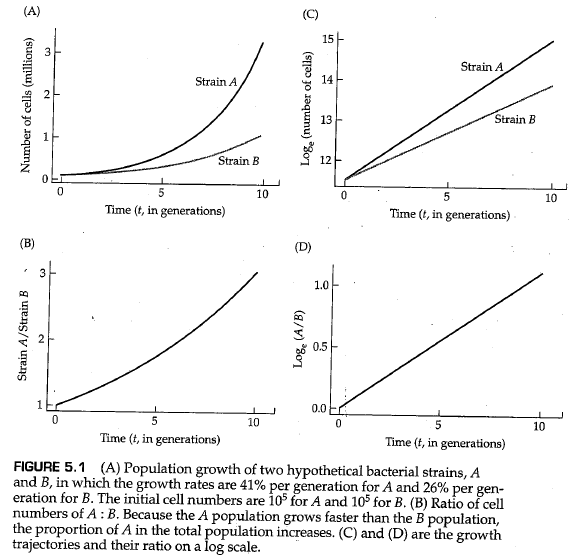
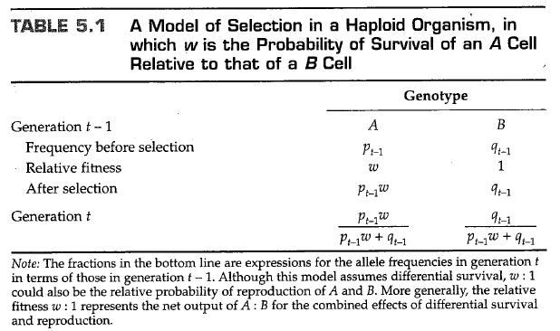
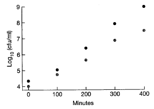

# 第5章 达尔文选择

<link rel="stylesheet" href="https://cdn.staticfile.org/font-awesome/4.7.0/css/font-awesome.css"><a href="index.html"> <i class="fa fa-arrow-left"></i><b> 返回目录 </b></a>

<i class="fa fa-arrow-up"></i><b> 返回顶部 </b>

到写作本书的时间为止，术语 “自然选择”（ *natural selection* ） 已经被达尔文在《物种起源》（ *The Origin of Species* ）（Darwin，1859）中使用在了一个非正式的、直观的场景中了：

> Owing to this struggle for life, variations, however slight and from whatever cause proceeding, if they be in any degree profitable to the *individuals* of a species, in their infinitely complex relations to other organic beings and to their physical conditions of life, will tend to the preservation of such *individuals* , and will generally be inherited by the offspring. The offspring, also, will thus have a better chance of surviving, for, of the many *individuals* of any species which are periodically born, but a small number can survive. I have called this principle, by which each slight variation, if useful, is preserved, by the term Natural Selection.  
>
> （由于这种生存斗争，对于一个变异，无论多么微小，无论出于何种原因，如果它们在任何程度上对一个物种的 *个体* 有益，在他们与其他有机物和他们的生活条件的无限复杂的关系中，这些变异将倾向于保护这些 *个体* ，并普遍地由后代遗传。因此，后代也将有更好的生存机会，因为在任何物种的许多周期性繁殖产生的 *个体* 中，只有一小部分能够生存。我把这一原则称为“自然选择”，即每一个微小的变化，如果有用的话，都会被保留下来。）
 
自然选择的现代表述不那么文学化，通常被压缩成类似逻辑三段论的形式：

+ 在所有物种中，产生的后代都超过了生存和繁殖的可能
+ 生物体的生存和繁殖能力不同，部分原因是基因型的差异
+ 在每一世代中，在当前环境中促进生存的基因型在生育年龄都会过量存在，从而对下一代的后代产生不成比例的影响。

因此，通过自然选择，提高生存和繁殖能力的等位基因的频率一代又一代地逐渐增加，群体在环境中的生存和繁殖能力逐渐增强。自然选择导致的群体遗传的逐步改善构成了 **进化适应（evolutionary adaptation）** 的过程。

在上面引用的关于自然选择的简短描述中，达尔文三次使用 *“个体”（individual）* 一词。选择的单位是个体生命，而不是物种，不是亚群，也不是同胞群（sibship）。重要的是个体的表现。每一个个体都在为生存而斗争，生死存亡全靠自己。达尔文还使用了“为生存而斗争”（struggle for existence）和“适者生存”（survival of the fittest）这两个术语作为自然选择的同义词，但他强调，他使用了最广泛的隐喻意义上的术语，不仅包括生物体自己的生命，还包括生物体在产生后代方面的成功：繁殖力（fecundity）与生存同等重要。在本章中，我们将看到达尔文关于个体生物“适者生存”的概念是如何变得更加正式和定量的，以及这一概念是如何被纳入到描述自然选择下等位基因频率变化的模型中的。这些模型表明，自然选择同时作用于适合度的不同组成部分，并可以在不同的群体结构水平上运行。现代的自然选择观与达尔文的观点有点不同，前者承认自然选择可能在单倍体阶段、二倍体阶段、成对的交配基因型上起作用，而在个体群体上起到的作用可能要弱得多。

## 5.1 单倍体生物中的选择

选择作用于表型，而不是基因型，全部表型由许多互作基因和各种环境因素共同决定。然而，在探索选择的结果时，最好关注单个基因的等位基因频率的变化，以便于研究的进行。我们将从最简单的选择类型开始，在单倍体、无性生物中进行操作，例如某种细菌。在单倍体中，选择是通过群体的生长差异来实现的。无论种群增长过程是离散的还是连续的，选择的过程都是相同的，但在模型参数化方面有些不同，因此有必要将模型联系起来，以避免以后混淆。

### 离散世代

考虑无性繁殖的细菌中的两种基因型，A和B。为了简单起见，我们将假设种群数量的几何增长过程符合下列离散模型，即 $A_t=(1+a)^tA_0,\ B_t=(1+b)^tB_0$ ，其中 $A_t$ 和 $B_t$ 分别是基因型A和基因型B在时间 $t$ 时的细胞数。当 $a\neq b$ 时选择发生。图5.1A是一个示例，其中基因型A和B的增长率分别为 $a=0.41,\ b=0.26$ 。两个群体的大小都呈指数级增长，但A的增长速率快于B。在大多数情况下，我们对A型或B型细菌细胞的实际数量并不感兴趣，而是对A型细胞在所有细胞中的所占比重感兴趣。等效地，我们可以检查 $t$ 时刻A型细胞与B型细胞数目的比率，该比率由下式给出：

$$
\frac{A_t}{B_t}=(\frac{1+a}{1+b})^t\frac{A_0}{B_0}=w^t(\frac{A_0}{B_0}) \tag{5.1}
$$

选择的结果由 $a$ 与 $b$ 的比率决定，因为如果 $a<b$ ，则A细胞与B细胞的比率降低，直到最终失去A型细胞；相反，如果 $a>b$ ，则A细胞与B细胞的比例无限制地增加。图5.1B显示了图5.1A的示例中的A/B比例的变化。初始值为1，在第十代时比例增加至3；这两个时间点A型细胞的频率分别为0.50和0.75。无论何时出现几何增长，在对数尺度上绘制（图5.1C和D）都会获得直线，这通常有助于统计分析（例如，从数据中估计 $a$ 和 $b$ ）。

在图5.1中，没有必要说明 $a$ 和 $b$ 是否因存活率或繁殖力而不同。重要的是它们确实不同。同样重要的是，结果只取决于比率 $(1+a)/(1+b)$ ，这意味着，在实践中，我们不需要知道A和B的绝对增长率，只需要知道它们的相对值（它们的比率）即可。在等式（5.1）中， $w$ 表示比率 $(1+a)/(1+b)$ 。符号 $w$ 通常用于离散选择模型，在本例中，它是基因型A相对于基因型B的 *相对适合度（relative fitness）* 。换句话说，在单倍体生物体中，相对适合度等于生长率的比率。

尽管这样做有时很有启发性，但在选择模型中没有必要追踪群体规模的变化。我们感兴趣的变量通常是等位基因频率，而不是群体大小。因此，设 $p_t$ 和 $q_t$ 分别表示基因型A和B在 $t$ 代中的频率，其中 $p_t+q_t=1$ 。表5.1中说明了一种方法，这种方法可以将A型和B型细胞在任何两个连续世代中的频率关联起来。为了便于讨论，我们将每一世代分为三个阶段：出生、选择和繁殖。在 $t-1$ 代中，出生阶段A和B的频率分别为 $p_{t-1}$ 和 $q_{t-1}$ 。按照假设，基因型A和B将以 $w:1$ 的比例存活，也就是说 $w$ 是A型相对于B型的存活概率。如前文所述，我们不用在意某种基因型存活的绝对概率。重要的是相对比例。经过选择， $A:B$ 的频率比值等于 $p_{t-1}\times w:q_{t-1}\times 1$ 。如果存活的基因型以相同的效率繁殖，则下一代的出生频率将由表5.1底部的表达式给出；表达中的分母部分是不可或缺的，它们使第 $t$ 代中的等位基因频率总和为1。

为了与方程5.1进行比较，考虑 $p_t$ 是第 $t$ 代中A细胞的数量除以总数；同样， $q_t$ 是B细胞的数量除以总数。因此，比值$p_t/q_t$ 等于 $t$ 代中A细胞与B细胞的比值，因为分母部分相互抵消。表5.1中的表达式表明，任何一代的 $p/q$ 比率都等于 $w$ 乘以上一代的 $p/q$ 比率，因此我们有：

$$
\frac{p_t}{q_t}=w\frac{p_{t-1}}{q_{t-1}}=w^2\frac{p_{t-2}}{q_{t-2}}=...=w^t\frac{p_0}{q_0} \tag{5.2}
$$

方程5.2的右侧与方程5.1中的右侧相同，只是相对频率 $p$ 和 $q$ 取代了A型和B型细胞的绝对数量。因此，推导出自然选择的结果，并不需要追踪种群大小。我们所需要的仅仅是相对适合度 $w$ 和初始频率 $p_0,\ q_0$ 。

为了应用于实验数据，方程5.2通常通过取自然对数（以 $e$ 为底）进行转换：

$$
\text{log}(\frac{p_t}{q_t})=\text{log}(\frac{p_0}{q_0})+t\text{log}(w) \tag{5.3}
$$

公式（5.3）意味着，如果在一段时间内在实验细菌群中持续监测 $p_t/q_t$ 的值，则 $\text{log}(p_t/q_t)$ 与时间 $t$ （以世代为单位）的关系图应该是一条直线，且斜率等于 $\text{log}(w)$ 的直线（见图5.1D）。这一事实的验证见下面的例题。

---------

**问题5.1**

耐甲氧西林金黄色葡萄球菌（Methicillin-resistant Staphyloccocus aureus，MRSA）是一种严重的病原体，传播速度特别快，随着传播，MRSA菌株的多样性增加。其中，MRSA菌株的一个传播速度特别快的亚类是庆大霉素敏感型（gentamicin sensitive-MRSA，GS-MRSA）。Laurent等人（2001）报道了旨在测试GS-MRSA和较老的庆大霉素抗性菌株（GR-MRSA）的相对生长率的实验。他们不使用恒化器，而是简单地在200毫升培养基烧瓶中培养菌株，每隔一段时间取样以测量每毫升菌落形成单位（cfu/ml）的密度。根据不同时间的 $\text{log}_{10}$（cfu/ml）表，分别计算第0-100分钟和第300-400分钟内两种菌株的相对生长率（假设一个世代的时间为100分钟）：

|Min|GR-MRSA|GS-MRSA|
|---|-------|-------|
|0  |4.000|4.322|
|100|4.708|5.041|
|200|5.633|6.398|
|300|6.669|7.908|
|400|7.462|8.968|

---------

**答案**

首先我们计算每个时间间隔内由每个菌株组成的混合培养物的比例，得到GS-MRSA菌株在五个时刻的比例分别为0.6774、0.6832、0.8532、0.9427、0.9698。

接下来，我们注意到，自然对数 $\text{log}_e(p_{100}/q_{100})=0.76865$ 而 $\text{log}_e(p_{0}/q_{0})=0.74194$ ，二者差值 $0.0267=\text{log}_e(w)$ 。在前100分钟，GS-MRSA相对于GR-MRSA的适合度为 $e^{0.0267}=1.027$ ，换句话说是2.7%的优势。
在最后100分钟内，我们得到 $\text{log}_e(p_{300}/q_{300})=2.80106,\ \text{log}_e(p_{400}/q_{400})=3.46789$ 。目前的差值是0.6668，因此适合度为 $e^{0.6668}=1.95$ 。
在实验的早期，GS-MRSA菌株似乎没有在其对数阶段生长，但后来GS-MRSA菌株的生长优势几乎是GR-MRSA的两倍。
如果我们使用所有的数据，可以得到 $\text{log}(w)=0.748$ 。由此得出 $w=e^{0.748}=2.11$ 。从数据中可以看出，GS-MRSA相对于GR-MRSA的比例在第四代中增加了16倍，这与GS-MRSA相比于GR-MRSA大约两倍的增长优势相一致。

---------

### 连续世代

问题5.1中的细菌群体不会以离散的世代繁殖，而是连续繁殖。在连续模型中，A和B群体的指数增长过程由方程 $dA_t/dt=a'A_t$ 和 $dB_t/dt=b'B_t$ 控制，其中 $a'$ 和 $b'$ 是增长率。因此，

$$
\frac{A_t}{B_t}=\frac{A_0}{B_0}e^{(a'-b')t}=\frac{A_0}{B_0}e^{mt} \tag{5.4}
$$

公式（5.4）意味着，在连续群体中，选择的结果取决于指数增长率之间的差值 $a'-b'$ ，该差值由右侧的符号 $m$ 表示。 $m$ 的值也是菌株A与B的相对适合度的度量，但其适用于连续繁殖的群体中。将方程（5.4）与方程（5.1）进行比较，可以得出 $m$ 与 $w$ 之间的关系：

$$
m=\text{ln}(w) \tag{5.5}
$$

换句话说，连续增长群体的相对适合度 $m$ 等于离散增长群体的相对适合度 $w$ 的自然对数。选择中性意味着 $w=1$ 或 $m=0$ 。对于问题5.1中估计的 $w$ 值， $m$ 的相应值分别为0.0267和0.6668。如果 $w$ 与1相差不大，那么令 $m=w-1$ 是一个合理的近似值。

### 单倍体中的等位基因频率变化

尽管在方程（5.5）中的变换下，离散模型和连续模型是完全等价的，但等位基因频率变化的方程看起来相当不同。在离散模型中，菌种A在第 $t$ 代中的频率变化由差值 $p_t-p_{t-1}$ 给出，该差值可以利用表5.1中的公式由 $p_{t-1}$ 计算得到。差值 $p_t-p_{t-1}$ 通常用符号 $\Delta p$ 表示，并且为了简便，我们通常忽略 $p_{t-1}$ 的下标。使用表5.1中的表达式，并基于 $q=1-p$ 的事实，我们得到：

$$
\Delta p=\frac{pw}{pw+q}-p=\frac{pq(w-1)}{pw+q} \tag{5.6}
$$

毫不奇怪，如果A的相对适合度大于1，则 $p$ 增加；如果A的相对适合度小于1，则 $p$ 减少。如果A和B的相对适合度相等，那么 $p$ 不会改变——当然这也有前提，即群体规模非常大（理论上，群体规模必须是无限的）。

在连续模型中，我们需要与方程（5.6）对标的数学公式，在这样的公式中导数 $dp/dt$ 将会代替 $\Delta p$ 。这个导师可以从方程（5.4）中得到，但需要一点技巧。因为 $A_t/B_t$ 等于 $p_t/q_t$ ，所以方程（5.4）相对于 $t$ 的导数必须等于 $p_t/q_t$ 相对于 $t$ 的导数。为了简单起见，我们同样省去 $p_t$ 和 $q_t$ 的下标。方程（5.4）关于 $t$ 的导数等于 $mp/q$ ， $p/q$ 关于 $t$ 的导数等于 $(1/q^2)(dp/dt)$ 。联立这两个式子，求解 $dp/dt$ ，我们可以得到

$$
\frac{dp}{dt}=pqm \tag{5.7}
$$

分母去了哪里？从技术上讲，它消失在离散模型和连续模型之间的差异中。从实际意义上讲，方程（5.7）中没有分母，极大地简化了一些用于描述选择效果的公式。尽管它们看起来非常不同，但方程（5.6）和（5.7）只是表达相同事物的不同方式。在本章中，我们将主要处理类似于方程（5.6）的表达式，因为它们在用于各种类型的选择时更容易推导。然而，当有必要处理一个麻烦的分母时，我们将使用方程（5.7）的连续模型以将分母去除。

### 达尔文适合度与马尔萨斯适合度

离散模型和连续模型中的适合度参数之间的区别已被纳入群体遗传学的术语中，其中 **达尔文适合度（darwinian fitness）** 用于描述离散模型的适合度参数， **马尔萨斯适合度（malthusian fitness）** 用于描述连续模型的适合度参数。后者以托马斯·马尔萨斯（Thomas Malthus，1766-1834）的名字命名，他对人口持续增长的影响的观点强烈影响了达尔文对这一主题的思考。达尔文适合度通常由符号 $w$ 表示，通常用下标修饰，而马尔萨斯适合度通常用符号 $m$ 表示。在本书中，术语 *“适合度”（fitness）* 在没有限定的情况下使用时，默认代表达尔文适合度，除非上下文中清楚地表明有其他含义。

## 5.2 二倍体生物中的选择

