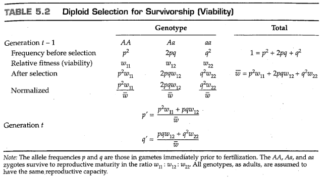

# 第5章 达尔文选择

<link rel="stylesheet" href="https://cdn.staticfile.org/font-awesome/4.7.0/css/font-awesome.css"><a href="index.html"> <i class="fa fa-arrow-left"></i><b> 返回目录 </b></a>

<div style="position:fixed;height:20px;right:50px;bottom:80px;background-color:#ddd;color:#069;padding:5px;border-radius:20px;box-shadow:0px 0px 4px #aaa;cursor:pointer;" onclick="javascript:window.location.href='#top'"><i class="fa fa-arrow-up"></i><b> 返回顶部 </b></div>

到写作本书的时间为止，术语 “自然选择”（ *natural selection* ） 已经被达尔文在《物种起源》（ *The Origin of Species* ）（Darwin，1859）这本书中使用在了一个非正式的、直观的场景中了：

> Owing to this struggle for life, variations, however slight and from whatever cause proceeding, if they be in any degree profitable to the *individuals* of a species, in their infinitely complex relations to other organic beings and to their physical conditions of life, will tend to the preservation of such *individuals* , and will generally be inherited by the offspring. The offspring, also, will thus have a better chance of surviving, for, of the many *individuals* of any species which are periodically born, but a small number can survive. I have called this principle, by which each slight variation, if useful, is preserved, by the term Natural Selection.  
>
> （由于这种生存斗争，对于一个变异，无论多么微小，无论出于何种原因，如果它们在任何程度上对一个物种的 *个体* 有益，在他们与其他有机物和他们的生活条件的无限复杂的关系中，这些变异将倾向于保护这些 *个体* ，并普遍地由后代遗传。因此，后代也将有更好的生存机会，因为在任何物种的许多周期性繁殖产生的 *个体* 中，只有一小部分能够生存。我把这一原则称为“自然选择”，即每一个微小的变化，如果有用的话，都会被保留下来。）
 
自然选择的现代表述不那么文学化，通常被压缩成类似逻辑三段论的形式：

+ 在所有物种中，产生的后代都超过了生存和繁殖的可能
+ 生物体的生存和繁殖能力不同，部分原因是基因型的差异
+ 在每一世代中，在当前环境中促进生存的基因型在生育年龄都会过量存在，从而对下一代的后代产生不成比例的影响。

因此，通过自然选择，提高生存和繁殖能力的等位基因的频率一代又一代地逐渐增加，群体在环境中的生存和繁殖能力逐渐增强。自然选择导致的群体遗传的逐步改善构成了 **进化适应（evolutionary adaptation）** 的过程。

在上面引用的关于自然选择的简短描述中，达尔文三次使用 *“个体”（individual）* 一词。选择的单位是个体生命，而不是物种，不是亚群，也不是同胞群（sibship）。重要的是个体的表现。每一个个体都在为生存而斗争，生死存亡全靠自己。达尔文还使用了“为生存而斗争”（struggle for existence）和“适者生存”（survival of the fittest）这两个术语作为自然选择的同义词，但他强调，他使用了最广泛的隐喻意义上的术语，不仅包括生物体自己的生命，还包括生物体在产生后代方面的成功：繁殖力（fecundity）与生存同等重要。在本章中，我们将看到达尔文关于个体生物“适者生存”的概念是如何变得更加正式和定量的，以及这一概念是如何被纳入到描述自然选择下等位基因频率变化的模型中的。这些模型表明，自然选择同时作用于适合度的不同组成部分，并可以在不同的群体结构水平上运行。现代的自然选择观与达尔文的观点有点不同，前者承认自然选择可能在单倍体阶段、二倍体阶段、成对的交配基因型上起作用，而在个体群体上起到的作用可能要弱得多。

## 5.1 单倍体生物中的选择

选择作用于表型，而不是基因型，全部表型由许多互作基因和各种环境因素共同决定。然而，在探索选择的结果时，最好关注单个基因的等位基因频率的变化，以便于研究的进行。我们将从最简单的选择类型开始，在单倍体、无性生物中进行操作，例如某种细菌。在单倍体中，选择是通过群体的生长差异来实现的。无论种群增长过程是离散的还是连续的，选择的过程都是相同的，但在模型参数化方面有些不同，因此有必要将模型联系起来，以避免以后混淆。

### 离散世代

考虑无性繁殖的细菌中的两种基因型，A和B。为了简单起见，我们将假设种群数量的几何增长过程符合下列离散模型，即 $A_t=(1+a)^tA_0,\ B_t=(1+b)^tB_0$ ，其中 $A_t$ 和 $B_t$ 分别是基因型A和基因型B在时间 $t$ 时的细胞数。当 $a\neq b$ 时选择发生。图5.1A是一个示例，其中基因型A和B的增长率分别为 $a=0.41,\ b=0.26$ 。两个群体的大小都呈指数级增长，但A的增长速率快于B。在大多数情况下，我们对A型或B型细菌细胞的实际数量并不感兴趣，而是对A型细胞在所有细胞中的所占比重感兴趣。等效地，我们可以检查 $t$ 时刻A型细胞与B型细胞数目的比率，该比率由下式给出：

$$
\frac{A_t}{B_t}=(\frac{1+a}{1+b})^t\frac{A_0}{B_0}=w^t(\frac{A_0}{B_0}) \tag{5.1}
$$

选择的结果由 $a$ 与 $b$ 的比率决定，因为如果 $a<b$ ，则A细胞与B细胞的比率降低，直到最终失去A型细胞；相反，如果 $a>b$ ，则A细胞与B细胞的比例无限制地增加。图5.1B显示了图5.1A的示例中的A/B比例的变化。初始值为1，在第十代时比例增加至3；这两个时间点A型细胞的频率分别为0.50和0.75。无论何时出现几何增长，在对数尺度上绘制（图5.1C和D）都会获得直线，这通常有助于统计分析（例如，从数据中估计 $a$ 和 $b$ ）。


在图5.1中，没有必要说明造成 $a$ 和 $b$ 差异的原因是存活率还是繁殖力。重要的是它们确实不同。同样重要的是，结果只取决于比率 $(1+a)/(1+b)$ ，这意味着，在实践中，我们不需要知道A和B的绝对增长率，只需要知道它们的相对值（它们的比率）即可。在等式（5.1）中， $w$ 表示比率 $(1+a)/(1+b)$ 。符号 $w$ 通常用于离散选择模型，在本例中，它是基因型A相对于基因型B的 *相对适合度（relative fitness）* 。换句话说，在单倍体生物体中，相对适合度等于生长率的比率。

尽管这样做有时很有启发性，但在选择模型中没有必要追踪群体规模的变化。我们感兴趣的变量通常是等位基因频率，而不是群体大小。因此，设 $p_t$ 和 $q_t$ 分别表示基因型A和B在 $t$ 代中的频率，其中 $p_t+q_t=1$ 。表5.1中说明了一种方法，这种方法可以将A型和B型细胞在任何两个连续世代中的频率关联起来。为了便于讨论，我们将每一世代分为三个阶段：出生、选择和繁殖。在 $t-1$ 代中，出生阶段A和B的频率分别为 $p_{t-1}$ 和 $q_{t-1}$ 。按照假设，基因型A和B将以 $w:1$ 的比例存活，也就是说 $w$ 是A型相对于B型的存活概率。如前文所述，我们不用在意某种基因型存活的绝对概率。重要的是相对比例。经过选择， $A:B$ 的频率比值等于 $p_{t-1}\times w:q_{t-1}\times 1$ 。如果存活的基因型以相同的效率繁殖，则下一代的出生频率将由表5.1底部的表达式给出；表达中的分母部分是不可或缺的，它们使第 $t$ 代中的等位基因频率总和为1。


为了与方程5.1进行比较，考虑 $p_t$ 是第 $t$ 代中A细胞的数量除以总数；同样， $q_t$ 是B细胞的数量除以总数。因此，比值$p_t/q_t$ 等于 $t$ 代中A细胞与B细胞的比值，因为分母部分相互抵消。表5.1中的表达式表明，任何一代的 $p/q$ 比率都等于 $w$ 乘以上一代的 $p/q$ 比率，因此我们有：

$$
\frac{p_t}{q_t}=w\frac{p_{t-1}}{q_{t-1}}=w^2\frac{p_{t-2}}{q_{t-2}}=...=w^t\frac{p_0}{q_0} \tag{5.2}
$$

方程5.2的右侧与方程5.1中的右侧相同，只是相对频率 $p$ 和 $q$ 取代了A型和B型细胞的绝对数量。因此，推导出自然选择的结果，并不需要追踪种群大小。我们所需要的仅仅是相对适合度 $w$ 和初始频率 $p_0,\ q_0$ 。

为了应用于实验数据，方程5.2通常通过取自然对数（以 $e$ 为底）进行转换：

$$
\text{log}(\frac{p_t}{q_t})=\text{log}(\frac{p_0}{q_0})+t\text{log}(w) \tag{5.3}
$$

公式（5.3）意味着，如果在一段时间内在实验细菌群中持续监测 $p_t/q_t$ 的值，则 $\text{log}(p_t/q_t)$ 与时间 $t$ （以世代为单位）的关系图应该是一条直线，且斜率等于 $\text{log}(w)$ 的直线（见图5.1D）。这一事实的验证见下面的例题。


---------

**问题5.1**

耐甲氧西林金黄色葡萄球菌（Methicillin-resistant Staphyloccocus aureus，MRSA）是一种严重的病原体，传播速度特别快，随着传播，MRSA菌株的多样性增加。其中，MRSA菌株的一个传播速度特别快的亚类是庆大霉素敏感型（gentamicin sensitive-MRSA，GS-MRSA）。Laurent等人（2001）报道了旨在测试GS-MRSA和较老的庆大霉素抗性菌株（GR-MRSA）的相对生长率的实验。他们不使用恒化器，而是简单地在200毫升培养基烧瓶中培养菌株，每隔一段时间取样以测量每毫升菌落形成单位（cfu/ml）的密度。根据不同时间的 $\text{log}_{10}$（cfu/ml）表，分别计算第0-100分钟和第300-400分钟内两种菌株的相对生长率（假设一个世代的时间为100分钟）：

|Min|GR-MRSA|GS-MRSA|
|---|-------|-------|
|0  |4.000|4.322|
|100|4.708|5.041|
|200|5.633|6.398|
|300|6.669|7.908|
|400|7.462|8.968|

---------

**答案**


首先我们计算每个时间间隔内由每个菌株组成的混合培养物的比例，得到GS-MRSA菌株在五个时刻的比例分别为0.6774、0.6832、0.8532、0.9427、0.9698。

接下来，我们注意到，自然对数 $\text{log}_e(p_{100}/q_{100})=0.76865$ 而 $\text{log}_e(p_{0}/q_{0})=0.74194$ ，二者差值 $0.0267=\text{log}_e(w)$ 。在前100分钟，GS-MRSA相对于GR-MRSA的适合度为 $e^{0.0267}=1.027$ ，换句话说是2.7%的优势。
在最后100分钟内，我们得到 $\text{log}_e(p_{300}/q_{300})=2.80106,\ \text{log}_e(p_{400}/q_{400})=3.46789$ 。目前的差值是0.6668，因此适合度为 $e^{0.6668}=1.95$ 。
在实验的早期，GS-MRSA菌株似乎没有在其对数阶段生长，但后来GS-MRSA菌株的生长优势几乎是GR-MRSA的两倍。
如果我们使用所有的数据，可以得到 $\text{log}(w)=0.748$ 。由此得出 $w=e^{0.748}=2.11$ 。从数据中可以看出，GS-MRSA相对于GR-MRSA的比例在第四代中增加了16倍，这与GS-MRSA相比于GR-MRSA大约两倍的增长优势相一致。

<div style="color:#38a;box-shadow:0 0 6px #ddd;border-radius:8px;padding:15px">

【 **翻译者按** 】

本题的答案中数字精度较低，因此一些结果似乎并不直观。这里解释一下各个数字的由来。

首先，“GS-MRSA菌株在五个时刻的比例分别为0.6774、0.6832、0.8532、0.9427、0.9698”。注意到，原题目给的表格中菌落形成单位（CFU）取得是自然对数，因此在计算比例时需要先求一下指数。使用python计算得到的精确结果分别是 `0.677309, 0.682820, 0.853395, 0.945469, 0.969754` 。

```python
import numpy as np; import pandas as pd
df1 = pd.DataFrame({'GR':[4,     4.708, 5.633, 6.669, 7.462],
                    'GS':[4.322, 5.041, 6.398, 7.908, 8.968]})
df2 = np.power(10,df1) # 获取CFU的实际数值
df2["total"]=df2["GR"]+df2["GS"] # 计算总CFU
print(df2["GS"]/df2["total"])
```

关于选择系数 $w$ 的计算，前面我们已经得到了关系式：

$$
\text{log}(\frac{p_t}{q_t})=\text{log}(\frac{p_0}{q_0})+t\text{log}(w) \tag{5.3}
$$

```python
np.log(df2["GS"]/df2["GR"])
```

使用上面的代码，我们可以计算得到从 $t=0$ 到 $t=400\text{min}$ 的 $\text{log}({p_t}/{q_t})$ ，结果分别为 `0.741432, 0.766761, 1.761478, 2.852903, 3.467693` ，自然对数 $\text{log}_e(p_{100}/q_{100})= 0.766761$ 而 $\text{log}_e(p_{0}/q_{0})=0.741432$ ，二者差值 $0.025329=\text{log}_e(w)$ 。在前100分钟，GS-MRSA相对于GR-MRSA的适合度为 $e^{0.025329}=1.02565$ ，换句话说是2.565%的优势。课本答案由于取值精度更低，与代码计算的结果稍有出入，不过总体上不影响结果。

同理，最后100分钟内，我们得到 $\text{log}_e(p_{300}/q_{300})=2.852903,\ \text{log}_e(p_{400}/q_{400})=3.467693$ 。目前的差值是0.61479，因此适合度为 $e^{0.61479}=1.849268$ ，也就是 84.9268%的优势。

```python
log_pq = np.log(df2["GS"]/df2["GR"])
delta  = np.diff(log_pq)
logw = np.mean(delta)
w = np.e**logw; print(w)
```

最后我们用代码计算一下 $w$ ，如上述代码所示。可以得到 $\text{log}(w)=0.681565$ ，由此得出 $w=e^{0.681565}=1.97697$ ，这一结果与课本答案也略有出入。此外，在 $t=400$ 时，GS菌株和GR菌株的相对比例大约是  32.062693 ，而在 $t=0$ 时这一比例还仅仅是2.098940，大约是前者的 $1/16$，这就是“GS-MRSA相对于GR-MRSA的比例在第四代中增加了16倍”的由来。

</div>


---------

### 连续世代

问题5.1中的细菌群体不会以离散的世代繁殖，而是连续繁殖。在连续模型中，A和B群体的指数增长过程由方程 $dA_t/dt=a'A_t$ 和 $dB_t/dt=b'B_t$ 控制，其中 $a'$ 和 $b'$ 是增长率。因此，

$$
\frac{A_t}{B_t}=\frac{A_0}{B_0}e^{(a'-b')t}=\frac{A_0}{B_0}e^{mt} \tag{5.4}
$$

公式（5.4）意味着，在连续群体中，选择的结果取决于指数增长率之间的差值 $a'-b'$ ，该差值由右侧的符号 $m$ 表示。 $m$ 的值也是菌株A与B的相对适合度的度量，但其适用于连续繁殖的群体中。将方程（5.4）与方程（5.1）进行比较，可以得出 $m$ 与 $w$ 之间的关系：

$$
m=\text{ln}(w) \tag{5.5}
$$

换句话说，连续增长群体的相对适合度 $m$ 等于离散增长群体的相对适合度 $w$ 的自然对数。选择中性意味着 $w=1$ 或 $m=0$ 。对于问题5.1中估计的 $w$ 值， $m$ 的相应值分别为0.0267和0.6668。如果 $w$ 与1相差不大，那么令 $m=w-1$ 是一个合理的近似值。

### 单倍体中的等位基因频率变化

尽管在方程（5.5）中的变换下，离散模型和连续模型是完全等价的，但等位基因频率变化的方程看起来相当不同。在离散模型中，菌种A在第 $t$ 代中的频率变化由差值 $p_t-p_{t-1}$ 给出，该差值可以利用表5.1中的公式由 $p_{t-1}$ 计算得到。差值 $p_t-p_{t-1}$ 通常用符号 $\Delta p$ 表示，并且为了简便，我们通常忽略 $p_{t-1}$ 的下标。使用表5.1中的表达式，并基于 $q=1-p$ 的事实，我们得到：

$$
\Delta p=\frac{pw}{pw+q}-p=\frac{pq(w-1)}{pw+q} \tag{5.6}
$$

毫不奇怪，如果A的相对适合度大于1，则 $p$ 增加；如果A的相对适合度小于1，则 $p$ 减少。如果A和B的相对适合度相等，那么 $p$ 不会改变——当然这也有前提，即群体规模非常大（理论上，群体规模必须是无限的）。

在连续模型中，我们需要与方程（5.6）对标的数学公式，在这样的公式中导数 $dp/dt$ 将会代替 $\Delta p$ 。这个导数可以从方程（5.4）中得到，但需要一点技巧。因为 $A_t/B_t$ 等于 $p_t/q_t$ ，所以方程（5.4）相对于 $t$ 的导数必须等于 $p_t/q_t$ 相对于 $t$ 的导数。为了简单起见，我们同样省去 $p_t$ 和 $q_t$ 的下标。方程（5.4）关于 $t$ 的导数等于 $mp/q$ ， $p/q$ 关于 $t$ 的导数等于 $(1/q^2)(dp/dt)$ 。联立这两个式子，求解 $dp/dt$ ，我们可以得到

$$
\frac{dp}{dt}=pqm \tag{5.7}
$$

分母去了哪里？从技术上讲，它消失在离散模型和连续模型之间的差异中。从实际意义上讲，方程（5.7）中没有分母，极大地简化了一些用于描述选择效果的公式。尽管它们看起来非常不同，但方程（5.6）和（5.7）只是表达相同事物的不同方式。在本章中，我们将主要处理类似于方程（5.6）的表达式，因为它们在用于各种类型的选择时更容易推导。然而，当有必要处理一个麻烦的分母时，我们将使用方程（5.7）的连续模型以将分母去除。

### 达尔文适合度与马尔萨斯适合度

离散模型和连续模型中的适合度参数之间的区别已被纳入群体遗传学的术语中，其中 **达尔文适合度（darwinian fitness）** 用于描述离散模型的适合度参数， **马尔萨斯适合度（malthusian fitness）** 用于描述连续模型的适合度参数。后者以托马斯·马尔萨斯（Thomas Malthus，1766-1834）的名字命名，他对人口持续增长的影响的观点强烈影响了达尔文对这一主题的思考。达尔文适合度通常由符号 $w$ 表示，通常用下标修饰，而马尔萨斯适合度通常用符号 $m$ 表示。在本书中，术语 *“适合度”（fitness）* 在没有限定的情况下使用时，默认代表达尔文适合度，除非上下文中清楚地表明有其他含义。

## 5.2 二倍体生物中的选择

在单倍体生物体中，一些细胞更善于避免死亡，或者能够更有效地获取营养，或者分裂更快。所有这些属性都可以分解为一个单一的适应度参数，该参数表示单倍体基因型的差异生长率。在二倍体生物中，选择的结果可以以更复杂的方式表现出来。从配子融合开始，受精卵必须经历分裂、生长和发育的过程。在这个过程中，基因型的差异可能导致个体有着不同的发育速度或者存活到成年阶段的概率，此谓 **生存能力选择（selection viability）** 。成年个体需要成功吸引到异性以留下后代，基因型差异导致的性吸引力差异谓之 **性选择（sexual selection）** 。当杂合子个体产生配子时，配子比例可能会偏离孟德尔分离定律，这一形式的选择谓之 **减数分裂驱动（meiotic drive）** 的选择形式或 **分离扭曲（segregation distortion）** 的选择形式。许多海洋生物释放配子于海洋之中，这些单倍体细胞可能存在生存能力上的差异，此之谓 **配子选择（gametic selection）** 。当交配发生时，不同基因型能够留下的后代数量不同，谓之 **繁殖力选择（fecundity selection）** 。更为复杂的是，一对基因型产生的后代数量可能不等于每个基因型的繁殖力效应的简单总和，而是由一对交配基因型共同决定的特性所影响。在本章的后面，我们将考虑选择的这些不同组成部分的一些后果。对于许多生物来说，不同的繁殖力似乎是适合度的最重要组成部分，但就目前而言，最容易考虑的模型是生存能力选择。

为了开发二倍体的自然选择模型，我们将从第2章中的随机交配模型开始，但现在我们允许基因型有不同的适合度从而进行选择。回想一下，在这个模型中，我们做出了许多假设——群体是无限的，因此不会发生遗传漂变，没有新的突变，没有迁移，不同基因型之间随机交配。在这些假设之上，我们再补充一点，即适合度是恒定不变的，并且假设自然选择的过程只发生在从受精卵到成年个体的生长发育阶段。按照惯例我们使用符号 $w_{11},\ w_{12},\ w_{22}$ 分别表示基因型AA、Aa和aa的达尔文适合度。如果令每个基因型的适合度等于其生存概率，那么每个适合度都是 **绝对适合度（absolute fitness）** ，因为它的值独立于其他基因型的适应度。在实践中，我们通常只知道每个基因型对于另一个被选为比较标准的基因型的生存能力的相对值。当一个适合度值以其相对于另一个基因型的适合度的值表示时，该适合度是 **相对适合度（relative fitness）** 。被选择作为比较标准的基因型的相对适合度被人为赋值为1。

考虑一个具体的例子，假设基因型AA、Aa和aa从受精到性成熟年龄的存活概率分别为0.75、0.75和0.50。这些是基因型的绝对生存能力。只有当我们具体说明生物体时，才能判断它们是否符合现实。如果生物体是哺乳动物或鸟类，这样的存活概率可能是合理的值，因为每个后代都有合理的生存机会；但如果生物体是昆虫或牡蛎，这些值可能不可信，因为它们中的绝大多数新生个体注定无法存活。因为选择取决于生存能力的相对大小，所以用相对术语表达生存能力通常是最方便的。以AA基因型为标准，AA、Aa和aa的相对生存能力分别为0.75/0.75、0.75/0.75和0.50/0.75，也就是1.0、1.0和0.67。当然，我们也可以选择基因型aa作为标准，在这种情况下，相对生存能力分别为0.75/0.50、0.75/0.50和0.50/0.50，也就是1.5、1.5和1.0。通常，在计算相对生存能力时，我们会令最大相对生存能力等于1.0。相对生存能力等于基因型的相对适合度，前提是基因型具有同等的繁殖能力。用相对术语表示的生存能力无论是对鱼鹰（ospery）还是对牡蛎（oysters）来说都一样有效，因为无论绝对适合度是0.75、0.75和0.50还是0.00075、0.00075和0.00050，相对适合度都是相同的。我们将看到，等位基因频率变化的动力学仅取决于相对适合度。

------------

**问题5.2**

已经在很多实验生物中发现了能够延长寿命的突变。一个特别引人注目的例子是 *daf-2* ，它是秀丽隐杆线虫胰岛素信号通路中的一个基因，一旦发生突变，可以使线虫的寿命延长一倍。Jenkins等人（2004）假设 *daf-2* 突变一定有负面影响；否则，这种突变就会在群体中固定下来。他们试图测量野生型和 *daf-2* 突变型线虫之间的总适合度差异。他们在六个群体中进行了重复实验，在实验开始时两种纯合基因型的频率相等（ $p_0=0.5$ ），并在第1、2、3和4代中观察到 *daf-2* 等位基因的频率分别为0.28、0.09、0.02和0。  *daf-2* 相对于野生型的净适合度是多少？（提示：秀丽隐杆线虫是二倍体，但几乎总是自交繁殖，因此可以将这两种基因型视为单倍体克隆。）

------------

**答案：**

对于第一代， *daf-2* 的频率从0.5下降到0.28，我们可以得到自然对数 $log_{10}(0.28/0.72)=log_{10}(0.5/0.5)+log_{10}(w)$ ，并解得 $w=0.389$ 。同样，对于从第1代到第2代以及从第2代到第3代的过渡，我们得到 $w=0.254$ 和 $w=0.206$ 的估计值。如果我们对 $log(p/g)$ 与世代数进行线性回归，则在这个实验中，回归方程的斜率估计值为 -1.3，其中 $e^{-1.3}=0.27$ ，0.27是适合度估计值的平均值。 *daf-2* 等位基因确实比野生型等位基因差得多，而且会很快被消除，就像在实验室群体中一样。这个例子证实了一句古老的格言，即太美好的事，往往不真实，天上不会掉馅饼。（“If something sounds too good to be true, it probably is too good to be true”）。

------------

### 二倍体生物中的等位基因频率

如果我们在 $t$ 代中将A和a的等位基因频率分别写成 $p_t$ 和 $q_t$ ，那么就可以直接根据上一代中的等位频率 $p_{t-1}$ 和 $q_{t-1}$ 推导出 $t$ 代中等位基因的频率表达式。下标 $t$ 和 $t-1$ 在方程中携带起来相当麻烦，因此我们将使用符号 $p$ 和 $q$ 表示$p_{t-1}$ 和 $q_{t-1}$ ，使用符号 $p'$ 和 $q'$ 表示$p_{t}$ 和 $q_{t}$ 。

表5.2中推导了连续两代中等位基因频率之间的关系，其中适合度  $w_{11},w_{12},w_{22}$ 是相对生存率。在 $t-1$ 代中，假设发生随机交配，则新产生的受精卵中AA、Aa和aa的基因型频率分别由 $p^2,2pq,q^2$ 给出。根据定义，新受精卵以 $w_{11}:w_{12}:w_{22}$ 的比例存活，因此存活的成虫中AA:Aa:aa的比例为

$$
p^2w_{11}:2pqw_{12}:q^2w_{22}
$$

为了继续，我们需要将上述表达式中的各个项目转化为相对频率，这可以通过将每个项目除以总和而实现。各个项目的总和值如表5.2所示，即

$$
\bar{w} = p^2w_{11}+2pqw_{12}+q^2w_{22} \tag{5.8}
$$





符号 $\bar{w}$ 是 $t-1$ 代群体的平均适合度，换句话说它只是群体中所有个体的适合度的平均值。将前面的比例式中每个项目的存活个体除以 $\bar{w}$ ，可以得出成年个体的基因型频率：

$$
AA:\frac{p^2w_{11}}{\bar{w}}\ \  
Aa:\frac{2pqw_{12}}{\bar{w}}\ \
aa:\frac{q^2w_{22}}{\bar{w}} \tag{5.9}
$$

在存活的成年个体中，AA基因型全部产生A配子，Aa基因型产生 $\frac{1}{2}$ A和 $\frac{1}{2}$ a配子，而aa基因型全部产生a配子。因此，随机组合形成的下一代受精卵中，不同基因型的配子的频率为：

$$
p'=\frac{p^2w_{11}+pqw_{12}}{\bar{w}}\ \ q'=\frac{q^2w_{22}+pqw_{12}}{\bar{w}} \tag{5.10}
$$

这正是我们想求解的关系式，因为它们可以表达任意世代的等位基因频率，只需要知道上一代的基因频率就行。通过这些方程，就可以推导出自然选择造成的后果。因为有关系式 $q'=1-p'$，描述等位基因频率变化过程的递归完全可以在只给出 $p'$ 的情况下进行。


与单倍体生物中的模型一样，了解 $\Delta{p}$ 通常是有用的，其代表选择在一个世代中造成的等位基因频率差异 $p'-p$ 。用方程（5.10）中关于 $p'$ 的表达式减去 $p$ ，并进行一些推导（其中需要用到 $p+q=1$ 这一事实），最终可以得到：

$$
\Delta{p}=\frac{pq[p(w_{11}-w_{12})+q(w_{12}-w_{22})]}{\bar{w}} \tag{5.11}
$$

和单倍体模型的方程（5.6）一样，方程（5.11）是多倍体生物中描述选择压力下等位基因频率变化的数学关系式。


行文至此，举一个例子实在是恰当不过了。下面这个例子的数据来自黑腹果蝇（ *Drosophila melanogaster* ）的某个实验室群体，其中胶状眼（Glued eyes, *Gl* ）等位基因的频率变化如图5.2所示。当 *Gl* 等位基因纯合时致死，因此 $w_{11}=0$ 。图5.2中的点与 *Gl* 杂合子的频率有关，但由于 *Gl/Gl* 基因型不能存活， *Gl* 的等位基因频率 $p$ 等于 *Gl/+* 成年个体频率的一半。图中的点互相各间隔一个世代，第一代的 *Gl/+* 成虫频率为0.67；因此 $p_0=0.335,q_0=0.665$ 。图5.2中的数据用于估计 *Gl/+* 相对于 *+/+* 基因型的适合度，因此定义 *+/+* 的适合度 $w_{22}=1.0$ 。通过对每个重复实验分别进行这一估计，得出相对适合度值约为0.383、0.573、0.693和0.559，平均值为0.538。将 $p,q,w_{11},w_{22}$ 的这些值分别代入方程（5.10）中，得到

$$
p'=\frac{0.335^2×0+0.335×0.665×0.538}{0.335^2×0+2×0.335×0.665×0.538+0.665^2×1}=0.292
$$

因此，第1代 *Gl/+* 成虫的频率预测值为 $2p'=0.584$ ，这与重复实验中0.504至0.646的观测值相当接近。

请注意，图5.2中的四个面板非常不同，尽管它们应该是彼此的重复。统计检验表明，它们实际上与相同的选择模型 *不* 一致。Clegg等人（1976）建立的这项实验，不仅是为了跟踪 *Glued* 等位基因本身的动力学，而且是为了跟踪连锁基因通过 *基因搭车效应（genetic hitchhiking）* 发生变化的方式。有趣的是，连锁基因并没有遵循从 *Glued* 致死等位基因和重组中预测到的等位基因频率的简单轨迹。相反，连锁基因的频率变化只能通过遗传背景中存在额外的受选择等位基因来解释。在实验室中进行任何涉及自然选择的实验时，一个重要的考虑因素是，并不是所有的变量都可以测量，其他未观察到的基因座可能也处于选择压力之下！

------------

**问题5.3**

具有多重倒位（multiple inversion）的平衡染色体在果蝇种群遗传学中很重要，因为它们允许研究人员从自然种群中分离出单个染色体进行研究。Dobzhansky和Spassky（1963）估计了1063个野生来源的 *D. pseudoobscura* 二号染色体纯合子与携带平衡染色体的杂合子的相对存活率，并发现这些野生染色体随机配对的纯合子存活率和杂合子存活率之间没有相关性。为了评估总体适合度，可以通过观察笼养群体中等位基因频率的变化来跟踪等位基因频率的全部动态。Sved和Ayala（1970年）开发了一种用于估计果蝇整个染色体总体适合度的方法，该方法利用了类似的平衡染色体系统，但跟踪的是笼养群体中的频率变化。由于平衡染色体的纯合子（Ba/Ba）是致死的，所以只有两种存活的基因型：Ba/+ 和 +/+ 。 在一个笼养群体中，Ba/+ 杂合子的频率为0.486，在下一代中这个频率变为0.726。请问Ba/+ 相对于 +/+ 的净适合度是多少？

------------

**答案：**

对于平衡染色体来说，等位基因频率是杂合子频率的一半，因此等位基因频率从 
$p=0.486/2=0.243$ 改变为 $0.726/2=0.363$ 。如果我们令 Ba/+ 基因型相比于 +/+ 的相对适合度为 $w$ （Ba/Ba的适合度为0），那么野生型等位基因频率的递归表达式为 $q'=(wpq+q^2)/(2pqw+q^2)$ 。现在我们将数字带入其中，得 $0.637=[w(0.243)(0.757)+(0.757)^2]/[w\times 2(0.243)(0.757)+(0.757)^2]$ 。解方程，得 $w=4.13$ 。另一种表达方式是说，相对于携带平衡染色体的杂合子，野生型纯合子的相对适合度是 $1/(4.13)=0.2421/(4.13)=0.242$ 。Sved 和 Ayala 努力尝试将适合度分解为生存能力和繁殖能力两个组成部分，并表明两者都在决定二号染色体之间的适合度差异方面扮演了重要角色。 

------------

图5.3展示了定向选择（directional selection）的另一个重要方面。当一个新的突变是有利的时候，如果它是显性的，那么它在频率上的增长会比它是隐性的时候快得多。原因是稀有等位基因几乎完全存在于杂合子中，而如果突变是完全隐性的，那么它的适合度效应不会像该等位基因为显性时那样显著地表现出来。当等位基因变得普遍时，情况就反转了，显性等位基因的频率变化非常缓慢，而常见的隐性等位基因的频率则迅速变化。同样的逻辑适用：当一个群体中存在常见的显性等位基因时，几乎所有个体的适合度都是相同的，因此选择对等位基因频率的变化影响很小。

通过将 $p'$ 和 $q'$ 的公式代入 $\bar w$ ，可以推导出一个关于 $\bar w'$ 的方程，该方程给出了平均群体适合度随世代变化的递归关系。进一步的代数运算表明，在具有恒定适合度选择的单一基因座双等位基因模型中，平均适合度 $\bar w$ 是非递减的。我们也可以证明，每当群体处于平衡等位基因频率时，平均适合度 $\bar w$ 位于局部最大值。这个平均适合度的性质是Fisher（1930） *自然选择基本定理（fundamental theorem of natural selection）* 的一部分，该定理指出，由于基因频率变化导致的群体平均适合度的增长率恰好等于适合度的加性遗传变异。直到Ewens（1989）才有了对Fisher定理令人信服的证明，部分原因在于Fisher对该定理陈述的微妙解释（参见Edwards 2002）。令人惊讶的是，在所有模型中，平均适合度并不总是增加，而且平衡往往不是平均适合度的最大值。


### 边际适合度与多等位基因选择


我们稍作偏离主题，指出有时用A和a等位基因的边际适合度来思考问题会更方便。**边际适合度** （marginal fitness）分别等于包含A或a的所有基因型的平均适合度，按其相对频率和所含A或a等位基因的数量加权。例如，A等位基因存在于AA和Aa基因型中，比例分别为p和q，因此A等位基因的边际适合度$\bar{w}_1$等于$p w_{11} + q w_{12}$。同理，a等位基因的边际适合度$\bar{w}_2$等于$p w_{12} + q w_{22}$。将这些表达式代入方程5.10后，得到$p' = p \bar{w}_1 / \bar{w}$，而方程5.11变为$\Delta p = p (\bar{w}_1 - \bar{w}) / \bar{w}$。这一表达式清楚地表明：若某等位基因的边际适合度（$\bar{w}_i$）高于群体平均适合度（$\bar{w}$），则该等位基因的频率会增加。这种方法可直接推广到多等位基因情形：对于频率为$p_i$且边际适合度为$\bar{w}_i$的等位基因，其单世代频率变化量为

$$
\Delta p_i = \frac{p_i (\bar{w}_i - \bar{w})}{\bar{w}} \tag{5.12}
$$

方程5.12具有若干重要推论。需注意平衡条件之一是$\bar{w}_i = \bar{w}$，这意味着所有等位基因的边际适合度相等。以三等位基因为例，边际适合度可表示为：

$$
\begin{aligned}
\bar{w}_1 &= p_1 w_{11} + p_2 w_{12} + p_3 w_{13} \\
\bar{w}_2 &= p_1 w_{21} + p_2 w_{22} + p_3 w_{23} \\
\bar{w}_3 &= p_1 w_{31} + p_2 w_{32} + p_3 w_{33}
\end{aligned}
$$

该方程组包含三个未知数的三个线性方程。除三个固定平衡点（等位基因频率分别为$(1,0,0)$、$(0,1,0)$或$(0,0,1)$）外，该系统要么不存在多态平衡点，要么存在唯一平衡点，或者所有等位基因频率组合均可成为平衡点（后者属于异常情况，例如当所有适合度相等时）。我们将推迟讨论维持三等位基因稳定平衡所需的适合度条件，留待后续分析模型稳定性特征时再行阐述。


------------

**问题5.4**

通过扩展利用笼养群体的方法，可以估计杂合子适合度。该方法使用从自然种群中分离出的单个染色体和两种平衡染色体。Gardner等人（2005）利用平衡染色体 *TM1* 和 *TM2* 研究了40条不同的野生型二号染色体（TM代表“三重倒位”）。对于纯合致死的野生型染色体，存活基因型仅包含 *+/TM1* 、 *+/TM2* 和 *TM1/TM2* ，其中 *TM1* 和 *TM2* 为平衡染色体。若 *+/TM1* 、 *+/TM2* 和 *TM1/TM2* 的相对适合度分别为s、t和u，请推导平衡频率 $p_1$ （+）、 $p_2$ （TM1）和 $p_3$ （TM2）。当s=0.8、t=0.3、u=0.7时，这些平衡频率是多少？

------------

**答案：**

首先注意到适合度可表示为对称矩阵形式 $w_{ij}=w_{ji}$：

$$
\begin{bmatrix}
0 & s & t \\
s & 0 & u \\
t & u & 0
\end{bmatrix}
$$

在平衡状态下，三个边际适合度均等于平均适合度$\bar{w}$，故有：

$$
\begin{aligned}
\bar{w} &= 0 \cdot p_1 + s p_2 + t p_3 \\
\bar{w} &= s p_1 + 0 \cdot p_2 + u p_3 \\
\bar{w} &= t p_1 + u p_2 + 0 \cdot p_3
\end{aligned}
$$

这构成一个含三个未知数的线性方程组，可通过克莱姆法则（Cramer's rule）求解。根据克莱姆法则，平衡频率由以下行列式比值给出：

$$
\hat{p}_j = \frac{D_j}{\sum\limits_{i=1}^3 D_i}
$$

其中$D_1$、$D_2$、$D_3$为下列矩阵的行列式：

$$
D_1 = \begin{vmatrix}
\bar{w} & s & t \\
\bar{w} & 0 & u \\
\bar{w} & u & 0
\end{vmatrix}, \quad
D_2 = \begin{vmatrix}
0 & \bar{w} & t \\
s & \bar{w} & u \\
t & \bar{w} & 0
\end{vmatrix}, \quad
D_3 = \begin{vmatrix}
0 & s & \bar{w} \\
s & 0 & \bar{w} \\
t & u & \bar{w}
\end{vmatrix}
$$

求解这些行列式，得到 $\hat{p_i}$ 的表达式为：

$$
\begin{aligned}
\hat{p}_1 &= \frac{u(u-s-t)}{u(u-s-t) + t(t-u-s) + s(s-t-u)} \\
\hat{p}_2 &= \frac{t(t-u-s)}{u(u-s-t) + t(t-u-s) + s(s-t-u)} \\
\hat{p}_3 &= \frac{s(s-t-u)}{u(u-s-t) + t(t-u-s) + s(s-t-u)}
\end{aligned}
$$

代入具体数值s=0.8、t=0.3、u=0.7后，平衡频率计算结果为 $\hat{p_1}=0.35,\hat{p_2}=0.45,\hat{p_3}=0.20$ 。这些平衡频率与观察到的某条野生型染色体的频率高度吻合。

------------------------

### 在杀虫剂抗性进化中的应用

自然界中最引人注目的进化实例之一是昆虫和其他农业害虫对化学杀虫剂的抗性演化。20世纪40年代是美国开始大规模使用化学杀虫剂的时间，当时美国约7%的农作物因虫害损失。这些害虫管理措施在初期成功，随后却逐渐失效。如今，超过400种害虫已对至少一种杀虫剂产生显著抗性，且美国仍有13%的农作物遭受虫害损失。2005年因昆虫造成的总成本和损失达126亿美元（Robinson, 2006）。在许多案例中，无论昆虫种类、地理区域、杀虫剂类型、使用频率或其他看似重要的变量如何，显著抗性通常都可以在5至50代内形成。实际案例的具体细节取决于有效种群数量和局部种群间遗传隔离程度等因素。由多个相互作用等位基因导致的抗性进化过程可能比单基因抗性耗时更久。

------------

**问题5.5**

库蚊属（*Culex*）和按蚊属（*Anopheles*）蚊子对有机磷类和氨基甲酸酯类杀虫剂的抗性已被证明由乙酰胆碱酯酶基因 *ace-1* 中的四个独立突变介导（Weill等，2004）。这些突变导致 G119S （第119位甘氨酸被丝氨酸取代），使该酶对这类杀虫剂不敏感。由于突变蛋白仍保持活性，这属于获得功能型突变（gain-of-function），因此抗性表现为显性。若携带抗性等位基因的蚊子存活和繁殖概率是敏感型的10倍（相对适合度10:1），问该等位基因频率从0.01上升到0.50需要多少代？

------------

**答案：**

将 $w_{11}=w_{12}=10$ 、 $w_{22}=1$ 及 $p=0.01$ 代入方程5.10，计算下一代等位基因频率。此计算可通过电子表格轻松完成，设置列分别记录等位基因频率、基因型频率、平均适合度及下一代等位基因频率。计算结果如下：

$$
\begin{aligned}
p_1 &= 0.0848 \\
p_2 &= 0.3445 \\
p_3 &= 0.5617
\end{aligned}
$$

因此，仅需三代时间，该等位基因频率即可超过50%。

-------------------------

## 5.3 选择作用下的平衡

在离散模型中，等位基因频率 $p$ 的 **平衡值** （equilibrium value）是指满足 $\Delta p=0$ 的任意取值。当无限大种群的等位基因频率处于平衡状态时，该频率将在世代之间保持不变。然而，真实种群因规模有限，等位基因频率会受随机波动影响，通常无法精确维持在平衡值。因此，研究等位基因频率在接近平衡时的行为至关重要。根据等位基因频率在平衡附近的动态特征，可将平衡分为以下类型：

- **局部稳定平衡** （locally stable equilibrium）：若等位基因频率已接近平衡，则后续世代中会逐渐趋近平衡。局部稳定平衡也可能表现为**全局稳定**，即无论初始频率如何偏离平衡，最终都会趋向平衡。具有稳定平衡的多态性有时被称为**平衡多态性** （balanced polymorphism）。
- **不稳定平衡** （unstable equilibrium）：等位基因频率最初接近平衡，但在后续世代中逐渐远离平衡。
- **中性稳定平衡** （neutrally stable equilibrium）：有时候也成为 *半稳定平衡* （ semistable equilibrium）。 在这种情况下，无论等位基因频率初始值如何，均无变化趋势（$\Delta p=0$）， 此时所有频率均为平衡点。例如无限大种群中的哈迪-温伯格平衡（见第2章）。

上述稳定性概念可应用于由方程5.11描述的选择过程，其中等位基因A是有利等位基因。若 A 为有利等位基因，则需满足 $w_{11} \geq w_{12} \geq w_{22}$ ，且至少有一个符号不取等。这种情况下，仅存在两个平衡点： $p=0$ 和 $p=1$ ，此时 $\Delta p=0$  。除这两个点外， $\Delta p>0$ 始终成立。其中，当 $p$ 接近0时，其频率会增加（进一步偏离0），故 $p=0$ 处的平衡是不稳定平衡；另一方面， $p$ 接近1时，频率继续向1趋近，因此 $p=1$ 处的平衡是局部稳定平衡。在此例中，无论初始频率如何， $p$ 最终会收敛到1，故 $p=1$ 处的平衡也是全局稳定的。

### 杂合子优势（overdominance）


